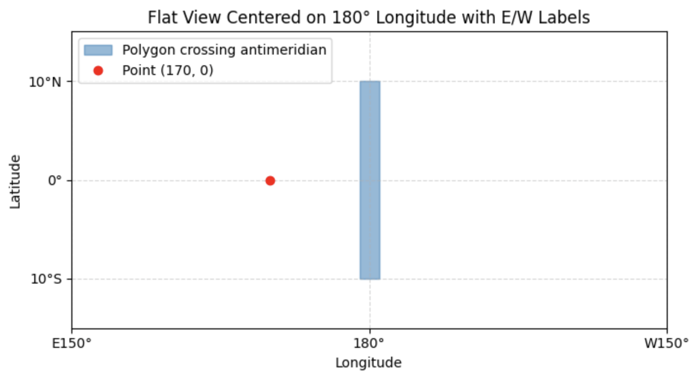

<!--
 Licensed to the Apache Software Foundation (ASF) under one
 or more contributor license agreements.  See the NOTICE file
 distributed with this work for additional information
 regarding copyright ownership.  The ASF licenses this file
 to you under the Apache License, Version 2.0 (the
 "License"); you may not use this file except in compliance
 with the License.  You may obtain a copy of the License at

   http://www.apache.org/licenses/LICENSE-2.0

 Unless required by applicable law or agreed to in writing,
 software distributed under the License is distributed on an
 "AS IS" BASIS, WITHOUT WARRANTIES OR CONDITIONS OF ANY
 KIND, either express or implied.  See the License for the
 specific language governing permissions and limitations
 under the License.
 -->

## ST_Contains

Introduction: Return true if A fully contains B

Format: `ST_Contains (A: Geography, B: Geography)`

Since: `v1.8.0`

SQL Example

```sql
SELECT ST_Contains(ST_GeogFromWKT('POLYGON((175 150,20 40,50 60,125 100,175 150))'), ST_GeogFromWKT('POINT(174 149)'))
```

Output:

```
false
```




## ST_Equals

Introduction: Return true if A equals to B

Format: `ST_Equals (A: Geography, B: Geography)`

Since: `v1.0.0`

SQL Example

```sql
SELECT ST_Equals(ST_GeogFromWKT('LINESTRING(0 0,10 10)'), ST_GeogFromWKT('LINESTRING(0 0,5 5,10 10)'))
```

Output:

```
true
```

## ST_Intersects

Introduction: Return true if A intersects B

Format: `ST_Intersects (A: Geography, B: Geography)`

Since: `v1.0.0`

SQL Example

```sql
SELECT ST_Intersects(ST_GeogFromWKT('LINESTRING(-43.23456 72.4567,-43.23456 72.4568)'), ST_GeogFromWKT('POINT(-43.23456 72.4567772)'))
```

Output:

```
true
```
