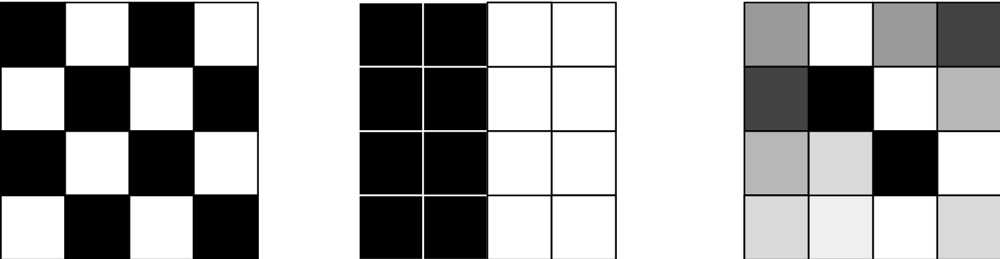

<!--
 Licensed to the Apache Software Foundation (ASF) under one
 or more contributor license agreements.  See the NOTICE file
 distributed with this work for additional information
 regarding copyright ownership.  The ASF licenses this file
 to you under the Apache License, Version 2.0 (the
 "License"); you may not use this file except in compliance
 with the License.  You may obtain a copy of the License at

   http://www.apache.org/licenses/LICENSE-2.0

 Unless required by applicable law or agreed to in writing,
 software distributed under the License is distributed on an
 "AS IS" BASIS, WITHOUT WARRANTIES OR CONDITIONS OF ANY
 KIND, either express or implied.  See the License for the
 specific language governing permissions and limitations
 under the License.
 -->

## Overview

Sedona's stats module provides Scala and Python functions for conducting geospatial
statistical analysis on dataframes with spatial columns.
The stats module is built on top of the core module and provides a set of functions
that can be used to perform spatial analysis on these dataframes. The stats module
is designed to be used with the core module and the viz module to provide a
complete set of geospatial analysis tools.

## Using DBSCAN

The DBSCAN function is provided at `org.apache.sedona.stats.clustering.DBSCAN.dbscan` in scala/java and `sedona.stats.clustering.dbscan.dbscan` in python.

The function annotates a dataframe with a cluster label for each data record using the DBSCAN algorithm.
The dataframe should contain at least one `GeometryType` column. Rows must be unique. If one
geometry column is present it will be used automatically. If two are present, the one named
'geometry' will be used. If more than one are present and none are named 'geometry', the
column name must be provided. The new column will be named 'cluster'.

### Parameters

names in parentheses are python variable names

- dataframe - dataframe to cluster. Must contain at least one GeometryType column
- epsilon - minimum distance parameter of DBSCAN algorithm
- minPts (min_pts) - minimum number of points parameter of DBSCAN algorithm
- geometry - name of the geometry column
- includeOutliers (include_outliers) - whether to include outliers in the output. Default is false
- useSpheroid (use_spheroid) - whether to use a cartesian or spheroidal distance calculation. Default is false

The output is the input DataFrame with the cluster label added to each row. Outlier will have a cluster value of -1 if included.

## Using Local Outlier Factor (LOF)

The LOF function is provided at `org.apache.sedona.stats.outlierDetection.LocalOutlierFactor.localOutlierFactor` in scala/java and `sedona.stats.outlier_detection.local_outlier_factor.local_outlier_factor` in python.

The function annotates a dataframe with a column containing the local outlier factor for each data record.
The dataframe should contain at least one `GeometryType` column. Rows must be unique. If one
geometry column is present it will be used automatically. If two are present, the one named
'geometry' will be used. If more than one are present and neither is named 'geometry', the
column name must be provided.

### Parameters

names in parentheses are python variable names

- dataframe - dataframe containing the point geometries
- k - number of nearest neighbors that will be considered for the LOF calculation
- geometry - name of the geometry column
- handleTies (handle_ties) - whether to handle ties in the k-distance calculation. Default is false
- useSpheroid (use_spheroid) - whether to use a cartesian or spheroidal distance calculation. Default is false

The output is the input DataFrame with the lof added to each row.

## Using Getis-Ord Gi(*)

The G Local function is provided at `org.apache.sedona.stats.hotspotDetection.GetisOrd.gLocal` in scala/java and `sedona.stats.hotspot_detection.getis_ord.g_local` in python.

Performs the Gi or Gi* statistic on the x column of the dataframe.

Weights should be the neighbors of this row. The members of the weights should be comprised
of structs containing a value column and a neighbor column. The neighbor column should be the
contents of the neighbors with the same types as the parent row (minus neighbors). Reference the _Using the Distance
Weighting Function_ header for instructions on generating this column. To calculate the Gi*
statistic, ensure the focal observation is in the neighbors array (i.e. the row is in the
weights column) and `star=true`. Significance is calculated with a z score.

### Parameters

- dataframe - the dataframe to perform the G statistic on
- x - The column name we want to perform hotspot analysis on
- weights - The column name containing the neighbors array. The neighbor column should be the contents of the neighbors with the same types as the parent row (minus neighbors). You can use `Weighting` class functions to achieve this.
- star - Whether the focal observation is in the neighbors array. If true this calculates Gi*, otherwise Gi

The output is the input DataFrame with the following columns added: G, E[G], V[G], Z, P.

## Using the Distance Weighting Function

The Weighting functions are provided at `org.apache.sedona.stats.Weighting` in scala/java and `sedona.stats.weighting` in python.

The function generates a column containing an array of structs containing a value column and a neighbor column.

The generic `addDistanceBandColumn` (`add_distance_band_column` in python) function annotates a dataframe with a weights column containing the other records within the threshold and their weight.

The dataframe should contain at least one `GeometryType` column. Rows must be unique. If one
geometry column is present it will be used automatically. If two are present, the one named
'geometry' will be used. If more than one are present and neither is named 'geometry', the
column name must be provided. The new column will be named 'cluster'.

### Parameters

#### addDistanceBandColumn

names in parentheses are python variable names

- dataframe - DataFrame with geometry column
- threshold - Distance threshold for considering neighbors
- binary - whether to use binary weights or inverse distance weights for neighbors (dist^alpha)
- alpha - alpha to use for inverse distance weights ignored when binary is true
- includeZeroDistanceNeighbors (include_zero_distance_neighbors) - whether to include neighbors that are 0 distance. If 0 distance neighbors are included and binary is false, values are infinity as per the floating point spec (divide by 0)
- includeSelf (include_self) - whether to include self in the list of neighbors
- selfWeight (self_weight) - the value to use for the self weight
- geometry - name of the geometry column
- useSpheroid (use_spheroid) - whether to use a cartesian or spheroidal distance calculation. Default is false

#### addBinaryDistanceBandColumn

names in parentheses are python variable names

- dataframe - DataFrame with geometry column
- threshold - Distance threshold for considering neighbors
- includeZeroDistanceNeighbors (include_zero_distance_neighbors) - whether to include neighbors that are 0 distance. If 0 distance neighbors are included and binary is false, values are infinity as per the floating point spec (divide by 0)
- includeSelf (include_self) - whether to include self in the list of neighbors
- selfWeight (self_weight) - the value to use for the self weight
- geometry - name of the geometry column
- useSpheroid (use_spheroid) - whether to use a cartesian or spheroidal distance calculation. Default is false

In both cases the output is the input DataFrame with the weights column added to each row.

## Moran I

Moran I is the spatial autocorrelation algorithm, which is using spatial
location and non-spatial attribute. When the value is close to the 1 it
means that there is spatial correlation, when it is close to 0 then the
correlation does not exist and data is randomly distributed. When the
MoranI autocorrelation value is close to -1 it means that there is negative
correlation. Negative correlation means that close values has dissimilar values.

You can see spatial correlation values on the figure below

- on the left there is negative correlation (-1)
- in the middle correlation is positive (1)
- on the right the correlation is close to zero and data is random.



Moran statistics can be used as the Scala/Java and Python functions.
As the input function requires weight DataFrame. You can create the
weight DataFrame using Apache Sedona weighting functions. You need
to keep in mind that your input has to have id column that uniquely identifies
the feature and value field. The required minimal schema for the MoranI Apache Sedona
function is:

```
 |-- id: integer (nullable = true)
 |-- value: double (nullable = true)
 |-- weights: array (nullable = false)
 |    |-- element: struct (containsNull = false)
 |    |    |-- neighbor: struct (nullable = false)
 |    |    |    |-- id: integer (nullable = true)
 |    |    |    |-- value: double (nullable = true)
 |    |    |-- value: double (nullable = true)
```

You can manipulate the value column name and id using function parameters.

To use the [Apache Sedona weight functions](#adddistancebandcolumn) you need to pass the id column and value column to kept parameters.

=== "Scala"

    ```scala
    val weights = Weighting.addDistanceBandColumn(
          positiveCorrelationFrame,
          1.0,
          savedAttributes = Seq("id", "value")
    )

    val moranResult = Moran.getGlobal(weights, idColumn = "id")

    // result fields
    moranResult.getPNorm
    moranResult.getI
    moranResult.getZNorm
    ```

=== "Python"

    ```python
    from sedona.spark.stats.autocorrelation.moran import Moran
    from sedona.spark.stats.weighting import add_binary_distance_band_column

    result = add_binary_distance_band_column(df, 1.0, saved_attributes=["id", "value"])

    moran_i_result = Moran.get_global(result)

    ## result fields
    moran_i_result.p_norm
    moran_i_result.i
    moran_i_result.z_norm
    ```

In the result you get the Z norm, P norm and Moran I value.

The full signatures of the functions

=== "Scala"

    ```scala
    def getGlobal(
      dataframe: DataFrame,
      twoTailed: Boolean = true,
      idColumn: String = ID_COLUMN,
      valueColumnName: String = VALUE_COLUMN): MoranResult

    // java interface
    public interface MoranResult {
        public double getI();
        public double getPNorm();
        public double getZNorm();
    }
    ```

=== "Python"

    ```python
    def get_global(
        df: DataFrame,
        two_tailed: bool = True,
        id_column: str = "id",
        value_column: str = "value",
    ) -> MoranResult: ...


    @dataclass
    class MoranResult:
        i: float
        p_norm: float
        z_norm: float
    ```
