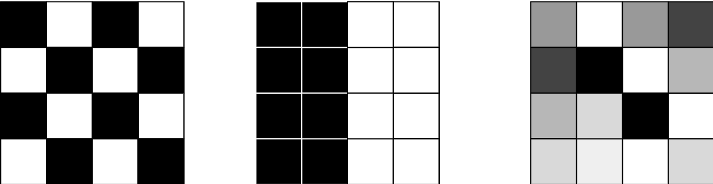

<!--
 Licensed to the Apache Software Foundation (ASF) under one
 or more contributor license agreements.  See the NOTICE file
 distributed with this work for additional information
 regarding copyright ownership.  The ASF licenses this file
 to you under the Apache License, Version 2.0 (the
 "License"); you may not use this file except in compliance
 with the License.  You may obtain a copy of the License at

   http://www.apache.org/licenses/LICENSE-2.0

 Unless required by applicable law or agreed to in writing,
 software distributed under the License is distributed on an
 "AS IS" BASIS, WITHOUT WARRANTIES OR CONDITIONS OF ANY
 KIND, either express or implied.  See the License for the
 specific language governing permissions and limitations
 under the License.
 -->

## 概述

Sedona 的 stats 模块为带有空间列的 dataframe 提供了用于地理空间
统计分析的 Scala 和 Python 函数。
stats 模块构建在 core 模块之上，提供了一组可用于
对这些 dataframe 进行空间分析的函数。stats 模块设计上配合 core 模块以及
viz 模块共同使用，从而提供一套完整的地理空间分析工具。

## 使用 DBSCAN

DBSCAN 函数在 scala/java 中位于 `org.apache.sedona.stats.clustering.DBSCAN.dbscan`，在 python 中位于 `sedona.stats.clustering.dbscan.dbscan`。

该函数使用 DBSCAN 算法为 dataframe 的每一条记录标注一个聚类标签。
dataframe 应至少包含一列 `GeometryType` 类型的列。各行必须唯一。如果仅有一列
几何列，会自动使用该列。如果有两列，会使用名为
'geometry' 的那一列。如果有多于一列且没有任何一列名为 'geometry'，则
必须显式提供列名。新增列将命名为 'cluster'。

### 参数

括号中的名字是 python 中的变量名

- dataframe —— 待聚类的 dataframe。必须包含至少一列 GeometryType 列
- epsilon —— DBSCAN 算法的最小距离参数
- minPts (min_pts) —— DBSCAN 算法的最小点数参数
- geometry —— 几何列的列名
- includeOutliers (include_outliers) —— 是否在输出中包含离群点。默认为 false
- useSpheroid (use_spheroid) —— 是否使用椭球距离计算（而非笛卡尔距离）。默认为 false

输出是输入 DataFrame，每一行新增了聚类标签。如果包含离群点，离群点的聚类值为 -1。

## 使用局部离群因子（LOF）

LOF 函数在 scala/java 中位于 `org.apache.sedona.stats.outlierDetection.LocalOutlierFactor.localOutlierFactor`，在 python 中位于 `sedona.stats.outlier_detection.local_outlier_factor.local_outlier_factor`。

该函数为 dataframe 的每一条记录新增一列，记录其局部离群因子。
dataframe 应至少包含一列 `GeometryType` 类型的列。各行必须唯一。如果仅有一列
几何列，会自动使用该列。如果有两列，会使用名为
'geometry' 的那一列。如果有多于一列且没有任何一列名为 'geometry'，则
必须显式提供列名。

### 参数

括号中的名字是 python 中的变量名

- dataframe —— 包含点几何对象的 dataframe
- k —— 计算 LOF 时考虑的最近邻居的数量
- geometry —— 几何列的列名
- handleTies (handle_ties) —— 是否在 k 距离计算中处理并列情形。默认为 false
- useSpheroid (use_spheroid) —— 是否使用椭球距离计算（而非笛卡尔距离）。默认为 false

输出是输入 DataFrame，每一行新增了 lof 值。

## 使用 Getis-Ord Gi(*)

G Local 函数在 scala/java 中位于 `org.apache.sedona.stats.hotspotDetection.GetisOrd.gLocal`，在 python 中位于 `sedona.stats.hotspot_detection.getis_ord.g_local`。

对 dataframe 的 x 列执行 Gi 或 Gi* 统计。

权重应为本行的邻居。权重元素应为包含 value 列与 neighbor 列的结构体。neighbor 列的内容应是
与父行同类型的邻居（但不再包含 neighbors）。生成此列的方法请参见 _Using the Distance
Weighting Function_ 一节。要计算 Gi*
统计量，请确保焦点观测值位于邻居数组中（即本行本身出现在 weights 列中）且 `star=true`。显著性通过 z 分数计算。

### 参数

- dataframe —— 用于执行 G 统计的 dataframe
- x —— 要执行热点分析的列名
- weights —— 包含邻居数组的列名。neighbor 列的内容应是与父行同类型的邻居（但不再包含 neighbors）。你可以使用 `Weighting` 类的函数来生成该列。
- star —— 焦点观测值是否包含在邻居数组中。若为 true 则计算 Gi*，否则计算 Gi

输出是输入 DataFrame，每一行新增以下列：G、E[G]、V[G]、Z、P。

## 使用距离加权函数

Weighting 相关函数在 scala/java 中位于 `org.apache.sedona.stats.Weighting`，在 python 中位于 `sedona.stats.weighting`。

该函数会新增一列，包含一组由 value 列和 neighbor 列构成的结构体数组。

通用的 `addDistanceBandColumn`（python 中为 `add_distance_band_column`）函数会为 dataframe 添加一个 weights 列，包含距离阈值内的其他记录及其权重。

dataframe 应至少包含一列 `GeometryType` 类型的列。各行必须唯一。如果仅有一列
几何列，会自动使用该列。如果有两列，会使用名为
'geometry' 的那一列。如果有多于一列且没有任何一列名为 'geometry'，则
必须显式提供列名。新增列将命名为 'cluster'。

### 参数

#### addDistanceBandColumn

括号中的名字是 python 中的变量名

- dataframe —— 包含几何列的 DataFrame
- threshold —— 判定邻居的距离阈值
- binary —— 邻居使用二进制权重还是反距离权重（dist^alpha）
- alpha —— 反距离权重使用的 alpha 值，当 binary 为 true 时忽略
- includeZeroDistanceNeighbors (include_zero_distance_neighbors) —— 是否包含距离为 0 的邻居。若包含且 binary 为 false，按浮点规范（除以 0），其值会是无穷大
- includeSelf (include_self) —— 是否将自身包含在邻居列表中
- selfWeight (self_weight) —— 自身权重的取值
- geometry —— 几何列的列名
- useSpheroid (use_spheroid) —— 是否使用椭球距离计算（而非笛卡尔距离）。默认为 false

#### addBinaryDistanceBandColumn

括号中的名字是 python 中的变量名

- dataframe —— 包含几何列的 DataFrame
- threshold —— 判定邻居的距离阈值
- includeZeroDistanceNeighbors (include_zero_distance_neighbors) —— 是否包含距离为 0 的邻居。若包含且 binary 为 false，按浮点规范（除以 0），其值会是无穷大
- includeSelf (include_self) —— 是否将自身包含在邻居列表中
- selfWeight (self_weight) —— 自身权重的取值
- geometry —— 几何列的列名
- useSpheroid (use_spheroid) —— 是否使用椭球距离计算（而非笛卡尔距离）。默认为 false

以上两种函数的输出均为输入 DataFrame，每一行新增 weights 列。

## Moran I

Moran I 是一种空间自相关算法，它同时使用空间
位置和非空间属性。当取值接近 1 时
表示存在空间相关性；当取值接近 0 时
表示不存在相关性，数据随机分布；当
MoranI 自相关值接近 -1 时表示存在负
相关。负相关意味着邻近的取值彼此差异较大。

下图展示了不同空间相关性的取值

- 左侧为负相关（-1）
- 中间为正相关（1）
- 右侧相关性接近 0，数据是随机的。



Moran 统计可以作为 Scala/Java 与 Python 函数使用。
该输入函数需要一个 weight DataFrame。你可以用
Apache Sedona 的加权函数来构造该 weight DataFrame。需要注意的是，
你的输入必须包含一个唯一标识要素的 id 列以及一个 value 字段。MoranI Apache Sedona 函数
所需的最简 schema 如下：

```
 |-- id: integer (nullable = true)
 |-- value: double (nullable = true)
 |-- weights: array (nullable = false)
 |    |-- element: struct (containsNull = false)
 |    |    |-- neighbor: struct (nullable = false)
 |    |    |    |-- id: integer (nullable = true)
 |    |    |    |-- value: double (nullable = true)
 |    |    |-- value: double (nullable = true)
```

你可以通过函数参数控制 value 列的列名和 id。

要使用 [Apache Sedona 权重函数](#adddistancebandcolumn)，需要把 id 列和 value 列传给保留参数。

=== "Scala"

    ```scala
    val weights = Weighting.addDistanceBandColumn(
          positiveCorrelationFrame,
          1.0,
          savedAttributes = Seq("id", "value")
    )

    val moranResult = Moran.getGlobal(weights, idColumn = "id")

    // result fields
    moranResult.getPNorm
    moranResult.getI
    moranResult.getZNorm
    ```

=== "Python"

    ```python
    from sedona.spark.stats.autocorrelation.moran import Moran
    from sedona.spark.stats.weighting import add_binary_distance_band_column

    result = add_binary_distance_band_column(df, 1.0, saved_attributes=["id", "value"])

    moran_i_result = Moran.get_global(result)

    ## result fields
    moran_i_result.p_norm
    moran_i_result.i
    moran_i_result.z_norm
    ```

结果中会得到 Z norm、P norm 以及 Moran I 值。

下面是函数的完整签名

=== "Scala"

    ```scala
    def getGlobal(
      dataframe: DataFrame,
      twoTailed: Boolean = true,
      idColumn: String = ID_COLUMN,
      valueColumnName: String = VALUE_COLUMN): MoranResult

    // java interface
    public interface MoranResult {
        public double getI();
        public double getPNorm();
        public double getZNorm();
    }
    ```

=== "Python"

    ```python
    def get_global(
        df: DataFrame,
        two_tailed: bool = True,
        id_column: str = "id",
        value_column: str = "value",
    ) -> MoranResult: ...


    @dataclass
    class MoranResult:
        i: float
        p_norm: float
        z_norm: float
    ```
