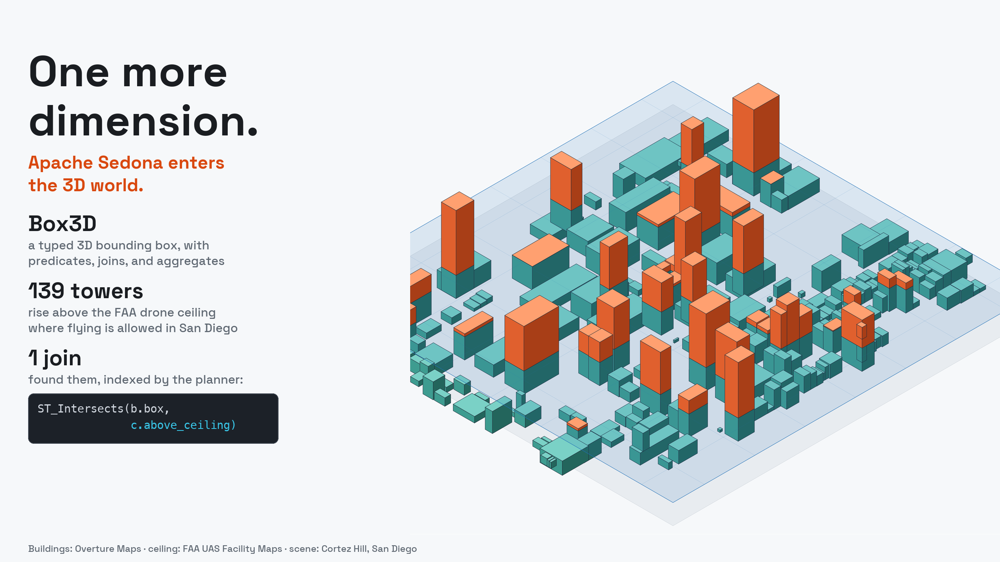
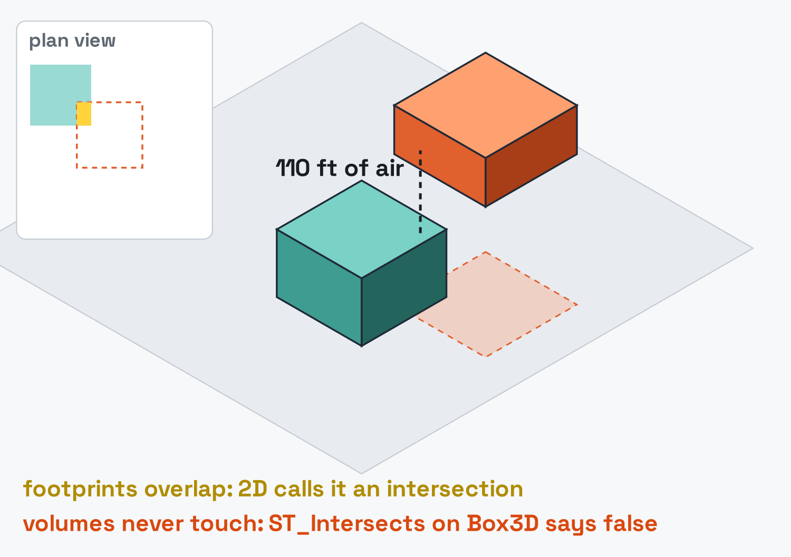
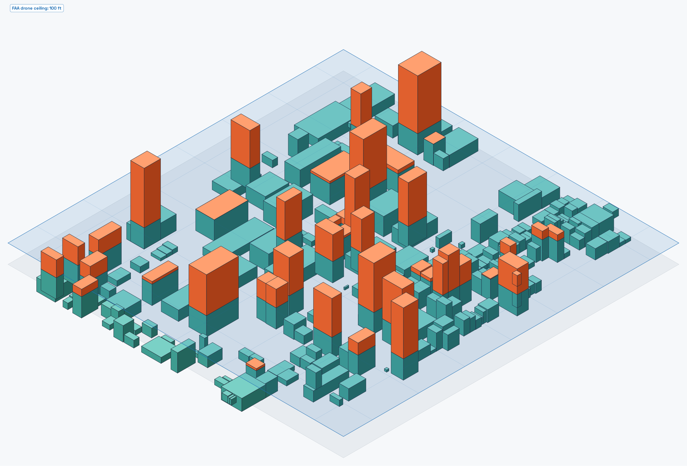
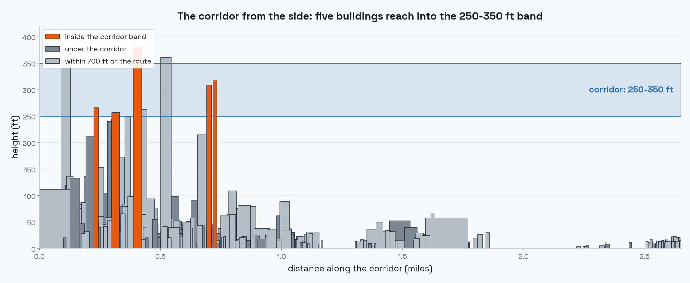
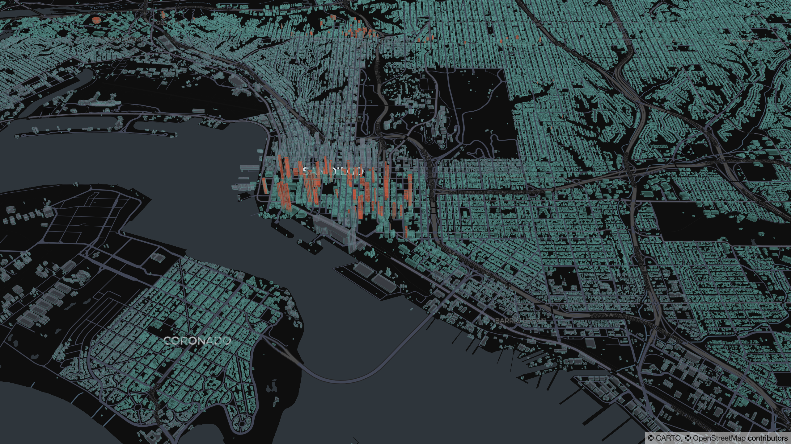

---
date:
  created: 2026-08-28
links:
  - Box3D constructors: https://sedona.apache.org/latest/api/sql/box3d/Box3D-Constructors/ST_3DMakeBox/
  - ST_3DDWithin: https://sedona.apache.org/latest/api/sql/Predicates/ST_3DDWithin/
  - Sedona 1.9.1 release notes: https://sedona.apache.org/latest/setup/release-notes/
authors:
  - jia
title: "One More Dimension: Apache Sedona Enters the 3D World"
---

# One More Dimension: Apache Sedona Enters the 3D World

A spatial query sees the world the way the noon sun does: as shadows on the ground. Two objects whose shadows touch can be four hundred feet apart, and flat geometry cannot tell the difference.

The questions arriving at spatial engines have stopped being flat. Drones under FAA ceilings, aircraft over towers, apartments above restaurants, mineral deposits below mining leases: each one asks whether two volumes meet, and until now SQL answered in shadow form. Sedona 1.9.1 adds the missing axis. There is a `Box3D` type with constructors and accessors, 3D predicates and distances, a 3D extent aggregate, and query plans that know up from down.



<!-- more -->

## A box with a z

`Box3D` is six doubles: `xmin, ymin, zmin, xmax, ymax, zmax`. Build one from any geometry with `ST_Box3D`, or from two corner points with `ST_3DMakeBox`; read it back with `ST_XMin` through `ST_ZMax`. The z changes answers:

```sql
SELECT ST_Intersects(ST_3DMakeBox(ST_PointZ(0, 0, 0),  ST_PointZ(10, 10, 10)),
                     ST_3DMakeBox(ST_PointZ(5, 5, 20), ST_PointZ(15, 15, 25))) AS xy_overlap_z_apart,
       ST_3DDWithin(ST_PointZ(0, 0, 0), ST_PointZ(3, 4, 12), 13.0) AS within_13
```

```
+------------------+---------+
|xy_overlap_z_apart|within_13|
+------------------+---------+
|             false|     true|
+------------------+---------+
```

The two boxes overlap in x and y. A 2D engine calls that an intersection; the third coordinate says they miss by ten vertical units. And the 3-4-12 point sits at Euclidean distance 13, which `ST_3DDWithin` treats inclusively, [mirroring PostGIS](https://sedona.apache.org/latest/api/sql/Predicates/ST_3DDWithin/).



## A city becomes boxes

Overture Maps publishes building footprints with a `height` attribute as GeoParquet on S3, open to anonymous reads. One filter pulls a city out of the planet, and one expression gives every building a volume:

```python
df = sedona.read.format("geoparquet").load(
    "s3a://overturemaps-us-west-2/release/2026-08-19.0/theme=buildings/type=building/"
)
df.where(
    "bbox.xmin BETWEEN -117.30 AND -117.05 AND bbox.ymin BETWEEN 32.60 AND 32.80"
).createOrReplaceTempView("b_raw")
```

```sql
SELECT id, names.primary AS name, geometry, height * 3.28084 AS height_ft,
       ST_3DMakeBox(ST_PointZ(ST_XMin(geometry), ST_YMin(geometry), 0.0),
                    ST_PointZ(ST_XMax(geometry), ST_YMax(geometry), height * 3.28084)) AS box
FROM b_raw WHERE height IS NOT NULL
```

The GeoParquet reader prunes row groups against the bounding-box filter, so the query touches a San Diego-sized slice of a planetary dataset: 208,477 buildings, 178,384 of them with a height. The tallest is Symphony Towers at 499 ft, which already hints at the third dimension shaping the city: downtown sits under the approach path to San Diego International, and the FAA caps its towers.

??? example "Session setup: released artifacts, anonymous S3"

    ```python
    from sedona.spark import SedonaContext

    config = (
        SedonaContext.builder()
        .master("local[*]")
        .config("spark.driver.memory", "8g")
        .config(
            "spark.jars.packages",
            "org.apache.sedona:sedona-spark-shaded-3.5_2.12:1.9.1,"
            "org.datasyslab:geotools-wrapper:1.9.1-33.5,"
            "org.apache.hadoop:hadoop-aws:3.3.4",
        )
        .config(
            "spark.hadoop.fs.s3a.aws.credentials.provider",
            "org.apache.hadoop.fs.s3a.AnonymousAWSCredentialsProvider",
        )
        .config(
            "spark.hadoop.fs.s3a.bucket.overturemaps-us-west-2.endpoint.region", "us-west-2"
        )
        .getOrCreate()
    )
    sedona = SedonaContext.create(config)
    ```

## The sky has a ceiling

Drone delivery went from pilot program to arms race this summer: [DoorDash earned its FAA air-carrier certificate in July](https://www.cnbc.com/2026/07/29/doordash-launches-drone-delivery-faa-certification.html), [Uber partnered with Zipline to put drones behind the Uber Eats button](https://investor.uber.com/news-events/news/press-release-details/2026/Uber-and-Zipline-Partner-to-Bring-Drone-Delivery-to-Millions-of-Americans/default.aspx), and [Amazon and Walmart are already flying](https://fortune.com/2026/08/21/amazon-uber-doordash-walmart-drone-delivery-wars/). Every one of those aircraft operates inside a volume the FAA has already mapped: the [UAS Facility Maps](https://faa.maps.arcgis.com/apps/webappviewer/index.html?id=9c2e4406710048e19806ebf6a06754ad) divide the airspace near airports into grid cells, each with a maximum drone altitude from 0 to 400 ft.

San Diego's grid makes the point vividly. Of the 585 cells covering the city, 233 have a ceiling of 0 ft. The approach path is a no-fly corridor drawn straight across downtown. Each cell becomes the box of sky *above* its ceiling, the volume a compliant drone never enters:

```sql
SELECT cell_id, ceiling_ft,
       ST_3DMakeBox(ST_PointZ(ST_XMin(geom), ST_YMin(geom), ceiling_ft),
                    ST_PointZ(ST_XMax(geom), ST_YMax(geom), 2000.0)) AS above_ceiling
FROM cells_raw
```

## Do the volumes meet?

One join answers a question neither dataset can answer alone: which buildings rise above the drone ceiling over their own roof?

```sql
SELECT COUNT(DISTINCT b.id) AS total_above,
       COUNT(DISTINCT CASE WHEN c.ceiling_ft > 0 THEN b.id END) AS above_in_flyable_cells
FROM bldg b JOIN cells c ON ST_Intersects(b.box, c.above_ceiling)
```

```
+-----------+----------------------+
|total_above|above_in_flyable_cells|
+-----------+----------------------+
|      31425|                   139|
+-----------+----------------------+
```

Two numbers, one story. 31,425 buildings stand taller than the ceiling above them, and nearly all sit in the 0 ft cells: the FAA drew its no-fly zones where the city is tall. In the cells where drones may fly at all, only **139 buildings** rise into or above the permitted band. Those 139 are the ones a route planner has to know by name; the biggest names on the other list, led by Symphony Towers at 499 ft under a 0 ft ceiling, are the reason the zeroes exist.

One neighborhood shows what the join sees. Around Cortez Hill the ceiling is 100 ft, drawn below as a translucent plane over the real building boxes; every orange volume is a row the join returns:



The join itself runs through Sedona's spatial join machinery. The physical plan shows it:

```
+- RangeJoin box: box3d, above_ceiling: box3d, INTERSECTS
```

`Box3D` predicates and `ST_3DDWithin` distance joins are indexed by the planner the same way 2D joins are, so the pattern holds when a city becomes a country: boxes are rows, and rows fan out across a cluster.

## A corridor through it

Route planning is the same join from the other side. Take a hypothetical delivery corridor from the convention center toward Hillcrest, three miles at 250 to 350 ft, built as forty stacked boxes:

```sql
WITH seg AS (SELECT explode(sequence(0, 39)) AS i),
corridor AS (
    SELECT i, ST_3DMakeBox(
        ST_PointZ(-117.161 + i * 0.0008 - 0.0006, 32.706 + i * 0.001 - 0.0006, 250.0),
        ST_PointZ(-117.161 + i * 0.0008 + 0.0006, 32.706 + i * 0.001 + 0.0006, 350.0)) AS cbox
    FROM seg)
SELECT COUNT(DISTINCT b.id) AS obstructions, MAX(ROUND(b.height_ft, 0)) AS tallest_ft
FROM corridor c JOIN bldg b ON ST_Intersects(b.box, c.cbox)
```

```
+------------+----------+
|obstructions|tallest_ft|
+------------+----------+
|           5|     381.0|
+------------+----------+
```

Five buildings stand inside the corridor's altitude band, the tallest at 381 ft. Swap `ST_Intersects` for `ST_3DDWithin(b.box, c.cbox, 50.0)` and the join enforces a 50 ft clearance margin instead of bare contact.



## One dimension, many doors

The same six doubles open more than airspace.

**Aircraft separation.** Aviation's loss-of-separation rule is a volume: a horizontal radius measured on the curved Earth and a vertical band. The horizontal half belongs to 1.9.1's other new type, [Geography](https://sedona.apache.org/latest/api/sql/geography/Geography-Constructors/ST_GeogFromWKT/), which measures geodesic meters; the vertical half is arithmetic:

```sql
SELECT ST_DWithin(a.pos, b.pos, 9260.0) AS within_5nm,
       ABS(a.alt_ft - b.alt_ft) < 1000 AS within_1000ft,
       ST_DWithin(a.pos, b.pos, 9260.0) AND ABS(a.alt_ft - b.alt_ft) < 1000 AS conflict
FROM a, b
```

Two aircraft three miles apart at 12,000 and 12,800 ft come back `conflict = true`.

**Below zero.** The axis points down as well. A planned excavation is a box with a negative floor, and a buried utility main is a box at depth:

```sql
WITH dig AS (SELECT ST_3DMakeBox(ST_PointZ(0, 0, -12), ST_PointZ(30, 8, 0)) AS site),
pipe AS (SELECT ST_3DMakeBox(ST_PointZ(-100, 3, -9), ST_PointZ(200, 4, -8)) AS main)
SELECT ST_Intersects(dig.site, pipe.main) AS strikes_the_main FROM dig, pipe
```

It returns `true`: call before you dig, as a query.

**The volume of anything.** `ST_3DExtent` aggregates a column of geometries into its bounding volume. Downtown San Diego's rooftop points collapse to `BOX3D(-117.174 32.705 0.1, -117.150 32.725 498.7)`: the whole skyline in one value, ceiling included.

## Seeing it in 3D

For an interactive view, [SedonaPyDeck](https://sedona.apache.org/latest/tutorial/sql/#visualize-query-results), Sedona's deck.gl integration, extrudes the same table with building height as the elevation column:

```python
from sedona.spark.maps.SedonaPyDeck import SedonaPyDeck

SedonaPyDeck.create_geometry_map(
    df,
    elevation_col="height_ft",
    fill_color="status == 'above the ceiling' ? [255, 90, 60, 235] : "
    "(status == 'no-fly zone' ? [125, 135, 150, 210] : [70, 170, 160, 210])",
)
```



The grey field is the FAA's no-fly grid, visible as geography.

## The flat sibling, and the bindings

`Box3D` arrived alongside `Box2D`, its planar counterpart, which comes with `ST_Extent`, box predicates with join support, and GeoParquet row-group pushdown for `ST_BoxIntersects` filters. Python code receives both as first-class types through the new UDT bindings, and SedonaFlink ships the same constructors, accessors, and predicates for streams.

## The point

Flat answers were an artifact of flat tools. The world your data describes has ceilings, floors, altitudes, and depths, and as of 1.9.1 a Sedona query can ask about all of them: build the volumes in one expression, join them with a planner that indexes the third axis, and draw the result in 3D without leaving the ecosystem.

*References: [Box3D constructors](https://sedona.apache.org/latest/api/sql/box3d/Box3D-Constructors/ST_3DMakeBox/), [ST_3DDWithin](https://sedona.apache.org/latest/api/sql/Predicates/ST_3DDWithin/), [ST_3DExtent](https://sedona.apache.org/latest/api/sql/Aggregate-Functions/ST_3DExtent/), and the [1.9.1 release notes](https://sedona.apache.org/latest/setup/release-notes/).*
