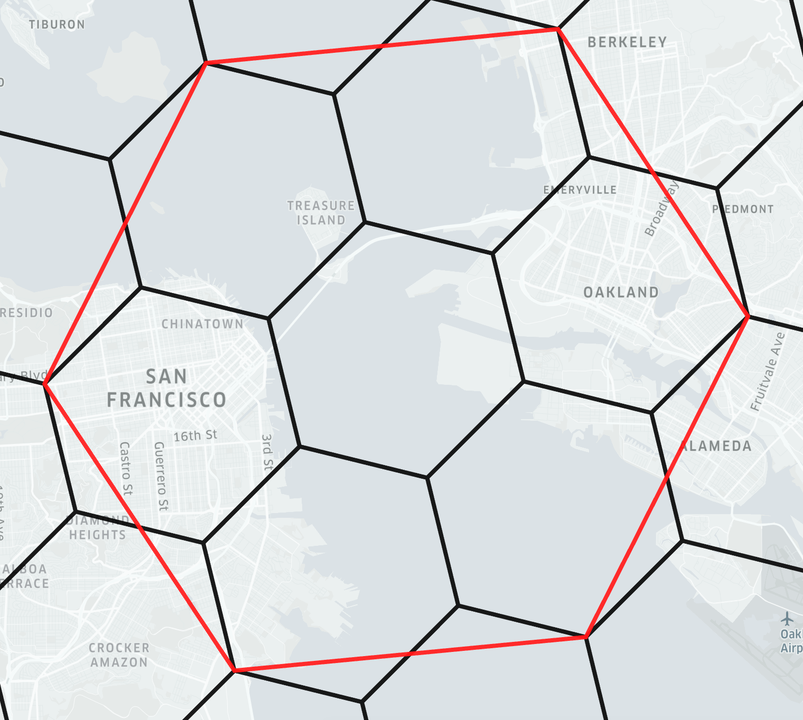
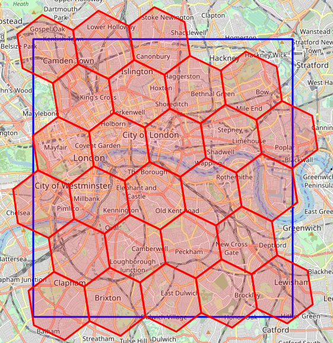
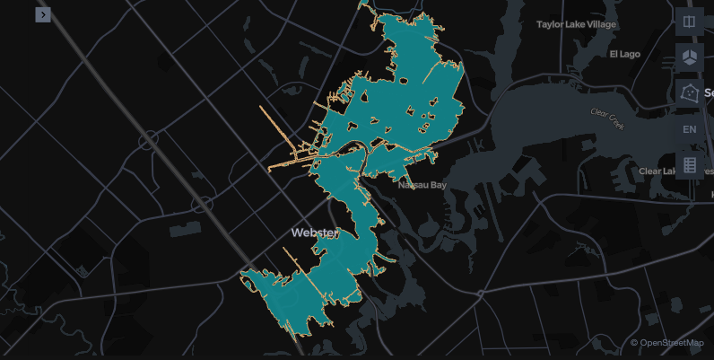
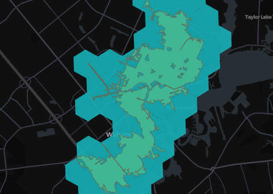
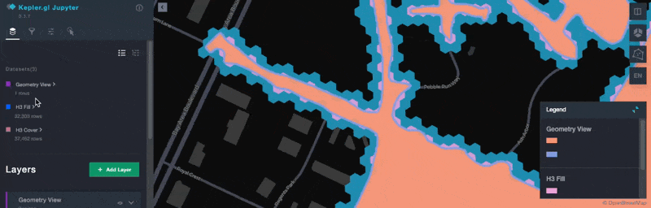
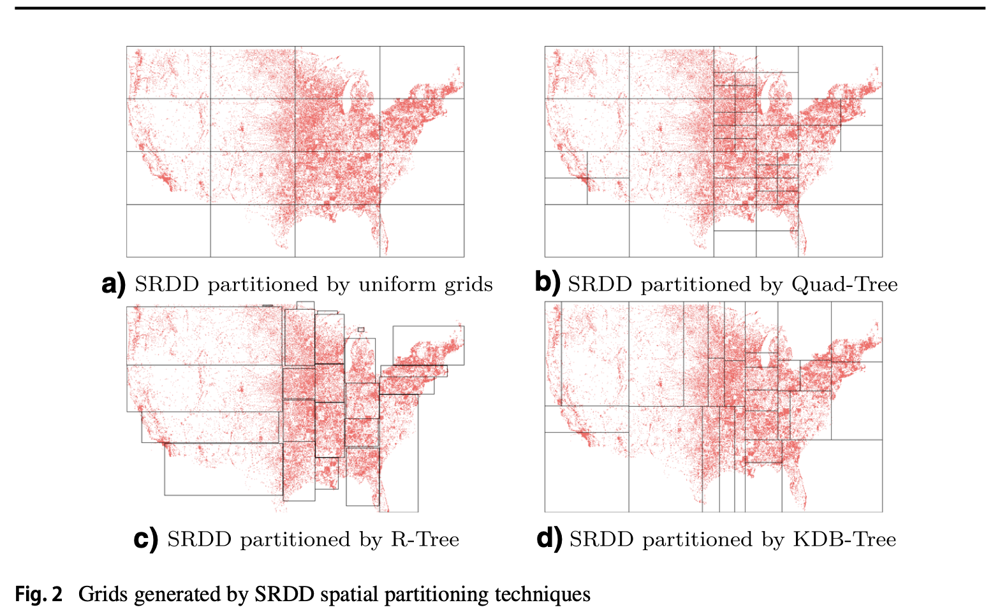

---
date:
  created: 2025-09-05
links:
  - Apache Sedona Discord: https://discord.com/invite/9A3k5dEBsY
  - SedonaSnow: https://app.snowflake.com/marketplace/listing/GZTYZF0RTY3/wherobots-sedonasnow
  - Apache Sedona on Apache Flink: https://sedona.apache.org/latest/tutorial/flink/sql/
authors:
  - matt_forrest
title: Should You Use H3 for Geospatial Analytics? A Deep Dive with Apache Spark and Sedona
---

<!--
# Licensed to the Apache Software Foundation (ASF) under one
# or more contributor license agreements.  See the NOTICE file
# distributed with this work for additional information
# regarding copyright ownership. The ASF licenses this file
# to you under the Apache License, Version 2.0 (the
# "License"); you may not use this file except in compliance
# with the License. You may obtain a copy of the License at
#
#   http://www.apache.org/licenses/LICENSE-2.0
#
# Unless required by applicable law or agreed to in writing,
# software distributed under the License is distributed on an
# "AS IS" BASIS, WITHOUT WARRANTIES OR CONDITIONS OF ANY
# KIND, either express or implied. See the License for the
# specific language governing permissions and limitations
# under the License.
-->

TL;DR The [H3 spatial index](https://www.uber.com/blog/h3/) provides a number of spatial functions and a consistent grid system for efficient data aggregation and visualization. H3 is an approximation that makes some computations run faster, but less accurately.  Sedona supports H3 spatial index, but it's often preferable to use precise computations, especially when accuracy is important.

<!-- more -->

## What is H3?

The H3 Index is a spatial index that converts real world geometries (points, lines, and polygons) into a hexagonal hierarchical index, also known as a discrete global grid. For example:

```py
# 40.6892524,-74.044552 - Location of the Statue of Liberty

import h3

resolution = 8
h3.latlng_to_cell(40.6892524, -74.044552, resolution)
"882a1072b5fffff"
```

Each cell is surrounded by exactly 6 other cells and a group of approximately seven cells at one resolution roughly corresponds to a single larger 'parent' cell in the next coarser resolution. This nesting isn't perfect, as child cells can slightly cross parent boundaries. (see below):

{ align=center width="80%" }

_Image source: [Indexing h3geo.org](https://h3geo.org/docs/highlights/indexing/)_

Each cell also has a measurable area-based on its position on the earth ranging from cell size 0 to 15.

| Resolution | Average Cell Area | Area in km² | Area in m² |
| ----- | ----- | ----- | ----- |
| **0** | Largest | 4,250,546 km² | 4.25 billion m² |
| **15** | Smallest | 0.0000009 km² | 0.9 m² |

Once you have this index you can access a number of functions that allow you to do approximate spatial calculations such as (but not limited to):

- Inspection: Find cell resolution, string conversion, etc.
- Traversal: Distances, path between cells, cell ring distance, etc.
- Hierarchy: Cell parents and children
- Regions: Converting polygons or other geometries to H3 cells
- Relationships: Cell grid relationships
- Conversion: Cells to centroids, coordinates, or geometries

### Why was H3 developed?

It was developed at Uber to provide a common layer for data science functions to analyze ridership data and visualize data in the driver application to show pickup hotspots. This provided an efficient way to analyze and visualize this large scale point data without the need to compute geographic relationships: the data could be sent to the application, in this case the driver mobile app, without latitude and longitude data and only an H3 index, which could then be aggregated and visualized to show hotspots efficiently since the H3 cells were already available as a map layer in the mobile app.

### Tessellation and tiling

Tessellation, also known as tiling, is how tiles can be arranged to cover a plane, without any gaps.

Covering a two-dimensional plane with tiles is straightforward, think of how a checkerboard can be covered with square tiles.

Covering a sphere with tiles is more complex than covering a two-dimensional plane. H3 creates its global grid by projecting hexagons onto the 20 faces of an icosahedron, which is then mapped to the Earth's sphere.  This post does not focus on math, so let's now concentrate on the practical use of H3 for geospatial analyses.

### When H3 is used today?

Increasingly H3 has been used to speed up common spatial operations like spatial joins. Since the geometry is converted to either a string or integer, tools that optimize joins around non-spatial data types can perform faster spatial operations. Since cells always have the same location and shape on the globe, it also makes visualization more efficient since no geometry data needs to be passed to the application visualizing the data.

There are, however, some significant trade-offs when using the H3 index for spatial data in terms of accuracy, data preservation, data transformation and processing, and more.

* Lose the original geometry data: If you drop the original geometry data there is no method to convert back to the original geometry data once converted to an H3 cell
* Complex, long-running polygon conversions: Converting polygons to H3 cells can be computationally complex and long-running. This is generally required for performing spatial joins between points and polygons.
* Inaccurate polygon coverage: When filling polygons with cells there isn't a perfect fill level, so some parts of the polygon will be left uncovered by the resulting set of cells, and other areas outside the original polygon will have a cell in them (see below).
* Overlap effects: H3 cells do not have complete coverage between parents and children resulting in a certain level of inaccuracy within H3 cells (see the image above to view the overlapping areas)

{ align=center width="80%" }

_Image source: [StackOverflow](https://stackoverflow.com/questions/75860703/h3-how-to-get-the-h3-index-of-all-cells-that-are-at-least-partially-inside-a-b)_

Apache Sedona provides spatial functions for both geometry-based operations without the need to leverage H3 cells and functions to create and read H3 indexes. No matter which option you choose you can leverage the functionality of Apache Sedona to perform spatial queries at scale.

### H3 example with Spark and Sedona

Let's create a DataFrame with start and end columns using the Empire State Building in New York, the Freedom Tower in New York, and the Wills Tower in Chicago.

```py
empire_state_building = Point(-73.985428, 40.748817)
freedom_tower = Point(-74.013379, 40.712743)
willis_tower = Point(-87.635918, 41.878876)

df = sedona.createDataFrame(
    [
        (empire_state_building, freedom_tower),
        (empire_state_building, willis_tower),
    ],
    ["start", "end"],
)
```

Let's see how to compute the distance sphere between the start and end points and the H3 cell distance.

```python
res = (
    df.withColumn("st_distance_sphere", ST_DistanceSphere(col("start"), col("end")))
    .withColumn("start_cellid", ST_H3CellIDs(col("start"), 6, True))
    .withColumn("end_cellid", ST_H3CellIDs(col("end"), 6, True))
    .withColumn(
        "h3_cell_distance",
        ST_H3CellDistance(col("start_cellid")[0], col("end_cellid")[0]),
    )
)
```

There are a few important points to note in this code snippet:

  * You must provide a resolution when instantiating the `ST_H3CellIDs`. For example, `ST_H3CellIDs(col("start"), 6, True)` uses a resolution of `6`.
  * The `ST_H3CellDistance` returns an integer representing the number of steps (hexagons) between the two H3 cells on the H3 grid.

Let's take a look at the resulting DataFrame:

```python
res.select("st_distance_sphere", "h3_cell_distance").show()
```

```text
+------------------+----------------+
|st_distance_sphere|h3_cell_distance|
+------------------+----------------+
|4651.5708314048225|               1|
|1145748.4514602514|             180|
+------------------+----------------+
```

The `ST_DistanceSphere` function returns the distance between the two points in meters and the ST_H3CellDistance function returns the number of H3 cells between two H3 cells, for a given resolution.

Let's now dive into a more realistic example with H3.

## Comparing H3 and geometries in Apache Sedona

To understand the nuances of using H3 cells for spatial analytics we can compare the performance of H3 cells with geometries using Apache Sedona. Sedona provides four functions for working with H3 cells:

- `ST_H3CellDistance`: Measure the cell distance between two cells (not the real world distance)
- `ST_H3CellIDs`: Creates an array of H3 cell IDs to cover polygons or linestrings
- `ST_H3KRing`: Produces the "filled-in disk" of cells which are at most grid distance k from the origin cell.
- `ST_H3ToGeom`: Turns an H3 cell into a hexagonal geometry

To demonstrate a real world use case, we will use the Federal Emergency Management Agency (FEMA) National Flood Hazard Layer (NFHL) data from the United States. This represents flood risk zones as defined by FEMA, specifically in Harris County, Texas where Houston is located.

As many of the geometries in this data set are particularly complex and have a high level of accuracy as many different decisions, from building permits to flood insurance, are-based off of this data, it provides a good use case for us to explore. We will limit the test to this specific flood zone polygon:

```py
# Pull the single area to show on the map

area = sedona.sql("""
select *
from fema
where FLD_AR_ID = '48201C_9129'
""")
```

{ align=center width="80%" }

As Sedona uses the integer-based cell identifier for H3, we will also create a user defined function to turn these into string-based H3 cells. This is because SedonaKepler accepts the strings in place of geometries, one of the main advantages of using H3.

```py
# Create a UDF to convert the H3 integer into a string to skip geometry creation for mapping in SedonaKepler

from pyspark.sql.functions import udf
from pyspark.sql.types import StringType
import h3


# Define a Python function that wraps h3.int_to_str
def h3_int_to_str(x):
    return h3.int_to_str(x)


# Register the function as a Spark UDF
h3_int_to_str_udf = udf(h3_int_to_str, StringType())

sedona.udf.register("h3_int_to_str", h3_int_to_str_udf)
```

## Coverage overlaps with H3 cells

One of the major issues with H3 cells is that they don't evenly overlap polygons
when transforming a polygon to H3 cells. There are two methods for doing this:

- Cover: Ensure that every part of the polygon is at least covered by a cell
- Fill: Will add a cell if the centroid of the cell falls within the polygon shape

Here we can test that out for level 8 and the cover method:

```py
h3_cells_8 = sedona.sql("""with a as (
select
explode(ST_H3CellIDs(geometry, 8, true)) as hex_id
from fema
where FLD_AR_ID = '48201C_9129')

select h3_int_to_str(hex_id) as hex_id from a
""")
```

{ align=center width="80%" }

As you can see there is a high amount of extra coverage at this level. Let's go down to level 12 to see how that compares for both the fill and the cover methods.

```py
# Test the same overlap but with H3 Size 12

h3_cells_12_cover = sedona.sql("""with a as (
select
explode(ST_H3CellIDs(geometry, 12, true)) as hex_id
from fema
where FLD_AR_ID = '48201C_9129')
select h3_int_to_str(hex_id) as hex_id from a
""")

h3_cells_12_fill = sedona.sql("""with a as (
select
explode(ST_H3CellIDs(geometry, 12, false)) as hex_id
from fema
where FLD_AR_ID = '48201C_9129')
select h3_int_to_str(hex_id) as hex_id from a
""")
```


You can see that this is a little closer to accurate coverage but there are still overlaps even with the fill method and areas that are uncovered.

We can also calculate the coverage overlaps. First for the level 8 layer:

```py
# Find the excess coverage area for H3 coverage level 8

h3_cells_missing_8 = sedona.sql("""with a as (
select
explode(ST_H3ToGeom(ST_H3CellIDs(geometry, 8, true))) as h3_geom
from fema
where FLD_AR_ID = '48201C_9129')

select
sum((st_area(st_intersection(fema.geometry, a.h3_geom))) / st_area(fema.geometry)) - 1 percent_missing
from a
join fema
on st_intersects(h3_geom, geometry)
where FLD_AR_ID = '48201C_9129'
""")

h3_cells_missing_8.show()
```

```text
+--------------------+
|     percent_missing|
+--------------------+
|2.220446049250313...|
+--------------------+
```

This means that it has an additional 2.2x coverage than the original geometry

We can do the same for the level 12 fill layer which is a bit better:

```py
# Find the percent of missing area with H3 coverage level 12

h3_cells_missing = sedona.sql("""with a as (
select
explode(ST_H3ToGeom(ST_H3CellIDs(geometry, 12, false))) as h3_geom
from fema
where FLD_AR_ID = '48201C_9129')

select
1 - sum((st_area(st_intersection(fema.geometry, a.h3_geom))) / st_area(fema.geometry)) percent_missing
from a
join fema
on st_intersects(h3_geom, geometry)
where FLD_AR_ID = '48201C_9129'
""")

h3_cells_missing.show()
```

```text
+--------------------+
|     percent_missing|
+--------------------+
|0.021671094911437705|
+--------------------+
```

This means there is a 2.16% missing coverage, or in other words, the H3 cells fail to cover 2.16% of the original polygon. Not as high but we will see how this is significant when performing a spatial join.

## Spatial join trade-offs with H3

Now let's compare how a spatial join compares between the original geometry, H3 level 8, and both methods for H3 level 12. We will count the number of buildings that intersect these layers using the Overture Maps Foundation building footprints dataset.

First let's look at a baseline joining the original geometry to the buildings:

```py
# Compare a spatial join at H3 level 8 with Overture Map Buildings

true_spatial_join = sedona.sql("""
select count(overture.id) as buildings
from overture.buildings_building overture
join fema
on st_intersects(fema.geometry, overture.geometry)
where fema.FLD_AR_ID = '48201C_9129'
""")

true_spatial_join.show()
```

```text
+---------+
|buildings|
+---------+
|     1412|
+---------+
```

This means that there are 1,412 buildings that touch at least one point on the flood zone polygons.

Let's test that with the level 8 H3 cells. Note that you must first transform the cells to geometries, then aggregate them into a single polygon using `ST_Union_Aggr` to avoid counting buildings more than one time.

```py
# Compare a spatial join at H3 level 8 with Overture Map Buildings

h3_cells_join_level_8 = sedona.sql("""with a as (
select
explode(
ST_H3ToGeom(
ST_H3CellIDs(geometry, 8, true)
)
) as h3_geom
from fema
where FLD_AR_ID = '48201C_9129'),

b as (
select ST_Union_Aggr(h3_geom) as h3_geom from a
)
select count(overture.id) as buildings
from overture.buildings_building overture
join b
on st_intersects(b.h3_geom, overture.geometry)
""")

h3_cells_join_level_8.show()
```

```text
+---------+
|buildings|
+---------+
|     5402|
+---------+
```

Far more than we would want in a real world analysis. Now let's try with our level 12 H3 cells using the fill methodology which has the least overlap.

```py
h3_cells_join_level_12 = sedona.sql("""with a as (
select
explode(
ST_H3ToGeom(
ST_H3CellIDs(geometry, 12, false)
)
) as h3_geom
from fema
where FLD_AR_ID = '48201C_9129'),
b as (
select ST_Union_Aggr(h3_geom) as h3_geom from a
)
select count(overture.id) as buildings
from overture.buildings_building overture
join b
on st_intersects(b.h3_geom, overture.geometry)
""")

h3_cells_join_level_12.show()
```

```text
# ... text output ...
+---------+
|buildings|
+---------+
|     1457|
+---------+
```

Closer but still over-counting by 45 buildings compared to the true polygon. With Apache Sedona you don't need to add any extra steps to process data at scale and you don't need to compromise accuracy.

Here is a final map of the three compared layers:

{ align=center width="80%" }

## Data skew in distributed queries

When working with large-scale geospatial data, performance is not just about indexing speed or geometry approximation—it's also about how evenly work is distributed across the cluster.

H3 partitions space into a uniform hexagonal grid. While simple, this approach breaks down in real-world datasets, which are almost always skewed: dense urban areas may contain millions of features, while rural regions contain very few. Uniform partitioning causes some partitions to become overloaded while others remain underutilized, leading to load imbalance and straggler tasks that slow down the entire job.

It's important to note that H3 was never designed to address this problem. In contrast, Apache Sedona uses adaptive spatial partitioners such as the KDB-tree, which split space-based on data density. This ensures partitions are more balanced, minimizing hotspots and improving query performance at scale.

{ align=center width="80%" }

For a deeper dive, see Jia Yu's [GeoSpark (now Sedona) paper](https://jiayuasu.github.io/files/paper/GeoSpark_Geoinformatica_2018.pdf), which illustrates how uniform grids fall short compared to adaptive methods in skewed workloads.

## Conclusion

H3 can be useful for speeding up some spatial operations by approximating
computations, but it sacrifices precision and creates additional complexity.

Apache Sedona is scalable and can run spatial computations exactly, which is easier.

H3 is still a great option for certain types of spatial computations, but it's
often easier to simply use the precise computations that are built-in to Apache Sedona.
