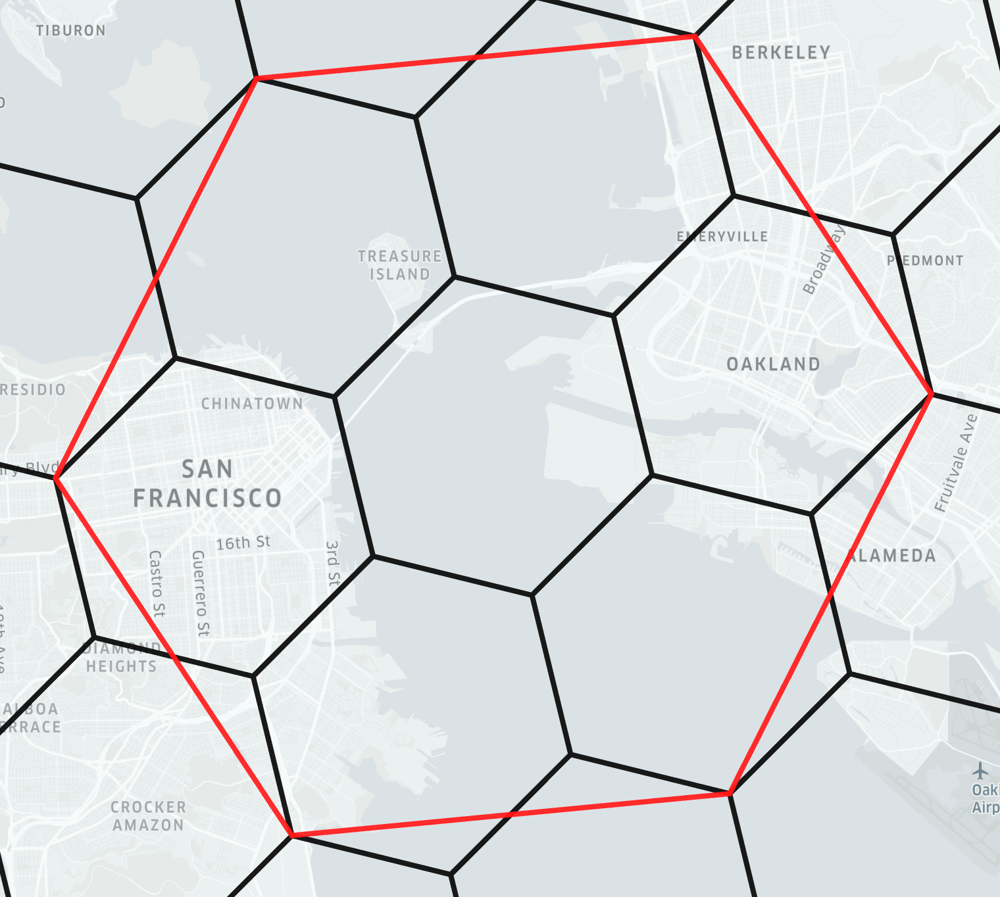
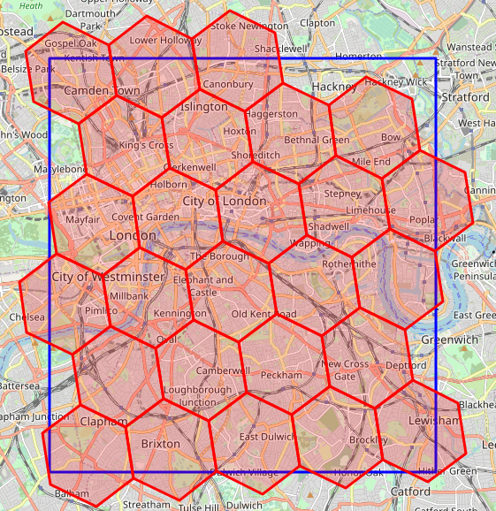
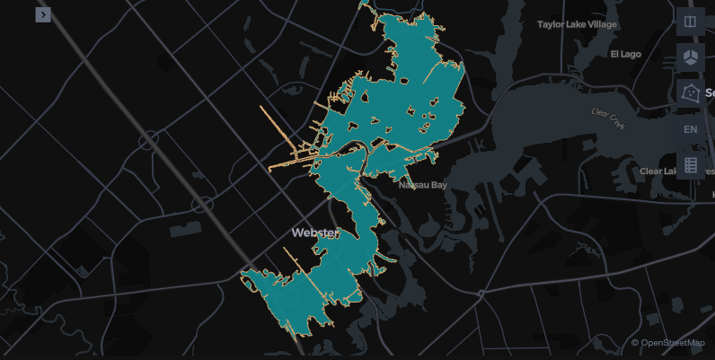
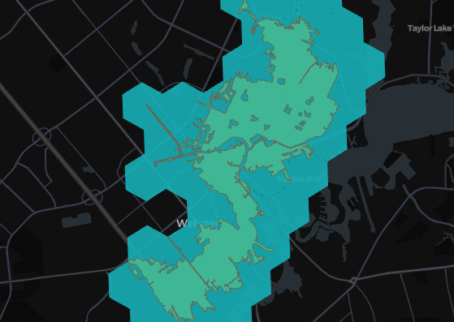
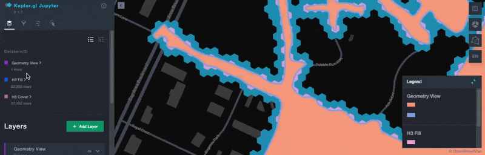
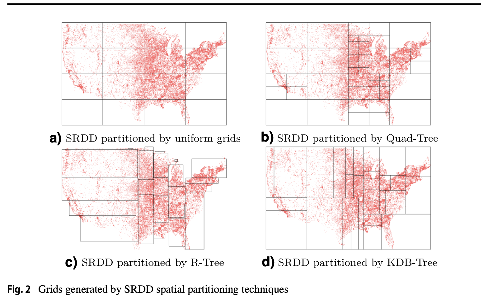

---
date:
  created: 2025-09-05
links:
  - Apache Sedona Discord 社区: https://discord.com/invite/9A3k5dEBsY
  - SedonaSnow: https://app.snowflake.com/marketplace/listing/GZTYZF0RTY3/wherobots-sedonasnow
  - Apache Sedona on Apache Flink: https://sedona.apache.org/latest/tutorial/flink/sql/
authors:
  - matt_forrest
title: 你应该用 H3 做地理空间分析吗?——基于 Apache Spark 和 Sedona 的深度解析
---

<!--
# Licensed to the Apache Software Foundation (ASF) under one
# or more contributor license agreements.  See the NOTICE file
# distributed with this work for additional information
# regarding copyright ownership. The ASF licenses this file
# to you under the Apache License, Version 2.0 (the
# "License"); you may not use this file except in compliance
# with the License. You may obtain a copy of the License at
#
#   http://www.apache.org/licenses/LICENSE-2.0
#
# Unless required by applicable law or agreed to in writing,
# software distributed under the License is distributed on an
# "AS IS" BASIS, WITHOUT WARRANTIES OR CONDITIONS OF ANY
# KIND, either express or implied. See the License for the
# specific language governing permissions and limitations
# under the License.
-->

TL;DR [H3 空间索引](https://www.uber.com/blog/h3/) 提供了一系列空间函数和统一的网格系统,可用于高效的数据聚合与可视化。H3 本质上是一种近似方法,能让部分计算更快,但精度有所下降。Sedona 支持 H3 空间索引,但在很多情况下,尤其当精度重要时,使用精确计算更为合适。

<!-- more -->

## 什么是 H3?

H3 索引是一种空间索引,它将真实世界的几何(点、线、面)转换为六边形分层索引,也就是离散全球网格。例如:

```py
# 40.6892524,-74.044552 - Location of the Statue of Liberty

import h3

resolution = 8
h3.latlng_to_cell(40.6892524, -74.044552, resolution)
"882a1072b5fffff"
```

每个单元都被另外 6 个单元包围,大约 7 个单元在一个分辨率上大致对应到下一个更粗分辨率上的一个更大的"父"单元。这种嵌套并不完美,子单元可能会略微越过父单元的边界(见下图):

{ align=center width="80%" }

_图片来源:[Indexing h3geo.org](https://h3geo.org/docs/highlights/indexing/)_

每个单元还有可度量的面积,取决于它在地球上的位置,从 0 级到 15 级。

| 分辨率 | 单元平均面积 | 面积(km²) | 面积(m²) |
| ----- | ----- | ----- | ----- |
| **0** | 最大 | 4,250,546 km² | 4.25 billion m² |
| **15** | 最小 | 0.0000009 km² | 0.9 m² |

获得这个索引后,你可以使用一系列函数进行近似空间计算,例如(但不限于):

- 检视:获取单元分辨率、字符串转换等。
- 遍历:距离、单元之间的路径、环距离等。
- 层次:单元的父子关系
- 区域:将多边形或其他几何转换为 H3 单元
- 关系:单元的网格关系
- 转换:单元转质心、坐标或几何

### 为什么开发 H3?

H3 由 Uber 开发,旨在为数据科学函数提供一个通用层,用于分析乘车数据,并在司机端 App 中可视化展示上车热点。它提供了一种高效的方法来分析和可视化大规模点数据,而无需计算地理关系:数据可以直接发送到应用(在这里是司机移动 App),无需经纬度数据,只需 H3 索引即可。由于 H3 单元已作为地图图层存在于移动 App 中,因此可以高效地聚合并可视化展示热点。

### 镶嵌与铺砌

镶嵌(Tessellation),又称铺砌(tiling),是指如何用拼块铺满一个平面而不留空隙。

二维平面铺砌很直观,想想看棋盘是如何用方格拼块铺满的。

而用拼块铺满球面就比铺二维平面要复杂得多。H3 通过将六边形投影到二十面体的 20 个面上,然后映射到地球球面,从而构建其全球网格。本文不聚焦于数学,因此我们现在专注于 H3 在地理空间分析中的实际应用。

### 当今 H3 的用途?

如今 H3 越来越多地被用于加速常见的空间操作,例如空间连接(spatial join)。由于几何会被转换为字符串或整数,基于非空间数据类型优化连接的工具可以更快地执行空间操作。由于单元在地球上始终具有相同的位置和形状,可视化也更高效——不需要将几何数据传给可视化应用。

不过,使用 H3 索引处理空间数据在精度、数据保留、数据转换与处理等方面也存在显著权衡。

* 丢失原始几何数据:如果丢弃原始几何数据,一旦转换为 H3 单元就无法再转换回原始几何数据
* 复杂、耗时的多边形转换:将多边形转换为 H3 单元可能在计算上复杂且耗时。在点与多边形之间进行空间连接通常需要这一步。
* 多边形覆盖不精确:用单元填充多边形时不存在完美的填充级别,因此一部分多边形会未被结果单元集合覆盖,而另一些原始多边形之外的区域则会被单元覆盖(见下图)。
* 重叠效应:H3 单元在父与子之间没有完全的覆盖一致性,从而在 H3 单元内部带来一定程度的误差(参见上图中的重叠区域)

{ align=center width="80%" }

_图片来源:[StackOverflow](https://stackoverflow.com/questions/75860703/h3-how-to-get-the-h3-index-of-all-cells-that-are-at-least-partially-inside-a-b)_

Apache Sedona 同时提供了无需使用 H3 单元的基于几何的空间函数,以及创建和读取 H3 索引的函数。无论选择哪种方式,你都可以借助 Apache Sedona 在大规模数据上执行空间查询。

### H3 在 Spark 与 Sedona 中的示例

让我们创建一个包含起点和终点列的 DataFrame,使用纽约的帝国大厦、纽约的自由塔以及芝加哥的威利斯大厦。

```py
empire_state_building = Point(-73.985428, 40.748817)
freedom_tower = Point(-74.013379, 40.712743)
willis_tower = Point(-87.635918, 41.878876)

df = sedona.createDataFrame(
    [
        (empire_state_building, freedom_tower),
        (empire_state_building, willis_tower),
    ],
    ["start", "end"],
)
```

让我们看看如何计算起点和终点之间的球面距离以及 H3 单元距离。

```python
res = (
    df.withColumn("st_distance_sphere", ST_DistanceSphere(col("start"), col("end")))
    .withColumn("start_cellid", ST_H3CellIDs(col("start"), 6, True))
    .withColumn("end_cellid", ST_H3CellIDs(col("end"), 6, True))
    .withColumn(
        "h3_cell_distance",
        ST_H3CellDistance(col("start_cellid")[0], col("end_cellid")[0]),
    )
)
```

这段代码有几点值得注意:

  * 实例化 `ST_H3CellIDs` 时必须提供分辨率。例如,`ST_H3CellIDs(col("start"), 6, True)` 使用分辨率 `6`。
  * `ST_H3CellDistance` 返回一个整数,表示 H3 网格上两个 H3 单元之间相隔的步数(六边形数)。

让我们看一下结果 DataFrame:

```python
res.select("st_distance_sphere", "h3_cell_distance").show()
```

```text
+------------------+----------------+
|st_distance_sphere|h3_cell_distance|
+------------------+----------------+
|4651.5708314048225|               1|
|1145748.4514602514|             180|
+------------------+----------------+
```

`ST_DistanceSphere` 函数返回两点之间的距离(单位:米),而 `ST_H3CellDistance` 函数返回在给定分辨率下两个 H3 单元之间相隔的 H3 单元数。

接下来让我们看一个更现实的 H3 使用示例。

## 在 Apache Sedona 中对比 H3 与几何

为了理解将 H3 单元用于空间分析的细微差别,我们可以使用 Apache Sedona 对比 H3 单元与几何的性能。Sedona 提供了四个用于处理 H3 单元的函数:

- `ST_H3CellDistance`:测量两个单元之间的单元距离(不是真实世界距离)
- `ST_H3CellIDs`:生成一组 H3 单元 ID,用于覆盖多边形或线串
- `ST_H3KRing`:生成原点单元在网格距离 k 以内的"实心圆盘"
- `ST_H3ToGeom`:将一个 H3 单元转换为六边形几何

为演示一个真实世界的用例,我们将使用美国联邦应急管理署(FEMA)的国家洪水危险图层(NFHL)数据。它表示 FEMA 定义的洪水风险区域,具体使用德克萨斯州哈里斯县(休斯顿所在地)的数据。

由于该数据集中很多几何特别复杂且精度很高(从建筑许可到洪水保险等许多决策都基于这些数据),它是一个非常合适的探索用例。我们将测试限定在这一具体的洪水区多边形上:

```py
# Pull the single area to show on the map

area = sedona.sql("""
select *
from fema
where FLD_AR_ID = '48201C_9129'
""")
```

{ align=center width="80%" }

由于 Sedona 使用基于整数的单元标识符表示 H3,我们还将创建一个用户自定义函数,将其转换为基于字符串的 H3 单元。这是因为 SedonaKepler 接受字符串以代替几何,这正是使用 H3 的主要优势之一。

```py
# Create a UDF to convert the H3 integer into a string to skip geometry creation for mapping in SedonaKepler

from pyspark.sql.functions import udf
from pyspark.sql.types import StringType
import h3


# Define a Python function that wraps h3.int_to_str
def h3_int_to_str(x):
    return h3.int_to_str(x)


# Register the function as a Spark UDF
h3_int_to_str_udf = udf(h3_int_to_str, StringType())

sedona.udf.register("h3_int_to_str", h3_int_to_str_udf)
```

## H3 单元的覆盖重叠

H3 单元的一个主要问题是,在将多边形转换为 H3 单元时,它们与多边形的重叠并不均匀。
有两种方法可以做到:

- Cover(覆盖):确保多边形的每一部分都至少被一个单元覆盖
- Fill(填充):仅当单元的质心落在多边形内部时才加入该单元

下面我们在第 8 级使用 cover 方法测试:

```py
h3_cells_8 = sedona.sql("""with a as (
select
explode(ST_H3CellIDs(geometry, 8, true)) as hex_id
from fema
where FLD_AR_ID = '48201C_9129')

select h3_int_to_str(hex_id) as hex_id from a
""")
```

{ align=center width="80%" }

可以看到,在这一级别存在大量额外覆盖。让我们降到第 12 级,看看 fill 和 cover 两种方法的对比。

```py
# Test the same overlap but with H3 Size 12

h3_cells_12_cover = sedona.sql("""with a as (
select
explode(ST_H3CellIDs(geometry, 12, true)) as hex_id
from fema
where FLD_AR_ID = '48201C_9129')
select h3_int_to_str(hex_id) as hex_id from a
""")

h3_cells_12_fill = sedona.sql("""with a as (
select
explode(ST_H3CellIDs(geometry, 12, false)) as hex_id
from fema
where FLD_AR_ID = '48201C_9129')
select h3_int_to_str(hex_id) as hex_id from a
""")
```


你可以看到这一级别已经接近精确覆盖了,但即便使用 fill 方法仍存在重叠和未覆盖的区域。

我们也可以计算覆盖重叠的具体数值。首先是第 8 级图层:

```py
# Find the excess coverage area for H3 coverage level 8

h3_cells_missing_8 = sedona.sql("""with a as (
select
explode(ST_H3ToGeom(ST_H3CellIDs(geometry, 8, true))) as h3_geom
from fema
where FLD_AR_ID = '48201C_9129')

select
sum((st_area(st_intersection(fema.geometry, a.h3_geom))) / st_area(fema.geometry)) - 1 percent_missing
from a
join fema
on st_intersects(h3_geom, geometry)
where FLD_AR_ID = '48201C_9129'
""")

h3_cells_missing_8.show()
```

```text
+--------------------+
|     percent_missing|
+--------------------+
|2.220446049250313...|
+--------------------+
```

这意味着覆盖面积比原始几何多了 2.2 倍。

我们可以对第 12 级 fill 图层做同样的计算,它表现稍好一些:

```py
# Find the percent of missing area with H3 coverage level 12

h3_cells_missing = sedona.sql("""with a as (
select
explode(ST_H3ToGeom(ST_H3CellIDs(geometry, 12, false))) as h3_geom
from fema
where FLD_AR_ID = '48201C_9129')

select
1 - sum((st_area(st_intersection(fema.geometry, a.h3_geom))) / st_area(fema.geometry)) percent_missing
from a
join fema
on st_intersects(h3_geom, geometry)
where FLD_AR_ID = '48201C_9129'
""")

h3_cells_missing.show()
```

```text
+--------------------+
|     percent_missing|
+--------------------+
|0.021671094911437705|
+--------------------+
```

这意味着覆盖缺失约 2.16%——也就是说,H3 单元未能覆盖原始多边形的 2.16%。数值不算太高,但在进行空间连接时,我们会看到它的影响相当显著。

## H3 在空间连接中的取舍

下面让我们对比原始几何、H3 第 8 级以及 H3 第 12 级两种方法在空间连接中的表现。我们将使用 Overture Maps Foundation 建筑物足迹数据集,统计与这些图层相交的建筑物数量。

首先看一个基线:将原始几何与建筑物连接:

```py
# Compare a spatial join at H3 level 8 with Overture Map Buildings

true_spatial_join = sedona.sql("""
select count(overture.id) as buildings
from overture.buildings_building overture
join fema
on st_intersects(fema.geometry, overture.geometry)
where fema.FLD_AR_ID = '48201C_9129'
""")

true_spatial_join.show()
```

```text
+---------+
|buildings|
+---------+
|     1412|
+---------+
```

这意味着有 1,412 栋建筑物至少与洪水区多边形上的某一点相接触。

接着用第 8 级 H3 单元测试。注意,你必须先将单元转换为几何,然后使用 `ST_Union_Aggr` 聚合为单个多边形,以避免对建筑物的重复计数。

```py
# Compare a spatial join at H3 level 8 with Overture Map Buildings

h3_cells_join_level_8 = sedona.sql("""with a as (
select
explode(
ST_H3ToGeom(
ST_H3CellIDs(geometry, 8, true)
)
) as h3_geom
from fema
where FLD_AR_ID = '48201C_9129'),

b as (
select ST_Union_Aggr(h3_geom) as h3_geom from a
)
select count(overture.id) as buildings
from overture.buildings_building overture
join b
on st_intersects(b.h3_geom, overture.geometry)
""")

h3_cells_join_level_8.show()
```

```text
+---------+
|buildings|
+---------+
|     5402|
+---------+
```

这个结果远远多于真实分析中我们想要的。再用重叠最少的 fill 方法、在第 12 级 H3 单元下试试。

```py
h3_cells_join_level_12 = sedona.sql("""with a as (
select
explode(
ST_H3ToGeom(
ST_H3CellIDs(geometry, 12, false)
)
) as h3_geom
from fema
where FLD_AR_ID = '48201C_9129'),
b as (
select ST_Union_Aggr(h3_geom) as h3_geom from a
)
select count(overture.id) as buildings
from overture.buildings_building overture
join b
on st_intersects(b.h3_geom, overture.geometry)
""")

h3_cells_join_level_12.show()
```

```text
# ... text output ...
+---------+
|buildings|
+---------+
|     1457|
+---------+
```

更接近真实结果,但相比真实多边形仍多算了 45 栋。使用 Apache Sedona 处理大规模数据时,你既不需要额外步骤,也无需在精度上做妥协。

下面是三种图层对比的最终地图:

{ align=center width="80%" }

## 分布式查询中的数据倾斜

处理大规模地理空间数据时,性能不仅取决于索引速度或几何近似,还在于工作如何在集群中均匀分布。

H3 将空间划分为均匀的六边形网格。这种方法虽然简单,但在真实数据集中并不奏效——真实数据几乎总是倾斜的:密集的城市区域可能包含数百万个要素,而乡村地区则极少。均匀分区会让某些分区过载,而另一些分区负载不足,导致负载不均衡和拖尾任务,从而拖慢整个作业。

需要注意的是,H3 从未被设计来解决这个问题。相比之下,Apache Sedona 使用 KDB-tree 等自适应空间分区器,根据数据密度划分空间。这确保了分区更均衡,减少热点,并在规模化时提升查询性能。

{ align=center width="80%" }

更深入的内容可参考 Jia Yu 的 [GeoSpark(现 Sedona)论文](https://jiayuasu.github.io/files/paper/GeoSpark_Geoinformatica_2018.pdf),它说明了均匀网格在数据倾斜工作负载下相对自适应方法的不足。

## 结论

H3 通过近似计算可以加速一些空间操作,但它牺牲了精度并带来了额外的复杂性。

Apache Sedona 可扩展,并能精确执行空间计算,使用上更简单。

H3 对于某些类型的空间计算仍是不错的选择,但很多时候,直接使用 Apache Sedona 内建的精确计算更为简单。
