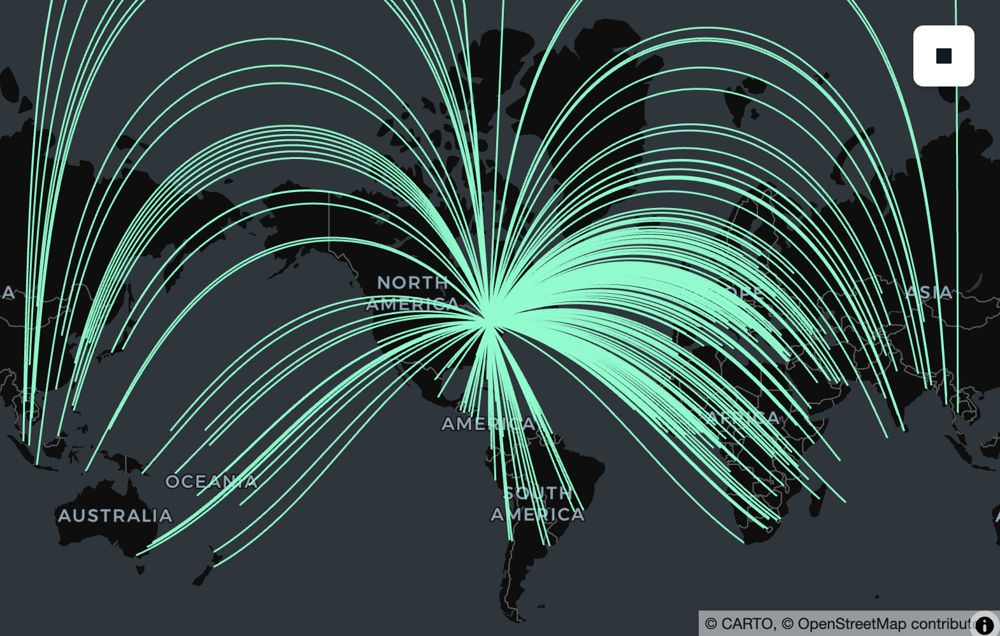
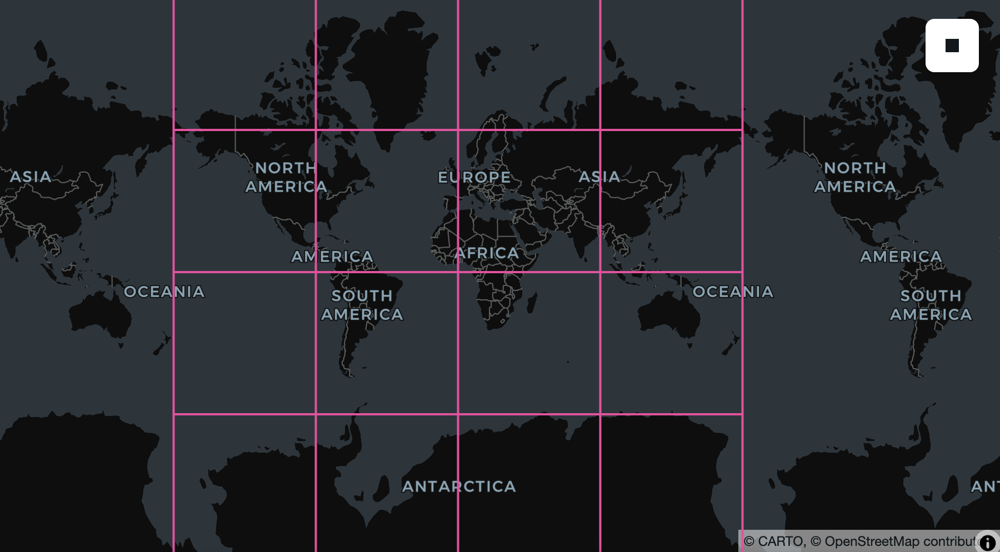
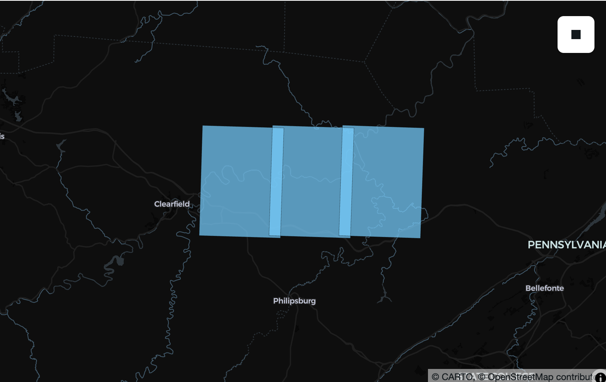

---
date:
  created: 2026-06-19
links:
  - SedonaDB: https://sedona.apache.org/sedonadb/
authors:
  - dewey
  - kristin
  - feng
  - jia
  - pranav
title: "SedonaDB 0.4.0 Release"
---

# SedonaDB 0.4.0 Release

The Apache Sedona community is excited to announce the release of [SedonaDB](https://sedona.apache.org/sedonadb) version 0.4.0!

SedonaDB is the first open-source, single-node analytical database engine that treats spatial data as a first-class citizen. It is developed as a subproject of Apache Sedona. This release consists of 187 resolved issues including 26 new functions from 15 contributors.

Apache Sedona powers large-scale geospatial processing on distributed engines like Spark (SedonaSpark), Flink (SedonaFlink), and Snowflake (SedonaSnow). SedonaDB extends the Sedona ecosystem with a single-node engine optimized for small-to-medium data analytics, delivering the simplicity and speed that distributed systems often cannot.

<!-- more -->

## Release Highlights

We're excited to have so many things to highlight in this release!

- Packaging for conda-forge
- Python DataFrame API
- R dplyr interface
- Geography support
- GPU-accelerated spatial join
- Parquet improvements
- Improved spatial function coverage and documentation
- Raster infrastructure

```python
# pip install --upgrade "apache-sedona[db]"
import sedona.db

sd = sedona.db.connect()
sd.options.interactive = True
```

## Packaging for conda-forge

We're excited to announce that sedonadb is now available on conda-forge! Users of the conda ecosystem can now install SedonaDB with:

```shell
conda install -c conda-forge sedonadb
```

Thank you to [p-vdp](https://github.com/p-vdp) for driving this work!

## Python DataFrame API

While SQL is a powerful, flexible, and well-understood language for describing many of the things one might want to do with spatial data, many Python users prefer using Python functions to interact with data frames and expressions. SedonaDB 0.4.0 adds just this: a basic set of transformation on data frames and expressions drawing inspiration from [Ibis](https://ibis-project.org), [DuckDB Python's relational API](https://duckdb.org/docs/current/clients/python/relational_api), [PySpark](https://spark.apache.org/docs/latest/api/python/index.html), [DataFusion Python](https://datafusion.apache.org/python/), [Pandas](https://pandas.pydata.org), and [GeoPandas](https://geopandas.org).

```python
# Load cities and countries from geoarrow-data
cities_url = "https://raw.githubusercontent.com/geoarrow/geoarrow-data/v0.2.0/natural-earth/files/natural-earth_cities.parquet"
countries_url = "https://raw.githubusercontent.com/geoarrow/geoarrow-data/v0.2.0/natural-earth/files/natural-earth_countries.parquet"

cities = sd.read(cities_url).alias("cities")
countries = sd.read(countries_url).alias("countries")

# Spatial join using the DataFrame API
f = sd.funcs
result = (
    cities.join(
        countries,
        on=f.st_intersects(cities.geometry, countries.geometry),
    )
    .filter(countries.continent != "North America")
    .select(cities.name, country=countries.name, continent=countries.continent)
    .sort("country")
    .limit(10)
)
result.show()
```

    ┌──────────────┬─────────────┬───────────────┐
    │     name     ┆   country   ┆   continent   │
    │     utf8     ┆     utf8    ┆      utf8     │
    ╞══════════════╪═════════════╪═══════════════╡
    │ Kabul        ┆ Afghanistan ┆ Asia          │
    ├╌╌╌╌╌╌╌╌╌╌╌╌╌╌┼╌╌╌╌╌╌╌╌╌╌╌╌╌┼╌╌╌╌╌╌╌╌╌╌╌╌╌╌╌┤
    │ Tirana       ┆ Albania     ┆ Europe        │
    ├╌╌╌╌╌╌╌╌╌╌╌╌╌╌┼╌╌╌╌╌╌╌╌╌╌╌╌╌┼╌╌╌╌╌╌╌╌╌╌╌╌╌╌╌┤
    │ Algiers      ┆ Algeria     ┆ Africa        │
    ├╌╌╌╌╌╌╌╌╌╌╌╌╌╌┼╌╌╌╌╌╌╌╌╌╌╌╌╌┼╌╌╌╌╌╌╌╌╌╌╌╌╌╌╌┤
    │ Luanda       ┆ Angola      ┆ Africa        │
    ├╌╌╌╌╌╌╌╌╌╌╌╌╌╌┼╌╌╌╌╌╌╌╌╌╌╌╌╌┼╌╌╌╌╌╌╌╌╌╌╌╌╌╌╌┤
    │ Buenos Aires ┆ Argentina   ┆ South America │
    ├╌╌╌╌╌╌╌╌╌╌╌╌╌╌┼╌╌╌╌╌╌╌╌╌╌╌╌╌┼╌╌╌╌╌╌╌╌╌╌╌╌╌╌╌┤
    │ Yerevan      ┆ Armenia     ┆ Asia          │
    ├╌╌╌╌╌╌╌╌╌╌╌╌╌╌┼╌╌╌╌╌╌╌╌╌╌╌╌╌┼╌╌╌╌╌╌╌╌╌╌╌╌╌╌╌┤
    │ Melbourne    ┆ Australia   ┆ Oceania       │
    ├╌╌╌╌╌╌╌╌╌╌╌╌╌╌┼╌╌╌╌╌╌╌╌╌╌╌╌╌┼╌╌╌╌╌╌╌╌╌╌╌╌╌╌╌┤
    │ Canberra     ┆ Australia   ┆ Oceania       │
    ├╌╌╌╌╌╌╌╌╌╌╌╌╌╌┼╌╌╌╌╌╌╌╌╌╌╌╌╌┼╌╌╌╌╌╌╌╌╌╌╌╌╌╌╌┤
    │ Sydney       ┆ Australia   ┆ Oceania       │
    ├╌╌╌╌╌╌╌╌╌╌╌╌╌╌┼╌╌╌╌╌╌╌╌╌╌╌╌╌┼╌╌╌╌╌╌╌╌╌╌╌╌╌╌╌┤
    │ Vienna       ┆ Austria     ┆ Europe        │
    └──────────────┴─────────────┴───────────────┘

Support for `.group_by()`, `.agg()`, `.distinct()`, and `.distinct_on()` were also added in 0.4.0 and more are in the works!

In addition to data frame operators, we increasingly realized that our hard-won library of 170+ spatial functions was difficult to explore and use (despite improved [SQL reference documentation](https://sedona.apache.org/sedonadb/latest/reference/sql/)!). Following the pattern of [Pandas-style datatype-specific accessors](https://pandas.pydata.org/docs/reference/series.html#accessors), you can now write expressions as chains with inline documentation helping you as you go.

```python
countries.select(
    countries.name, geometry=countries.geometry.geo.centroid().geo.buffer(0.1)
).limit(4)
```

    ┌─────────────────────────────┬────────────────────────────────────────────────────────────────────┐
    │             name            ┆                              geometry                              │
    │             utf8            ┆                              geometry                              │
    ╞═════════════════════════════╪════════════════════════════════════════════════════════════════════╡
    │ Fiji                        ┆ MULTIPOLYGON(((163.7531646445823 -17.31630942638265,163.755086116… │
    ├╌╌╌╌╌╌╌╌╌╌╌╌╌╌╌╌╌╌╌╌╌╌╌╌╌╌╌╌╌┼╌╌╌╌╌╌╌╌╌╌╌╌╌╌╌╌╌╌╌╌╌╌╌╌╌╌╌╌╌╌╌╌╌╌╌╌╌╌╌╌╌╌╌╌╌╌╌╌╌╌╌╌╌╌╌╌╌╌╌╌╌╌╌╌╌╌╌╌┤
    │ United Republic of Tanzania ┆ MULTIPOLYGON(((34.652989854755944 -6.25773242850609,34.6549113267… │
    ├╌╌╌╌╌╌╌╌╌╌╌╌╌╌╌╌╌╌╌╌╌╌╌╌╌╌╌╌╌┼╌╌╌╌╌╌╌╌╌╌╌╌╌╌╌╌╌╌╌╌╌╌╌╌╌╌╌╌╌╌╌╌╌╌╌╌╌╌╌╌╌╌╌╌╌╌╌╌╌╌╌╌╌╌╌╌╌╌╌╌╌╌╌╌╌╌╌╌┤
    │ Western Sahara              ┆ MULTIPOLYGON(((-12.237831111607791 24.291172960208634,-12.2359096… │
    ├╌╌╌╌╌╌╌╌╌╌╌╌╌╌╌╌╌╌╌╌╌╌╌╌╌╌╌╌╌┼╌╌╌╌╌╌╌╌╌╌╌╌╌╌╌╌╌╌╌╌╌╌╌╌╌╌╌╌╌╌╌╌╌╌╌╌╌╌╌╌╌╌╌╌╌╌╌╌╌╌╌╌╌╌╌╌╌╌╌╌╌╌╌╌╌╌╌╌┤
    │ Canada                      ┆ MULTIPOLYGON(((-98.24238137209699 61.46907614534894,-98.240459900… │
    └─────────────────────────────┴────────────────────────────────────────────────────────────────────┘

## R dplyr Interface

Similarly, in past releases R users had to use SQL to access most features of SedonaDB. In the 0.4.0 release, you can now use the dplyr backend to transform your SedonaDB-backed lazy data frames. To make this happen we added a new pakckage, **sdplyr**, with an additional package **sedonafns** whose job it is to enumerate and document our large and growing collection of spatial functions. You can get everything you need from [the sdplyr package on R Universe](https://apache.r-universe.dev/sdplyr) to get started!

```r
library(sdplyr)

# Load cities and countries from geoarrow-data
cities_url <- "https://raw.githubusercontent.com/geoarrow/geoarrow-data/v0.2.0/natural-earth/files/natural-earth_cities.parquet"
countries_url <- "https://raw.githubusercontent.com/geoarrow/geoarrow-data/v0.2.0/natural-earth/files/natural-earth_countries.parquet"

cities <- sd_read_parquet(cities_url)
countries <- sd_read_parquet(countries_url)

# Spatial join using dplyr
cities |>
  inner_join(
    countries,
    by = sd_join_intersects()
  ) |>
  filter(continent != "North America") |>
  select(
    city = name.x,
    country = name.y,
    continent
  ) |>
  arrange(country) |>
  head(10)
#> <sedonab_dataframe: NA x 3>
#> ┌──────────────┬─────────────┬───────────────┐
#> │     city     ┆   country   ┆   continent   │
#> │     utf8     ┆     utf8    ┆      utf8     │
#> ╞══════════════╪═════════════╪═══════════════╡
#> │ Kabul        ┆ Afghanistan ┆ Asia          │
#> ├╌╌╌╌╌╌╌╌╌╌╌╌╌╌┼╌╌╌╌╌╌╌╌╌╌╌╌╌┼╌╌╌╌╌╌╌╌╌╌╌╌╌╌╌┤
#> │ Tirana       ┆ Albania     ┆ Europe        │
#> ├╌╌╌╌╌╌╌╌╌╌╌╌╌╌┼╌╌╌╌╌╌╌╌╌╌╌╌╌┼╌╌╌╌╌╌╌╌╌╌╌╌╌╌╌┤
#> │ Algiers      ┆ Algeria     ┆ Africa        │
#> ├╌╌╌╌╌╌╌╌╌╌╌╌╌╌┼╌╌╌╌╌╌╌╌╌╌╌╌╌┼╌╌╌╌╌╌╌╌╌╌╌╌╌╌╌┤
#> │ Luanda       ┆ Angola      ┆ Africa        │
#> ├╌╌╌╌╌╌╌╌╌╌╌╌╌╌┼╌╌╌╌╌╌╌╌╌╌╌╌╌┼╌╌╌╌╌╌╌╌╌╌╌╌╌╌╌┤
#> │ Buenos Aires ┆ Argentina   ┆ South America │
#> ├╌╌╌╌╌╌╌╌╌╌╌╌╌╌┼╌╌╌╌╌╌╌╌╌╌╌╌╌┼╌╌╌╌╌╌╌╌╌╌╌╌╌╌╌┤
#> │ Yerevan      ┆ Armenia     ┆ Asia          │
#> └──────────────┴─────────────┴───────────────┘
#> Preview of up to 6 row(s)
```

While we have some R functions translated for use in SedonaDB à la dbplyr/arrow, this is a work in progress. In the meantime, DataFusion/SedonaDB-raw SQL functions are available via `.fns` (e.g., `.fns$substr(some_col,1, 5)`) and tidy `!!some_r_expression` are supported and we would love [feature requests](https://github.com/apache/sedona-db/issues/new) to implement frequently used functions from our users.

## Geography Support

SedonaDB 0.4.0 introduces expanded support for the Geography data type, including a completely rewritten implementation of most operations using [s2geography](https://github.com/paleolimbot/s2geography), which in turn packages primitives from Google's [s2geometry](https://github.com/google/s2geometry) as PostGIS/BigQuery-compatible SQL operators.

Geography shines for distance queries across large geographical areas. For example, if we wanted to find cities within 200 km of Germany, we'd have to find a local projection and do potentially expensive transformations between coordinate systems. Geography simplifies this to a simple distance-within query:

```python
germany = countries.filter(countries.name == "Germany").select(
    countries.geometry.geo.to_geography()
)

cities.filter(
    cities.geometry.geo.to_geography().geo.d_within(germany, 100_000.0)
).select(cities.name)
```

    ┌────────────┐
    │    name    │
    │    utf8    │
    ╞════════════╡
    │ Vaduz      │
    ├╌╌╌╌╌╌╌╌╌╌╌╌┤
    │ Luxembourg │
    ├╌╌╌╌╌╌╌╌╌╌╌╌┤
    │ Bern       │
    ├╌╌╌╌╌╌╌╌╌╌╌╌┤
    │ Prague     │
    ├╌╌╌╌╌╌╌╌╌╌╌╌┤
    │ Amsterdam  │
    ├╌╌╌╌╌╌╌╌╌╌╌╌┤
    │ Berlin     │
    └────────────┘

This works for spatial joins, too. If you'd like to analyze *all* the countries with their nearby cities, SedonaDB can now do that too.

```python
cities_geog = cities.select(
    cities.name, geometry=cities.geometry.geo.to_geography()
).alias("cities_geog")
countries_geog = countries.select(
    countries.name,
    countries.continent,
    geometry=countries.geometry.geo.to_geography(),
).alias("countries_geog")

cities_geog.join(
    countries_geog,
    on=f.st_dwithin(
        cities_geog.geometry,
        countries_geog.geometry,
        100_000,  # Distance in meters!
    ),
).select(
    cities_geog.name, country=countries_geog.name, continent=countries_geog.continent
)
```

    ┌──────────────┬──────────────┬───────────┐
    │     name     ┆    country   ┆ continent │
    │     utf8     ┆     utf8     ┆    utf8   │
    ╞══════════════╪══════════════╪═══════════╡
    │ Vatican City ┆ Italy        ┆ Europe    │
    ├╌╌╌╌╌╌╌╌╌╌╌╌╌╌┼╌╌╌╌╌╌╌╌╌╌╌╌╌╌┼╌╌╌╌╌╌╌╌╌╌╌┤
    │ San Marino   ┆ Italy        ┆ Europe    │
    ├╌╌╌╌╌╌╌╌╌╌╌╌╌╌┼╌╌╌╌╌╌╌╌╌╌╌╌╌╌┼╌╌╌╌╌╌╌╌╌╌╌┤
    │ Vaduz        ┆ Austria      ┆ Europe    │
    ├╌╌╌╌╌╌╌╌╌╌╌╌╌╌┼╌╌╌╌╌╌╌╌╌╌╌╌╌╌┼╌╌╌╌╌╌╌╌╌╌╌┤
    │ Vaduz        ┆ Germany      ┆ Europe    │
    ├╌╌╌╌╌╌╌╌╌╌╌╌╌╌┼╌╌╌╌╌╌╌╌╌╌╌╌╌╌┼╌╌╌╌╌╌╌╌╌╌╌┤
    │ Vaduz        ┆ Switzerland  ┆ Europe    │
    ├╌╌╌╌╌╌╌╌╌╌╌╌╌╌┼╌╌╌╌╌╌╌╌╌╌╌╌╌╌┼╌╌╌╌╌╌╌╌╌╌╌┤
    │ Vaduz        ┆ Italy        ┆ Europe    │
    ├╌╌╌╌╌╌╌╌╌╌╌╌╌╌┼╌╌╌╌╌╌╌╌╌╌╌╌╌╌┼╌╌╌╌╌╌╌╌╌╌╌┤
    │ Lobamba      ┆ South Africa ┆ Africa    │
    ├╌╌╌╌╌╌╌╌╌╌╌╌╌╌┼╌╌╌╌╌╌╌╌╌╌╌╌╌╌┼╌╌╌╌╌╌╌╌╌╌╌┤
    │ Lobamba      ┆ Mozambique   ┆ Africa    │
    ├╌╌╌╌╌╌╌╌╌╌╌╌╌╌┼╌╌╌╌╌╌╌╌╌╌╌╌╌╌┼╌╌╌╌╌╌╌╌╌╌╌┤
    │ Lobamba      ┆ eSwatini     ┆ Africa    │
    ├╌╌╌╌╌╌╌╌╌╌╌╌╌╌┼╌╌╌╌╌╌╌╌╌╌╌╌╌╌┼╌╌╌╌╌╌╌╌╌╌╌┤
    │ Luxembourg   ┆ France       ┆ Europe    │
    └──────────────┴──────────────┴───────────┘

Geography is also useful for calculating the shortest path along the surface of the earth between two points or more complex geometries. For example, if you wanted to find the theoretical path an airplane would take if it flew from Toronto to any other city in the world, you could simply create a line (using ST_MakeLine) and use ST_TessellateGeom to visualize the line on a flat lon/lat map like those provided by most interactive map providers.

```python
import lonboard

result = (
    cities_geog.filter(cities_geog.name == "Toronto")
    .select(name_from=cities_geog.name, pt_from=cities_geog.geometry)
    .cross_join(cities_geog)
    .select(
        name_to=sd.col("name"),
        geometry=sd.col("pt_from")
        .geo.make_line(sd.col("geometry"))
        .geo.tessellate_geom(1_000),
    )
)

lonboard.viz(result.to_pandas())
```

    Map(basemap_style=<CartoBasemap.DarkMatter: 'https://basemaps.cartocdn.com/gl/dark-matter-gl-style/style.json'…



Functions directly supported by s2geometry/s2geography include `s2_cellidfrompoint`, `s2_coveringcellids`, `st_area`, `st_buffer`, `st_centroid`, `st_closestpoint`, `st_contains`, `st_convexhull`, `st_difference`, `st_disjoint`, `st_distance`, `st_dwithin`, `st_equals`, `st_intersection`, `st_intersects`, `st_length`, `st_lineinterpolatepoint`, `st_linelocatepoint`, `st_longestline`, `st_maxdistance`, `st_perimeter`, `st_pointonsurface`, `st_reduceprecision`, `st_segmentize`, `st_shortestline`, `st_simplify`, `st_symdifference`, `st_tessellategeog`, `st_tessellategeom`, `st_union`, and `st_within`.

Additionally, we've made sure that bounding box-related functions (`st_analyze_agg`, `st_envelope`, `st_envelope_agg`, `st_xmax`, `st_xmin`, `st_ymax`, `st_ymin`) are all geography aware, and that structural accessors/transformers (`st_asbinary`, `st_astext`, `st_boundary`, `st_dimension`, `st_flipcoordinates`, `st_force2d`, `st_force3d`, `st_force3dm`, `st_force4d`, `st_geogfromwkb`, `st_geogfromwkt`, `st_geogpoint`, `st_geometryn`, `st_geometrytype`, `st_interiorringn`, `st_isclosed`, `st_iscollection`, `st_isempty`, `st_linemerge`, `st_mmax`, `st_mmin`, `st_normalize`, `st_npoints`, `st_nrings`, `st_numgeometries`, `st_numinteriorrings`, `st_numpoints`, `st_pointn`, `st_points`, `st_reverse`, `st_setcrs`, `st_togeography`, `st_togeometry`, `st_x`, `st_y`, `st_zmax`, `st_zmin`) all support Geography just as they support Geometry.

Thanks to [edzer](https://github.com/edzer), [benbovy](https://github.com/benbovy), [jorisvandenbossche](https://github.com/jorisvandenbossche), and many years of [s2geography](https://github.com/paleolimbot/s2geography) and [r-spatial/s2](https://github.com/r-spatial/s2) contributors that formed the basis for these implementations.

## GPU-Accelerated Spatial Join

SedonaDB now introduces hardware acceleration via an integrated GPU Spatial Join Library. This feature significantly boosts the performance of compute-intensive spatial joins by offloading highly parallel filtering and refinement operations to the GPU.

By default, the GPU feature is disabled and is not included in the standard published python packages; however we provide an official Docker image to easily try this feature with a single command that supports [GPU models with compute capabilities 7.5, 8.6, and 8.9](https://developer.nvidia.com/cuda/gpus). For other GPU models, we encourage users to build the image or Python package directly from source.

```bash
docker run -it --rm --gpus all -p 8888:8888 apache/sedona:sedonadb-latest
```

Launching the container provides a [JupyterLab](https://jupyter.org/) instance. From there, you can connect to SedonaDB and enable GPU acceleration using the following configuration:

```python
import sedona.db

ctx = sedona.db.connect()

# Enable the GPU feature
ctx.sql("SET gpu.enable = true")

# Increase the batch size to feed sufficient data to the GPU
ctx.sql("SET datafusion.execution.batch_size = 100000")
```

For more information, see our brand new [GPU Acceleration guide](https://sedona.apache.org/sedonadb/latest/gpu-acceleration/).

Thanks to [pwrliang](https://github.com/pwrliang) for the research, benchmarking, implementation, and documentation for this feature!

## Parquet improvements

Whereas in 0.3.0 we added support for *reading* first-class Geometry and Geography types, in 0.4.0 we added write support. Thanks to first-class Geography support throughout the engine, this includes geography support with statistics (both on the read side, for pruning, and the write side, for generating them!). The [draft GeoParquet 2.0 specification](https://github.com/opengeospatial/geoparquet) is based on these types, and SedonaDB will happily write either plain Parquet files or Parquet files with GeoArrow 1.0, 1.1, or 2.0 metadata for compatibility with existing engines.

```python
import sedona.db

sd = sedona.db.connect()
countries_url = "https://raw.githubusercontent.com/geoarrow/geoarrow-data/v0.2.0/natural-earth/files/natural-earth_countries.parquet"
countries = sd.read(countries_url).alias("countries")

countries.select(
    countries.name, countries.continent, geometry=countries.geometry.geo.to_geography()
).to_parquet(
    "countries-geog.parquet",
    geoparquet_version="2.0",
    sort_by="geometry",
    max_row_group_size=10_000,
)
```

```python
from pyarrow import parquet

parquet.ParquetFile("countries-geog.parquet").schema
```

    <pyarrow._parquet.ParquetSchema object at 0x1174f3680>
    required group field_id=-1 arrow_schema {
      optional binary field_id=-1 name (String);
      optional binary field_id=-1 continent (String);
      optional binary field_id=-1 geometry (Geography(crs=, algorithm=spherical));
    }

## Improved spatial function coverage

Since the 0.3.0 release we have been fortunate to work with contributors to add 26 new ST\_ and RS\_ functions to our growing catalogue. Users of rs_bandnodatavalue, rs_bandpixeltype, rs_bandtodim, rs_contains, rs_dimnames, rs_dimsize, rs_dimtoband, rs_ensureloaded, rs_frompath, rs_intersects, rs_isempty, rs_metadata, rs_numdimensions, rs_pixelascentroid, rs_pixelaspoint, rs_pixelaspolygon, rs_shape, rs_slice, rs_slicerange, rs_within, st_linesubstring, st_longestline, st_normalize, st_pointonsurface, st_reduceprecision, st_relate, st_segmentize, st_tessellategeog, st_tessellategeom, st_togeography, and st_togeometry. This brings the total ST\_ and RS\_ function count to 176, all of which are tested against PostGIS and/or BigQuery for compatibility with the full matrix of geometry types and XY, XYZ, XYM, and XYZM wherever possible. Check them out in our always improving [SQL reference documentation](https://sedona.apache.org/sedonadb/latest/reference/sql/)!

Thank you to [Kontinuation](https://github.com/Kontinuation), [james-willis](https://github.com/james-willis), [oglego](https://github.com/oglego), and [sapienza88](https://github.com/sapienza88) for these contributions!

## N-dimensional array and Zarr support

Geospatial raster data is increasingly a *datacube*: climate reanalyses, satellite time series, and model outputs all stack extra axes (e.g., `time`, `level`, `band`) on top of the spatial grid. In 0.4.0, SedonaDB's raster type goes natively N-dimensional, and the new `sedonadb-zarr` extension reads [Zarr](<https://zarr.dev/>) groups straight into a queryable raster column.

Point SedonaDB at a Zarr datacube and explore its shape without reading a single pixel:

```python
# pip install sedonadb-zarr
import sedonadb_zarr

# Register Zarr functionality with a SedonaDB session
sd.register(sedonadb_zarr.ZarrExtension())

# A public ERA5 rainfall pyramid (Zarr, anonymous). Reading + inspecting
# dimensions is a metadata-only round-trip — no pixel bytes fetched.
url = "https://weathermapdata.rdrn.me/era5_2015_2020_l5.zarr/2"
spec = sedonadb_zarr.Zarr().with_options({"arrays": ["rain_ok"]})
cube = sd.read(url, format=spec)

cube.select(
    cube.raster.rst.num_dimensions().alias("ndim"),
    cube.raster.rst.dim_names().alias("dims"),
    cube.raster.rst.shape().alias("shape"),
    cube.raster.rst.srid().alias("srid"),
).show(1)
```

    ┌───────┬──────────────┬───────────────┬────────┐
    │  ndim ┆     dims     ┆     shape     ┆  srid  │
    │ int32 ┆     list     ┆      list     ┆ uint32 │
    ╞═══════╪══════════════╪═══════════════╪════════╡
    │     3 ┆ [year, y, x] ┆ [1, 128, 128] ┆   3857 │
    └───────┴──────────────┴───────────────┴────────┘

`sedonadb-zarr` emits one row per Zarr chunk, so the storage layout *is* the data layout. SedonaDB stays lazy about pixels: reading the group and inspecting its dimensions (`RS_DimNames`, `RS_Shape`, `RS_DimSize`, `RS_NumDimensions`) touches only the group schema, which is a small metadata round-trip, with no pixel bytes fetched. A chunk's bytes are read only when an operation actually needs them. `RS_Slice` is currently one such operation: it resolves the chunks the query touches, then slices.

```python
sliced = cube.select(plane=cube.raster.rst.slice("year", 0))
sliced.select(
    dims=sliced.plane.rst.dim_names(),
    shape=sliced.plane.rst.shape(),
).show(1)
```

    ┌────────┬────────────┐
    │  dims  ┆    shape   │
    │  list  ┆    list    │
    ╞════════╪════════════╡
    │ [y, x] ┆ [128, 128] │
    └────────┴────────────┘

Because each row is a chunk, `.show(5)` touches exactly five chunks and a `.filter(...)` trims the set further, so you only fetch the chunks your query reaches. The data stays in the cloud until then. And because each chunk is a row with a real spatial footprint, you can put a Zarr on a map without decoding a single pixel. `RS_Envelope` turns each chunk into its bounding geometry, so you can see exactly where the cube's chunks fall:

```python
chunks = cube.select(geom=f.st_transform(cube.raster.rst.envelope(), "EPSG:4326"))

# Draw outlines only, so the basemap shows through the chunk grid.
lonboard.viz(
    chunks,
    polygon_kwargs=dict(
        filled=False,
        stroked=True,
        get_line_color=[236, 64, 160],
        line_width_min_pixels=2,
    ),
)
```



For the full walkthrough (load a cube, inspect its dimensions, slice a plane, and hand it to NumPy) see [Working with Zarr and NDArray data in SedonaDB](https://sedona.apache.org/sedonadb/latest/working-with-zarr-ndarray-sedonadb/).

In addition to a [redesign of our existing raster type to accommodate N-dimensional data](https://github.com/apache/sedona-db/pull/749), we added a number of `RS_` functions that mirror equivalents in Sedona Spark, with a focus on reading and extracting metadata. For example, in SedonaDB 0.4.0 it is also possible to extract the extent from a series of GeoTiffs and put them on a map.

```python
import pandas as pd

usgs_drg_quads = [
    "https://download.osgeo.org/geotiff/samples/usgs/o41078a1.tif",
    "https://download.osgeo.org/geotiff/samples/usgs/o41078a2.tif",
    "https://download.osgeo.org/geotiff/samples/usgs/o41078a3.tif",
]

tiffs = sd.create_data_frame(pd.DataFrame({"url": usgs_drg_quads}))
envelopes = tiffs.select(f.rs_envelope(f.rs_frompath(tiffs.url)).geo.transform(4326))
lonboard.viz(envelopes)
```



While we're not ready to announce that SedonaDB fully supports raster data, we're excited at the foundation we we able to build for the 0.4.0 release and look forward to building this feature in earnest with the community over the next few months...we'd love your input on where it goes next! If you're working with datacubes or cloud-native raster data, [open an issue](https://github.com/apache/sedona-db/issues/new/choose) and tell us what you're building and what you need.

Thank you to [Kontinuation](https://github.com/Kontinuation) for designing and driving this the 2D improvements, and [james-willis](https://github.com/james-willis) for designing and driving N-dimensional/Zarr support!

## What's Next?

Among other projects, in 0.5.0 we plan to [expand geography coverage to include the union of supported geography functions in PostGIS and BigQuery](https://github.com/apache/sedona-db/issues/821), [make our point cloud readers accessible to Python and R users](https://github.com/apache/sedona-db/issues/595), and realize the potential of our raster/ND-array foundation.

We'd love to hear your feedback and use cases! Join the conversation on [GitHub Discussions](https://github.com/apache/sedona-db/discussions) or the [Apache Sedona mailing list](https://sedona.apache.org/community/).

## Contributors

```shell
git shortlog -sn apache-sedona-db-0.4.0.dev..HEAD
    50  Dewey Dunnington
    31  James Willis
    20  Jia Yu
    16  Kristin Cowalcijk
    13  Liang Geng
     5  Camden Lowrance
     2  Balthasar Teuscher
     2  Mehak3010
     2  Terry L. Blessing
     2  Yongting You
     1  Mayank Aggarwal
     1  Peter Von der Porten
     1  Pranav Toggi
     1  Pratheek Rebala
     1  Selim S.
     1  oglego
```
