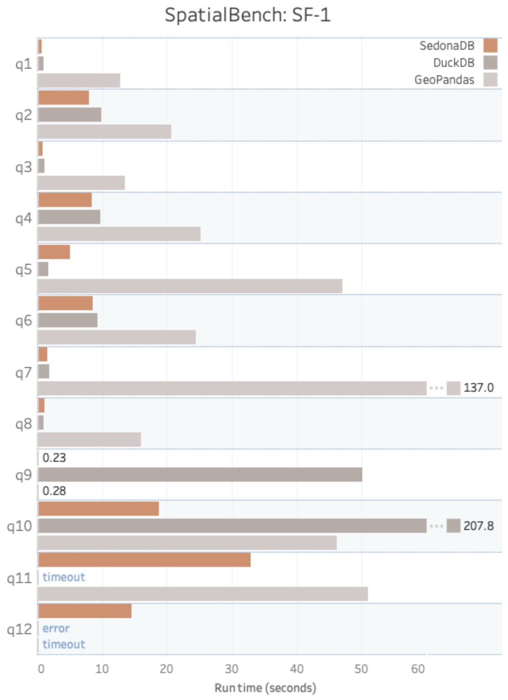

---
date:
  created: 2025-09-24
links:
  - Apache Sedona Discord: https://discord.com/invite/9A3k5dEBsY
authors:
  - dewey
  - feng
  - jia
  - kristin
  - matt_powers
title: "Introducing SedonaDB: A spatial-first query engine"
---

<!--
# Licensed to the Apache Software Foundation (ASF) under one
# or more contributor license agreements.  See the NOTICE file
# distributed with this work for additional information
# regarding copyright ownership.  The ASF licenses this file
# to you under the Apache License, Version 2.0 (the
# "License"); you may not use this file except in compliance
# with the License.  You may obtain a copy of the License at
#
#   http://www.apache.org/licenses/LICENSE-2.0
#
# Unless required by applicable law or agreed to in writing,
# software distributed under the License is distributed on an
# "AS IS" BASIS, WITHOUT WARRANTIES OR CONDITIONS OF ANY
# KIND, either express or implied.  See the License for the
# specific language governing permissions and limitations
# under the License.
-->

The Apache Sedona community is excited to announce the initial release of SedonaDB.

SedonaDB is the first open-source, single-node analytical database engine that treats spatial data as a first-class citizen.

Written in Rust, it’s lightweight, blazing fast, and spatial-native. Out of the box, it provides: \

* Full support for spatial types, joins, CRS (coordinate reference systems), and functions on top of industry-standard query operations.
* Query optimizations, indexing, and data pruning features under the hood that make spatial operations just work with high performance.
* Pythonic and SQL interfaces familiar to developers, plus APIs for R and Rust.
* Flexibility to run in single-machine environments on local files or data lakes. 

SedonaDB utilizes Apache Arrow and Apache DataFusion, providing everything you need from a modern, vectorized query engine. However, it also delivers the unique ability to run high-performance spatial workloads easily, without requiring extensions. It's for builders who need a spatial-first query engine. 

SedonaDB is easy to download and run on your local machine or in the cloud. You can install it easily in any runtime.

Apache Sedona already adds geospatial support to Apache Spark (SedonaSpark), Apache Flink (SedonaFlink), and Snowflake (SedonaSnow).  SedonaDB is an excellent small data complement to the existing big data/streaming Sedona libraries.  

The initial release of SedonaDB provides a comprehensive suite of geometric vector operations and seamlessly integrates with GeoArrow, GeoParquet, and GeoPandas.  Subsequent releases will support all popular spatial functions, including functions for raster data.

## SedonaDB quickstart example

Start by installing SedonaDB:

```
pip install "apache-sedona[db]"
```

Now instantiate the connection:

```python
import sedona.db
sd = sedona.db.connect()
```

Let's perform a spatial join using SedonaDB.

Suppose you have a `cities` table with latitude and longitude points representing the center of each city, and a `countries` table with a column containing a polygon of the country's geographic boundaries.

Here are a few rows from the `cities` table:

```
┌──────────────┬───────────────────────────────┐
│     name     ┆            geometry           │
│   utf8view   ┆      geometry <epsg:4326>     │
╞══════════════╪═══════════════════════════════╡
│ Vatican City ┆ POINT(12.4533865 41.9032822)  │
├╌╌╌╌╌╌╌╌╌╌╌╌╌╌┼╌╌╌╌╌╌╌╌╌╌╌╌╌╌╌╌╌╌╌╌╌╌╌╌╌╌╌╌╌╌╌┤
│ San Marino   ┆ POINT(12.4417702 43.9360958)  │
├╌╌╌╌╌╌╌╌╌╌╌╌╌╌┼╌╌╌╌╌╌╌╌╌╌╌╌╌╌╌╌╌╌╌╌╌╌╌╌╌╌╌╌╌╌╌┤
│ Vaduz        ┆ POINT(9.5166695 47.1337238)   │
├╌╌╌╌╌╌╌╌╌╌╌╌╌╌┼╌╌╌╌╌╌╌╌╌╌╌╌╌╌╌╌╌╌╌╌╌╌╌╌╌╌╌╌╌╌╌┤
```

And here are a few rows from the countries table:

```
┌─────────────────────────────┬───────────────┬────────────────────────────────────────────────────┐
│             name            ┆   continent   ┆                      geometry                      │
│           utf8view          ┆    utf8view   ┆                geometry <epsg:4326>                │
╞═════════════════════════════╪═══════════════╪════════════════════════════════════════════════════╡
│ Fiji                        ┆ Oceania       ┆ MULTIPOLYGON(((180 -16.067132663642447,180 -16.55… │
├╌╌╌╌╌╌╌╌╌╌╌╌╌╌╌╌╌╌╌╌╌╌╌╌╌╌╌╌╌┼╌╌╌╌╌╌╌╌╌╌╌╌╌╌╌┼╌╌╌╌╌╌╌╌╌╌╌╌╌╌╌╌╌╌╌╌╌╌╌╌╌╌╌╌╌╌╌╌╌╌╌╌╌╌╌╌╌╌╌╌╌╌╌╌╌╌╌╌┤
│ United Republic of Tanzania ┆ Africa        ┆ POLYGON((33.90371119710453 -0.9500000000000001,34… │
├╌╌╌╌╌╌╌╌╌╌╌╌╌╌╌╌╌╌╌╌╌╌╌╌╌╌╌╌╌┼╌╌╌╌╌╌╌╌╌╌╌╌╌╌╌┼╌╌╌╌╌╌╌╌╌╌╌╌╌╌╌╌╌╌╌╌╌╌╌╌╌╌╌╌╌╌╌╌╌╌╌╌╌╌╌╌╌╌╌╌╌╌╌╌╌╌╌╌┤
│ Western Sahara              ┆ Africa        ┆ POLYGON((-8.665589565454809 27.656425889592356,-8… │
├╌╌╌╌╌╌╌╌╌╌╌╌╌╌╌╌╌╌╌╌╌╌╌╌╌╌╌╌╌┼╌╌╌╌╌╌╌╌╌╌╌╌╌╌╌┼╌╌╌╌╌╌╌╌╌╌╌╌╌╌╌╌╌╌╌╌╌╌╌╌╌╌╌╌╌╌╌╌╌╌╌╌╌╌╌╌╌╌╌╌╌╌╌╌╌╌╌╌┤
```

Here’s how to perform a spatial join to compute the country of each city:

```python
sd.sql("""
select 
    cities.name as city_name,
    countries.name as country_name,
    continent
from cities
join countries
where ST_Intersects(cities.geometry, countries.geometry)
""").show(3)
```

The code utilizes `ST_Intersects` to determine if a city is contained within a given country.

Here’s the result of the query:

```
┌───────────────┬─────────────────────────────┬───────────┐
│   city_name   ┆         country_name        ┆ continent │
│    utf8view   ┆           utf8view          ┆  utf8view │
╞═══════════════╪═════════════════════════════╪═══════════╡
│ Suva          ┆ Fiji                        ┆ Oceania   │
├╌╌╌╌╌╌╌╌╌╌╌╌╌╌╌┼╌╌╌╌╌╌╌╌╌╌╌╌╌╌╌╌╌╌╌╌╌╌╌╌╌╌╌╌╌┼╌╌╌╌╌╌╌╌╌╌╌┤
│ Dodoma        ┆ United Republic of Tanzania ┆ Africa    │
├╌╌╌╌╌╌╌╌╌╌╌╌╌╌╌┼╌╌╌╌╌╌╌╌╌╌╌╌╌╌╌╌╌╌╌╌╌╌╌╌╌╌╌╌╌┼╌╌╌╌╌╌╌╌╌╌╌┤
│ Dar es Salaam ┆ United Republic of Tanzania ┆ Africa    │
└───────────────┴─────────────────────────────┴───────────┘
```

The code above is an example of a point-in-polygon join.  The point represents the city, and the polygon represents the area that represents the country.  SedonaDB can easily perform spatial joins with optimizations, such as effectively utilizing spatial indices where required and adapting join strategies at runtime based on samples of the input data.

These types of spatial operations can be relatively slow for engines that are not optimized for spatial data.  SedonaDB is optimized for these spatial computations.  

## Apache Sedona SpatialBench

To test our work on SedonaDB, we also needed to develop a mechanism to evaluate its performance and speed. As a result of this, and other motivations, we also created Apache Sedona SpatialBench, which is a new standard for measuring the performance of spatial data processing engines and databases. We will discuss the benefits and capabilities of SpatialBench in more detail in our next blog.

## Single-node spatial benchmarks

Let’s compare the performance of SedonaDB vs. GeoPandas and DuckDB Spatial for some representative spatial queries as defined in [SpatialBench](https://sedona.apache.org/spatialbench/):

{ align=center width="80%" }

Here’s an example of the SpatialBench query #8 SQL code that works for SedonaDB and DuckDB:

```sql
SELECT b.b_buildingkey, b.b_name, COUNT(*) AS nearby_pickup_count
FROM trip t JOIN building b ON ST_DWithin(ST_GeomFromWKB(t.t_pickuploc), ST_GeomFromWKB(b.b_boundary), 0.0045) -- ~500m
GROUP BY b.b_buildingkey, b.b_name
ORDER BY nearby_pickup_count DESC
```

Here’s what the query returns:

```
┌───────────────┬──────────┬─────────────────────┐
│ b_buildingkey ┆  b_name  ┆ nearby_pickup_count │
│     int64     ┆ utf8view ┆        int64        │
╞═══════════════╪══════════╪═════════════════════╡
│          3779 ┆ linen    ┆                  42 │
├╌╌╌╌╌╌╌╌╌╌╌╌╌╌╌┼╌╌╌╌╌╌╌╌╌╌┼╌╌╌╌╌╌╌╌╌╌╌╌╌╌╌╌╌╌╌╌╌┤
│         19135 ┆ misty    ┆                  36 │
├╌╌╌╌╌╌╌╌╌╌╌╌╌╌╌┼╌╌╌╌╌╌╌╌╌╌┼╌╌╌╌╌╌╌╌╌╌╌╌╌╌╌╌╌╌╌╌╌┤
│          4416 ┆ sienna   ┆                  26 │
└───────────────┴──────────┴─────────────────────┘
```

Here’s the equivalent GeoPandas code:

```python
trips_df = pd.read_parquet(data_paths["trip"])
trips_df["pickup_geom"] = gpd.GeoSeries.from_wkb(
    trips_df["t_pickuploc"], crs="EPSG:4326"
)
pickups_gdf = gpd.GeoDataFrame(
    trips_df, geometry="pickup_geom", crs="EPSG:4326"
)

buildings_df = pd.read_parquet(data_paths["building"])
buildings_df["boundary_geom"] = gpd.GeoSeries.from_wkb(
    buildings_df["b_boundary"], crs="EPSG:4326"
)
buildings_gdf = gpd.GeoDataFrame(
    buildings_df, geometry="boundary_geom", crs="EPSG:4326"
)

threshold = 0.0045  # degrees (~500m)
result = (
    buildings_gdf.sjoin(pickups_gdf, predicate="dwithin", distance=threshold)
    .groupby(["b_buildingkey", "b_name"], as_index=False)
    .size()
    .rename(columns={"size": "nearby_pickup_count"})
    .sort_values(
        ["nearby_pickup_count", "b_buildingkey"], ascending=[False, True]
    )
    .reset_index(drop=True)
)
```

SedonaDB optimizes query execution behind the scenes. GeoPandas requires more manual optimizations for better performance.  If you have experience tuning GeoPandas code and would like to help optimize it, please comment on [this issue](https://github.com/apache/sedona-spatialbench).

DuckDB Spatial offers optimized spatial join capabilities, enabling the quick execution of some queries, but it errors out for other queries. We encourage the DuckDB community to investigate these issues.

## SedonaDB CRS management

SedonaDB manages the CRS when reading/writing files, as well as in DataFrames, making your pipelines safer and saving you from manual work.

Let’s compute the number of buildings in the state of Vermont to highlight the CRS management features embedded in SedonaDB.

Start by reading in a FlatGeobuf file that uses the EPSG 32618 CRS with GeoPandas and then convert it to a SedonaDB DataFrame:

```python
import geopandas as gpd

path = "https://raw.githubusercontent.com/geoarrow/geoarrow-data/v0.2.0/example-crs/files/example-crs_vermont-utm.fgb"
gdf = gpd.read_file(path)
vermont = sd.create_data_frame(gdf)
```

Let’s check the schema of the `vermont` DataFrame:

```
vermont.schema

SedonaSchema with 1 field:
  geometry: wkb <epsg:32618>
```

We can see that the `vermont` DataFrame maintains the CRS that’s specified in the FlatGeobuf file.  SedonaDB doesn’t have a native FlatGeobuf reader yet, but it’s easy to use the GeoPandas FlatGeobuf reader and then convert it to a SedonaDB DataFrame with a single line of code.

Now read a GeoParquet file into a SedonaDB DataFrame.

```python
buildings = sd.read_parquet(
    "https://github.com/geoarrow/geoarrow-data/releases/download/v0.2.0/microsoft-buildings_point_geo.parquet"
)
```

Check the schema of the DataFrame:

```
buildings.schema

SedonaSchema with 1 field:
  geometry: geometry <ogc:crs84>
```

Let’s expose these two tables as views and run a spatial join to see how many buildings are in Vermont:

```python
buildings.to_view("buildings", overwrite=True)
vermont.to_view("vermont", overwrite=True)

sd.sql("""
select count(*) from buildings
join vermont
where ST_Intersects(buildings.geometry, vermont.geometry)
""").show()
```

This command correctly errors out because the tables have different CRSs.  For safety, SedonaDB errors out rather than give you the wrong answer!  Here’s the error message that’s easy to debug:

```
SedonaError: type_coercion
caused by
Error during planning: Mismatched CRS arguments: ogc:crs84 vs epsg:32618
Use ST_Transform() or ST_SetSRID() to ensure arguments are compatible.
```

Let’s rewrite the spatial join to convert the `vermont` CRS to EPSG:4326, so it’s compatible with the `buildings` CRS.

```python
sd.sql("""
select count(*) from buildings
join vermont
where ST_Intersects(buildings.geometry, ST_Transform(vermont.geometry, 'EPSG:4326'))
""").show()
```

We now get the correct result:

```
┌──────────┐
│ count(*) │
│   int64  │
╞══════════╡
│   361856 │
└──────────┘
```

SedonaDB tracks the CRS when reading/writing files, converting to/from GeoPandas DataFrames, or when performing DataFrame operations, so your spatial computations run safely and correctly!

## Realistic example with SedonaDB

Let’s now turn our attention to a KNN join, which is a more complex spatial operation.

Suppose you’re analyzing ride-sharing data and want to identify which buildings are most commonly near pickup points, helping understand the relationship between trip origins and nearby landmarks, businesses, or residential structures that might influence ride demand patterns.

This query finds the five closest buildings to each trip pickup location using spatial nearest neighbor analysis. For every trip, it identifies the five buildings that are geographically closest to where the passenger was picked up and calculates the exact distance to each of those buildings.

Here’s the query:

```sql
WITH trip_with_geom AS (
    SELECT t_tripkey, t_pickuploc, ST_GeomFromWKB(t_pickuploc) as pickup_geom
    FROM trip
),
building_with_geom AS (
    SELECT b_buildingkey, b_name, b_boundary, ST_GeomFromWKB(b_boundary) as boundary_geom
    FROM building
)
SELECT
    t.t_tripkey,
    t.t_pickuploc,
    b.b_buildingkey,
    b.b_name AS building_name,
    ST_Distance(t.pickup_geom, b.boundary_geom) AS distance_to_building
FROM trip_with_geom t JOIN building_with_geom b
ON ST_KNN(t.pickup_geom, b.boundary_geom, 5, FALSE)
ORDER BY distance_to_building ASC, b.b_buildingkey ASC
```

Here are the results of the query:
 
```
┌───────────┬───────────────────────────────┬───────────────┬───────────────┬──────────────────────┐
│ t_tripkey ┆          t_pickuploc          ┆ b_buildingkey ┆ building_name ┆ distance_to_building │
│   int64   ┆             binary            ┆     int64     ┆      utf8     ┆        float64       │
╞═══════════╪═══════════════════════════════╪═══════════════╪═══════════════╪══════════════════════╡
│   5854027 ┆ 01010000001afa27b85825504001… ┆            79 ┆ gainsboro     ┆                  0.0 │
├╌╌╌╌╌╌╌╌╌╌╌┼╌╌╌╌╌╌╌╌╌╌╌╌╌╌╌╌╌╌╌╌╌╌╌╌╌╌╌╌╌╌╌┼╌╌╌╌╌╌╌╌╌╌╌╌╌╌╌┼╌╌╌╌╌╌╌╌╌╌╌╌╌╌╌┼╌╌╌╌╌╌╌╌╌╌╌╌╌╌╌╌╌╌╌╌╌╌┤
│   3326828 ┆ 01010000001bfcc5b8b7a95d4083… ┆           466 ┆ deep          ┆                  0.0 │
├╌╌╌╌╌╌╌╌╌╌╌┼╌╌╌╌╌╌╌╌╌╌╌╌╌╌╌╌╌╌╌╌╌╌╌╌╌╌╌╌╌╌╌┼╌╌╌╌╌╌╌╌╌╌╌╌╌╌╌┼╌╌╌╌╌╌╌╌╌╌╌╌╌╌╌┼╌╌╌╌╌╌╌╌╌╌╌╌╌╌╌╌╌╌╌╌╌╌┤
│   1239844 ┆ 0101000000ce471770d6ce2a40f9… ┆           618 ┆ ivory         ┆                  0.0 │
└───────────┴───────────────────────────────┴───────────────┴───────────────┴──────────────────────┘
```

This is one of the queries from [SpatialBench](https://github.com/apache/sedona-spatialbench/).  

## Why SedonaDB was built in Rust

SedonaDB is built in Rust to leverage performance, fine-grained memory management capabilities, and an expansive ecosystem of data libraries.

Rust is a high-performance, memory-safe programming language. 

The Rust data ecosystem is mature, and SedonaDB leverages Rust libraries like [Apache DataFusion](https://github.com/apache/datafusion), [GeoArrow](https://github.com/geoarrow/geoarrow), and [georust/geo](https://github.com/georust/geo).

Whereas Spark, as a database engine, exposes several extension points that allow Sedona Spark to optimize spatial queries in a distributed setting, on a single node, DataFusion exposes stable and well-documented APIs for pruning, specialized physical operators like spatial joins, and optimizer rules at the logical and execution levels. This allowed us to add deep spatial awareness throughout the engine while maintaining non-spatial type and function coverage that users need and expect. Not only did DataFusion make our vision of a single-node spatial engine possible, but the project and its community made it enjoyable at every turn!

## Why SedonaDB and SedonaSpark are Both Needed

SedonaSpark is an excellent option for users who have large geospatial datasets or an existing production Spark runtime.  For example, if you have a large 4-terabyte vector dataset and want to join it with a large raster dataset, then SedonaSpark is clearly the best option.

But Spark has limitations for smaller datasets. It is slow to run locally, cumbersome to install, and challenging to tune.

SedonaDB is better for smaller datasets and when running computations locally.  The SedonaDB spatial functions are compatible with the SparkSedona functions, so SQL chunks that work for one engine will usually work for the other.  Over time, we will ensure that both project APIs are fully interoperable.  Here’s an example of a chunk to analyze the Overture buildings table that works for both engines.

```
nyc_bbox_wkt = (
    "POLYGON((-74.2591 40.4774, -74.2591 40.9176, -73.7004 40.9176, -73.7004 40.4774, -74.2591 40.4774))"
)

sd.sql(f"""
SELECT
    id,
    height,
    num_floors,
    roof_shape,
    ST_Centroid(geometry) as centroid
FROM
    buildings
WHERE
    is_underground = FALSE
    AND height IS NOT NULL
    AND height > 20
    AND ST_Intersects(geometry, ST_SetSRID(ST_GeomFromText('{nyc_bbox_wkt}'), 4326))
LIMIT 5;
```

## Next steps

While SedonaDB is well-tested and provides a core set of features that can perform numerous spatial analyses, it remains an early-stage project with multiple opportunities for new features.

Many more ST functions are required.  Some are relatively straightforward, but others are complex.

The community will add built-in support for other spatial file formats, such as GeoPackage and GeoJSON, to SedonaDB.  You can read data in these formats into GeoPandas DataFrames and convert them to SedonaDB DataFrames in the meantime.

Raster support is also on the roadmap, which is a complex undertaking, so it’s an excellent opportunity to contribute if you’re interested in solving challenging problems with Rust.

Refer to the [SedonaDB v0.2 milestone](https://github.com/apache/sedona-db/milestone/1) for more details on the specific tasks outlined for the next release.  Additionally, feel free to create issues, comment on the Discord, or start GitHub discussions to brainstorm new features. 

## Join the community

The Apache Sedona community has an active Discord community, monthly user meetings, and regular contributor meetings.  

SedonaDB has a [well-defined roadmap](https://github.com/apache/sedona-db/milestones) and welcomes contributions from the community.  Feel free to request to take ownership of an issue, and we will be happy to assign it to you.  You’re also welcome to join the contributor meetings, and the other active contributors will be glad to help you get your pull request over the finish line!
