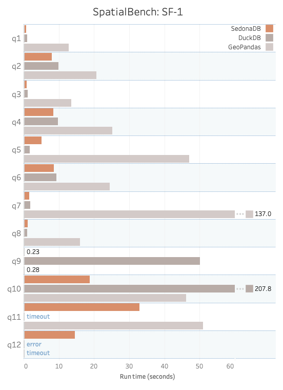
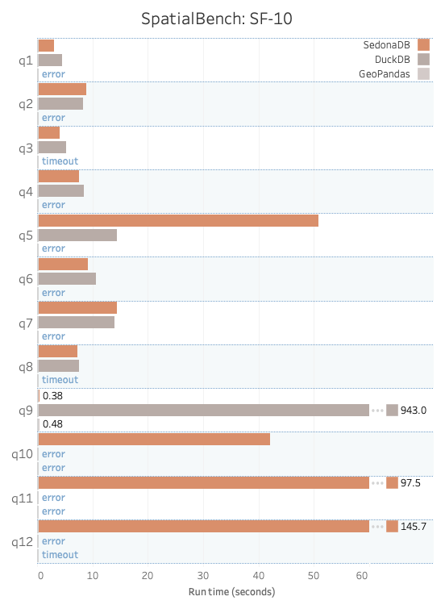

---
date:
  created: 2025-12-11
links:
  - SpatialBench: https://sedona.apache.org/spatialbench/
authors:
  - pranav
  - james
  - jia
  - matt_powers
title: "Introducing SpatialBench: performance benchmarks for spatial database queries"
---

<!--
# Licensed to the Apache Software Foundation (ASF) under one
# or more contributor license agreements.  See the NOTICE file
# distributed with this work for additional information
# regarding copyright ownership.  The ASF licenses this file
# to you under the Apache License, Version 2.0 (the
# "License"); you may not use this file except in compliance
# with the License.  You may obtain a copy of the License at
#
#   http://www.apache.org/licenses/LICENSE-2.0
#
# Unless required by applicable law or agreed to in writing,
# software distributed under the License is distributed on an
# "AS IS" BASIS, WITHOUT WARRANTIES OR CONDITIONS OF ANY
# KIND, either express or implied.  See the License for the
# specific language governing permissions and limitations
# under the License.
-->

SpatialBench is a benchmarking framework for spatial joins, distance queries, and point-in-polygon analyses.

Traditional benchmarking frameworks don’t include spatial workflows.  It’s important to benchmark spatial workflows separately because an engine that’s fast for tabular data analyses isn’t necessarily performant for spatial queries.

For example, here are the [SpatialBench results](https://sedona.apache.org/spatialbench/single-node-benchmarks/) for Scale Factor 1 (SF-1) and SF-10 for SedonaDB, DuckDB, and GeoPandas on a single ec2 instance:

<!-- more -->

{ width="400" }
{ width="400" }
{: .grid }

You can run the SpatialBench queries with any data processing engine that supports spatial analyses.

SpatialBench currently comprises 12 queries, with more to be added in the future.

Let’s examine one query to gain a better understanding of spatial data analysis.

## Example spatial query

Here’s an example query that computes monthly statistics for ride-sharing trips originating within 15 kilometers of Sedona, Arizona, a city in the US.

```sql
SELECT
    DATE_TRUNC('month', t.t_pickuptime) AS pickup_month, COUNT(t.t_tripkey) AS total_trips,
    AVG(t.t_distance) AS avg_distance, AVG(t.t_dropofftime - t.t_pickuptime) AS avg_duration,
    AVG(t.t_fare) AS avg_fare
FROM trip t
WHERE ST_DWithin(
    ST_GeomFromWKB(t.t_pickuploc),
    ST_GeomFromText('POLYGON((-111.9060 34.7347, -111.6160 34.7347, -111.6160 35.0047, -111.9060 35.0047, -111.9060 34.7347))'), -- 10km bounding box around Sedona
    0.045 -- Additional 5km buffer
)
GROUP BY pickup_month
ORDER BY pickup_month
```

Here’s what the query returns:

```
┌──────────────────────┬─────────────┬───────────────────┬─────────────────────┬───────────────────┐
│     pickup_month     ┆ total_trips ┆    avg_distance   ┆     avg_duration    ┆      avg_fare     │
│ timestamp(milliseco… ┆    int64    ┆ decimal128(19, 9) ┆ duration(milliseco… ┆ decimal128(19, 9) │
╞══════════════════════╪═════════════╪═══════════════════╪═════════════════════╪═══════════════════╡
│ 1992-04-01T00:00:00  ┆           2 ┆       0.000020000 ┆ 0 days 1 hours 23 … ┆       0.000075000 │
├╌╌╌╌╌╌╌╌╌╌╌╌╌╌╌╌╌╌╌╌╌╌┼╌╌╌╌╌╌╌╌╌╌╌╌╌┼╌╌╌╌╌╌╌╌╌╌╌╌╌╌╌╌╌╌╌┼╌╌╌╌╌╌╌╌╌╌╌╌╌╌╌╌╌╌╌╌╌┼╌╌╌╌╌╌╌╌╌╌╌╌╌╌╌╌╌╌╌┤
│ 1992-07-01T00:00:00  ┆           1 ┆       0.000010000 ┆ 0 days 0 hours 58 … ┆       0.000040000 │
├╌╌╌╌╌╌╌╌╌╌╌╌╌╌╌╌╌╌╌╌╌╌┼╌╌╌╌╌╌╌╌╌╌╌╌╌┼╌╌╌╌╌╌╌╌╌╌╌╌╌╌╌╌╌╌╌┼╌╌╌╌╌╌╌╌╌╌╌╌╌╌╌╌╌╌╌╌╌┼╌╌╌╌╌╌╌╌╌╌╌╌╌╌╌╌╌╌╌┤
│ 1994-02-01T00:00:00  ┆           2 ┆       0.000020000 ┆ 0 days 1 hours 23 … ┆       0.000050000 │
└──────────────────────┴─────────────┴───────────────────┴─────────────────────┴───────────────────┘
```

This query uses several spatial functions:

* `ST_DWithin`: returns true if the pickup location is within a certain distance of the specified polygon
* `ST_GeomFromWKB`: converts well-known binary to geometry
* `ST_GeomFromText`: converts text to geometry

Engines not designed to work with spatial data may not support `ST_DWithin` or may run very slowly.

Running aggregations and reports on data within a specified distance of a point is a typical spatial workflow, so this query is representative of an engine's spatial capabilities.

You can see all of the SpatialBench queries within [the SpatialBench project](https://sedona.apache.org/spatialbench/queries/).

## Importance of representative queries

The SpatialBench maintainers in the Apache Sedona project designed the queries to provide a fair and accurate measure of an engine's spatial capabilities.

The queries should not be biased toward any particular engine and should reflect typical workflows.

If you have any questions or comments about a SpatialBench query, please [create an issue](https://github.com/apache/sedona-spatialbench/issues) so the Apache Sedona community can discuss it.

You must also run the queries on high-quality, representative data to ensure accurate benchmarking.

## Importance of reliable data

The SpatialBench queries use synthetic datasets that anyone can generate with the spatialbench-cli tool.  Synthetic datasets are easy to reproduce, but they’re also dangerous because they may not represent real-world data. Learn about the current open datasets and generators [within the project](https://sedona.apache.org/spatialbench/datasets-generators/).

For example, the query we examined above identifies all trips that originated within 15 kilometers of Sedona, Arizona.  Here are different ways the data could provide misleading results for this particular query:

* No data within the selected region.
* Concentrated data in a part of the 15km region instead of being properly dispersed throughout the city.
* Concentrating the data in a single file or row group allows the engine to perform Parquet-level bounding box filtering without challenging its spatial capabilities.

The SpatialBench datasets don’t suffer from these limitations because they contain realistic spatial point processes. By default, SpatialBench uses the **Hierarchical Thomas distribution** for the Trip and Building tables. This process captures the multi-scale nature of real cities:

* **City-level hubs:** Large metropolitan areas emerge naturally, with sizes following a Pareto distribution.
* **Neighborhood clusters:** Within each city, subclusters of trips or buildings form around neighborhood centers, producing dense activity in some areas and sparse activity in others.
* **Gaussian spread:** Each neighborhood spawns points with natural spatial variation, ensuring data isn’t artificially grid-aligned or perfectly uniform.

This layered structure mimics how human activity and urban development actually look on the ground: a few big cities dominate, smaller towns exist alongside them, and within each city, some neighborhoods are bustling while others are quiet. By encoding these patterns, SpatialBench data doesn’t fall into artificial patterns that make benchmarks less meaningful - for example, all trips landing on a perfect grid, or every building being equidistant. Instead, the data exhibits the heterogeneity and irregularity of real-world geography, ensuring that queries stress the engine’s true spatial capabilities.

Importantly, these distributions are also configurable. Users can choose from multiple distributions depending on what they want to test.  Here are the supported distributions:

* Uniform
* Normal
* Diagonal
* Bit
* Sierpinski
* Thomas
* Hierarchical Thomas

You can also tune the parameters for each distribution (e.g., number of clusters, spread, skew) to fit the benchmarking scenario.

See the [SpatialBench configuration guide for details on how to configure SpatialBench data generation.](https://github.com/apache/sedona-spatialbench/blob/main/spatialbench-cli/CONFIGURATION.md)

Realistic data enables queries such as “all trips within 15 kilometers of Sedona” to return accurate results.  Sometimes there’s rich coverage, sometimes sparse, but always distributed in a way consistent with real geography. The realistic data, combined with representative spatial queries, is what makes benchmarks built on SpatialBench meaningful.

## Data scale factors

You can generate the SpatialBench datasets with different scale factors.

Scale factor 1 is well-suited for queries run on a single machine or localhost.  Scale factor 1000 is better for queries run on a large distributed cluster.

Unlike some other benchmarks, SpatialBench is designed to support different scale factors and is flexible enough to benchmark queries across both small and big data engines reliably.

## Components of reliable benchmarks

Benchmarks should be fair and unbiased and have the following characteristics:

1. Open source query/data generation code with reproducible results
2. Disclose all software and hardware versions
3. Reproducible or downloadable datasets
4. Full disclosure of any engine/vendor-specific tuning or optimizations
5. Detailed description of methodology and full disclosure of all components of the query runtime

We’ve taken great care to ensure the SpatialBench benchmarks are reliable and valuable to the data community.  We encourage you to challenge our methodology if you disagree.

## Future work

The SpatialBench maintainers will include raster data and queries in the next release.

These queries will join vector and raster data and provide some representative raster workflows.  These are a critical addition, as raster queries are vital for assessing a spatial engine's performance.

We will also consider community suggestions for further improvements to the benchmarks.  The SpatialBench maintainers have experience in spatial research, and they will welcome your suggestions with academic rigor.

## Call for vendor benchmarks

We encourage vendors and practitioners to generate their own benchmarks with SpatialBench and share them with the community.

Please credit SpatialBench and follow all the benchmarking best practices.  We recommend considering the impact of adding spatial indexes, which can accelerate queries. These may not be available in all data processing engines and can improve performance after a heavy one-time operation. We request that you disclose all details when you present a SpatialBench benchmark.  Make sure to account for essential components of the query runtime, such as the time required to load data into memory.

## How to contribute

There are many ways to contribute to SpatialBench.

You can run the benchmarks on your computer or on different runtimes with other hardware, and share your results with the community.

You can also create issues and make code contributions.  The codebase is open source and accepts contributions.

We are interested in running the benchmarks on different engines.  Writing the code to reliably provision clusters and run benchmarks is complex, especially for distributed engines.  Let us know if you’re interested in developing automated scripts to provision cloud clusters and run benchmarks using distributed open-source solutions.

SpatialBench strives to be at the forefront of benchmarking, and you can also use this project for academic research.  We encourage papers on spatial benchmarking and are happy to collaborate with academics.
