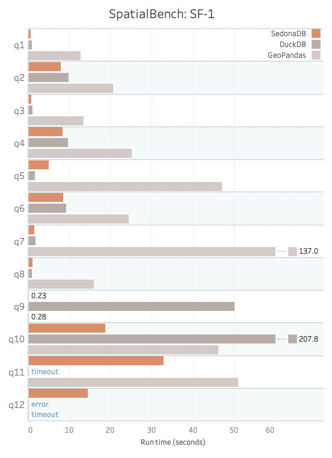
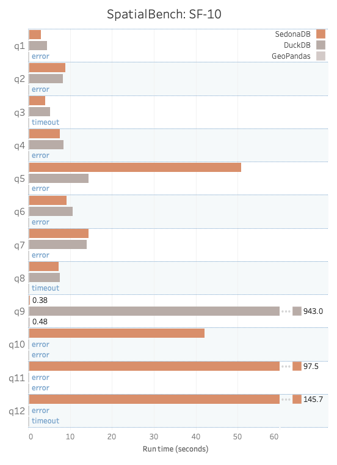

---
date:
  created: 2025-12-11
links:
  - SpatialBench: https://sedona.apache.org/spatialbench/
authors:
  - pranav
  - james
  - jia
  - matt_powers
title: "SpatialBench 正式发布:面向空间数据库查询的性能基准测试"
---

<!--
# Licensed to the Apache Software Foundation (ASF) under one
# or more contributor license agreements.  See the NOTICE file
# distributed with this work for additional information
# regarding copyright ownership.  The ASF licenses this file
# to you under the Apache License, Version 2.0 (the
# "License"); you may not use this file except in compliance
# with the License.  You may obtain a copy of the License at
#
#   http://www.apache.org/licenses/LICENSE-2.0
#
# Unless required by applicable law or agreed to in writing,
# software distributed under the License is distributed on an
# "AS IS" BASIS, WITHOUT WARRANTIES OR CONDITIONS OF ANY
# KIND, either express or implied.  See the License for the
# specific language governing permissions and limitations
# under the License.
-->

SpatialBench 是一个针对空间连接、距离查询和点在多边形内分析的基准测试框架。

传统的基准测试框架不包含空间工作流。单独对空间工作流进行基准测试很重要,因为擅长表格数据分析的引擎在空间查询上未必表现出色。

例如,下面是在同一台 ec2 实例上,SedonaDB、DuckDB 和 GeoPandas 在规模因子 1(SF-1)和 SF-10 下的 [SpatialBench 结果](https://sedona.apache.org/spatialbench/single-node-benchmarks/):

<!-- more -->

{ width="400" }
{ width="400" }
{: .grid }

你可以在任何支持空间分析的数据处理引擎上运行 SpatialBench 查询。

SpatialBench 目前包含 12 条查询,未来还会持续增加。

让我们看一个查询,以更好地理解空间数据分析。

## 空间查询示例

下面这条示例查询统计了起点在美国亚利桑那州 Sedona 城方圆 15 公里以内的共享出行行程的月度统计数据。

```sql
SELECT
    DATE_TRUNC('month', t.t_pickuptime) AS pickup_month, COUNT(t.t_tripkey) AS total_trips,
    AVG(t.t_distance) AS avg_distance, AVG(t.t_dropofftime - t.t_pickuptime) AS avg_duration,
    AVG(t.t_fare) AS avg_fare
FROM trip t
WHERE ST_DWithin(
    ST_GeomFromWKB(t.t_pickuploc),
    ST_GeomFromText('POLYGON((-111.9060 34.7347, -111.6160 34.7347, -111.6160 35.0047, -111.9060 35.0047, -111.9060 34.7347))'), -- 10km bounding box around Sedona
    0.045 -- Additional 5km buffer
)
GROUP BY pickup_month
ORDER BY pickup_month
```

下面是查询返回的结果:

```
┌──────────────────────┬─────────────┬───────────────────┬─────────────────────┬───────────────────┐
│     pickup_month     ┆ total_trips ┆    avg_distance   ┆     avg_duration    ┆      avg_fare     │
│ timestamp(milliseco… ┆    int64    ┆ decimal128(19, 9) ┆ duration(milliseco… ┆ decimal128(19, 9) │
╞══════════════════════╪═════════════╪═══════════════════╪═════════════════════╪═══════════════════╡
│ 1992-04-01T00:00:00  ┆           2 ┆       0.000020000 ┆ 0 days 1 hours 23 … ┆       0.000075000 │
├╌╌╌╌╌╌╌╌╌╌╌╌╌╌╌╌╌╌╌╌╌╌┼╌╌╌╌╌╌╌╌╌╌╌╌╌┼╌╌╌╌╌╌╌╌╌╌╌╌╌╌╌╌╌╌╌┼╌╌╌╌╌╌╌╌╌╌╌╌╌╌╌╌╌╌╌╌╌┼╌╌╌╌╌╌╌╌╌╌╌╌╌╌╌╌╌╌╌┤
│ 1992-07-01T00:00:00  ┆           1 ┆       0.000010000 ┆ 0 days 0 hours 58 … ┆       0.000040000 │
├╌╌╌╌╌╌╌╌╌╌╌╌╌╌╌╌╌╌╌╌╌╌┼╌╌╌╌╌╌╌╌╌╌╌╌╌┼╌╌╌╌╌╌╌╌╌╌╌╌╌╌╌╌╌╌╌┼╌╌╌╌╌╌╌╌╌╌╌╌╌╌╌╌╌╌╌╌╌┼╌╌╌╌╌╌╌╌╌╌╌╌╌╌╌╌╌╌╌┤
│ 1994-02-01T00:00:00  ┆           2 ┆       0.000020000 ┆ 0 days 1 hours 23 … ┆       0.000050000 │
└──────────────────────┴─────────────┴───────────────────┴─────────────────────┴───────────────────┘
```

这条查询使用了几个空间函数:

* `ST_DWithin`:如果上车点位于指定多边形的某一距离范围内,则返回 true
* `ST_GeomFromWKB`:将 well-known binary 转换为几何
* `ST_GeomFromText`:将文本转换为几何

未针对空间数据设计的引擎可能不支持 `ST_DWithin`,或运行速度非常慢。

在某一点指定距离范围内的数据上运行聚合与报表是典型的空间工作流,因此这条查询能很好地代表一个引擎的空间能力。

完整的 SpatialBench 查询列表可在 [SpatialBench 项目](https://sedona.apache.org/spatialbench/queries/) 中找到。

## 具代表性查询的重要性

Apache Sedona 项目中 SpatialBench 的维护者在设计这些查询时,力求公平且准确地衡量引擎的空间能力。

查询不应偏向任何特定引擎,而应反映典型工作流。

如果你对某条 SpatialBench 查询有任何疑问或意见,请[创建一个 issue](https://github.com/apache/sedona-spatialbench/issues),让 Apache Sedona 社区可以讨论。

你还必须在高质量、有代表性的数据上运行这些查询,以确保基准测试的准确性。

## 可靠数据的重要性

SpatialBench 查询使用任何人都可以通过 spatialbench-cli 工具生成的合成数据集。合成数据集易于复现,但同样存在风险——它们可能无法代表真实数据。可在[项目页面](https://sedona.apache.org/spatialbench/datasets-generators/)了解当前开放的数据集和生成器。

例如,上面我们看到的查询识别了所有起点在 Sedona 城方圆 15 公里以内的行程。下面列出了数据可能给这条查询带来误导性结果的几种情况:

* 选定区域内没有数据。
* 数据集中在 15km 区域的某一小部分,而不是合理地分布在整座城市。
* 数据被集中放在单个文件或行组中,使引擎仅依靠 Parquet 级别的边界框过滤就能完成查询,而未真正考验其空间能力。

SpatialBench 数据集不存在这些局限,因为它们包含真实的空间点过程。默认情况下,SpatialBench 在 Trip 和 Building 表上使用 **层次化 Thomas 分布**。这种过程能刻画真实城市的多尺度特征:

* **城市级别的中心:** 大型都市自然涌现,规模符合 Pareto 分布。
* **街区聚类:** 每个城市内部,行程或建筑围绕街区中心形成子聚类,产生密集和稀疏区域。
* **高斯分布扩散:** 每个街区生成的点带有自然的空间变化,确保数据不会人为对齐到网格或完全均匀。

这种分层结构模拟了人类活动和城市发展在真实地理中的样子:少数大城市占主导,小城镇与之并存,每个城市内部某些街区繁华、另一些则较为冷清。通过编码这些模式,SpatialBench 数据不会陷入降低基准价值的人工模式——例如所有行程都落在完美网格上,或每栋建筑都等距分布。相反,数据呈现真实地理的异质性与不规则性,确保查询真正考验引擎的空间能力。

值得一提的是,这些分布也可配置。用户可根据测试目标选择多种分布。受支持的分布包括:

* 均匀(Uniform)
* 正态(Normal)
* 对角(Diagonal)
* 位(Bit)
* Sierpinski
* Thomas
* 层次化 Thomas(Hierarchical Thomas)

你还可以调整每种分布的参数(例如聚类数量、扩散程度、偏度),以匹配具体的基准测试场景。

更多关于如何配置 SpatialBench 数据生成的细节,请参阅 [SpatialBench 配置指南](https://github.com/apache/sedona-spatialbench/blob/main/spatialbench-cli/CONFIGURATION.md)。

真实数据让"Sedona 方圆 15 公里以内的所有行程"这类查询能够返回准确结果。覆盖时而丰富、时而稀疏,但始终以与真实地理一致的方式分布。真实的数据加上具代表性的空间查询,才让基于 SpatialBench 的基准测试具有意义。

## 数据规模因子

你可以使用不同的规模因子生成 SpatialBench 数据集。

规模因子 1 适合在单机或本地运行的查询。规模因子 1000 更适合在大型分布式集群上运行的查询。

与其他一些基准测试不同,SpatialBench 支持不同的规模因子,足够灵活,可以可靠地为小型和大型数据引擎基准测试。

## 可靠基准测试的要素

基准测试应当公正、无偏,并具备以下特征:

1. 开源的查询/数据生成代码,结果可复现
2. 公开所有软硬件版本
3. 数据集可复现或可下载
4. 完整披露任何针对引擎/厂商的调优或优化
5. 详尽描述方法,并完整披露查询运行时间的所有组成部分

我们非常用心地确保 SpatialBench 的基准测试可靠且对数据社区有价值。如果你对我们的方法论有不同看法,我们鼓励你提出质疑。

## 未来工作

SpatialBench 的维护者将在下一个版本中加入栅格数据和查询。

这些查询将连接矢量与栅格数据,并提供一些具代表性的栅格工作流。这是关键的补充,因为栅格查询对于评估空间引擎的性能至关重要。

我们还会考虑社区对基准测试改进的建议。SpatialBench 的维护者有空间研究方面的经验,他们将以学术严谨的态度欢迎你的建议。

## 邀请厂商提交基准测试

我们鼓励厂商和实践者使用 SpatialBench 生成自己的基准测试,并将结果分享给社区。

请注明 SpatialBench 的来源,并遵循所有基准测试最佳实践。我们建议关注添加空间索引的影响——索引可以加速查询,但并非所有数据处理引擎都支持,而且一次性建立索引的开销较大。当你公布 SpatialBench 基准测试时,请披露所有细节。务必将查询运行时间的关键组成部分(例如数据加载到内存所需的时间)纳入考量。

## 如何贡献

为 SpatialBench 做贡献的方式有很多。

你可以在自己的电脑上、不同的运行时和硬件上运行基准测试,并将结果分享给社区。

你也可以提交 issue 或代码贡献。代码库是开源的,接受贡献。

我们也希望在不同引擎上运行基准测试。可靠地为基准测试搭建集群的代码相当复杂,尤其是对分布式引擎而言。如果你有兴趣开发能够自动在云端建立集群并基于开源分布式方案运行基准测试的脚本,请告诉我们。

SpatialBench 力求在基准测试领域处于前沿,你也可以将本项目用于学术研究。我们鼓励发表关于空间基准测试的论文,并乐于与学者合作。
