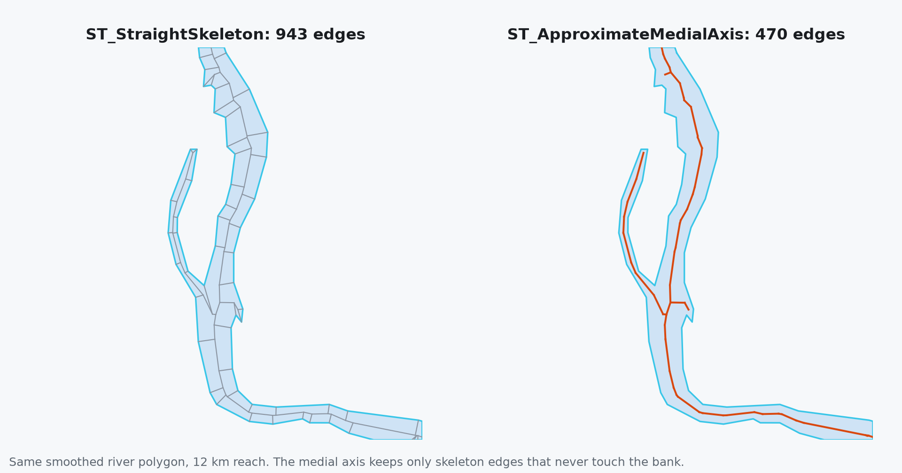
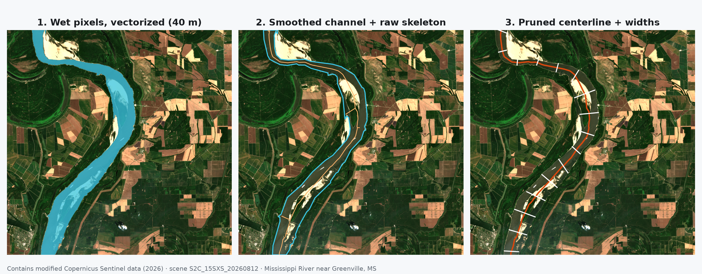
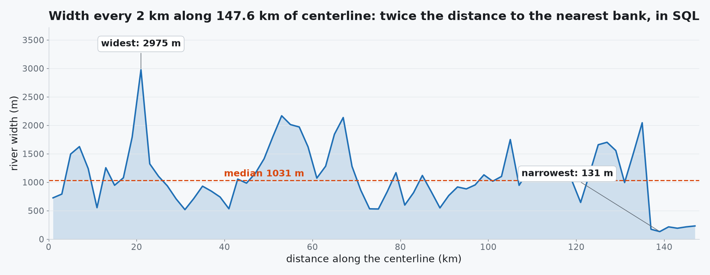

---
date:
  created: 2026-08-21
links:
  - ST_ApproximateMedialAxis: https://sedona.apache.org/latest/api/sql/Geometry-Processing/ST_ApproximateMedialAxis/
  - RS_PixelAsPolygons: https://sedona.apache.org/latest/api/sql/Pixel-Functions/RS_PixelAsPolygons/
  - Raster tutorial: https://sedona.apache.org/latest/tutorial/raster/
authors:
  - jia
title: "Find the Middle of the Mississippi"
---

# Find the Middle of the Mississippi

Every shape in a raster has a middle. A river has a centerline, a glacier has a flowline, a runway has a heading. Once you have the middle, you can measure the thing: how long, how wide, how crooked. Below, Apache Sedona pulls the Mississippi's centerline out of raw Sentinel-2 pixels, **148 km of it, in 56 seconds**, and one function does the geometry: `ST_ApproximateMedialAxis`.


<!-- more -->

## From pixels to a polygon

The scene is a cloud-free August capture of the river near Greenville, MS, from the [Sentinel-2 COG archive](https://registry.opendata.aws/sentinel-2-l2a-cogs/) that [last week's NDVI post](https://sedona.apache.org/latest/blog/2026/08/14/seven-lines-of-numpy-121-million-pixels/) used. The start is the same: two bands of about 200 MB each, read as 512-pixel tiles and paired on tile position.

```python
scene = (
    "s3a://sentinel-cogs/sentinel-s2-l2a-cogs/15/S/XS/2026/8/"
    "S2C_15SXS_20260812_0_L2A"
)
reader = (
    sedona.read.format("raster").option("tileWidth", "512").option("tileHeight", "512")
)
green_df = reader.load(f"{scene}/B03.tif")
nir_df = reader.load(f"{scene}/B08.tif")

tiles = green_df.select(col("rast").alias("green"), "x", "y").join(
    nir_df.select(col("rast").alias("nir"), "x", "y"), ["x", "y"]
)
```

??? example "Session setup: released artifacts, anonymous S3"

    ```python
    import numpy as np
    from pyspark.sql.functions import col, udf

    from sedona.spark import SedonaContext
    from sedona.spark.sql.types import RasterType

    config = (
        SedonaContext.builder()
        .master("local[4]")
        .config("spark.driver.memory", "8g")
        .config(
            "spark.jars.packages",
            "org.apache.sedona:sedona-spark-shaded-3.5_2.12:1.9.1,"
            "org.datasyslab:geotools-wrapper:1.9.1-33.5,"
            "org.apache.hadoop:hadoop-aws:3.3.4",
        )
        .config(
            "spark.hadoop.fs.s3a.aws.credentials.provider",
            "org.apache.hadoop.fs.s3a.AnonymousAWSCredentialsProvider",
        )
        .config("spark.hadoop.fs.s3a.bucket.sentinel-cogs.endpoint.region", "us-west-2")
        .getOrCreate()
    )
    sedona = SedonaContext.create(config)
    ```

Water reflects more green light than near-infrared. That makes the water index a seven-line Python UDF, the same shape as [last week's NDVI function](https://sedona.apache.org/latest/blog/2026/08/14/seven-lines-of-numpy-121-million-pixels/):

```python
@udf(returnType=RasterType())
def ndwi(green_tile, nir_tile):
    g = green_tile.as_numpy_masked()[0]
    n = nir_tile.as_numpy_masked()[0]
    out = (g - n) / (g + n)
    out = np.where(np.isnan(out), -9999.0, out).astype(np.float32)
    return green_tile.with_bands(out, nodata=-9999.0)


tiles.withColumn("ndwi", ndwi(col("green"), col("nir"))).createOrReplaceTempView(
    "ndwi_tiles"
)
```

Now the raster ops. A kilometre-wide river does not need 10 m pixels, so `RS_Resample` drops each tile to 40 m and cuts the polygon count downstream by sixteen. `RS_PixelAsPolygons` turns every wet pixel into a square, and one `ST_Union_Aggr` per tile dissolves the squares. The per-tile union keeps the job distributed: 484 small unions spread across the cluster instead of one giant one.

```sql
WITH small AS (
    SELECT x, y, RS_Resample(ndwi, 128, 128, false, 'Bilinear') AS r FROM ndwi_tiles
),
px AS (
    SELECT x, y, explode(RS_PixelAsPolygons(r, 1)) AS p FROM small
)
SELECT x, y, ST_Union_Aggr(p.geom) AS geom
FROM px WHERE p.value > 0.0
GROUP BY x, y
```

That step produces 410 tile-polygons in 51 seconds, S3 read included. One more union and an `ST_Dump` give every water body its own row:

```sql
WITH all_water AS (SELECT ST_Union_Aggr(geom) AS geom FROM tile_water),
bodies AS (SELECT explode(ST_Dump(geom)) AS geom FROM all_water)
SELECT ROUND(ST_Area(geom) / 1e6, 1) AS km2, ST_NPoints(geom) AS vertices,
       ST_NumInteriorRings(geom) AS islands
FROM bodies ORDER BY km2 DESC LIMIT 5
```

```
+-----+--------+-------+
|  km2|vertices|islands|
+-----+--------+-------+
|157.4|   17530|    179|
| 16.5|    1572|     21|
| 14.9|    1365|      6|
| 10.7|     990|      5|
|  7.9|     776|      1|
+-----+--------+-------+
```

The scene holds 5,429 water bodies: oxbow lakes, catfish ponds, borrow pits. The biggest one, by a mile, is the river: 157 km² of water with 179 islands and sandbars punched through it.

## Find the middle

`ST_ApproximateMedialAxis` computes a polygon's straight skeleton and keeps the interior edges, which is the centerline. Two preparations make it fast and clean on a real river. Fewer vertices, because skeleton cost climbs steeply with vertex count and a pixel-derived outline is all stair-steps. No holes, because every island spawns a loop. So: smooth the outline with a buffer out and back in, simplify to 80 m, keep the exterior ring, then skeletonize and merge the pieces.

```sql
WITH river AS (SELECT geom FROM bodies ORDER BY ST_Area(geom) DESC LIMIT 1),
clean AS (
    SELECT ST_MakePolygon(ST_ExteriorRing(
               ST_SimplifyPreserveTopology(ST_Buffer(ST_Buffer(geom, 60), -60), 80)
           )) AS channel
    FROM river
)
SELECT channel, ST_LineMerge(ST_ApproximateMedialAxis(channel)) AS axis FROM clean
```

17,530 vertices become 474, and the medial axis takes **1.1 seconds**: 470 raw edges, 81 line parts after `ST_LineMerge`, 205 km of skeleton including every spur into a side channel or around a sandbar.

Under the hood, `ST_ApproximateMedialAxis` is built on [`ST_StraightSkeleton`](https://sedona.apache.org/latest/api/sql/Geometry-Processing/ST_StraightSkeleton/), which shrinks every edge of the polygon inward at the same speed and records where the edges meet. On this channel the straight skeleton has 943 edges and 437.7 km of line: ribs run from every bend in the bank to the spine. The medial axis keeps the 470 edges that never touch the bank. Call `ST_StraightSkeleton` directly when the ribs are the point, as in roof modeling or polygon offsetting.





The spurs come off with a pruning rule in SQL: a line part survives if it is at least 10 km long or if both of its ends touch another part. Three rounds of that rule, each followed by `ST_LineMerge`, leave a single line.

```sql
WITH parts AS (SELECT posexplode(ST_Dump(axis)) AS (id, g) FROM centerline),
tips AS (
    SELECT id, g, ST_StartPoint(g) AS s, ST_EndPoint(g) AS e, ST_Length(g) AS len FROM parts
),
kept AS (
    SELECT a.g FROM tips a
    WHERE a.len >= 10000
       OR (EXISTS (SELECT 1 FROM tips b WHERE b.id <> a.id AND ST_Intersects(b.g, a.s))
           AND EXISTS (SELECT 1 FROM tips b WHERE b.id <> a.id AND ST_Intersects(b.g, a.e)))
)
SELECT ST_LineMerge(ST_Union_Aggr(g)) AS axis FROM kept
```

```sql
SELECT ST_NumGeometries(main) AS parts,
       ROUND(ST_Length(main) / 1000, 1) AS km,
       ROUND(ST_Distance(ST_StartPoint(main), ST_EndPoint(main)) / 1000, 1) AS straight_km,
       ROUND(ST_Length(main) / ST_Distance(ST_StartPoint(main), ST_EndPoint(main)), 2) AS sinuosity
FROM main
```

```
+-----+-----+-----------+---------+
|parts|   km|straight_km|sinuosity|
+-----+-----+-----------+---------+
|    1|147.6|      103.4|     1.43|
+-----+-----+-----------+---------+
```

The Mississippi runs **147.6 km** through this 110 km scene. Its two ends sit 103.4 km apart. **Sinuosity 1.43**: the river travels 43 percent farther than a straight line would.

## How wide is it?

With a centerline and a bank, width is a distance query. Step along the centerline every 2 km, and at each point take twice the distance to the nearest bank:

```sql
WITH steps AS (
    SELECT explode(sequence(1000, CAST(ST_Length(main) AS INT), 2000)) AS d, main, channel
    FROM centerline
),
pts AS (
    SELECT d, ST_LineInterpolatePoint(main, d / ST_Length(main)) AS pt, channel FROM steps
)
SELECT COUNT(*) AS samples, MIN(w) AS narrowest_m, percentile(w, 0.5) AS median_m, MAX(w) AS widest_m
FROM (SELECT ROUND(2 * ST_Distance(pt, ST_Boundary(channel)), 0) AS w FROM pts)
```

```
+-------+-----------+--------+--------+
|samples|narrowest_m|median_m|widest_m|
+-------+-----------+--------+--------+
|     74|      131.0|  1031.5|  2975.0|
+-------+-----------+--------+--------+
```



A kilometre wide on a typical day. Three kilometres where the channel balloons around mid-river bars. The final 12 km drop to about 200 m: there the 10 km rule kept a long side channel at the scene edge over the main channel's shorter last reach, and the 131 m minimum sits in that side channel. Every number comes from pixels that left S3 less than a minute earlier.

## Built for hundreds of machines and millions of shapes

Every stage of this pipeline is a table of rows, and rows are what Sedona spreads across a cluster. Tiles are rows: once the band join shuffles them, the UDF, the resampling, and the per-tile unions run on every executor at once, so a cluster of a hundred workers processes a hundred tiles at a time. Water bodies are rows too. This one scene produced 5,429 of them, and the skeleton step runs once per body, in parallel, with no change to the SQL. Point the same query at every Sentinel-2 tile over a continent and the work becomes millions of detected shapes, each one cleaned, skeletonized, and measured on whichever worker holds it.

One detail shapes the plan: the `raster` reader emits a file's tiles from a single task, so the fan-out begins at the join. After that, nothing in the pipeline funnels through one machine until the optional final union, and that union can be replaced by a union per region when the lake grows. The centerline comes out as an ordinary geometry column. Index it with the [`geotiff.metadata`](https://sedona.apache.org/latest/blog/2026/08/07/index-a-million-rasters-without-reading-a-pixel/) footprints, join it to gauges and bridges, write it to GeoParquet.

## Roads are next

The recipe, mask to polygons to union to medial axis, works on any detected shape with width. Road networks are the next target, and they come with their own lessons: a road needs several pixels of width before a skeleton can find it, and a street grid is made of holes that the pipeline has to keep. Roads get their own post next week.

## The point

A raster knows where the water is. Sedona's raster ops turn that into a polygon, and `ST_ApproximateMedialAxis` turns the polygon into the one line that lets you measure a river: 148 km long, a kilometre wide, 1.43 times longer than a straight line. From S3 to answer in 56 seconds, on one laptop, with the same SQL ready for a cluster.

*Function references: [ST_ApproximateMedialAxis](https://sedona.apache.org/latest/api/sql/Geometry-Processing/ST_ApproximateMedialAxis/), [RS_PixelAsPolygons](https://sedona.apache.org/latest/api/sql/Pixel-Functions/RS_PixelAsPolygons/), [RS_Resample](https://sedona.apache.org/latest/api/sql/Raster-Operators/RS_Resample/). The UDF pattern is in the [Raster UDF reference](https://sedona.apache.org/latest/api/sql/Raster-UDF/).*
