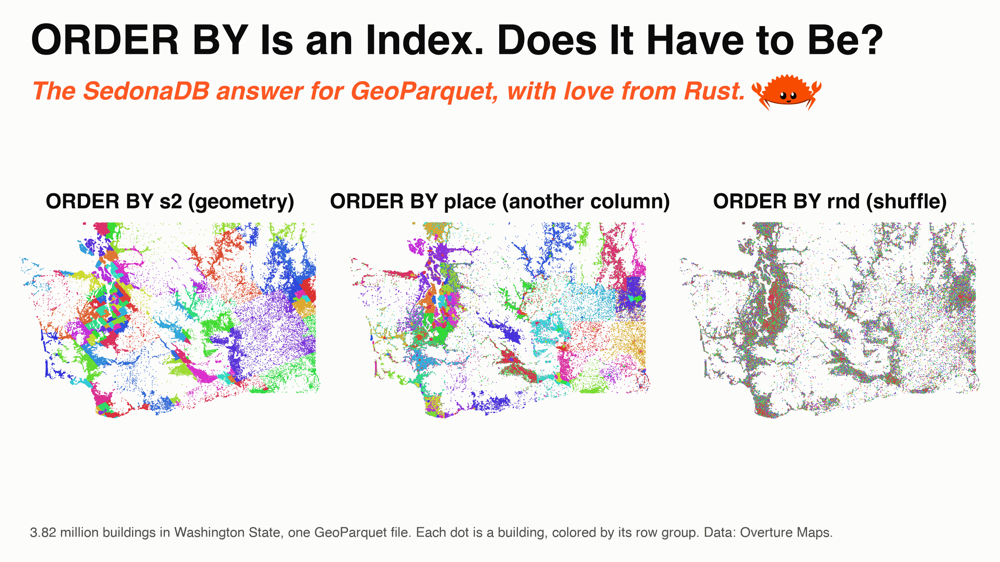
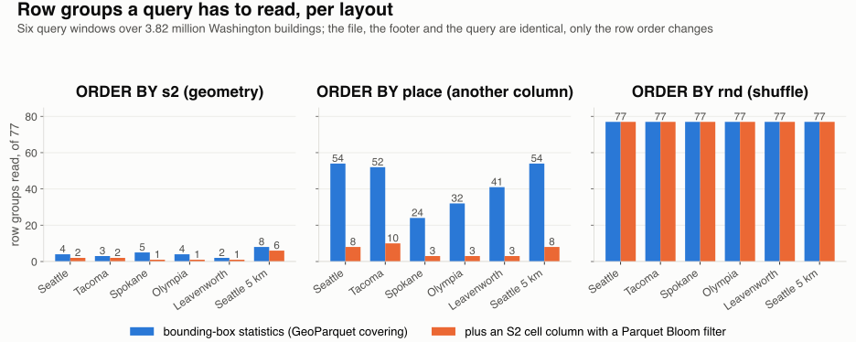

---
date:
  created: 2026-09-18
links:
  - "Hippo (PVLDB 2016)": https://jiayuasu.github.io/files/paper/hippo_vldb2016_fullpaper.pdf
  - GeoParquet in Sedona: https://sedona.apache.org/latest/tutorial/files/geoparquet-sedona-spark/
  - SedonaDB to_parquet: https://sedona.apache.org/sedonadb/latest/reference/python/
authors:
  - jia
title: "ORDER BY Is an Index. Does It Have to Be?"
slug: order-by-is-an-index-does-it-have-to-be
---

# ORDER BY Is an Index. Does It Have to Be?

*The SedonaDB answer for GeoParquet, with love from Rust.*

Parquet has stored a minimum and a maximum for every column in every row group [since September 2013](https://github.com/apache/parquet-format/commit/2c4ada8e988c1c0018332e420764c09bab16bf9c). PostgreSQL 9.5 [added BRIN in January 2016](https://www.postgresql.org/docs/release/9.5.0/): one small summary per range of blocks, cheap to update, useful when the data is clustered. In the same year the original creators of Apache Sedona, Jia Yu and Mohamed Sarwat, published [Hippo](https://jiayuasu.github.io/files/paper/hippo_vldb2016_fullpaper.pdf) at VLDB, the top database conference. Hippo is a sparse index 25 to 30 times smaller than a B+-tree, with a goal the min/max family never had: skip data that is not sorted. Ten years later, data skipping is how every lakehouse engine reads a file, and the question from 2016 is still open. Below: 3.82 million Washington buildings in one GeoParquet file, written three ways. Sorted by geometry, sorted by another column, and shuffled.



<!-- more -->

## Skipping is the index now

Parquet row-group statistics, Iceberg and Delta file statistics, DuckDB zone maps and Snowflake micro-partitions all come from the same idea: summarize a block, then skip the block when the summary says the answer cannot be inside. For geometry the summary is a bounding box, stored in GeoParquet's `covering` columns. SedonaDB reports what it skipped in `EXPLAIN ANALYZE`:

```
row_groups_spatial_pruned=770 total → 40 matched, row_groups_pruned_statistics=4 total → 4 matched,
bytes_scanned=20.12 M
```

A query over downtown Seattle reads 4 of the 77 row groups, 20 MB of 555. The limit is the same as BRIN's: a summary is only as good as the rows in its block, and no file format groups the rows for you.

## Same buildings, three layouts

The rows are the 3.82 million Overture buildings in Washington State. Each carries a place name: the city when the building sits inside one, which is the case for 53% of them, and the county for the rest. SedonaDB's writer takes a sort key, so the three files differ in one argument: the geometry, another column, or a random number.

??? example "Three writes"

    ```python
    # pip install "apache-sedona[db]"
    import sedona.db

    sd = sedona.db.connect()
    sd.read_parquet("buildings_wa.parquet").to_view("raw")
    sd.sql("""
        SELECT id, place, geometry,
               S2_CellIdFromPoint(ST_ToGeography(ST_Centroid(geometry))) AS s2,
               S2_CoveringCellIds(ST_ToGeography(ST_Centroid(geometry)), 12, 12, 1)[1] AS cell,
               random() AS rnd
        FROM raw
    """).to_memtable().to_view("b")

    for name, key in {"geo": "s2", "name": "place", "random": "rnd"}.items():
        sd.sql("SELECT * FROM b").to_parquet(
            f"layout_{name}.parquet",
            sort_by=[key],
            single_file_output=True,
            max_row_group_size=50_000,
            geoparquet_version="1.1",
            options={"bloom_filter_enabled::cell": True, "bloom_filter_ndv::cell": 10000},
        )
    ```

`s2` is ORDER BY geometry. Rows follow a space-filling curve, the same idea as the geohash sort in the [GeoParquet tutorial](https://sedona.apache.org/latest/tutorial/files/geoparquet-sedona-spark/). `place` is ORDER BY another column, here the place name from above. This is how most data arrives: sorted by whatever key the producer used, an ID, a name or a timestamp. The rows are still grouped in space, because a city or a county is one compact area, but the groups are in no spatial order. Pacific County and Palouse sit next to each other in the alphabet and 526 km apart on the map. `rnd` is a random shuffle, the worst case. Each write took two seconds and produced 77 row groups and a 139 KB footer. The median bounding box of a row group covers 0.15 square degrees in the geometry order, 5.3 in the name order, and 26.6 in the shuffle, which is the whole state.

## One query, three answers

Six query windows: 1 by 1.5 km over downtown Seattle, Tacoma, Spokane, Olympia and Leavenworth, plus a 5 by 8 km window over Seattle. Each runs as `ST_Intersects` against each file:



The Seattle query reads 4 row groups in the geometry order (20 MB, 40 ms), 54 in the name order (253 MB, 105 ms), and 77 in the shuffle (373 MB). All three files carry the same statistics. The row order is the index. The file sorted by name, the realistic one, reads almost everything.

## Can we skip without sorting?

Z-order and liquid clustering are sorts under another name, and they cost a full rewrite. [Bloom filters](https://github.com/apache/parquet-format/blob/master/BloomFilter.md), in Parquet since format 2.9 and a column property in Iceberg and Delta, answer `=` and `IN` only. A range predicate passes straight through them, and every spatial query is a range predicate.

Hippo summarized a range of pages with a bitmap: one bit per bucket of the table's histogram, set when the range holds a value from that bucket. Three clusters far apart set three bits instead of one span the size of the state. That is why Hippo can skip data that is grouped but not sorted, like the file sorted by name.

That bitmap can be built from parts every format already has. Store the S2 cell of each geometry as an integer column, put a Bloom filter on it, and turn the range query into an `IN` list:

```python
cells = sd.sql(f"""
    SELECT S2_CoveringCellIds(ST_ToGeography(ST_GeomFromWKT('{window}', 4326)), 12, 12, 100000) AS c
""").to_pandas().c[0]

sd.sql(f"""
    SELECT COUNT(*) FROM t
    WHERE cell IN ({", ".join(str(c) for c in cells)})
      AND ST_Intersects(geometry, ST_GeomFromWKT('{window}', 4326))
""")
```

The orange bars are this query. In the file sorted by name, Seattle drops from 54 row groups to 8, from 253 MB to 43 MB, and from 105 ms to 62 ms. Leavenworth drops from 41 to 3, Olympia from 32 to 3, Spokane from 24 to 3, Tacoma from 52 to 10, and the 5 by 8 km window from 54 to 8. The file was never sorted by geometry, and the filter on one column added 1.3 MB to a 591 MB file. In the file sorted by geometry the filter still cuts the reads, from 2 to 5 row groups down to 1 or 2. A bounding box around a piece of the curve covers more ground than the piece itself, while the filter tests only the cells the query touches. In the shuffled file the filter skips nothing. Each row group of 50,000 random buildings holds 7,652 of the 21,493 cells, and 16 buildings from the downtown Seattle cell alone. A sparse index, Hippo included, can only skip a block that does not contain the value, and a shuffle puts every value in every block.

## What we left open

The cell column is a shortcut, and it has four limits.

- **Skew.** The cells are a grid of equal-sized squares, S2 level 12, about 5 km² each. The 21,493 cells with a Washington building hold between 1 and 13,267 of them, median 15. Hippo's histogram used buckets of equal count, so every bucket held the same number of rows.
- **Mixed sizes.** Each row stores one cell, the cell of its centroid. That fits most buildings, and it already leaks: the 55 km window below misses three buildings that reach into it from a cell outside it. A lake or a coastline spans hundreds of cells, and one cell per row cannot describe it.
- **Wide queries.** A query much wider than a cell becomes a long `IN` list, and the gain shrinks. On the file sorted by name, a 30 by 30 km window over Seattle lists 223 cells and reads 32 row groups instead of 56. A 55 by 55 km window lists 684 cells and reads 47 instead of 62, in the same time: 113 ms against 112.
- **Tuning.** The level is a guess. Level 12 fits these buildings and these windows. Other data and other queries need another level, and finding it takes trial runs.

Hippo's design, moved to two dimensions, handles all four with one structure: a histogram with equal-count buckets follows the skew, a bitmap can carry every bucket a large object touches, a wide query tests more bits of the same bitmap at the same cost, and the bucket count is the only setting. So the next step is to adapt Hippo itself to Parquet. Where does the summary live: in the footer, in an Iceberg Puffin file, or in a separate sidecar file? How does it survive appends? Hippo solved that with lazy updates, and immutable files avoid the problem. We would like to see the [Sedona community](https://sedona.apache.org/latest/community/contact/) take this on.

## The point

Sort by geometry when you can: one `sort_by`, and the statistics already in the file read 4 row groups instead of 77. When the data arrives sorted by something else, the usual case, a cell column and a Bloom filter recover most of the difference without a rewrite, for small objects and small queries. Skew, mixed sizes, wide queries and the level itself are the question from 2016, still open, and the file format has room for the answer in its footer.

*Buildings, cities and counties from Overture Maps. Measurements on SedonaDB 0.4.1.*
