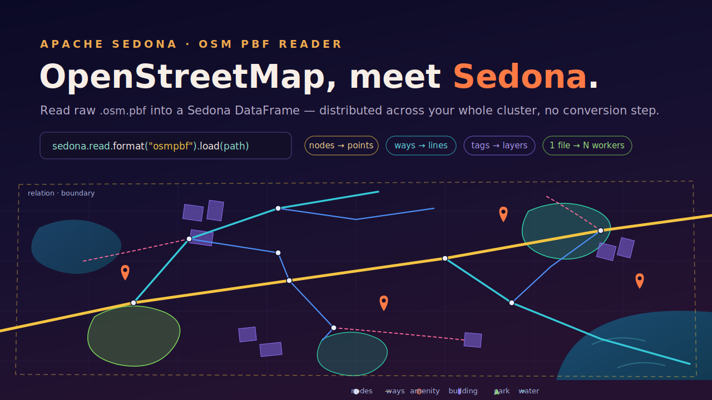
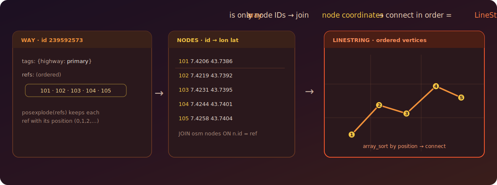
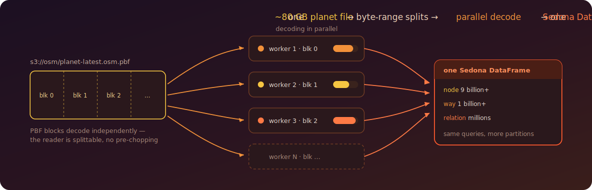

---
date:
  created: 2026-07-24
links:
  - Geofabrik downloads (regional .osm.pbf): https://download.geofabrik.de/
  - OpenStreetMap: https://www.openstreetmap.org/
  - Spatial DataFrame / SQL app: https://sedona.apache.org/latest/tutorial/sql/
authors:
  - jia
title: "OpenStreetMap, Meet Sedona: Raw .osm.pbf to Spatial SQL"
---

# OpenStreetMap, Meet Sedona: Raw .osm.pbf to Spatial SQL

OpenStreetMap is the world's map — every road, café, and coastline, edited by millions of people. It ships as `.osm.pbf`: a dense, compressed Protocol-Buffers blob of nodes, ways, and relations. Getting that into a cluster usually means a preprocessing detour through `osmium` or a staging database.



<!-- more -->

SedonaSpark reads `.osm.pbf` natively. Point the `osmpbf` format at a file and you get a Sedona DataFrame of raw OSM elements — no conversion step. And because Sedona is a distributed engine, that one-line read fans out across a cluster: a planet-scale file is just more partitions. From there it's ordinary Spatial SQL: assemble geometries, filter by tag, measure, join. Every snippet below runs against the small **Monaco** extract that ships in Sedona's test resources, so you can reproduce it verbatim — and scale it up unchanged.

## One line to raw OSM

```python
from sedona.spark import SedonaContext

sedona = SedonaContext.create(SedonaContext.builder().master("local[*]").getOrCreate())

# a regional extract from Geofabrik, or Sedona's bundled Monaco sample
osm = sedona.read.format("osmpbf").load(
    "spark/common/src/test/resources/osmpbf/monaco-latest.osm.pbf"
)
osm.createOrReplaceTempView("osm")
osm.printSchema()
```

The reader gives you the raw OSM element model, one row per element:

```
 |-- id: long
 |-- kind: string                 (node | way | relation)
 |-- location: struct<longitude, latitude>   -- nodes only
 |-- tags: map<string, string>
 |-- refs: array<long>            -- ordered member node/way ids (ways & relations)
 |-- ref_roles: array<string>
 |-- ref_types: array<string>
 |-- changeset / timestamp / uid / user / version / visible   -- edit metadata
```

Monaco is small but complete — three element kinds, one table:

```python
sedona.sql("SELECT kind, COUNT(*) AS n FROM osm GROUP BY kind ORDER BY n DESC").show()
```

```
+--------+-----+
|kind    |n    |
+--------+-----+
|node    |39587|
|way     | 5777|
|relation|  309|
+--------+-----+
```

## Nodes are points

A **node** is the only element with a coordinate, so points are immediate. Here are Monaco's amenities:

```python
sedona.sql("""
    SELECT id, tags['amenity'] AS amenity, tags['name'] AS name,
           ST_ReducePrecision(ST_Point(location.longitude, location.latitude), 5) AS geom
    FROM   osm
    WHERE  kind = 'node' AND tags['amenity'] IS NOT NULL
    ORDER BY id LIMIT 5
""").show(truncate=False)
```

```
+--------+-------+------------------------------+------------------------+
|id      |amenity|name                          |geom                    |
+--------+-------+------------------------------+------------------------+
|25191432|parking|Parking du Chemin des Pêcheurs|POINT (7.42711 43.73128)|
|25230434|fuel   |Esso                          |POINT (7.41209 43.72851)|
|25239190|parking|null                          |POINT (7.42919 43.74531)|
|25239191|parking|Parking du centre commercial  |POINT (7.41792 43.7309) |
|25249199|parking|Parking de la Gare            |POINT (7.41908 43.7389) |
+--------+-------+------------------------------+------------------------+
```

## Ways are just node IDs — assemble the lines

Here's the part that trips people up. A **way** (a road, a river, a building outline) has **no coordinates of its own** — only `refs`, an *ordered* list of the node IDs it passes through. To get a geometry you resolve those IDs back to node coordinates, in order, and connect them.



That's a `posexplode` to keep the ordering, a join to the nodes, and a rebuild in sequence:

```python
roads = sedona.sql("""
    WITH nodes AS (
        SELECT id, location.longitude AS lon, location.latitude AS lat
        FROM osm WHERE kind = 'node'
    ),
    way_pts AS (                               -- one row per (way, vertex), ordered
        SELECT w.id AS way_id, w.highway, w.pos AS seq, n.lon, n.lat
        FROM (SELECT id, tags['highway'] AS highway, posexplode(refs) AS (pos, ref)
              FROM osm WHERE kind = 'way' AND tags['highway'] IS NOT NULL) w
        JOIN nodes n ON n.id = w.ref
    )
    SELECT way_id, highway,
           ST_MakeLine(
               transform(array_sort(collect_list(struct(seq, lon, lat))),
                         x -> ST_Point(x.lon, x.lat))
           ) AS geom
    FROM   way_pts
    GROUP BY way_id, highway
    HAVING count(*) >= 2
""")
roads.createOrReplaceTempView("roads")
```

`array_sort` on `(seq, …)` guarantees the vertices land in the way's declared order, and `ST_MakeLine` connects the sorted points into the geometry — no string assembly. Note the tag filter sits *before* the join, so only road vertices are ever shuffled. Now the ways are real `LineString`s and the full Spatial SQL toolkit applies. How much road is in Monaco?

```python
sedona.sql("""
    SELECT highway,
           COUNT(*) AS ways,
           ROUND(SUM(ST_LengthSpheroid(geom)) / 1000, 1) AS km
    FROM   roads
    GROUP BY highway
    ORDER BY km DESC
    LIMIT 5
""").show(truncate=False)
```

```
+-----------+----+----+
|highway    |ways|km  |
+-----------+----+----+
|footway    |1612|63.5|
|residential| 311|29.0|
|service    | 379|19.6|
|tertiary   | 127|10.6|
|secondary  | 174|10.5|
+-----------+----+----+
```

**3,334 road ways, 163.9 km** of it — reconstructed from raw node references, no preprocessing. (The same pattern builds rivers, boundaries, or coastlines; you just filter a different tag.)

## Every element carries its history

OSM elements are versioned. Each row keeps a `version` and an edit `timestamp`, so you can measure how *alive* a map is — no separate history file. When was Monaco mapped?

```python
sedona.sql("""
    SELECT YEAR(timestamp) AS yr, COUNT(*) AS edits
    FROM   osm WHERE timestamp IS NOT NULL
    GROUP BY YEAR(timestamp) ORDER BY edits DESC LIMIT 5
""").show()
```

```
+----+-----+
|  yr|edits|
+----+-----+
|2023| 8595|
|2011| 5206|
|2022| 5175|
|2024| 4110|
|2020| 3865|
+----+-----+
```

And which features have been revised the most? `version` tells you — the big administrative-boundary relations churn constantly:

```python
sedona.sql("""
    SELECT kind, tags['name'] AS name, version
    FROM   osm WHERE tags['name'] IS NOT NULL
    ORDER BY version DESC LIMIT 3
""").show(truncate=False)
```

```
+--------+--------------------------+-------+
|kind    |name                      |version|
+--------+--------------------------+-------+
|relation|France métropolitaine     |800    |
|relation|Provence-Alpes-Côte d'Azur|774    |
|relation|France (terres)           |614    |
+--------+--------------------------+-------+
```

!!! note "A note on the metadata fields"
    The reader also exposes `user`, `uid`, and `changeset`. Public Geofabrik extracts **strip these for privacy**, so they arrive empty — as they do here. To analyze contributors by name you need a full-history or internal planet file; `timestamp` and `version` are always present.

## Built for the planet, not the demo

Monaco is a teaching extract — the full OpenStreetMap planet is a *single* `.osm.pbf` of roughly 80 GB holding billions of elements. Three properties of the reader make that size a non-event on a Sedona cluster:



- **One file, many workers.** PBF is a sequence of independently decodable blocks, and the reader declares the format *splittable* — Sedona carves even a single planet file into byte-range partitions and decodes them in parallel across the cluster. No pre-chopping into per-region files.
- **Object storage native.** The same `load()` reads from S3 or HDFS as happily as from a local disk, so the planet file never has to leave your bucket.
- **Assembly is a join, not a script.** The refs → coordinates rebuild above is an ordinary distributed join between two slices of the same table. Where a single-machine tool streams the planet through one process, Sedona shuffles the work across however many machines you give it — the classic way OSM processing becomes horizontal instead of overnight.

The result: the four queries in this post run against `planet-latest.osm.pbf` exactly as written — just with more partitions underneath.

## The point

`.osm.pbf` stops being a format problem. One `osmpbf` read turns the planet's map into a Sedona DataFrame; `posexplode` + a join reconstitutes geometries from raw references; and from there OpenStreetMap is just another spatial table — one you can filter, measure, and join at whatever scale your cluster allows.

*Grab any regional extract from [Geofabrik](https://download.geofabrik.de/) — or the planet itself — and point the reader at it: the queries above scale from Monaco to the whole world unchanged.*
