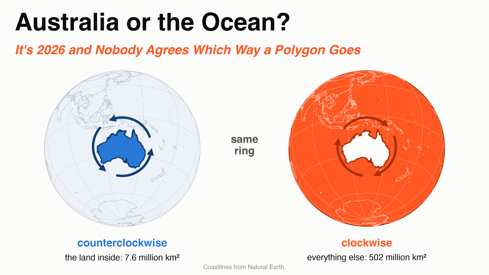
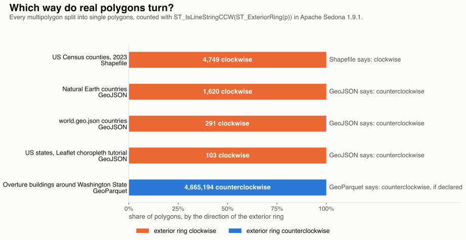

---
date:
  created: 2026-10-02
links:
  - "GeoJSON RFC 7946, section 3.1.6": https://datatracker.ietf.org/doc/html/rfc7946#section-3.1.6
  - ST_ForcePolygonCCW: https://sedona.apache.org/latest/api/sql/Geometry-Editors/ST_ForcePolygonCCW/
  - ST_IsPolygonCCW: https://sedona.apache.org/latest/api/sql/Geometry-Accessors/ST_IsPolygonCCW/
authors:
  - jia
title: "Australia or the Ocean? It's 2026 and Nobody Agrees Which Way a Polygon Goes"
slug: australia-or-the-ocean-nobody-agrees-which-way-a-polygon-goes
---

# Australia or the Ocean? It's 2026 and Nobody Agrees Which Way a Polygon Goes

Draw a line around Australia and close it. On a globe that ring has two sides, and both are real polygons: the Australian mainland, 7.6 million km², and everything else on Earth, about 502 million km². The coastline is the same in both. The only thing that says which one you meant is the direction you drew it.

So which direction means "the land"? It depends on whom you ask. The standards have disagreed for decades, and two of them call their opposite answers by the same name.



<!-- more -->

## One ring, two answers

A polygon is stored as a list of corners in order. There are two orders: clockwise and counterclockwise. A common rule on a globe is that the inside is on your left as you walk. Walk the Australian coast counterclockwise and the land is on your left. Walk it clockwise and the ocean is.

On a flat map nobody needs the rule, because a ring has only one finite side, the inside. That is why most files never cared, and why the rules that exist do not agree.

## Who says which way

| Who | The outside ring goes |
|---|---|
| [OGC Simple Features](https://docs.ogc.org/is/06-103r4/06-103r4.pdf) | counterclockwise |
| [Shapefile, 1998](https://www.esri.com/content/dam/esrisites/sitecore-archive/Files/Pdfs/library/whitepapers/pdfs/shapefile.pdf) | clockwise |
| [GeoJSON, RFC 7946, 2016](https://datatracker.ietf.org/doc/html/rfc7946#section-3.1.6) | counterclockwise |
| [Mapbox Vector Tiles](https://github.com/mapbox/vector-tile-spec/tree/master/2.1#4344-polygon-geometry-type) | clockwise, on a screen where y points down |
| [GeoParquet](https://github.com/opengeospatial/geoparquet/blob/main/format-specs/geoparquet.md#orientation) | counterclockwise, but only if the file says so |

GeoJSON calls its rule "the right-hand rule". PostGIS, the spatial extension of PostgreSQL, has a function named after the right-hand rule too, [`ST_ForceRHR`](https://postgis.net/docs/ST_ForceRHR.html), and it turns rings clockwise. Its own manual warns that the definition "conflicts with definitions used in other contexts". Two right-hand rules, two opposite directions.

## What real files do

One Sedona query counts the direction of every outside ring in a file.

??? example "The counting query"

    ```sql
    SELECT COUNT(*) AS polygons,
           SUM(CASE WHEN ST_IsLineStringCCW(ST_ExteriorRing(p)) THEN 1 ELSE 0 END) AS counterclockwise,
           SUM(CASE WHEN NOT ST_IsLineStringCCW(ST_ExteriorRing(p)) THEN 1 ELSE 0 END) AS clockwise
    FROM (SELECT explode(ST_Dump(geometry)) AS p FROM source)
    ```



The Census shapefile is clockwise, as the Shapefile standard says, and Overture's 4.67 million buildings are counterclockwise, as GeoJSON and GeoParquet ask.

The three GeoJSON files are the surprise. All three are in wide use, and 2,014 of their 2,015 polygons go clockwise, against GeoJSON's own rule. That includes Natural Earth's ring around the Australian mainland. Read with the walk-on-the-left rule, that file says the ocean.

Nothing breaks, because the GeoJSON standard also tells readers to accept rings that go the wrong way, and because most software never looks.

## What Sedona does

Sedona has two types for shapes, geometry and geography, and neither one reads direction.

**Geometry is flat.** Longitude and latitude are x and y on a sheet of paper. On paper a closed ring has one finite side, and the other side runs to infinity, so there is nothing to choose. As a geometry, the Australian ring measures 686.65 square degrees with `ST_Area` and 7.6 million km² with `ST_AreaSpheroid`, clockwise or counterclockwise.

The ocean has to be drawn: a bigger outside ring with Australia as a hole. The role comes from the order of the rings: the first is the outside and the rest are holes. The same holds at scale: 3,235 US counties keep the same area and the same join results after every ring is reversed.

**Geography is the globe.** Here the ring has two finite sides, and Sedona always takes the smaller one. As a geography, the Australian mainland is 7.6 million km² in both directions. It contains Alice Springs and it does not contain London.

A harder test is a ring along 10° south, which splits the planet 41% to 59%. Walked east or walked west, Sedona returns the smaller, southern side: 210.6 million km². The price is that one ring can never mean more than half the planet.

So in Sedona the answer to the title is always Australia.

Direction still shows up in three places:

- **Reading a Shapefile.** The format has no flag for a hole. A hole is a ring that goes the other way. Sedona compares each ring with the first one, so a file with every ring reversed still reads right.
- **Checking and fixing.** `ST_IsPolygonCCW` tells you which way a polygon goes. `ST_ForcePolygonCCW` makes it counterclockwise for GeoJSON and GeoParquet. `ST_ForcePolygonCW` makes it clockwise for Shapefile and tiles.
- **Writing.** Sedona keeps the order you gave. `ST_AsText` and `ST_AsGeoJSON` return the corners as stored, so the next system sees your direction.

## The point

- Inside Sedona, ignore direction.
- When you hand data to another system, force the direction it expects.
- When someone says "right-hand rule", ask which one.

*Counties from the US Census Bureau, countries and coastlines from Natural Earth and world.geo.json, US states from the Leaflet tutorials, buildings from Overture Maps release 2026-08-19.0. Measurements on Apache Sedona 1.9.1.*
