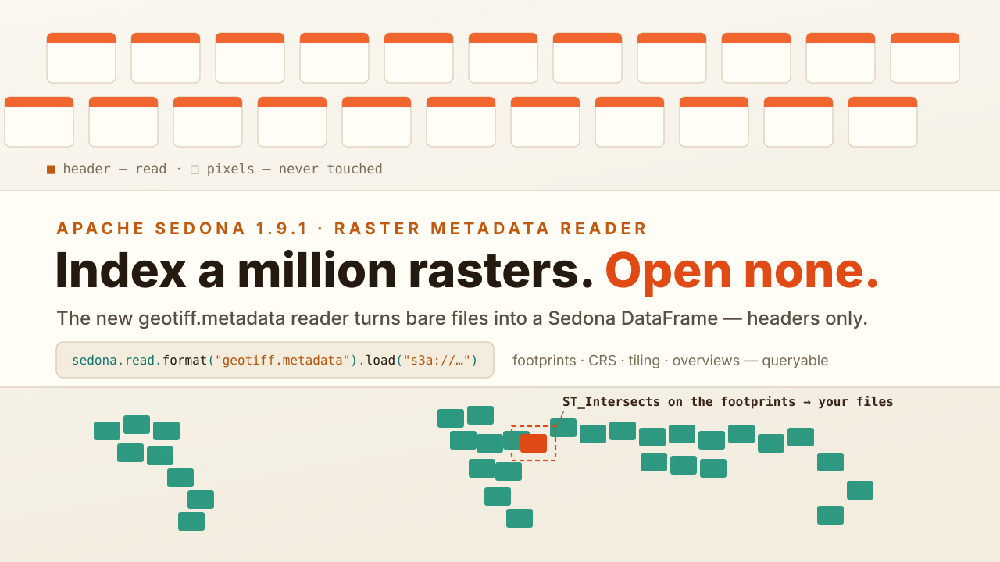
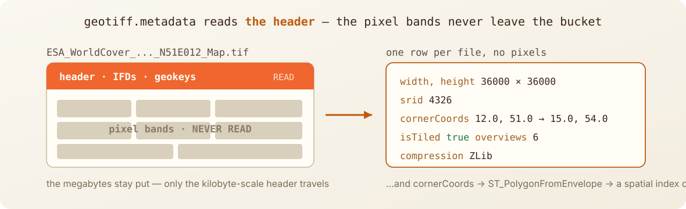
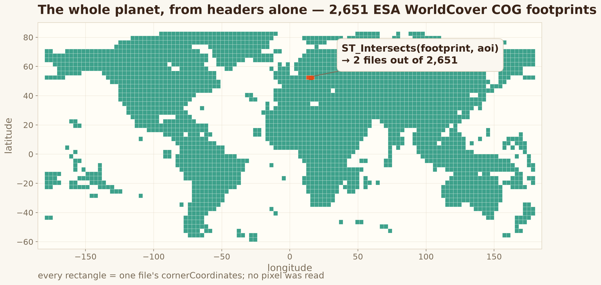
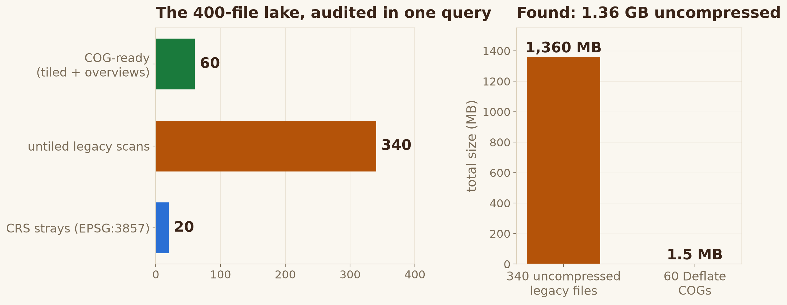

---
date:
  created: 2026-08-07
links:
  - GeoTIFF metadata tutorial: https://sedona.apache.org/latest/tutorial/files/geotiffmetadata-sedona-spark/
  - NetCDF metadata tutorial: https://sedona.apache.org/latest/tutorial/files/netcdfmetadata-sedona-spark/
  - Sedona 1.9.1 release notes: https://sedona.apache.org/latest/setup/release-notes/
authors:
  - jia
title: "Index a Million Rasters. Open None."
---

# Index a Million Rasters. Open None.

Every raster team has the bucket. Thousands of GeoTIFFs accumulated from surveys, vendors, and pipelines — and no catalog. Which files cover this area? Which CRS are they in? Which ones were never converted to Cloud Optimized GeoTIFF? Until now, answering meant opening every file.



<!-- more -->

Sedona 1.9.1 ships a pair of **raster metadata readers** — `geotiff.metadata` and its sibling `netcdf.metadata` — that read *only the file headers*: dimensions, CRS, geotransform, corner coordinates, band layout, tiling, overviews, compression. One row per file, straight into a Sedona DataFrame. The pixels never leave the bucket.



## Point it at a bucket

Everything below ran on the released artifacts, exactly as you'd install them — `pip install apache-sedona==1.9.1`, plus the release jars and S3 support:

```python
from sedona.spark import SedonaContext

config = (
    SedonaContext.builder()
    .master("local[*]")
    .config(
        "spark.jars.packages",
        "org.apache.sedona:sedona-spark-shaded-3.5_2.12:1.9.1,"
        "org.datasyslab:geotools-wrapper:1.9.1-33.5,"
        "org.apache.hadoop:hadoop-aws:3.3.4",
    )
    # the demo bucket is public — read it anonymously
    .config(
        "spark.hadoop.fs.s3a.aws.credentials.provider",
        "org.apache.hadoop.fs.s3a.AnonymousAWSCredentialsProvider",
    )
    .getOrCreate()
)
sedona = SedonaContext.create(config)
```

For data, we point at a public bucket you have seen before on this blog: `s3://sentinel-cogs`, the Sentinel-2 COG archive that our STAC post's asset links resolve to. One tile, one month — no catalog service involved, just files:

```python
meta = sedona.read.format("geotiff.metadata").load(
    "s3a://sentinel-cogs/sentinel-s2-l2a-cogs/10/S/EG/2026/6"
)
meta.createOrReplaceTempView("meta")
```

That's **289 COGs holding 14.7 GB of imagery, indexed in 70 seconds from a laptop** — network-bound, since only the kilobyte-scale headers travel. What comes back is a table:

```python
sedona.sql("""
    SELECT regexp_extract(path, '([^/]+)$', 1) AS file,
           width, height, numBands, srid, isTiled,
           size(overviews) AS ov, compression,
           ROUND(fileSize / 1048576, 1) AS mb
    FROM meta ORDER BY fileSize DESC LIMIT 3
""").show(truncate=False)
```

```
+-------+-----+------+--------+-----+-------+---+-----------+-----+
|file   |width|height|numBands|srid |isTiled|ov |compression|mb   |
+-------+-----+------+--------+-----+-------+---+-----------+-----+
|TCI.tif|10980|10980 |3       |32610|true   |4  |ZLib       |335.9|
|TCI.tif|10980|10980 |3       |32610|true   |4  |ZLib       |330.3|
|TCI.tif|10980|10980 |3       |32610|true   |4  |ZLib       |316.1|
+-------+-----+------+--------+-----+-------+---+-----------+-----+
```

True-color composites in UTM zone 10N, tiled, four overview levels each — facts we now know without having read a single pixel. The month mixes four raster shapes (10 m, 20 m, 60 m bands and previews), and one `GROUP BY` sorts them out:

```
+-----+------+-----+
|width|height|files|
+-----+------+-----+
| 5490|  5490|  119|
|10980|10980 |  102|
| 1830|  1830|   51|
|  343|   343 |  17|
+-----+------+-----+
```

## The footprint index

The quiet superpower is `cornerCoordinates`. One expression turns it into a geometry — and suddenly your bucket has a spatial index:

```python
footprints = sedona.sql("""
    SELECT path,
           ST_PolygonFromEnvelope(
               cornerCoordinates.minX, cornerCoordinates.minY,
               cornerCoordinates.maxX, cornerCoordinates.maxY
           ) AS footprint
    FROM meta
""")
```

`WHERE ST_Intersects(footprint, my_aoi)` now answers *"which files cover this area?"* over the whole bucket — the question that used to require a catalog nobody built.

## And when you point it at a planet

To see where the ceiling is, we ran the same one-liner over the **entire ESA WorldCover archive**: every 3°×3° land-cover COG on Earth, in one glob. All **2,651 files — 124 GB of rasters — indexed in 12.4 minutes from the same laptop**, across an ocean, headers only. (You don't need to reproduce this one; the month-sized read above is the same code.)

Plotting nothing but each file's `cornerCoordinates` draws the continents:



With the index cached, `ST_Intersects` against an area of interest in western Poland — the Lubusz box from our spatial statistics post — came back in **2.6 seconds** with exactly two files:

```
+--------------------------------------------+
|ESA_WorldCover_10m_2021_v200_N51E015_Map.tif|
|ESA_WorldCover_10m_2021_v200_N51E012_Map.tif|
+--------------------------------------------+
```

A planetary raster archive, answering spatial questions like a database table.

## Audit your raster lake

Metadata is also where data problems hide. To show the audit workflow end to end — reproducibly, offline — we had Sedona *generate* a deliberately messy 400-file lake with its own raster writers (`RS_MakeEmptyRaster` → `RS_AsGeoTiff` / the new `RS_AsCOG`): 320 plain untiled files, 60 proper COGs, and 20 strays a "web tool" exported in EPSG:3857. Then we indexed it back:

```python
lake = (
    sedona.read.format("geotiff.metadata")
    .option("recursiveFileLookup", "true")
    .load("/data/raster-lake")
)
lake.createOrReplaceTempView("lake")

sedona.sql("""
    SELECT COUNT(*) AS files,
           SUM(CASE WHEN isTiled AND size(overviews) > 0 THEN 1 ELSE 0 END) AS cog_ready,
           SUM(CASE WHEN srid <> 4326 THEN 1 ELSE 0 END) AS crs_strays
    FROM lake
""").show()
```

```
+-----+---------+----------+
|files|cog_ready|crs_strays|
+-----+---------+----------+
|  400|       60|        20|
+-----+---------+----------+
```



Three lines of SQL and the lake confesses: only 60 files are COG-ready, 20 are quietly in the wrong CRS, and the untiled legacy scans are hoarding **1,360 MB uncompressed** (our synthetic tiles are empty, so their compression ratio is theatrical — but the *finding* is exactly what you'd get on real data: the audit tells you where the storage and correctness debt lives).

## NetCDF gets the same treatment

The sibling `netcdf.metadata` reader does the same for scientific data cubes — variables, dimensions, attributes, and CF `grid_mapping` translated to a proper CRS — so climate archives can be inventoried the same way. Same pattern: `sedona.read.format("netcdf.metadata").load(...)`.

## The point

Catalogs like STAC are wonderful — when someone has built one for you. For every other bucket of rasters, Sedona 1.9.1 turns the files *themselves* into the catalog: one read for the metadata, one expression for the footprints, plain SQL for the audit. Index a million rasters. Open none.

*Full option reference in the [GeoTIFF metadata tutorial](https://sedona.apache.org/latest/tutorial/files/geotiffmetadata-sedona-spark/) and [NetCDF metadata tutorial](https://sedona.apache.org/latest/tutorial/files/netcdfmetadata-sedona-spark/).*
