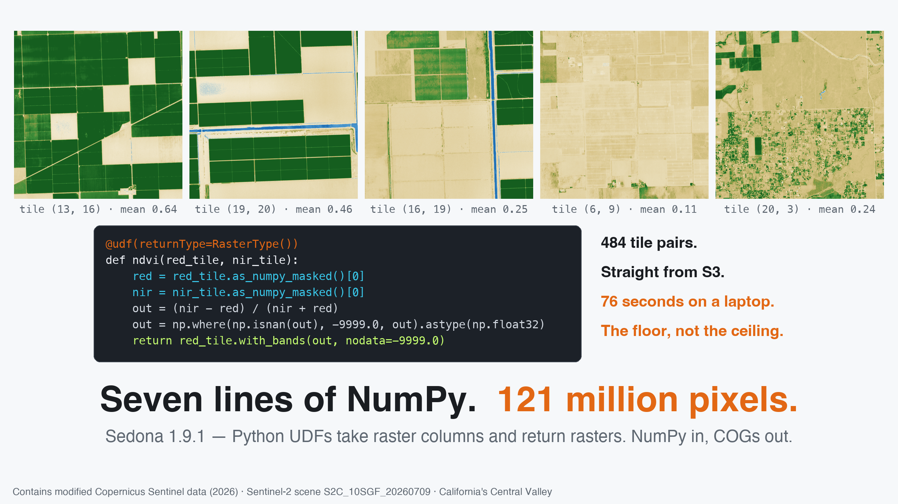
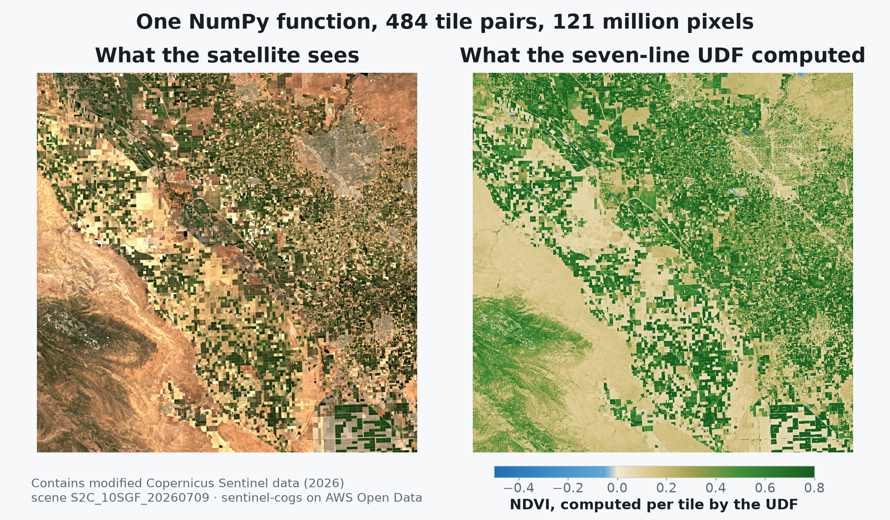

---
date:
  created: 2026-08-14
links:
  - Raster UDF reference: https://sedona.apache.org/latest/api/sql/Raster-UDF/
  - Raster tutorial: https://sedona.apache.org/latest/tutorial/raster/
  - Sedona 1.9.1 release notes: https://sedona.apache.org/latest/setup/release-notes/
authors:
  - jia
title: "Seven Lines of NumPy, 121 Million Pixels"
---

# Seven Lines of NumPy, 121 Million Pixels

Those deep-green grids are California's Central Valley — some of the most intensively farmed land on Earth, not as a camera sees it but as the NDVI vegetation index does: computed, pixel by pixel, by seven lines of NumPy. Sedona ran those seven lines on 484 satellite tiles in parallel, straight out of a public S3 bucket, and wrote the answer back as Cloud Optimized GeoTIFFs. That's the new move in Sedona 1.9.1: a plain Python UDF can take raster columns *and return rasters*. If the raster function you need isn't built in — your index, your QA rule, your model — write it.



<!-- more -->

## From bucket to vegetation map

NDVI needs a red band and a near-infrared band. Our scene is a cloud-free July capture of the valley around Fresno — irrigated fields, summer-gold rangeland, Sierra foothills — from the [Sentinel-2 COG archive](https://registry.opendata.aws/sentinel-2-l2a-cogs/), the same one [our STAC post](https://sedona.apache.org/latest/blog/2026/07/17/join-the-sky-to-the-ground-spatial-joins-over-stac-catalogs/) searched by catalog. The two bands are separate 230 MB files of 10,980 × 10,980 pixels each — so we read them with the tiled `raster` reader [from our 2 GB wall post](https://sedona.apache.org/latest/blog/2026/07/10/open-huge-geotiffs-without-the-2-gb-wall/), which turns each file into 484 tile rows, and pair the bands with a join on tile position:

```python
scene = (
    "s3a://sentinel-cogs/sentinel-s2-l2a-cogs/10/S/GF/2026/7/"
    "S2C_10SGF_20260709_0_L2A"
)
reader = (
    sedona.read.format("raster").option("tileWidth", "512").option("tileHeight", "512")
)
red_df = reader.load(f"{scene}/B04.tif")
nir_df = reader.load(f"{scene}/B08.tif")

tiles = red_df.select(col("rast").alias("red"), "x", "y").join(
    nir_df.select(col("rast").alias("nir"), "x", "y"), ["x", "y"]
)
```

??? example "Session setup — released artifacts, anonymous S3"

    ```python
    from pyspark.sql.functions import col, format_string, udf

    from sedona.spark import SedonaContext
    from sedona.spark.sql.types import RasterType

    config = (
        SedonaContext.builder()
        .master("local[4]")
        .config("spark.driver.memory", "8g")
        .config(
            "spark.jars.packages",
            "org.apache.sedona:sedona-spark-shaded-3.5_2.12:1.9.1,"
            "org.datasyslab:geotools-wrapper:1.9.1-33.5,"
            "org.apache.hadoop:hadoop-aws:3.3.4",
        )
        .config(
            "spark.hadoop.fs.s3a.aws.credentials.provider",
            "org.apache.hadoop.fs.s3a.AnonymousAWSCredentialsProvider",
        )
        .config("spark.hadoop.fs.s3a.bucket.sentinel-cogs.endpoint.region", "us-west-2")
        .getOrCreate()
    )
    sedona = SedonaContext.create(config)
    ```

Now the seven lines. Inside the UDF each raster arrives as a `SedonaRaster` — pixels as a NumPy array, CRS and geotransform riding along — and `with_bands()` hands back a real raster on the same grid:

```python
@udf(returnType=RasterType())
def ndvi(red_tile, nir_tile):
    red = red_tile.as_numpy_masked()[0]  # NaN where the scene has no data
    nir = nir_tile.as_numpy_masked()[0]
    out = (nir - red) / (nir + red)
    out = np.where(np.isnan(out), -9999.0, out).astype(np.float32)
    return red_tile.with_bands(out, nodata=-9999.0)


result = tiles.withColumn("ndvi", ndvi(col("red"), col("nir")))
```

Note it takes *two* raster columns — any number works — and that NODATA is handled honestly: `as_numpy_masked()` turns missing pixels into `NaN` so they can't masquerade as numbers, and `nodata=-9999.0` declares what "invalid" means in the output. (One habit to keep: check your archive's radiometric conventions. This bucket pre-applies the Sentinel-2 reflectance offset — `earthsearch:boa_offset_applied: true` in its STAC metadata — so the plain ratio is correct as-is; elsewhere it's one extra line of NumPy.)

The output is an ordinary raster column, so writing it out as Cloud Optimized GeoTIFFs is the stock raster writer:

```python
(
    result.selectExpr("RS_AsCOG(ndvi) AS raster_binary", "x", "y")
    .withColumn("path", format_string("ndvi_x%02d_y%02d", col("x"), col("y")))
    .write.format("raster")
    .option("rasterField", "raster_binary")
    .option("pathField", "path")
    .option("fileExtension", ".tif")
    .mode("overwrite")
    .save("/data/ndvi-tiles")
)
```

That one action pulls 460 MB of COGs from S3, joins 484 tile pairs, runs the UDF over 121 million pixel pairs, and writes 484 NDVI tiles that are themselves proper COGs — internally tiled, with overviews, deflate-compressed — in **76 seconds on a laptop**. And the laptop is the floor, not the ceiling: every step is rows moving through a distributed engine.



The map is the code review. Irrigated fields read deep green, the summer-dry rangeland and foothills sit near zero — and open water, the canals and ponds threading between fields, comes out *negative*, because water absorbs near-infrared. Physics, reproduced by seven lines of NumPy.

## It's just Python in there

The UDF body is ordinary Python, so the whole scientific stack comes along. `as_rasterio()` exposes a tile as a read-only `rasterio` dataset — `rasterio.fill.fillnodata(...)` patches holes right inside a UDF. SciPy is one decorator away: `ndimage.uniform_filter(raster.as_numpy()[0], size=3)` is a distributed smoothing filter. Anything that maps an array to an array on the same grid — scikit-learn inference, OpenCV morphology, your own model — plugs into raster columns the same way. Sedona's built-in [map algebra](https://sedona.apache.org/latest/api/sql/Raster-map-algebra/) still covers classic band math; when you want more flexibility than an expression language — libraries, unit tests, a debugger — a UDF is the same idea with your whole toolbox attached.

Two boundaries to know: `with_bands()` keeps the output on the input's grid (band count and dtype can change; for reprojection or resampling use `RS_ReprojectMatch` and friends before or after), and NODATA deserves the care shown above. The [Raster UDF reference](https://sedona.apache.org/latest/api/sql/Raster-UDF/) covers both in depth.

## One machine today, a fleet tomorrow

A raster column is rows, and rows are what Sedona distributes: the tiled reader spreads a scene across the cluster as it reads, the UDF runs in Python workers beside every executor, and the writer commits each task's tiles independently. Point the same code at a year of acquisitions and it fans out over whatever cluster you have — nothing about the function changes. And because the output is a first-class raster column, it composes with the rest of 1.9.1: index the results with the [`geotiff.metadata` reader](https://sedona.apache.org/latest/blog/2026/08/07/index-a-million-rasters-without-reading-a-pixel/), filter tiles spatially, or feed them to zonal statistics without leaving the DataFrame.

## The point

Raster processing at scale used to mean choosing between an engine's built-in function list and exporting everything to files for Python. Sedona 1.9.1 removes the choice: the engine brings the distribution, tiling, and I/O — you bring the function. If it's NumPy on a grid, it runs on raster columns, cluster-wide, seven lines at a time.

*Full API in the [Raster UDF reference](https://sedona.apache.org/latest/api/sql/Raster-UDF/); reading and writing patterns in the [raster tutorial](https://sedona.apache.org/latest/tutorial/raster/).*
