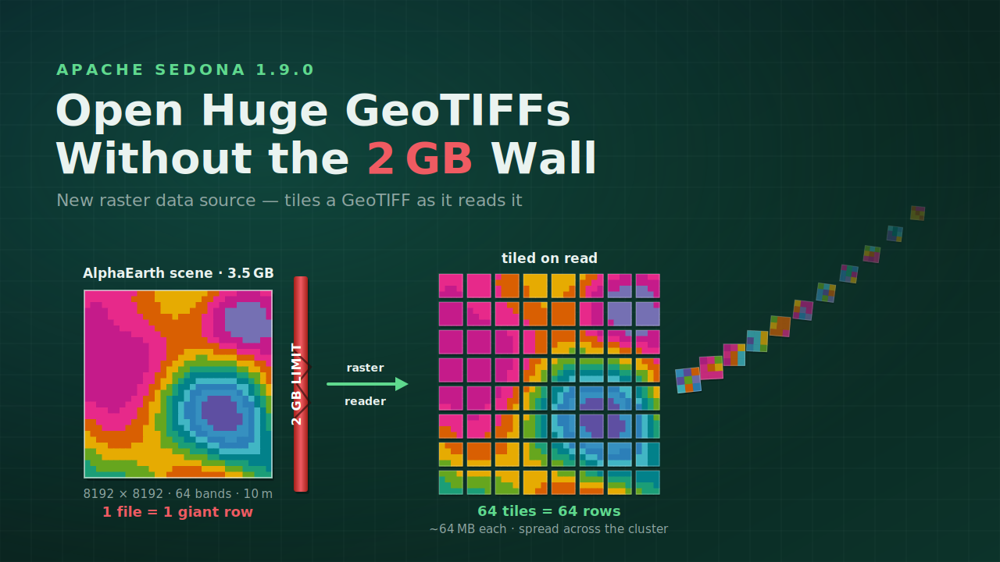

---
date:
  created: 2026-07-10
links:
  - Raster tutorial: https://sedona.apache.org/latest/tutorial/raster/
  - Release notes: https://sedona.apache.org/latest/setup/release-notes/
authors:
  - jia
title: "Open Huge GeoTIFFs Without the 2 GB Wall"
---

# Open Huge GeoTIFFs Without the 2 GB Wall

The hardest part of working with big rasters often isn't the analysis. It's just getting the file open.



<!-- more -->

Take a single [AlphaEarth Foundations](https://deepmind.google/discover/blog/alphaearth-foundations-helps-map-our-planet-in-unprecedented-detail/) embedding scene — 64 bands of learned satellite features at 10 m resolution, 8192 × 8192 pixels, 3.5 GB in one GeoTIFF. Load it the old way and the job dies — not because your cluster is too small, but because the engine underneath won't materialize a single record larger than 2 GB. Decoded, that raster is over 4 GB; read as one record it becomes a single 4 GB row that topples over before any spatial work begins.

Apache Sedona didn't save you here either: Sedona runs on Spark, so it inherited that ceiling. Its raster loader read each file as one record — one file, one row, one oversized object.

That left the usual ugly workarounds: hand-tile the file first, convert formats offline, or throw memory at the executor and pray.

## Tile on read

Apache Sedona 1.9.0 removes the wall. A new `raster` data source tiles a GeoTIFF as it reads it — one row per tile, streamed straight into a DataFrame:

```python
df = sedona.read.format("raster").load("/data/alphaearth-scene.tiff")
```

That's the whole thing. The AlphaEarth file is a Cloud Optimized GeoTIFF with 1024 × 1024 internal tiles, so the reader splits it into an 8 × 8 grid — **64 tiles, 64 rows, about 64 MB each** — instead of one 4 GB record. Each row carries the tile's raster payload (all 64 embedding bands ride along) plus its `(x, y)` position in the grid, and Sedona spreads the tiles across the cluster automatically so no single executor has to carry the whole file alone.

```
+--------------------+---+---+-----------------------+
|                rast|  x|  y| name                  |
+--------------------+---+---+-----------------------+
|GridCoverage2D["g...|  0|  0| alphaearth-scene.tiff |
|GridCoverage2D["g...|  1|  0| alphaearth-scene.tiff |
|GridCoverage2D["g...|  2|  0| alphaearth-scene.tiff |
...
```

## Then it's just a DataFrame

From here it's an ordinary DataFrame — every Sedona raster function runs per tile, across the cluster. First confirm the split, and that each tile still carries all 64 bands at full 1024² resolution:

```python
df.createOrReplaceTempView("aef")

sedona.sql("""
    SELECT COUNT(*)   AS tiles,      -- 64
           MAX(x) + 1 AS tile_cols,  -- 8
           MAX(y) + 1 AS tile_rows   -- 8
    FROM aef
""").show()

sedona.sql("""
    SELECT RS_Width(rast)    AS width,   -- 1024
           RS_Height(rast)   AS height,  -- 1024
           RS_NumBands(rast) AS bands    -- 64
    FROM aef LIMIT 1
""").show()
```

Then run real analysis. Here's a zonal statistic — the mean of embedding band 1 inside a region of interest — computed the *tiling-aware* way, because the scene is now 64 rows rather than one:

```python
sedona.sql("""
    WITH zone AS (
        -- ROI polygon, tagged with the scene's CRS (UTM zone 15N) so it
        -- lines up with the raster instead of being read as lon/lat
        SELECT ST_SetSRID(
            ST_GeomFromText(
                'POLYGON((600000 1650000, 640000 1650000, '
                '640000 1700000, 600000 1700000, 600000 1650000))'
            ),
            32615
        ) AS geom
    )
    SELECT SUM(RS_ZonalStats(t.rast, z.geom, 1, 'sum'))
         / SUM(RS_ZonalStats(t.rast, z.geom, 1, 'count')) AS mean_band1
    FROM aef t, zone z
""").show()
```

On this scene — a 40 km × 50 km ROI at 10 m — that rolls up **20,000,000 pixels spread across the overlapping tiles** into one number:

```
+----------+
|mean_band1|
+----------+
|   82.8633|
+----------+
```

A single, untiled raster would take `RS_ZonalStats(rast, geom, 1, 'mean')` directly. With a tiled raster each tile covers only part of the polygon, so you sum the per-tile `sum` and `count` and divide once — the same idiom, one extra aggregation. [`RS_ZonalStatsAll`](https://sedona.apache.org/latest/api/sql/Raster-Band-Accessors/RS_ZonalStatsAll/) returns every standard statistic in a single call.

## A few things worth knowing

- **COGs shine here.** The AlphaEarth scene above is a [Cloud Optimized GeoTIFF](https://www.cogeo.org/); its square 1024 × 1024 internal tiles map cleanly onto the reader, so by default the tile size is taken straight from the file's own tiling scheme — you don't have to specify anything.
- **You stay in control.** Set `option("retile", "false")` to load a whole raster as a single row, or set `tileWidth` / `tileHeight` to choose the tile size yourself. `padWithNoData` pads the ragged right and bottom edge tiles out to a uniform size.
- **It walks directories too.** The reader globs paths and honors the Spark file-source options `recursiveFileLookup` and `pathGlobFilter`, so a folder of thousands of scenes is one line.

```python
df = (
    sedona.read.format("raster")
    .option("recursiveFileLookup", "true")
    .option("pathGlobFilter", "*.tif*")
    .load("/data/scenes/")
)
```

If a file's internal layout isn't tiling-friendly, the reader tells you instead of failing silently — disable tiling with `retile=false`, set the tile size manually, or translate the file to COG with `gdal_translate`.

## Try it

Whether you work in Earth observation, climate, agriculture, or anything else that ships pixels at scale, this quietly deletes a problem teams have been engineering around for years.

- Walkthrough: [Raster data tutorial](https://sedona.apache.org/latest/tutorial/raster/)
- [Apache Sedona 1.9.0 release notes](https://sedona.apache.org/latest/setup/release-notes/)
