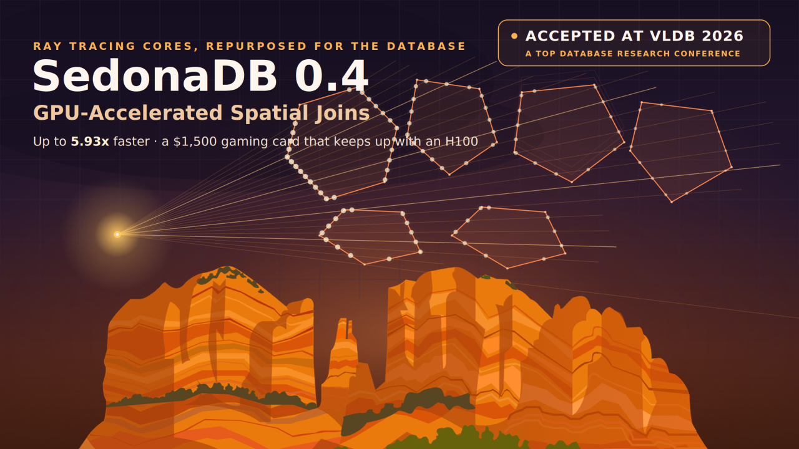
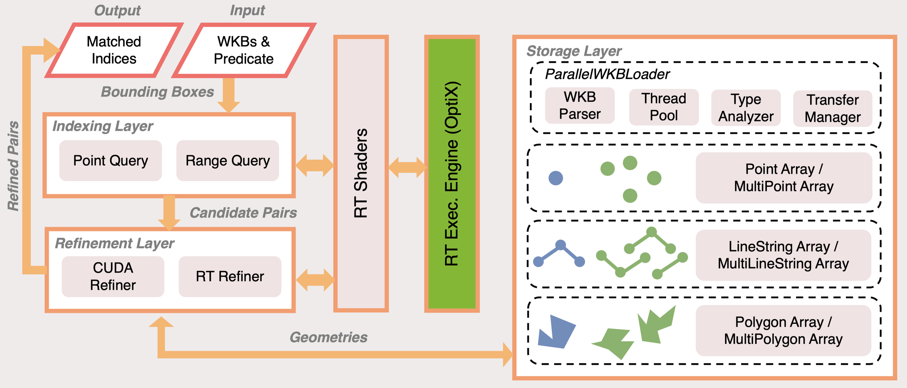
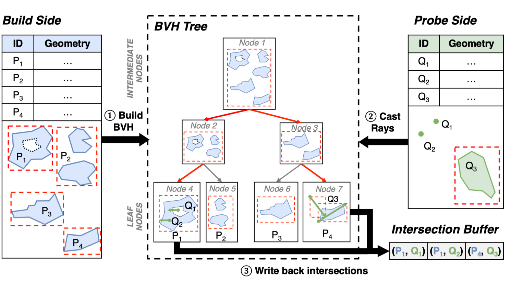
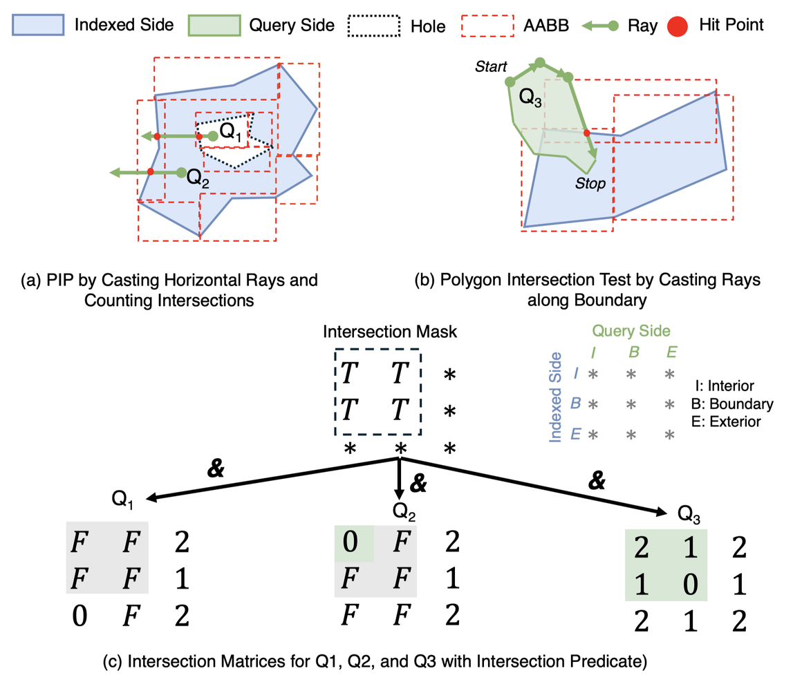
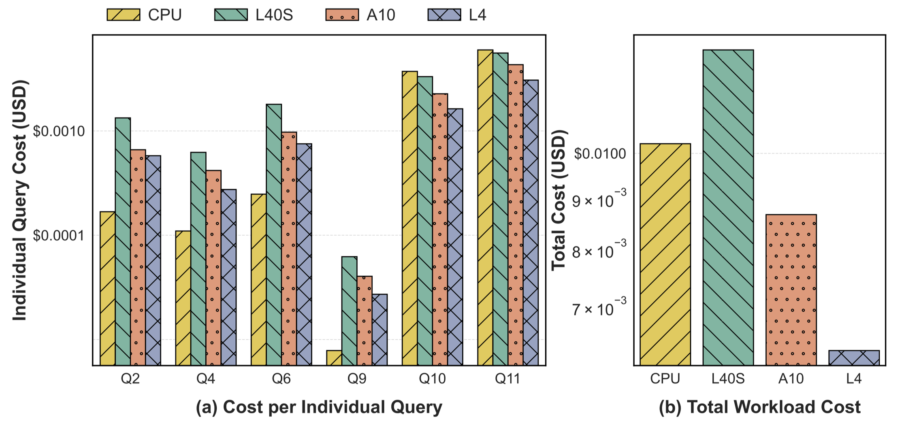

---
date:
  created: 2026-06-26
links:
  - SedonaDB: https://sedona.apache.org/sedonadb/
authors:
  - jia
title: "SedonaDB 0.4: GPU-Accelerated Spatial Joins"
---

# SedonaDB 0.4: GPU-Accelerated Spatial Joins

In SedonaDB 0.4, we taught this Rust database to run spatial joins on your $1,500 gaming GPU's ray tracing cores, and it beats an H100.



<!-- more -->

The Apache Sedona community released [SedonaDB](https://sedona.apache.org/sedonadb) 0.4.0, resolving 187 issues and adding 26 new functions from 15 contributors. SedonaDB is the first open-source, single-node analytical database that treats spatial data as a first-class citizen — the counterpart to the distributed Sedona engines for small-to-medium datasets running on a single machine.

This is the first in a series of posts diving into what's new in SedonaDB 0.4. We'll be covering more of the release — the Python DataFrame API, the R dplyr interface, Geography support, GeoParquet write support, N-dimensional rasters and Zarr, and more — in the posts to come; for the full rundown, see the [0.4.0 release blog post](https://sedona.apache.org/latest/blog/2026/06/19/sedonadb-040-release/). We're kicking things off with the feature we're most excited about: GPU-accelerated spatial joins.

## GPU-Accelerated Spatial Joins



Gaming GPUs contain dedicated ray tracing cores designed for video game lighting — and they sit idle during database queries. Spatial joins are about finding intersecting geometries, which maps naturally onto ray tracing primitives. We built **RayBooster**, an extension that brings ray tracing core acceleration into SedonaDB.

The accompanying research paper, [*"RayBooster: A Ray Tracing Engine to Accelerate SedonaDB,"*](https://jiayuasu.github.io/files/paper/sedona_db_gpu_vldb_2026.pdf) was accepted to **VLDB 2026** (Industry Track), developed in collaboration with The Ohio State University.

### How it works: four components



**1. GPU-friendly storage layout.** Instead of the stream-oriented WKB format, RayBooster uses a Structure of Arrays organization that separates offsets, vertices, and types, enabling O(1) random access to any geometry.

**2. A single monolithic index.** Rather than building millions of tiny index trees, it uses *Z-stacking* — encoding each geometry's ID into the unused Z-axis of the ray tracing scene and building one global BVH for the entire batch.

**3. A universal predicate engine.** `RelateEngine` computes the DE-9IM matrix (a topological descriptor) on RT cores, giving one code path that resolves any geometry/predicate combination instead of hardcoding 500+ kernel variants.

**4. Memory-aware execution.** A scheduling and spilling layer keeps joins within GPU memory budgets on irregular real-world workloads, preventing out-of-memory failures.



## Performance

Testing on SpatialBench:

- **Up to 5.93x speedup** on heavy joins, with a 59.02% cost reduction on AWS
- **Q11 cross-zone trip join**: 7.51s (CPU) → 1.61s on a consumer RTX 3090 — a 4.66x speedup
- **10x scale**: 53.34s reduced to under 7s
- **Heavy joins at scale**: 4.93x to 9.68x speedups across GPU models
- **Consumer RTX 3090 vs. H100**: on some queries the gaming card actually beat the H100 (1.26s vs 1.77s on Q10), despite the H100 lacking RT cores



## Using it

On a machine with an NVIDIA GPU, pull the official Docker image and enable the feature with a single command:

```python
ctx.sql("SET gpu.enable = true")
```

The [GPU Acceleration guide](https://sedona.apache.org/sedonadb/latest/gpu-acceleration/) walks through launching the Docker image on NVIDIA GPU machines and lists the supported compute capabilities.

## Citation

Liang Geng, Rubao Lee, Dewey Dunnington, Feng Zhang, Jia Yu, and Xiaodong Zhang. ["RayBooster: A Ray Tracing Engine to Accelerate SedonaDB."](https://jiayuasu.github.io/files/paper/sedona_db_gpu_vldb_2026.pdf) PVLDB, 2026 (Industry Track).
