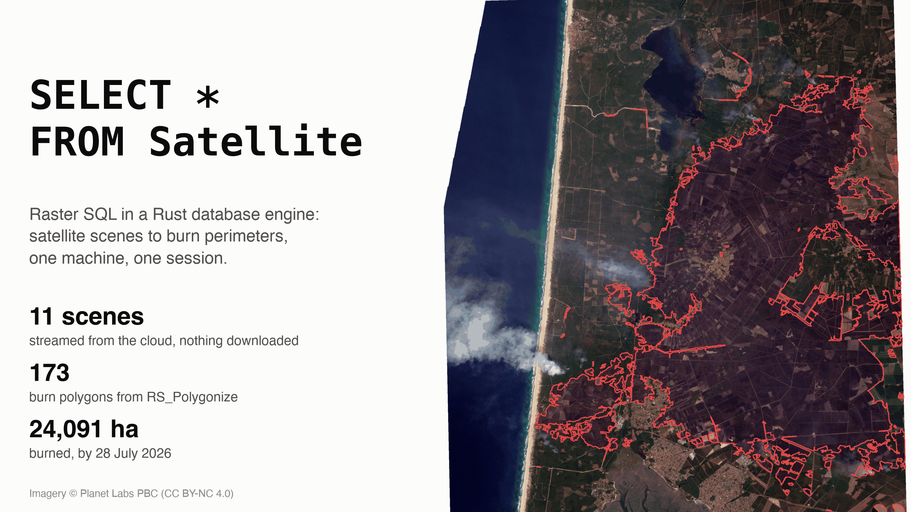
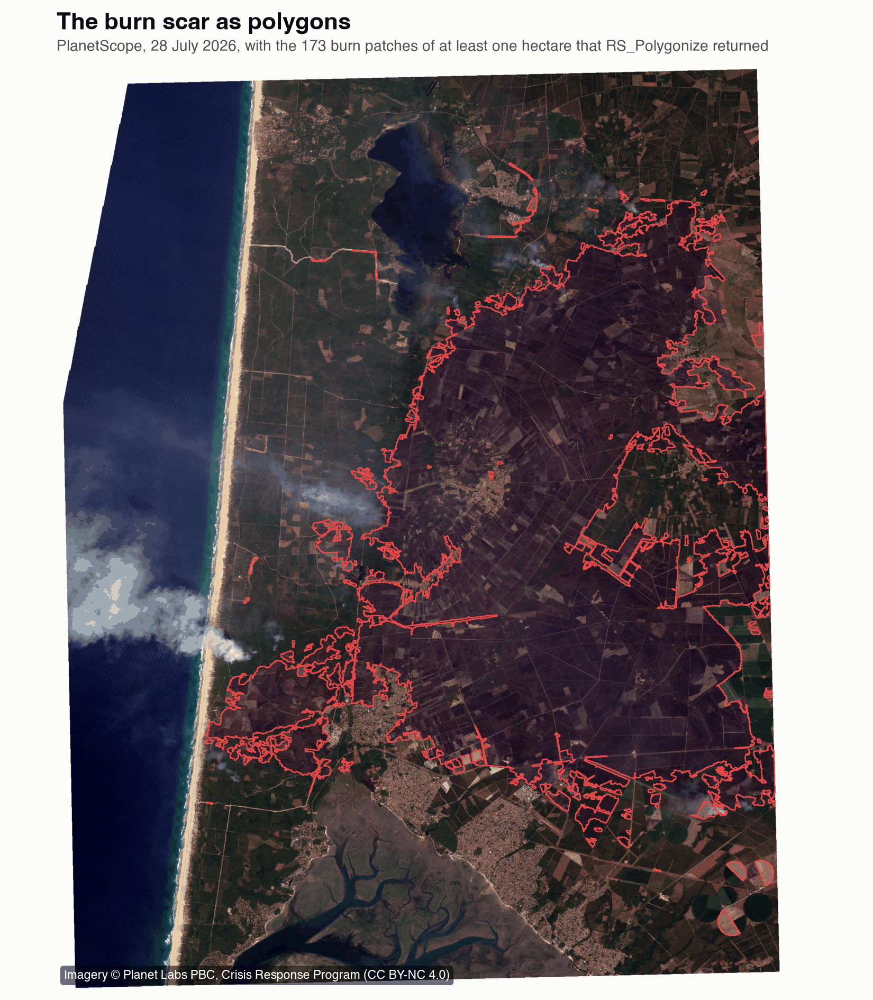
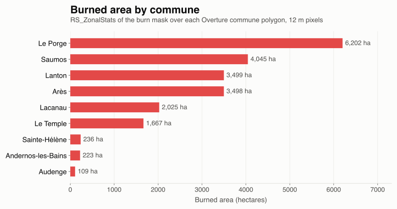

---
date:
  created: 2026-09-11
links:
  - SedonaDB quickstart: https://sedona.apache.org/sedonadb/latest/quickstart-python/
  - RS_Polygonize in SedonaDB: https://sedona.apache.org/sedonadb/latest/reference/sql/rs_polygonize/
  - Planet Crisis Response data: https://source.coop/planet/disasterdata
authors:
  - jia
title: "SELECT * FROM Satellite, in a Rust Database"
---

# SELECT * FROM Satellite, in a Rust Database

[SedonaDB](https://sedona.apache.org/sedonadb/latest/) 0.4.1 supports raster analysis in SQL and Python on a single machine. This example uses eleven PlanetScope satellite images to estimate the area burned in the [Gironde and Landes wildfire of July 2026](https://source.coop/planet/disasterdata/gironde-wildfire-2026). SQL selects and aligns the images, NumPy identifies vegetation loss, and raster functions convert the result into polygons and area estimates by municipality.



<!-- more -->

The code excerpts below show the main raster operations. Mosaic assembly, threshold calculation, and loading municipality boundaries are described but not included in full. The [SedonaDB quickstart](https://sedona.apache.org/sedonadb/latest/quickstart-python/) covers installation.

## Select scenes from the catalog

Planet publishes its crisis imagery as Cloud Optimized GeoTIFFs (COGs), which support reading parts of an image over HTTP. Each event has a [STAC-GeoParquet](https://source.coop/planet/disasterdata) index: a Parquet table of scene metadata that follows the SpatioTemporal Asset Catalog (STAC) format. SedonaDB reads this table over HTTPS. `ST_Intersects` selects scenes whose footprints overlap the study area:

??? example "Scene selection"

    ```python
    import sedonadb

    sd = sedonadb.connect()
    EV = "https://data.source.coop/planet/disasterdata/gironde-wildfire-2026"
    AOI = "POLYGON((-1.30 44.70, -0.95 44.70, -0.95 45.02, -1.30 45.02, -1.30 44.70))"

    sd.read_parquet(f"{EV}/pre-event/items.parquet").to_view("pre_event")
    sd.read_parquet(f"{EV}/post-event/items.parquet").to_view("post_event")
    scenes = sd.sql(f"""
        SELECT 'pre' AS phase, id, "eo:cloud_cover" AS cloud, assets.analytic_sr.href AS href
        FROM pre_event
        WHERE constellation = 'planetscope' AND ST_Intersects(geometry, ST_GeomFromWKT('{AOI}', 4326))
        UNION ALL
        SELECT 'post', id, "eo:cloud_cover", assets.analytic_sr.href
        FROM post_event
        WHERE constellation = 'planetscope' AND ST_Intersects(geometry, ST_GeomFromWKT('{AOI}', 4326))
        ORDER BY phase DESC, cloud
    """).to_pandas()
    ```

```
   phase                       id  cloud
0    pre  20260708_105558_91_2544      0
1    pre  20260708_105601_27_2544      0
...
8   post  20260728_105820_44_2562      0
9   post  20260728_105825_11_2562      0
10  post  20260728_105822_78_2562      5
```

The query selects eight scenes from 8 July and three from 28 July. These dates fall before and after the fire started on 23 July. Scene selection took about two seconds in the recorded run and read only catalog metadata.

## Read and align raster pixels

`RS_FromPath` reads a file's header and returns an out-of-database raster. This value stores the raster's location and spatial metadata; pixel values remain in the source file until an operation reads them. Opening one scene of about half a gigabyte took roughly a second and returned this metadata:

```
{'w': 12715, 'h': 9085, 'nb': 4, 'srid': 32630, 'sx': 3.0, 't': 'UNSIGNED_16BITS', 'nodata': 0.0}
```

The scene has four bands with 3 m pixels in the UTM zone 30N coordinate reference system (EPSG:32630). Scene grids have different origins, so the comparison needs a common grid. A NumPy array defines a reference raster with 12 m cells over the study area, and SQL receives it as a query parameter.

`RS_Clip` limits each raster to the study area. `RS_ReprojectMatch` then averages the 3 m pixels onto the reference grid. A `VALUES` table groups the scenes for each date into one query:

??? example "Clip and align scenes from one date"

    ```python
    from urllib.parse import urljoin

    import numpy as np
    from sedonadb.raster import Raster

    W, H = 2374, 3017  # 12 m cells over the 28 x 36 km study area, UTM 30N
    GT = [633936.0, 12, 0, 4987224.0, 0, -12]
    ref = Raster.from_numpy(np.zeros((H, W), np.uint8), crs="EPSG:32630", transform=GT)


    def asset_url(phase, scene_id, href):
        date = f"{scene_id[:4]}-{scene_id[4:6]}-{scene_id[6:8]}"
        return urljoin(f"{EV}/{phase}-event/{date}/items/{scene_id}/", href)


    def aligned(phase, band, algorithm="Average"):
        rows = scenes[scenes.phase == phase]
        values = ", ".join(
            f"('{r.id}', '{asset_url(phase, r.id, r.href)}')" for r in rows.itertuples()
        )
        tbl = sd.sql(
            f"""
            SELECT id, RS_ReprojectMatch(
                           RS_Clip(RS_FromPath(href), {band}, ST_GeomFromWKT('{AOI}', 4326)),
                           $1, '{algorithm}') AS r
            FROM (VALUES {values}) AS t(id, href)
            """,
            params=(ref,),
        ).to_arrow_table()
        return {
            tbl["id"][i].as_py(): Raster(tbl["r"], i).to_numpy()[0]
            for i in range(tbl.num_rows)
        }
    ```

The catalog's asset paths are relative to each scene's item directory. `asset_url` resolves them to HTTPS URLs before the query opens them.

The analysis reads the red and near-infrared bands, plus Planet's usable-data mask, for each date. The mask identifies clear pixels; it is read from a separate asset with nearest-neighbor resampling. These six queries took about eleven and a half minutes in the recorded run. `to_numpy()` exposes each result as a NumPy view.

NumPy combines the scenes into one image, or mosaic, per date. Scenes are processed in cloud-cover order, and each grid cell keeps the first clear pixel. The mosaics cover about 87 percent of the grid. Cloud, smoke, ocean, and gaps between scenes can leave cells without usable observations.

## Estimate vegetation loss with NumPy

The normalized difference vegetation index (NDVI) compares red and near-infrared reflectance. A drop in NDVI between the two dates indicates vegetation loss, which can result from fire or other changes such as harvesting. Otsu's method selects a threshold by dividing the distribution of NDVI changes into two groups. Applied to pixels with pre-fire NDVI above 0.35, it gave a threshold of 0.225 for this dataset.

The excerpt below assumes that `pre_red`, `pre_nir`, `post_red`, and `post_nir` are floating-point mosaics. `both_dates` marks cells with usable observations on both dates. The resulting mask contains 1 for vegetation loss that meets the thresholds and 0 elsewhere. `Raster.from_numpy` passes it back to SQL as an in-database raster, with its pixels held in memory.

??? example "NDVI drop to burn mask"

    ```python
    def ndvi(red, nir):
        return np.where(red + nir > 0, (nir - red) / np.maximum(red + nir, 1), np.nan)


    drop = ndvi(pre_red, pre_nir) - ndvi(post_red, post_nir)
    burn = (both_dates & (ndvi(pre_red, pre_nir) > 0.35) & (drop > 0.225)).astype(np.uint8)
    mask = Raster.from_numpy(burn, crs="EPSG:32630", transform=GT)
    ```

## Convert the mask to polygons

`RS_Polygonize` converts connected pixels with the same value into polygons. `unnest` expands the returned list into rows, and the filter keeps polygons with a mask value of 1:

```python
sd.sql(
    """
    SELECT p.geom AS geom, ST_Area(p.geom) AS m2
    FROM (SELECT unnest(RS_Polygonize($1, 1)) AS p) WHERE p.value = 1
""",
    params=(mask,),
).to_memtable().to_view("patches")
```

```
        ha                                             c
0  21090.0  POINT(-1.0499563746105551 44.85692261508244)
1    855.0  POINT(-1.1992262050284765 44.79970523209393)
2    303.0  POINT(-0.9643428713835945 44.76723745400395)
```

The output above lists the area in hectares and centroid of the three largest polygons, after sorting by area. Polygonizing the 7-million-cell mask took about three seconds and produced 3,769 patches. Keeping patches of at least one hectare leaves **173 polygons covering 24,091 ha**. The largest covers 21,090 ha between Le Porge and Lanton.



## Calculate area by municipality

Zonal statistics summarize raster values within a polygon. `RS_ZonalStats` sums the 0/1 mask within each French municipality, or commune. Each 12 m cell covers 144 square meters, or 0.0144 hectares, so multiplying the sum by 0.0144 gives an area estimate.

This query assumes a `communes` view with `name` and `geometry` columns loaded from [Overture Maps division areas](https://docs.overturemaps.org/guides/divisions/). It uses the full mask, including patches smaller than one hectare:

```python
per_commune = sd.sql(
    """
    SELECT name, RS_ZonalStats($1, geometry, 'sum') * 0.0144 AS burned_ha
    FROM communes ORDER BY burned_ha DESC
""",
    params=(mask,),
).to_pandas()
```



The query evaluated 27 communes in about fourteen seconds. The chart shows the nine with more than 50 hectares flagged by the mask.

## Compare the mask with land cover

ESA WorldCover provides a 10 m land-cover map for 2021, described in the [zonal statistics post](https://sedona.apache.org/latest/blog/2026/09/04/group-by-but-for-pixels/). `RS_Clip` and `RS_ReprojectMatch` align it to the same 12 m grid. `NearestNeighbor` preserves class values such as tree cover and cropland; averaging those codes would change their meaning.

A NumPy count groups flagged pixels by land-cover class. Like the commune query, this step uses the full mask, which covers about 24,347 ha before small patches are removed. The four largest classes are:

```
   land_cover  class  burned_ha  share_pct
   tree cover     10    18262.5       75.0
    grassland     30     5501.0       22.6
     cropland     40      548.7        2.3
     built-up     50       23.7        0.1
```

Tree cover accounts for 75 percent of the flagged area in the 2021 map. This class does not identify tree species, and land use may have changed by 2026. The roughly 549 ha classified as cropland also need care: harvested fields can lose as much NDVI as burned vegetation. A forest-only analysis could select the tree-cover class, but NDVI loss alone does not establish that a pixel burned.

## Export the results

`RS_AsGeoTiff` encodes the mask as a tiled, compressed GeoTIFF of 137 KB. `to_parquet` exports the polygons as GeoParquet.

??? example "Export"

    ```python
    tif = sd.sql(
        "SELECT RS_AsGeoTiff($1, 'DEFLATE', 0.0, 256) AS tif", params=(mask,)
    ).to_arrow_table()
    open("burn_mask.tif", "wb").write(tif["tif"][0].as_py())
    sd.sql(
        "SELECT ST_Transform(geom, 'EPSG:4326') AS geom, m2 FROM patches WHERE m2 >= 10000"
    ).to_parquet("burn_patches.parquet")
    ```

## Interpret the estimate

The recorded raster run took about twelve minutes in one process, including about eleven and a half minutes to read and align pixels. It used previously saved commune boundaries. Loading those boundaries, comparing land cover, and making the figures were separate steps; these timings are from this run, not a general performance benchmark.

The 24,091 ha estimate covers flagged patches of at least one hectare in the 28 July imagery at 12 m resolution. It excludes pixels rejected by Planet's usable-data mask and may include vegetation loss unrelated to fire. The fire continued after the images were taken. [Planet's event catalog](https://source.coop/planet/disasterdata/gironde-wildfire-2026) reports 34,000 to 45,000 ha for the wildfire complex, so the two figures describe different extents and dates.

Later imagery can update the estimate, but its coverage, usable pixels, and NDVI threshold need to be checked again.

*SedonaDB reference: [`RS_FromPath`](https://sedona.apache.org/sedonadb/latest/reference/sql/rs_frompath/), [`RS_ReprojectMatch`](https://sedona.apache.org/sedonadb/latest/reference/sql/rs_reprojectmatch/), [`RS_Polygonize`](https://sedona.apache.org/sedonadb/latest/reference/sql/rs_polygonize/), [`RS_ZonalStats`](https://sedona.apache.org/sedonadb/latest/reference/sql/rs_zonalstats/). Imagery © Planet Labs PBC, Crisis Response Program, CC BY-NC 4.0. Land cover © ESA WorldCover project 2021, contains modified Copernicus Sentinel data (2021). Commune boundaries from Overture Maps.*
