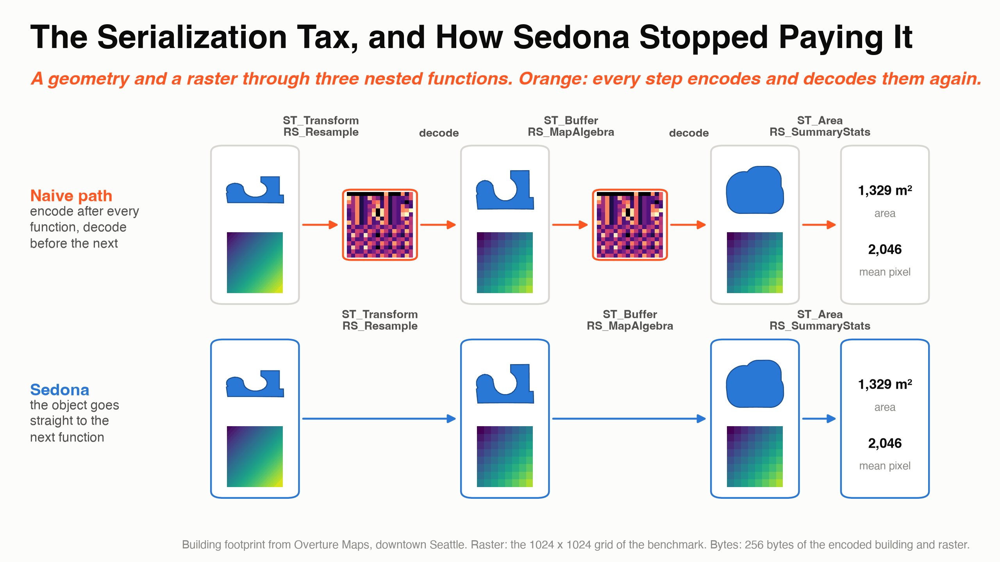

---
date:
  created: 2026-09-25
links:
  - "SEDONA-231: Redundant Serde Elimination": https://github.com/apache/sedona/pull/792
  - Map algebra in Sedona: https://sedona.apache.org/latest/api/sql/Raster-Map-Algebra-Operators/RS_MapAlgebra/
  - Sedona Python setup: https://sedona.apache.org/latest/setup/install-python/
authors:
  - jia
title: "The Serialization Tax, and How Sedona Stopped Paying It"
slug: the-serialization-tax-and-how-sedona-stopped-paying-it
---

# The Serialization Tax, and How Sedona Stopped Paying It

Transform a building footprint to a projected coordinate system, buffer it by ten meters, then calculate its area. Three spatial operations, written as one SQL expression. There is also work hidden between those operations: converting each intermediate geometry to bytes, only for the next function to turn it back into an object.

Apache Sedona avoids those conversions by passing objects directly between functions that support it. The mechanism is small, and its effect depends on the workload. The measurements below show where it matters, where other work dominates, and what interrupts it.



<!-- more -->

## The work between the functions

Sedona stores a geometry in a row as bytes, in its own binary format. Spatial functions such as `ST_Buffer` work on geometry objects. Reading a stored geometry therefore requires deserialization: decoding the bytes into an object. Returning a geometry to a row requires serialization: encoding the object as bytes again. For a raster, the serialized form includes its metadata and every pixel.

Consider the building query:

```sql
SELECT SUM(ST_Area(ST_Buffer(ST_Transform(geometry, 'EPSG:4326', 'EPSG:32610'), 10)))
FROM buildings
```

If each function returns its result through the row, `ST_Transform` decodes the input and encodes the transformed geometry. `ST_Buffer` decodes that geometry and encodes the buffer. `ST_Area` decodes it once more to calculate a number.

That is three geometry decodes and two encodes per building. Only the first decode is needed to read the input. The two intermediate round trips do no spatial work. They are the serialization tax. In a raster chain, the same pattern encodes and decodes large pixel arrays again and again.

## Pass the object to the next function

Sedona gives expressions a way to return their result before it is serialized. The interface is a Scala trait called `SerdeAware`:

```scala
trait SerdeAware {
  def evalWithoutSerialization(input: InternalRow): Any
}
```

Many Sedona scalar functions inherit this interface through `InferredExpression`. When a function reads a geometry argument, it checks whether the child expression implements `SerdeAware`. If so, it requests the geometry object directly. Otherwise, it evaluates the child normally and decodes the result:

```scala
def toGeometry(input: InternalRow): Geometry = {
  if (inputExpression.isInstanceOf[SerdeAware]) {
    inputExpression.asInstanceOf[SerdeAware].evalWithoutSerialization(input).asInstanceOf[Geometry]
  } else {
    inputExpression.eval(input).asInstanceOf[Array[Byte]] match {
      case binary: Array[Byte] => GeometrySerializer.deserialize(binary)
      case _ => null
    }
  }
}
```

In the building query, `ST_Transform` decodes the stored geometry once. It passes its result to `ST_Buffer`, which passes its result to `ST_Area`. There are no intermediate geometry encodes or decodes, and the final result is a number. If the outermost function returns a geometry instead, Sedona serializes that final geometry for the row.

The same mechanism supports raster, geography, and box arguments. For example, `RS_MapAlgebra(RS_Resample(raster, ...), ...)` receives the resampled raster without an intermediate serialization of its pixels. Each function still does its own pixel work.

The geometry optimization shipped in Sedona 1.4.0 through [SEDONA-231](https://github.com/apache/sedona/pull/792). Raster support followed in 1.4.1 through [SEDONA-270](https://github.com/apache/sedona/pull/810). It applies on its own wherever both expressions support the path.

## Put the round trips back and measure

The comparison runs the same spatial operations twice, with and without an expression inserted between them. An `IF` expression does not implement `SerdeAware`, so it makes the inner function serialize its result and the outer function deserialize it.

For these records, `IF(length(id) >= 0, x, NULL)` always returns `x`, because every ID is a non-null string. The condition survived in the optimized plans, and the aggregate results matched with and without it. That check matters: a condition the optimizer removes would no longer force the round trip.

??? example "The nested query, the barriers, and a control"

    ```sql
    -- nested: one decode, no intermediate encode
    SELECT SUM(ST_Area(ST_Buffer(ST_Transform(geometry, 'EPSG:4326', 'EPSG:32610'), 10)))
    FROM buildings;

    -- barriers between spatial functions: force intermediate serialization
    SELECT SUM(ST_Area(IF(length(id) >= 0,
                  ST_Buffer(IF(length(id) >= 0,
                    ST_Transform(geometry, 'EPSG:4326', 'EPSG:32610'), NULL), 10), NULL)))
    FROM buildings;

    -- control: add a condition around the numeric result, preserving object passing
    SELECT SUM(IF(length(id) >= 0,
                  ST_Area(ST_Buffer(ST_Transform(geometry, 'EPSG:4326', 'EPSG:32610'), 10)), NULL))
    FROM buildings;
    ```

The tests used Sedona 1.9.1 on Spark 3.5.4, with `local[8]`, 14 GB of driver memory, and inputs repartitioned to 64 partitions and cached before timing. The datasets were 3.82 million buildings in Washington State, 39 Washington county geometries repeated 2,000 times to make 78,000 rows, and 256 generated rasters of 1024 by 1024 pixels. The buildings and county boundaries came from Overture Maps release `2026-08-19.0`. The chart reports the fastest of three runs for each query.


*Percentages show the extra runtime of the barrier query relative to the nested query: `(barrier / nested - 1) × 100`. Function chains in the chart omit arguments for readability.*

The largest relative difference came from inexpensive coordinate operations. Flipping coordinates, reversing their order, translating them, and counting points took **0.69 seconds with direct nesting and 1.24 seconds with barriers** on the buildings. The barrier version took about 80% longer. Seen from the other side, the nested version used about 44% less time. The two percentages have different baselines: 80% is the extra time of the barrier version, and 44% is the time the nested version saves.

That chain, as executed:

```sql
ST_NPoints(ST_Translate(ST_Reverse(ST_FlipCoordinates(geometry)), 1.0, 1.0))
```

On the replicated county geometries, the same chain took 1.24 seconds nested and 1.63 seconds with barriers, a 31% increase. These inputs averaged about 1,722 vertices per geometry, compared with about eight for the buildings.

When the spatial work was more expensive, the relative difference was smaller. The transform-buffer-area query took 17.48 seconds nested and 17.96 seconds with barriers, a 3% gap, smaller than the variation between runs. A five-function chain that also simplified the transformed geometry and took the buffered result's convex hull took 27.87 versus 33.04 seconds, a 19% increase. Resampling the rasters, applying map algebra, and calculating summary statistics took 4.47 versus 4.81 seconds, an 8% increase.

These are end-to-end comparisons of two query plans, and the barriers add their own condition evaluation. The control query, with one condition around the final number, took 20.09 seconds, and its raster twin took 4.89 seconds. With three runs per query, the small differences sit inside the noise, and none of the results isolates the serialization cost on its own. What they show is where skipping the conversions matters most: chains of inexpensive spatial operations.

## Where the chain breaks

Direct object passing depends on the expression tree that runs after optimization. A parent must use the object-aware argument path, and its child must implement `SerdeAware`. Serialization returns at boundaries such as:

- an intervening expression such as `IF` or `CASE` that remains after optimization and does not support object passing;
- a Python UDF, which sends the bytes to a Python worker and back;
- a spatial intermediate result materialized in a table, a cache, or a shuffle.

Naming an intermediate column does not by itself create a boundary. In the tested DataFrame query, three `withColumn` calls followed by an aggregation collapsed into one projection, `ST_Area` directly over `ST_Buffer` directly over `ST_Transform`, the same tree as the nested SQL. When it matters, inspect the optimized plan. Separate calls alone do not show whether an intermediate result is materialized.

## Keep intermediate results inside the expression

Compose spatial functions in one expression and Sedona keeps the intermediate geometries and rasters as objects. There is no setting to enable. The question that matters is whether each result can pass directly to the next function or must be serialized at a boundary. Avoid boundaries you do not need, above all in chains of inexpensive operations, where the conversion is a large share of the work.
