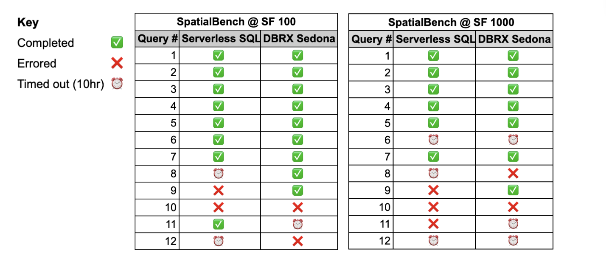

---
date:
  created: 2026-01-08
links:
  - SpatialBench: https://sedona.apache.org/spatialbench/
authors:
  - jia
  - james
title: "Spatial Query Benchmarking on Databricks with SpatialBench"
slug: spatial-query-benchmarking-databricks
---

<!--
# Licensed to the Apache Software Foundation (ASF) under one
# or more contributor license agreements.  See the NOTICE file
# distributed with this work for additional information
# regarding copyright ownership.  The ASF licenses this file
# to you under the Apache License, Version 2.0 (the
# "License"); you may not use this file except in compliance
# with the License.  You may obtain a copy of the License at
#
#   http://www.apache.org/licenses/LICENSE-2.0
#
# Unless required by applicable law or agreed to in writing,
# software distributed under the License is distributed on an
# "AS IS" BASIS, WITHOUT WARRANTIES OR CONDITIONS OF ANY
# KIND, either express or implied.  See the License for the
# specific language governing permissions and limitations
# under the License.
-->

[Recently Databricks announced](https://www.databricks.com/blog/databricks-spatial-joins-now-17x-faster-out-box) that Serverless SQL users "will see up to 17x faster performance compared to classic clusters with Apache Sedona installed." Unfortunately, Databricks didn’t speak to the cost of the results. It is also an apples-to-oranges comparison because the serverless compute shape and quantity that Databricks deployed to generate the 17x performance difference was not shared. Their result was also limited to specific query configurations.

We saw an opportunity to address these issues using [SpatialBench](https://sedona.apache.org/spatialbench/), a new benchmarking framework for spatial queries. Because we are comparing different infrastructure types, our benchmark normalizes on price-performance rather than performance alone, while providing what we believe is a more comprehensive benchmarking result.

We found that only one of the simpler SpatialBench queries (\#2) tested on Databricks SQL Serverless had price-performance aligned with the Databricks claim. However, we found that Sedona excelled in most other queries, delivering up to 6x better price-performance, while offering more query coverage.

<!-- more -->

You can see these results in the graph below, which represents a price-performance measurement normalized to the Sedona configuration (1x) on Databricks Jobs clusters and compares this to Serverless SQL using SpatialBench at a scale factor of 1000. We’ll dive into how these results were produced and share other results as well. Some queries are missing data points because those queries didn’t finish or errored out given the configuration and guardrails we used.

## What is SpatialBench?

SpatialBench exists because before it, spatial query standards didn’t exist. SpatialBench provides users with a consistent way to compare spatial query capability, cost, and performance across analytics engines. It provides a spatial data generator for multiple scale factors (SF 100, 1000, etc.) and real-world spatial queries to comprehensively measure query cost across a wide spectrum of query complexity. It makes benchmarking easy, fair, open, and convenient, and we encourage contribution in the open.

The SpatialBench framework has 12 queries ordered in terms of computational complexity: query 1 is the least complex query, and query 12 is the most complex query. Here’s a high level description of those queries. You can go to the [SpatialBench page](https://sedona.apache.org/spatialbench/) to dive further into each.

| Query \# | SpatialBench Query Description       |
|:--------:|:------------------------------------:|
| 1        | Spatial filter, aggregation, sorting |
| 2        | Spatial filter, aggregation, sorting |
| 3        | Spatial filter, aggregation, sorting |
| 4        | Spatial join and aggregation         |
| 5        | Spatial aggregation                  |
| 6        | Spatial join                         |
| 7        | Geometry construction and access     |
| 8        | Distance join                        |
| 9        | Polygon self spatial join            |
| 10       | Spatial left join                    |
| 11       | Multi-way spatial join               |
| 12       | KNN join                             |

## How to use SpatialBench on serverless and cluster-based engines

If you are using SpatialBench to compare the spatial query performance across cluster-based engines like Amazon EMR and Databricks Classic Jobs Compute, you may set up both such that the underlying compute configuration is equal across platforms, then measure performance. But, when you are benchmarking with a serverless engine this gets trickier because you don’t know the shape and quantity of compute under the hood. There could be 20x more cores and you wouldn’t know it\!

Here’s how to handle this scenario and others:

1. **Normalize on price-performance**: Because serverless architectures obscure the underlying hardware, direct performance comparisons are often misleading. To ensure a fair comparison, benchmarks should focus on the cost per query. In our charts we take cost per query one step further by normalizing to Sedona's cost for each query to 1, then compute Serverless SQL cost per query as a multiple of Sedona. You can choose to perform this in the other direction as well.
2. **Test it yourself with your own setup:** The queries you have in production or want to put into production are unlikely to match the benchmarking query or data being tested, and these results are no exception. Therefore, guarantees that users *will see* certain results should be loosely held. You may also see a degradation in price-performance, or a much better result\!
3. **Evaluate scale and innovation costs:** Cost-based benchmarking is useful when you have known queries you are looking to optimize or you are starting to evaluate a platform and want to use this for directional guidance. You should compare capability to support scale or innovation you may not know how to measure for just yet. This requires evaluating an engine using queries at scale that you may need in the future. If you’re selecting a query engine based only on what it can do now, the cost of restricted innovation in the future may be drastically higher than what you’re seeing in a cost-based benchmark.

Benchmarking results, including this one, are intended to point you in a direction and support your own analysis. There’s bias you need to navigate as well, and we are doing our best to mitigate this with transparency and use of an open and comprehensive benchmarking process. In the end, you should always run your own queries with your own data, to build your own apples-to-apples comparisons across query engines.

## Benchmarking Configurations

### Classic Databricks Jobs Sedona Configuration

* Apache Sedona v1.7 on Databricks DBR 16.4 with Classic Jobs Compute
* 18 m7i.2xlarge workers \+ 1 driver, 32GB GENERAL\_PURPOSE\_SSD. We used general purpose VMs because they are one of the most common types of VMs used with Sedona on AWS.
* Cost measurement: (EC2 and EBS on-demand hourly infra costs \+ Databricks DBU hourly costs) \* (query run duration in hrs)
* 10-hour query timeout

### Serverless SQL

* Databricks Serverless SQL Configuration: Medium
* Cost measurement: (Query run duration in hrs) \* ([24 DBUs/hr or $16.80/hr](https://www.databricks.com/product/pricing/product-pricing/instance-types))
* 10-hour query timeout

### Queries Executed

For each configuration, we executed all 12 SpatialBench queries across scale factors (SF) of 100 and 1000, where SF1000 is 10x larger in data scale than SF100 and takes around 500GB storage in uncompressed Parquet format.

## Benchmarking Result: Capability

Neither option finished all queries within the 10-hour timeout, and some queries errored before the timeout threshold was met. "DBRX Sedona" \= "Classic Databricks Jobs Sedona Configuration" used in this benchmark.

## Benchmarking Result: Price-Performance

The following shows query price-performance normalized against the results of Sedona (1x baseline) at both SF100 and SF1000. Missing data points match the capability matrices above, where only price-performance is shown for queries that finished. Lower is better.

### SpatialBench @ SF100: Actual Cost per Query

| SpatialBench @ SF100 |  |  |
|:--------:|:--------------:|:------------------------------:|
| Query \# | Serverless SQL | Classic DBRX Jobs w/Sedona 1.7 |
| 1        | $0.12          | $0.13                          |
| 2        | $0.14          | $2.17                          |
| 3        | $0.15          | $0.08                          |
| 4        | $0.33          | $0.16                          |
| 5        | $1.18          | $0.23                          |
| 6        | $0.35          | $1.05                          |
| 7        | $0.61          | $0.16                          |
| 8        | DNF            | $0.30                          |
| 9        | DNF            | $0.17                          |
| 10       | DNF            | DNF                            |
| 11       | $22.00         | DNF                            |
| 12       | DNF            | DNF                            |

\* In SpatialBench @ SF100, Query 11 finished in \~78 min on Serverless SQL.

### SpatialBench @ SF1000: Actual Cost per Query

| SpatialBench @ SF1000 |  |  |
|:--------:|:--------------:|:------------------------------:|
| Query \# | Serverless SQL | Classic DBRX Jobs w/Sedona 1.7 |
| 1        | $1.27          | $0.44                          |
| 2        | $0.41          | $17.20                         |
| 3        | $1.80          | $0.28                          |
| 4        | $0.84          | $0.40                          |
| 5        | $10.39         | $3.40                          |
| 6        | DNF            | DNF                            |
| 7        | $4.07          | $1.28                          |
| 8        | DNF            | DNF                            |
| 9        | DNF            | $0.15                          |
| 10       | DNF            | DNF                            |
| 11       | DNF            | DNF                            |
| 12       | DNF            | DNF                            |

## Conclusion and Next Steps

SpatialBench provides a repeatable standard for measuring and communicating spatial query performance across engines, and we showed its utility by measuring spatial query performance using two different processing engines on Databricks. Based on the configuration and benchmarking method we used with SpatialBench, Databricks Serverless SQL delivers great price-performance for spatial query 2 for both SF100 and SF1000, and query 6 at SF100. However, the Sedona configuration can deliver up to 6x better price-performance and offers support for more queries.

If you want to utilize these benchmarking results verbatim, we recommend that you map your existing queries to the SpatialBench queries to support your decision making.

Apache Sedona 1.8.1 will be available soon which includes support for Spark 4.0 and the latest DBR runtimes. Once it's live, we will extend and share the same benchmark for Sedona 1.8.1 on the latest stable DBR version that supports Spark 4.0.
