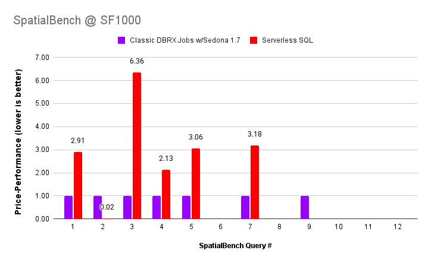
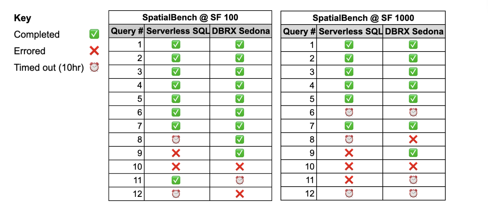
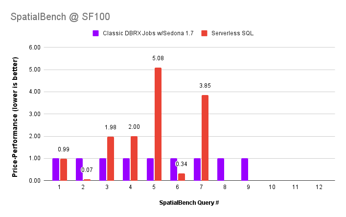

---
date:
  created: 2026-01-08
links:
  - SpatialBench: https://sedona.apache.org/spatialbench/
authors:
  - jia
  - james
  - pranav
title: "使用 SpatialBench 在 Databricks 上进行空间查询基准测试"
slug: spatial-query-benchmarking-databricks
---

<!--
# Licensed to the Apache Software Foundation (ASF) under one
# or more contributor license agreements.  See the NOTICE file
# distributed with this work for additional information
# regarding copyright ownership.  The ASF licenses this file
# to you under the Apache License, Version 2.0 (the
# "License"); you may not use this file except in compliance
# with the License.  You may obtain a copy of the License at
#
#   http://www.apache.org/licenses/LICENSE-2.0
#
# Unless required by applicable law or agreed to in writing,
# software distributed under the License is distributed on an
# "AS IS" BASIS, WITHOUT WARRANTIES OR CONDITIONS OF ANY
# KIND, either express or implied.  See the License for the
# specific language governing permissions and limitations
# under the License.
-->

[Databricks 最近宣布](https://www.databricks.com/blog/databricks-spatial-joins-now-17x-faster-out-box) Serverless SQL 用户"相比安装了 Apache Sedona 的经典集群,可获得高达 17 倍的性能提升"。遗憾的是,Databricks 并未提及结果的成本。这同时也是一次"苹果对橘子"的比较——Databricks 用来制造这 17 倍性能差距的 Serverless 计算形态与数量从未对外披露。其结果也仅限于特定的查询配置。

我们看到可以借助 [SpatialBench](https://sedona.apache.org/spatialbench/)——一个面向空间查询的全新基准测试框架——来解决这些问题。由于我们要对比不同类型的基础设施,我们的基准测试以性价比(price-performance)而非单纯性能为归一化标准,同时提供我们认为更全面的基准测试结果。

我们发现,在 Databricks SQL Serverless 上测试时,只有一条较简单的 SpatialBench 查询(\#2)的性价比与 Databricks 的说法一致。而在大多数其他查询上,Sedona 表现优秀,在覆盖更多查询的同时,性价比最高可达 6 倍。

<!-- more -->

下图展示了这些结果。图中将性价比归一化到 Databricks Jobs 集群上的 Sedona 配置(1x),并与 Serverless SQL 在 SpatialBench 规模因子 1000 下的结果进行比较。我们将深入说明这些结果是如何得到的,并分享其他结果。某些查询缺少数据点,是因为在我们使用的配置和限制下,这些查询未能完成或报错。

## 什么是 SpatialBench?

SpatialBench 之所以存在,是因为在它之前,空间查询并没有统一标准。SpatialBench 为用户提供了一种跨分析引擎一致地比较空间查询能力、成本与性能的方法。它提供面向多种规模因子(SF 100、1000 等)的空间数据生成器以及真实世界的空间查询,在广泛的查询复杂度范围内全面衡量查询成本。它让基准测试简单、公平、开放、便捷,我们鼓励大家参与开源贡献。

SpatialBench 框架包含 12 条按计算复杂度排序的查询:查询 1 最简单,查询 12 最复杂。下面是这些查询的概要描述。更多细节请访问 [SpatialBench 页面](https://sedona.apache.org/spatialbench/)。

| 查询 \#  | SpatialBench 查询描述              |
|:--------:|:------------------------------------:|
| 1        | 空间过滤、聚合、排序                |
| 2        | 空间过滤、聚合、排序                |
| 3        | 空间过滤、聚合、排序                |
| 4        | 空间连接与聚合                      |
| 5        | 空间聚合                            |
| 6        | 空间连接                            |
| 7        | 几何构造与访问                      |
| 8        | 距离连接                            |
| 9        | 多边形自连接                        |
| 10       | 空间左连接                          |
| 11       | 多路空间连接                        |
| 12       | KNN 连接                            |

## 如何在 Serverless 与基于集群的引擎上使用 SpatialBench

如果你用 SpatialBench 比较基于集群的引擎(例如 Amazon EMR 与 Databricks Classic Jobs Compute)之间的空间查询性能,可以将两边的底层计算配置设置为相同,然后衡量性能。但如果是在 Serverless 引擎上进行基准测试,事情就变得复杂,因为你并不知道底层计算的形态和数量。底层 CPU 核心可能多出 20 倍,你也无从得知!

下面介绍如何处理这种以及其他情形:

1. **以性价比归一化**:由于 Serverless 架构隐藏了底层硬件,直接的性能比较往往具有误导性。为了进行公平比较,基准测试应关注单次查询成本。在我们的图表中,我们更进一步——将每条查询的 Sedona 成本归一化为 1,然后将 Serverless SQL 单次查询的成本表示为 Sedona 的倍数。当然,你也可以反向操作。
2. **用你自己的环境亲自测试**:你在生产中已有或计划上线的查询不太可能与基准测试所用的查询或数据完全一致,这些结果也不例外。因此,对于"你将看到这样的结果"这类保证应当谨慎对待。你也可能看到性价比下降,或者明显更好的结果\!
3. **评估可扩展性与创新成本**:在你有已知查询需要优化、或刚开始评估一个平台并希望获得方向性参考时,基于成本的基准测试很有用。你应当对比平台支持你尚未知如何衡量的可扩展性或创新能力。这需要使用未来可能用到的、在大规模下运行的查询来评估引擎。如果只根据当下能力来选型,未来在创新上的受限成本可能远高于成本基准中所见到的数字。

包括本文在内的基准测试结果,旨在为你提供方向并支持你自己的分析。其中也存在你需要警觉的偏差,我们正尽力以透明的方式、并采用开放且全面的基准测试流程来减轻这种偏差。最终,你应始终使用自己的查询和数据,基于公平的"苹果对苹果"的比较,亲自评估不同查询引擎。

## 基准测试配置

### Classic Databricks Jobs Sedona 配置

* Databricks DBR 16.4、Classic Jobs Compute 上的 Apache Sedona v1.7
* 18 个 m7i.2xlarge worker \+ 1 个 driver,32GB GENERAL\_PURPOSE\_SSD。我们选用通用型 VM,因为在 AWS 上它们是与 Sedona 一起使用最常见的 VM 类型之一。
* 成本计量:(EC2 与 EBS 按需小时基础设施成本 \+ Databricks DBU 小时成本) \* (查询运行时长(小时))
* 10 小时查询超时

### Serverless SQL

* Databricks Serverless SQL 配置:Medium
* 成本计量:(查询运行时长(小时)) \* ([24 DBUs/hr 或 $16.80/hr](https://www.databricks.com/product/pricing/product-pricing/instance-types))
* 10 小时查询超时

### 执行的查询

对每种配置,我们在规模因子(SF)100 和 1000 下执行了全部 12 条 SpatialBench 查询,其中 SF1000 的数据规模是 SF100 的 10 倍,在未压缩 Parquet 格式下约占用 500GB 存储。

## 基准测试结果:能力

两种方案都未能在 10 小时超时内完成所有查询,部分查询甚至在超时前就报错。"DBRX Sedona" \= 本次基准测试所用的"Classic Databricks Jobs Sedona 配置"。

## 基准测试结果:性价比

下图展示了 SF100 和 SF1000 下,各查询相对于 Sedona(1x 基线)归一化的性价比。缺失的数据点与上面的能力矩阵一致——只展示完成了的查询的性价比。数值越低越好。

### SpatialBench @ SF100:每条查询的实际成本

| SpatialBench @ SF100 |  |  |
|:--------:|:--------------:|:------------------------------:|
| 查询 \# | Serverless SQL | Classic DBRX Jobs w/Sedona 1.7 |
| 1        | $0.12          | $0.13                          |
| 2        | $0.14          | $2.17                          |
| 3        | $0.15          | $0.08                          |
| 4        | $0.33          | $0.16                          |
| 5        | $1.18          | $0.23                          |
| 6        | $0.35          | $1.05                          |
| 7        | $0.61          | $0.16                          |
| 8        | DNF            | $0.30                          |
| 9        | DNF            | $0.17                          |
| 10       | DNF            | DNF                            |
| 11       | $22.00         | DNF                            |
| 12       | DNF            | DNF                            |

\* 在 SpatialBench @ SF100 中,Query 11 在 Serverless SQL 上耗时约 78 分钟完成。

### SpatialBench @ SF1000:每条查询的实际成本

| SpatialBench @ SF1000 |  |  |
|:--------:|:--------------:|:------------------------------:|
| 查询 \# | Serverless SQL | Classic DBRX Jobs w/Sedona 1.7 |
| 1        | $1.27          | $0.44                          |
| 2        | $0.41          | $17.20                         |
| 3        | $1.80          | $0.28                          |
| 4        | $0.84          | $0.40                          |
| 5        | $10.39         | $3.40                          |
| 6        | DNF            | DNF                            |
| 7        | $4.07          | $1.28                          |
| 8        | DNF            | DNF                            |
| 9        | DNF            | $0.15                          |
| 10       | DNF            | DNF                            |
| 11       | DNF            | DNF                            |
| 12       | DNF            | DNF                            |

## 结论与下一步

SpatialBench 为衡量与传达跨引擎空间查询性能提供了可重复的标准。我们通过测量 Databricks 上两种不同处理引擎的空间查询性能展示了它的实用性。基于我们与 SpatialBench 一起使用的配置和基准测试方法,Databricks Serverless SQL 在 SF100 和 SF1000 下的空间查询 2,以及 SF100 下的查询 6 上,都提供了出色的性价比。然而,Sedona 配置的性价比可高达 6 倍,且支持的查询更多。

如果你打算直接套用这些基准测试结果,我们建议你将自己现有的查询与 SpatialBench 查询进行映射,以辅助决策。

Apache Sedona 1.8.1 即将发布,将支持 Spark 4.0 和最新的 DBR 运行时。一旦发布,我们将在支持 Spark 4.0 的最新稳定版 DBR 上对 Sedona 1.8.1 扩展并分享同样的基准测试。
