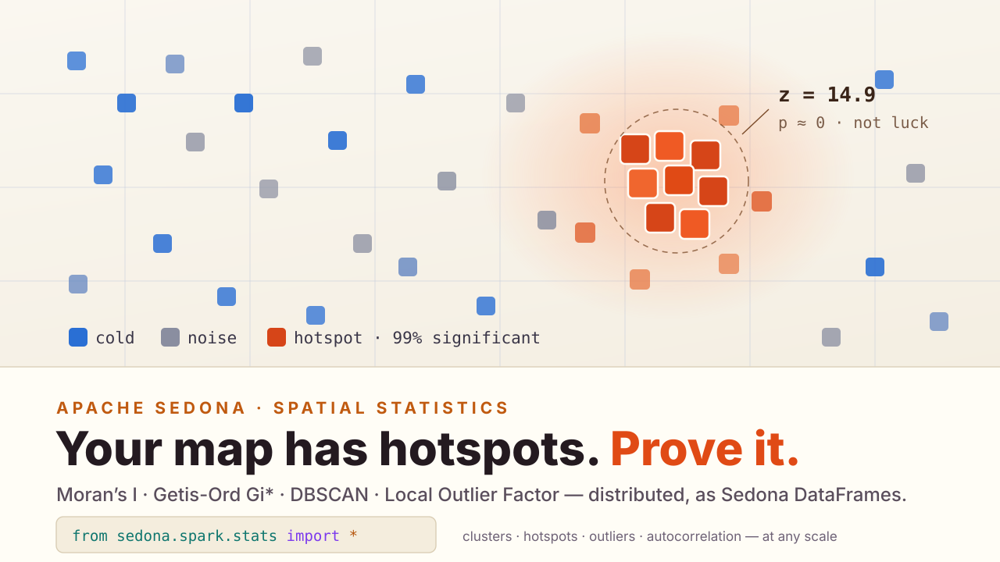
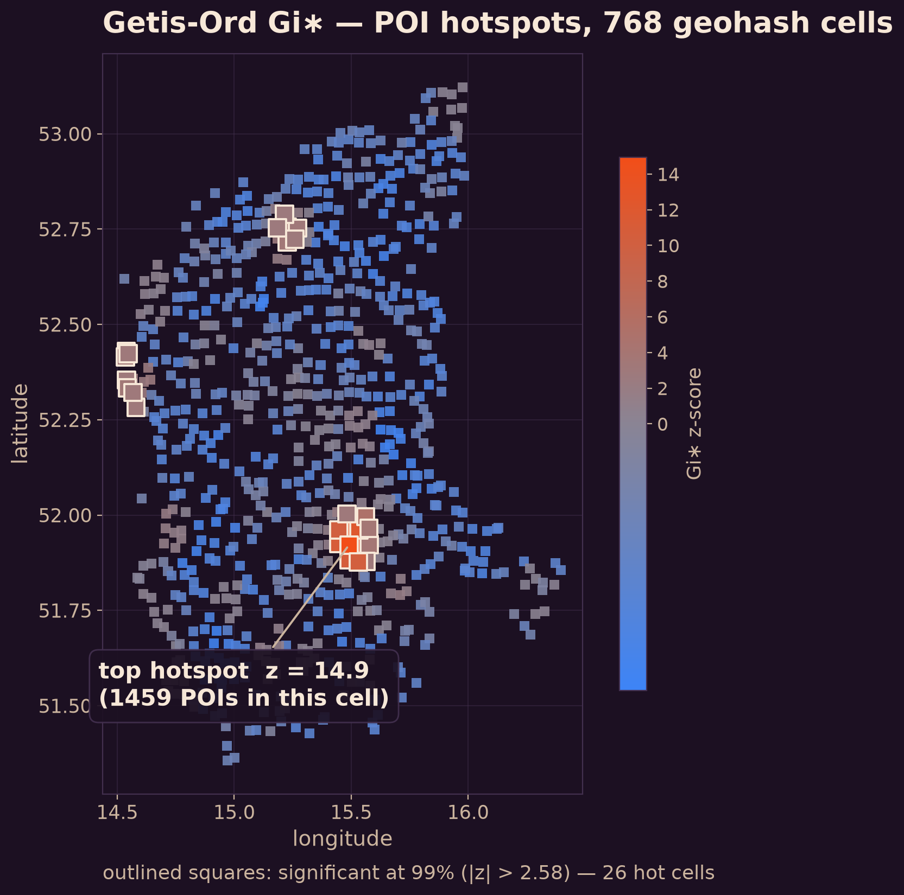
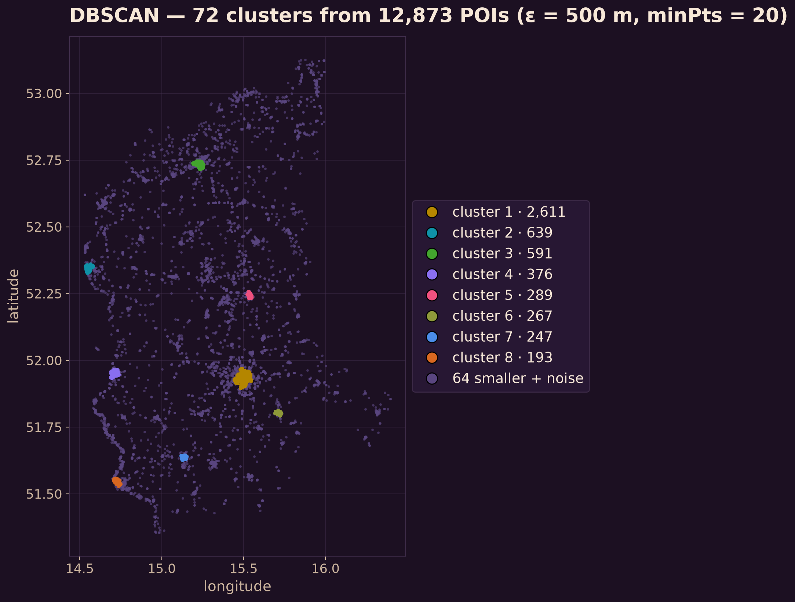
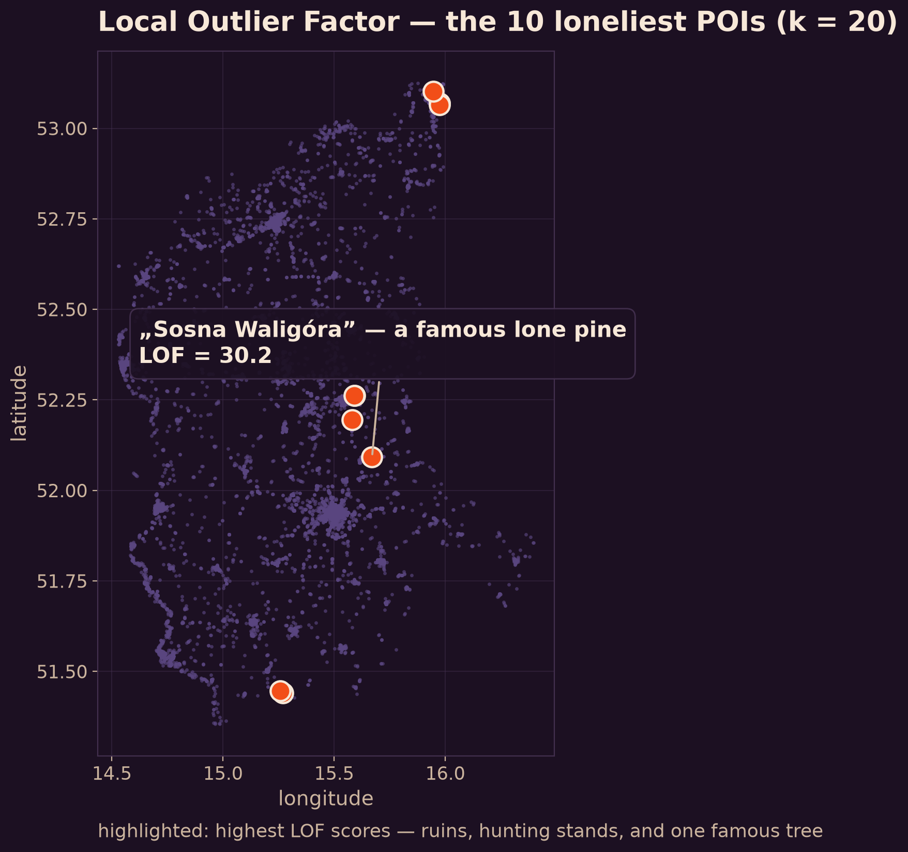

---
date:
  created: 2026-07-31
links:
  - Stats API reference: https://sedona.apache.org/latest/api/stats/sql/
  - Clustering concepts: https://sedona.apache.org/latest/tutorial/concepts/clustering-algorithms/
authors:
  - jia
title: "Your Map Has Hotspots. Prove It."
---

# Your Map Has Hotspots. Prove It.

Anyone can look at a map and see clumps. The interesting questions are the ones eyeballing can't answer: is that clustering *statistically real*? Exactly *where* is it significant? And which points genuinely don't belong?



<!-- more -->

Sedona ships a spatial statistics module — `sedona.stats` — that answers those questions as DataFrame operations: **Moran's I** for global autocorrelation, **Getis-Ord Gi\*** for hotspot significance, **DBSCAN** for density clustering, and **Local Outlier Factor** for spatial anomalies. The classic exploratory-spatial-analysis toolkit, running distributed.

This post works through all four as one investigation, on a dataset that ships in the Sedona repo: **12,873 OpenStreetMap points of interest** from western Poland's Lubusz region. (Poland is the home country of Sedona PMC member Pawel — which is how a slice of it became the project's sample data.) Loaded straight from the bundled shapefile:

```python
from sedona.spark import SedonaContext

sedona = SedonaContext.create(SedonaContext.builder().master("local[*]").getOrCreate())
sedona.sparkContext.setCheckpointDir("/tmp/sedona-ckpt")

pois = sedona.read.format("shapefile").load("docs/usecases/data")
pois.createOrReplaceTempView("pois")
```

Benches, tourist info, shops, restaurants, memorials — everyday map furniture. Four questions, four functions.

## 1. Is anything actually clustered? — Moran's I

Before hunting for hotspots, ask whether the data has *any* spatial structure. Moran's I is the one-number answer: near +1 means similar values cluster together, near 0 means spatial noise. We aggregate the points onto a geohash grid and test the counts:

```python
from sedona.spark.stats.weighting import add_binary_distance_band_column
from sedona.spark.stats.autocorrelation.moran import Moran

cells = sedona.sql("""
    SELECT ST_GeoHash(geometry, 5)                        AS id,
           CAST(COUNT(*) AS DOUBLE)                       AS poi_count,
           ST_Centroid(ST_Envelope_Aggr(geometry))        AS geometry
    FROM pois GROUP BY ST_GeoHash(geometry, 5)
""")

weighted = add_binary_distance_band_column(
    cells, 0.08, include_self=False, saved_attributes=["id", "poi_count"]
)
result = Moran.get_global(weighted, value_column="poi_count", id_column="id")
```

```
I = 0.2519    z = 12.69    p ≈ 0.000000
```

A z-score of **12.7**. The clumping you'd see by eye is not an accident of sampling — there is real spatial structure here. Now we're allowed to ask *where*.

## 2. Where, exactly? — Getis-Ord Gi*

Gi\* gives every cell a z-score against its neighborhood: significantly hot, significantly cold, or unremarkable. The neighborhood comes from the same distance-band weighting; `star=True` includes each cell in its own neighborhood (the Gi\* variant):

```python
from sedona.spark.stats.hotspot_detection.getis_ord import g_local

weighted = add_binary_distance_band_column(
    cells, 0.08, include_self=True, saved_attributes=["id", "poi_count"]
)
hot = g_local(weighted, "poi_count", star=True)
hot.orderBy("Z", ascending=False).show(3)
```

```
+-----+---------+-------+-----+---+
|id   |poi_count|G      |Z    |P  |
+-----+---------+-------+-----+---+
|u35p2|1459.0   |0.2347 |14.94|0.0|
|u35p8|380.0    |0.2299 |12.94|0.0|
|u35p3|556.0    |0.224  |12.59|0.0|
+-----+---------+-------+-----+---+
```



Of 768 cells, **26 are significant hotspots at the 99% level** (z > 2.58) — and they concentrate in one glowing patch, the region's biggest city, with the top cell at **z = 14.9**. Not "this looks busy," but *this is a hotspot with p ≈ 0*.

## 3. What are the groupings? — DBSCAN

Hotspots test a value on a grid; DBSCAN works on the raw points — it finds arbitrarily-shaped dense groups and labels everything too sparse as noise. Distances here are real meters on the spheroid:

```python
from sedona.spark.stats.clustering.dbscan import dbscan

clustered = dbscan(pois, epsilon=500.0, min_pts=20, use_spheroid=True)
```



**72 clusters** emerge, and the largest — from 2,611 POIs down through 639, 591, 376, 289 — are the region's towns, discovered from point density alone. No boundary polygons were consulted; the settlement pattern simply falls out of `ST_DistanceSpheroid` and a minimum-points rule.

(DBSCAN builds a connectivity graph under the hood, so set a Spark checkpoint directory first — `sedona.sparkContext.setCheckpointDir(...)`, as in the setup above.)

## 4. Who doesn't belong? — Local Outlier Factor

The inverse question: which points are suspiciously *far* from their neighbors? LOF compares each point's local density to that of its k nearest neighbors — a score well above 1 means "much lonelier than the company it keeps":

```python
from sedona.spark.stats.outlier_detection.local_outlier_factor import (
    local_outlier_factor,
)

lof = local_outlier_factor(pois, k=20)
lof.orderBy("lof", ascending=False).select("fclass", "name", "lof").show(5)
```

```
+-------------+----------------+-----+
|fclass       |name            |lof  |
+-------------+----------------+-----+
|ruins        |                |35.44|
|hunting_stand|                |31.18|
|hunting_stand|                |30.67|
|attraction   |Sosna „Waligóra”|30.19|
|motel        |Motel Europa    |29.69|
+-------------+----------------+-----+
```



The algorithm has no idea what these features are — and it independently surfaced ruins in the forest, hunting stands, a roadside motel, and **Sosna Waligóra**: a celebrity pine near Sulechów with a six-metre waistline, long billed as the thickest in Poland, holding court entirely alone beside a country road. The detector's verdict, in effect: *this tree has no neighbors*. Correct — and when your outlier detector independently rediscovers a beloved national monument whose whole scene is standing alone, it's working.

## The same code at any scale

Everything above is a DataFrame in, a DataFrame out. The neighborhood weights are built with distributed distance joins, DBSCAN's connectivity resolves through connected components across partitions, and LOF's neighbor search rides Sedona's `ST_KNN` join — so the identical four snippets run on 12 thousand points from a bundled shapefile or on hundreds of millions of GPS pings on a cluster. No sampling step, no "export to a stats package," no single machine holding all the points.

So next time someone squints at a dot map and says "looks clustered" — prove it, with a z-score, at scale.

*API details for every function are in the [Sedona stats reference](https://sedona.apache.org/latest/api/stats/sql/).*
