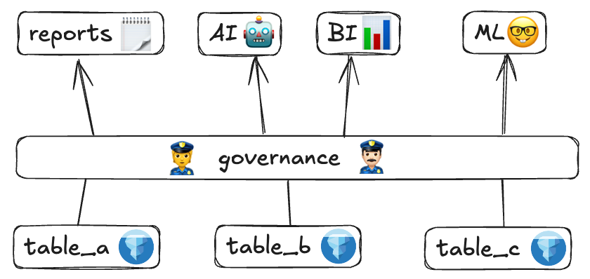

---
date:
  created: 2025-04-30
authors:

  - matt_powers
  - kelly

---

<<<<<<< HEAD
=======
<!--
 Licensed to the Apache Software Foundation (ASF) under one
 or more contributor license agreements.  See the NOTICE file
 distributed with this work for additional information
 regarding copyright ownership.  The ASF licenses this file
 to you under the Apache License, Version 2.0 (the
 "License"); you may not use this file except in compliance
 with the License.  You may obtain a copy of the License at

   http://www.apache.org/licenses/LICENSE-2.0

 Unless required by applicable law or agreed to in writing,
 software distributed under the License is distributed on an
 "AS IS" BASIS, WITHOUT WARRANTIES OR CONDITIONS OF ANY
 KIND, either express or implied.  See the License for the
 specific language governing permissions and limitations
 under the License.
 -->

>>>>>>> 14074d417b ([DOCS] putting metadata at top)
# Geospatial Data on Iceberg: The Lakehouse Advantage

This post delves into the benefits of Lakehouse architecture for spatial tables
and differentiate its approach from standard data warehouses and data lakes.

While spatial data requires different types of metadata and optimizations,
it doesn't require entirely different file formats.

Recent advancements, specifically the addition of native geometry/geography types to
Apache Parquet and the Apache Iceberg V3 specification, now enable the spatial data community
to fully integrate with and take advantage of Lakehouse architectures, overcoming previous
ecosystem fragmentation.
<!-- more -->

Many of the benefits that Lakehouses provide for tabular data also apply to spatial data, including:

* **Versioned data:** Lakehouses automatically track changes to spatial features over time, creating distinct versions ideal for historical analysis and auditing how geometries or attributes evolved.
* **Time travel:** This capability allows querying spatial data (like features, boundaries, or locations) exactly as that data existed at a specific prior time or version, crucial for reproducibility and auditing historical spatial relationships.
* **Schema enforcement:** Lakehouses enforce schemas to ensure spatial data consistency by guaranteeing correct geometry types and attribute formats, which improve data quality and query reliability.
* **Database Optimizations:** Techniques like geographic partitioning, data skipping using bounding boxes, and columnar storage accelerate spatial queries and improve storage efficiency within the Lakehouse.

## Data Lakehouse Architecture Overview

Lakehouse architectures use open table formats like Apache Iceberg, Delta Lake, or Hudi to manage data stored on underlying platforms like cloud object storage (e.g. Amazon S3, or Google Cloud Storage).

Tables in Lakehouses are governed by a catalog. These catalogs don't store files–files are stored in cloud object storage. Rather, catalogs maintain records of related metadata information, like names of available databases/tables, table schemas, historical information needed for features like time travel. The catalog enables tools like Apache Spark, Trino, and Apache Flink, to know the location of your table or its latest state–enabling accurate database queries and analysis.

Example Lakehouse catalogs include Databricks' Unity catalog and the open source Apache Polaris.

The catalogs allow for role-based access control (RBAC) at the tabular level and features like single-table transactions, which ensure that relevant changes to dependent tables are applied atomically and without manual intervention.

You can query tables in the Lakehouse Architecture for business intelligence (BI) reporting, data science, machine learning, and other complex analyses.



The Lakehouse Architecture offers several advantages:

* Data is stored in open formats, letting any engine can query it, avoiding vendor lock-in.
* Lakehouses support all the features familiar to data warehouses, like reliable transactions, Data Manipulation Language (DML) operations, and RBAC.
* Lakehouses are performant enough for low-latency applications like BI dashboards.
* Lakehouses are interoperable with proprietary tools like BigQuery, Redshift, or Esri.
* You can store Lakehouses in cloud-based storage systems without any additional charges.
* Lakehouses are compatible with any engine. You can use one engine for ingestion, another for ETL, and a third for Machine Learning. The architecture encourages using the best engine for the job.

## Lakehouses & spatial data

Earlier, we mentioned 2 important features of lakehouses: Single-table transactions and RBAC. Let's delve into how these 2 features can be beneficial for working with spatial data.

### Single-table transactions

**Scenario:** Imagine a retail company is closing a store in New Jersey. Let's assume that this company maintains 3 different tables: `stores` (containing point geometry), `sales_territories` (containing polygon geometry), and `sales_performance` (containing no geometry).

These tables are interdependent: The `store_id` field is in `stores` and `sales_territories` and `territory_id` is in `sales_territories` and `sales_performance`.

The `stores` table is indirectly linked to `sales_performance` via the `sales_territories` table.

**Impact:** With **single-table transactions**, as featured in many lakehouses, each update to an individual table is atomic (all-or-nothing). In the aforementioned scenario, when a store is closed:

The operation to update the store's status in the `stores` table is completed as one atomic transaction on that table.

Any corresponding changes to the `sales_territories` table (e.g., altering polygon boundaries or updating `store_id` associations) would be a separate atomic transaction on the `sales_territories` table.
Similarly, updates to the `sales_performance` table (e.g., adjusting sales targets linked to the `territory_id`) would be performed as an atomic transaction on that specific table.

This individual atomicity ensures that each table remains consistent after its specific update. For example, the `stores` table won't be left in a partially updated state.

To ensure data consistency across all three tables (`stores`, `sales_territories`, and `sales_performance`) for the entire
business operation of closing a store, these individual atomic operations on each table would typically be executed in sequence.

While single-table transactions don't automatically "package" these three distinct table updates into a single overarching transaction that
makes them all visible simultaneously (that would require multi-table transaction capabilities), they are foundational.

By ensuring each step is completed successfully and atomically, the overall process is far more reliable.

If an update to `sales_territories` were to fail, the `stores` table (from its preceding successful transaction) would remain consistent, and the `sales_territories` table would roll back its own failed changes, preventing corruption within that table.

Developers could implement application logic or an orchestration layer (like Apache Airflow) separately in order to manage
the overall consistency across tables, potentially by handling compensating transactions if a later step fails.

Now, let's see how Lakehouses differ from Data Lakes.

## Lakehouses vs. Data Lakes

In contrast, Data Lakes store data in files without a metadata layer, so they don't guarantee reliable transactions.

The following are a few examples of data lakes:

* GeoParquet files stored in AWS S3
* GeoJSON files stored in Azure Blob Storage
* CSV files with WKT geometry data stored in GCP

Generally, data lakes lack built-in mechanisms to coordinate atomic changes across multiple files or objects. As a result of this and other architectural limitations, data lakes do not support reliable single-table transactions.

Consequently, traditional data lakes present challenges for common data tasks: they struggle to efficiently execute developer-centric operations like `DELETE` and `MERGE`; modifying datasets often requires downtime to maintain consistency during file rewrites; and they typically lack the sophisticated performance optimizations (like advanced indexing) found in more performant database systems.

The Lakehouse metadata layer is relatively small, so the storage costs for a Lakehouse and a data lake are about the same. However, Lakehouses allow for better performance, so compute expenses can be generally lower than those of a data lake.

## Lakehouses vs. Data Warehouses

A Data Warehouse is an analytics system typically powered by a proprietary engine with similarly proprietary file formats. However, due to many modern customers wanting to avoid vendor-lock-in via a proprietary file format, data warehouses also began supporting Lakehouse Storage Systems in addition to proprietary file formats.

Still, data warehouses generally exhibit the following limitations:

* Pricing models frequently package storage and compute, requiring users to pay for more compute even if they only need more storage.
* Storing data in proprietary file formats limits compatibility with other engines.
* Querying data stored in open file formats **can result** in slower performance compared to proprietary formats. Performance can suffer in shared compute environments when resource-intensive queries from one user impact others.

Many modern enterprises prefer the Lakehouse architecture because it's vendor-neutral, low-cost, and open–compatible with any engine that builds a connector.

In the next section, we'll discuss how to create tables with Iceberg.

## Creating tables with Iceberg

The following code sample demonstrates how to create and populate an Iceberg table within a Lakehouse. In this example, we'll create a `customers` table with `id` and `first_name columns:

```py
CREATE TABLE local.db.customers (id string, first_name string)
USING iceberg
TBLPROPERTIES('format-version'='3');
```

Next, let's append some data to the table:

```py
df = sedona.createDataFrame([
    ("a", "Bob"),
    ("b", "Mary"),
    ("c", "Sue"),
], ["id", "first_name"])

df.write.format("iceberg").mode("append").saveAsTable("local.db.customers")
```

Finally, run a query on the `customers` table:

```py
sedona.table("local.db.customers").show()

+---+----------+
| id|first_name|
+---+----------+
|  a|       Bob|
|  b|      Mary|
|  c|       Sue|
+---+----------+
```

Creating a table with tabular data is straightforward. Now let's see how to make a table with spatial data in Iceberg.

## Creating spatial tables with Iceberg v3

With Iceberg announcing native support for geospatial data, we can include spatial columns in tables without any special data accommodations.

Let's create a customer_purchases table with a purchase_location column that contains Point Geometry of the different store locations

```py
CREATE TABLE local.db.customer_purchases (id string, price double, geometry geometry)
USING iceberg
TBLPROPERTIES('format-version'='3');
```

Now, let's append the location data to the table:

```py
coords = [
    (-88.110352, 24.006326),
    (-77.080078, 24.006326),
    (-77.080078, 31.503629),
    (-88.110352, 31.503629),
    (-88.110352, 24.006326)
]
df = sedona.createDataFrame([
    ("a", 10.99, Polygon(coords)),
    ("b", 3.5, Point(1, 2)),
    ("c", 1.95, Point(3, 4)),
], ["id", "price", "geometry"])

df.write.format("iceberg").mode("append").saveAsTable("local.db.customer_purchases")
```

The spatial table uses `Point` geometries for exact purchase locations and `Polygon` geometries for purchases tied to an approximate region.

## Joining an Iceberg tabular table with a spatial table

Let's discuss how to join the customers and customer_purchases tables.

```py
customers = sedona.table("local.db.customers")
purchases = sedona.table("local.db.customer_purchases")

joined = customers.join(purchases, "id")
joined.show()


+---+----------+-----+--------------------+
| id|first_name|price|            geometry|
+---+----------+-----+--------------------+
|  a|       Bob|10.99|POLYGON ((-88.110...|
|  b|      Mary|  3.5|         POINT (1 2)|
|  c|       Sue| 1.95|         POINT (3 4)|
+---+----------+-----+--------------------+
```

Now, we can see the customer information and the location of their purchases all in one table.

It's easy to join any tables with Sedona, regardless of the underlying file format, because Sedona has so
many built-in file readers (e.g., you can easily join one table stored in Shapefiles and another stored
in GeoParquet files). But it's even easier when Iceberg stores the tabular and spatial tables in the same catalog.

!!!tip "Best Practice: Co-location can optimize spatial tables in Lakehouses"
    To speed up your Lakehouse queries, you can co-locate similar data in the same files and eliminate excessively small files.

Let's look at the following spatial table stored in GeoParquet. This table is the Overture Maps Foundation buildings dataset.

```py
(
    sedona
    .table()
    .withColumn("geometry", ST_GeomFromWKB(col("geometry")))
    .select("id", "geometry", "num_floors", "roof_color")
    .createOrReplaceTempView("my_fun_view")
)
```

```py
import pyspark.sql.functions as sql_funcs

# Assume 'sedona' is the configured SparkSession from Section 0

# Define the Overture Maps source path (condensed)
overture_release = "2025-03-19.0" # Define the specific release date
# Construct the full S3 path directly
overture_s3_path = f"s3://overturemaps-us-west-2/release/{overture_release}/theme=buildings/type=building"

print(f"Reading Overture buildings data from: {overture_s3_path}")

try:
    # Read the GeoParquet data directly from S3
    buildings_df_raw = sedona.read.parquet(overture_s3_path)

    # Select ID, convert WKB geometry, and extract height from properties
    buildings_df = (
        buildings_df_raw
        .withColumn("geometry", sql_funcs.expr("ST_GeomFromWKB(geometry)"))
        .withColumn("height", sql_funcs.col("properties.height").cast("double"))
        .select("id", "geometry", "height")
        .filter(sql_funcs.col("geometry").isNotNull())
    )

    # Create a temporary view for querying the source data
    source_view_name = "ov_buildings_source_view"
    buildings_df.createOrReplaceTempView(source_view_name)

    # Confirmation message
    print(f"Created temporary view '{source_view_name}'")

except Exception as e:
    # Keep the more detailed error reporting
    print(f"ERROR: Could not read or process data from {overture_s3_path}")
    print(f"Error details: {e}")
    print("Please check the path, release date, network access, and cloud credentials/permissions.")
    raise # Re-raise the exception to stop execution if needed
```

Let's run a filtering query on this GeoParquet dataset:

```py
# Define the area of interest polygon (WKT format)
spot = "POLYGON((-82.258759 29.129371, -82.180481 29.136569, -82.202454 29.173747, -82.258759 29.129371))"

# Construct the SQL query using the temporary view name
# Select relevant columns for the result
sql_query_source = f"""
SELECT id, height
FROM {source_view_name}
WHERE ST_Contains(ST_GeomFromWKT('{spot}'), geometry)
"""

print(f"Running spatial query on source data view '{source_view_name}'...")

try:
    # Execute the query and get the count
    source_results_df = sedona.sql(sql_query_source)
    source_count = source_results_df.count()
    print(f"Query on source GeoParquet data returned {source_count} results.")
    # You can show some results if desired:
    # source_results_df.show(10)

    # IMPORTANT: Performance claims are removed
    # Actual performance depends heavily on many factors.

except Exception as e:
    print(f"ERROR: Failed to run query on source view '{source_view_name}'.")
    print(f"Error details: {e}")
    source_count = -1 # Indicate failure
```

Let's convert this dataset to Iceberg:

```py
# Assume 'sedona', 'buildings_df', 'source_count', 'overture_release',
# and 'iceberg_db_name' (e.g., 'blog_db') exist from previous sections

# Define the full Iceberg table name using the database configured in setup
iceberg_table_full_name = f"{iceberg_db_name}.overture_buildings_{overture_release.replace('-', '_').replace('.', '_')}"

print(f"Preparing Iceberg conversion for: {iceberg_table_full_name}")

iceberg_write_successful = False # Initialize status flag
# Check if source data is available before proceeding
if 'buildings_df' in locals() and source_count != -1:
    # Define minimal Iceberg table DDL string
    # Using format-version 2 for broad compatibility
    sql_create_iceberg = f"""
    CREATE TABLE IF NOT EXISTS {iceberg_table_full_name} (id STRING, geometry GEOMETRY, height DOUBLE)
    USING iceberg PARTITIONED BY (bucket(16, id)) TBLPROPERTIES('format-version'='2');
    """
    try:
        # Create the Iceberg table structure
        sedona.sql(sql_create_iceberg)

        # Write the DataFrame (from Section 1) to the Iceberg table, overwriting if exists
        (buildings_df
            .select("id", "geometry", "height") # Ensure correct columns
            .write
            .format("iceberg")
            .mode("overwrite")
            .saveAsTable(iceberg_table_full_name)
        )
        print(f"Successfully wrote data to Iceberg table: {iceberg_table_full_name}")
        iceberg_write_successful = True # Update status on success

    except Exception as e:
        print(f"ERROR during Iceberg create/write for {iceberg_table_full_name}: {e}")
        # iceberg_write_successful remains False
else:
    print("Skipping Iceberg conversion: Source data unavailable or prior errors.")
    # iceberg_write_successful remains False

# The 'iceberg_write_successful' flag indicates if the next step can proceed
```

Now, let's rerun the same query on the Iceberg table:

```py
# Check if Iceberg write was successful before querying
if iceberg_write_successful:

    # Use the same polygon WKT as before
    # spot = "POLYGON(...)" # Already defined in Section 2

    # Construct the SQL query using the full Iceberg table name
    sql_query_iceberg = f"""
    SELECT id, height
    FROM {iceberg_table_full_name}
    WHERE ST_Contains(ST_GeomFromWKT('{spot}'), geometry)
    """

    print(f"Running spatial query on Iceberg table '{iceberg_table_full_name}'...")

    try:
        # Execute the query and get the count
        iceberg_results_df = sedona.sql(sql_query_iceberg)
        iceberg_count = iceberg_results_df.count()
        print(f"Query on Iceberg table returned {iceberg_count} results.")
        # iceberg_results_df.show(10)

        # Compare counts if desired
        if source_count >= 0:
             print(f"(Count comparison: Source View={source_count}, Iceberg Table={iceberg_count})")

    except Exception as e:
        print(f"ERROR: Failed to run query on Iceberg table '{iceberg_table_full_name}'.")
        print(f"Error details: {e}")
else:
    print("Skipping query on Iceberg table due to issues in previous steps.")

```

## Spatial tables in Data lakes

Let's compare these Iceberg Lakehouse tables with spatial tables built with data lakes.

### Lack of Atomicity

```py
# --- Define path for the traditional data lake "table" ---
data_lake_path = "/tmp/datalake_buildings_table"
print(f"Using traditional data lake path: {data_lake_path}")

# Function to safely clean up directory
def cleanup_path(path):
    if os.path.exists(path):
        try:
            shutil.rmtree(path)
            print(f"Cleaned up directory: {path}")
        except OSError as e:
            print(f"Error cleaning up {path}: {e}")

cleanup_path(data_lake_path) # Start clean
```

Operating directly on data lake file directories places the burden of state management on
the developer, as these operations generally lack atomicity. Ensuring predictable outcomes for writes
or overwrites might involve explicit state preparation (like clearing target directories), a step made redundant by Iceberg's built-in transactional consistency.

### Reading the data

Writing the code for basic read operations often involves a similar level of effort, whether you are targeting raw data lake files or tables within a data lakehouse.

```py
# Write the initial data to the data lake path to simulate its existence
try:
    print("Simulating initial data presence in data lake path...")
    (buildings_df
     # Convert geometry to WKB for standard Parquet storage
     .withColumn("geometry_wkb", sql_funcs.expr("ST_AsWKB(geometry)"))
     .select("id", "height", "geometry_wkb")
     .write.format("parquet").save(data_lake_path)
     )
    print(f"Initial data written to {data_lake_path}")

    # Create a temporary view on this data lake path
    source_dl_view_name = "buildings_datalake_source_view"
    (sedona.read.parquet(data_lake_path)
      .withColumn("geometry", sql_funcs.expr("ST_GeomFromWKB(geometry_wkb)"))
      .createOrReplaceTempView(source_dl_view_name)
    )
    print(f"Created view '{source_dl_view_name}' on data lake path.")

    # Run the same spatial filter query
    spot_wkt = "POLYGON((-82.258759 29.129371, -82.180481 29.136569, -82.202454 29.173747, -82.258759 29.129371))"
    sql_query_source = f"""
    SELECT id, height
    FROM {source_dl_view_name}
    WHERE ST_Contains(ST_GeomFromWKT('{spot_wkt}'), geometry)
    """
    print(f"Running spatial query on '{source_dl_view_name}'...")
    start_time = time.time()
    source_dl_count = sedona.sql(sql_query_source).count()
    end_time = time.time()
    print(f"Query on data lake view returned {source_dl_count} results (took {end_time - start_time:.2f}s).")

except Exception as e:
    print(f"Error during initial read/query setup for data lake: {e}")
    raise
```

### Updating the dataset

This code simulates a common update pattern for data stored directly in
data lake files, in this case, adding an `is_in_spot` column based on a spatial
filter. The required process involves reading the entire existing dataset, applying
the modification to all records in memory, and then rewriting the whole modified
dataset back to storage, overwriting the original.

This highlights key data
lake disadvantages: the inefficiency of the full read/rewrite cycle, and the
critical lack of atomicity in the overwrite step, which risks data corruption
or loss if the write operation fails partway through.

```py
print(f"Simulating an UPDATE on the data lake table (via Read-Modify-Rewrite)...")
print(f"Goal: Add 'is_in_spot' column to data in {data_lake_path}")

try:
    # Read the *entire* dataset again
    print("Reading entire dataset for modification...")
    current_data_df = (
        sedona.read.parquet(data_lake_path)
        .withColumn("geometry", sql_funcs.expr("ST_GeomFromWKB(geometry_wkb)"))
    )
    read_count = current_data_df.cache().count() # Cache for potential reuse & count
    print(f"Read {read_count} records.")

    # Add the new column
    print("Adding 'is_in_spot' column...")
    modified_data_df = current_data_df.withColumn(
        "is_in_spot",
        sql_funcs.expr(f"ST_Contains(ST_GeomFromWKT('{spot_wkt}'), geometry)")
    )
    print(f"Rewriting ENTIRE dataset ({read_count} records) with new column back to {data_lake_path}...")
    start_time_write = time.time()
    (modified_data_df
     .withColumn("geometry_wkb", sql_funcs.expr("ST_AsWKB(geometry)"))
# Convert back for storage
     .select("id", "height", "geometry_wkb", "is_in_spot")
     .write.format("parquet").mode("overwrite").save(data_lake_path)
    )
    end_time_write = time.time()
    print(f"Data lake overwrite complete (took {end_time_write - start_time_write:.2f}s).")
    current_data_df.unpersist()
    print("DISADVANTAGE 1 (Inefficiency): Update required full read & full rewrite.")
    print("DISADVANTAGE 2 (No Atomicity): If the overwrite failed, data is lost/corrupted.")

except Exception as e:
    print(f"ERROR during data lake update (Read-Modify-Rewrite): {e}")
    print(f"The directory {data_lake_path} is likely in an INCORRECT/CORRUPTED state!")
    data_lake_update_failed = True
```

### Querying "updated" table

This final step demonstrates querying the data lake path after the simulated
update (the burdensome overwrite). Since the raw directory of files doesn't
maintain a consistent, managed table state like Iceberg, querying the results
requires re-reading the potentially modified Parquet files, re-applying
transformations (like parsing the WKB geometry), and creating a new temporary
view. The original spatial filter query is then executed against this newly
created view. This entire process, necessary to access the latest state, is
contingent on the success of the previous non-atomic overwrite operation and
contrasts with the simpler, direct query against an already updated and
consistent Iceberg table.

```py
print(f"Running spatial query on the overwritten data lake path '{data_lake_path}'...")

if not 'data_lake_update_failed' in locals() or not data_lake_update_failed:
    try:
        final_dl_view_name = "buildings_datalake_final_view"
        (sedona.read.parquet(data_lake_path)
          .withColumn("geometry", sql_funcs.expr("ST_GeomFromWKB(geometry_wkb)"))
          .createOrReplaceTempView(final_dl_view_name)
         )

        sql_query_final = f"""
        SELECT id, height, is_in_spot -- Can now select the new column
        FROM {final_dl_view_name}
        WHERE ST_Contains(ST_GeomFromWKT('{spot_wkt}'), geometry)
        """
        start_time_final = time.time()
        final_dl_count = sedona.sql(sql_query_final).count()
        end_time_final = time.time()
        print(f"Query on final data lake view returned {final_dl_count} results (took {end_time_final - start_time_final:.2f}s).")

    except Exception as e:
        print(f"ERROR running query on final data lake data: {e}")
else:
    print("Skipping final query due to failure during update.")
```

## Conclusion

Lakehouse architecture offers many advantages for the data community, and
with the native support native for `geometry` and `geography` (GEO) data types
in Iceberg, the spatial community can now take advantage of these benefits.
This marks a fundamental shift from simply storing spatial data *within*
generic types (like binary WKB or string WKT).

This native support is expected to improve interoperability and performance
across various query engines, including Sedona.

Stay tuned for future updates regarding Apache Sedona's support for the
native `GEOMETRY` and `GEOGRAPHY` types introduced in Apache Iceberg v3.
