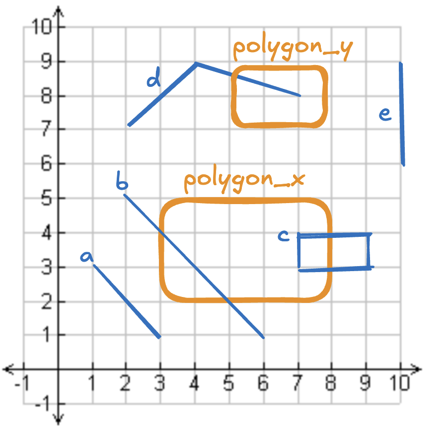

---
date:
  created: 2025-10-21
links:
  - SedonaDB: https://sedona.apache.org/sedonadb/
  - SpatialBench: https://sedona.apache.org/spatialbench/
authors:
  - matt_powers
title: "Managing spatial tables in Data Lakehouses with Iceberg"
---

<!--
# Licensed to the Apache Software Foundation (ASF) under one
# or more contributor license agreements.  See the NOTICE file
# distributed with this work for additional information
# regarding copyright ownership.  The ASF licenses this file
# to you under the Apache License, Version 2.0 (the
# "License"); you may not use this file except in compliance
# with the License.  You may obtain a copy of the License at
#
#   http://www.apache.org/licenses/LICENSE-2.0
#
# Unless required by applicable law or agreed to in writing,
# software distributed under the License is distributed on an
# "AS IS" BASIS, WITHOUT WARRANTIES OR CONDITIONS OF ANY
# KIND, either express or implied.  See the License for the
# specific language governing permissions and limitations
# under the License.
-->

This post explains the benefits of the Lakehouse Architecture for spatial tables and how Lakehouses differ from data warehouses and data lakes.

<!-- more -->

Many of the benefits that Lakehouses (e.g., Iceberg, Delta Lake, Hudi) provide for tabular data also apply to spatial data, for example:

* Reliable transactions
* Versioned data
* Time travel
* Schema enforcement
* Optimizations
* And many more

The spatial data community can use Lakehouses as of Iceberg v3, which adds geometry/geography types.

Spatial data requires different types of metadata and optimizations, but doesn’t always require entirely different file formats.  Iceberg can now store the metadata needed for geometry and geography columns.  It’s excellent that you can now use Iceberg for tabular and spatial data.

This post also explains why Lakehouse architecture is often better than warehouses and data lakes.  Let’s start with a detailed description of the Lakehouse architecture.

## Data Lakehouse Architecture Overview

A Lakehouse stores data in a Lakehouse Storage System like Iceberg, Delta Lake, or Hudi.  Iceberg v3 is currently the best option for spatial data because it natively supports geometry and geography columns.

Tables in Lakehouses are governed by a catalog like Unity Catalog or Apache Polaris. The catalog allows role-based access control (RBAC) and features like multi-table transactions.

You can query tables in the Lakehouse Architecture for BI, reporting, data science, machine learning, and other complex analyses.

The following table illustrates the Lakehouse Architecture:

{ align=center width="80%" }

The Lakehouse Architecture offers several advantages:

* Data is stored in open formats so any engine can query it, and there is no vendor lock-in.
* Lakehouses support all the features familiar to data warehouses, like reliable transactions, DML operations, and role-based access control.
* Lakehouses are often performant enough for low-latency applications like BI dashboards.
* Lakehouses are interoperable with proprietary tools like BigQuery, Redshift, or Esri.
* You can store Lakehouses in cloud-based storage systems without any additional charges.
* Lakehouses are compatible with any engine. You can use one engine for ingestion, another for ETL, and a third for ML. The architecture encourages using the best engine for the job.

Let’s see how Lakehouses differ from data lakes.

## Spatial tables in Lakehouses vs. Data Lakes

Data Lakes store data in files without a metadata layer, so they don’t guarantee reliable transactions.

Here are examples of spatial data lakes:

* GeoParquet files stored in AWS S3
* GeoJSON files stored in Azure Blob Storage
* CSV files with WKT geometry data stored in GCP

Since data lakes do not support reliable transactions, they cannot support developer-friendly features like delete and merge, require downtime when datasets are mutated, and do not offer advanced performance features.  Data lakes don’t support features like deletion vectors or small file compaction.

The Lakehouse metadata layer allows for convenience functions and much better performance.

The Lakehouse metadata layer is relatively small, so the storage costs for a Lakehouse and a data lake are about the same. Lakehouses allow for better performance, so compute expenses are generally lower than those of a data lake.

## Spatial tables in Lakehouses vs. Data Warehouses

A Data Warehouse is an analytics system powered by a proprietary engine and file formats. However, due to market pressures, this definition has shifted, and some Data Warehouses began supporting Lakehouse Storage Systems in addition to proprietary file formats. Many modern customers don’t want vendor lock-in via a proprietary file format.

Data Warehouses have the following limitations:

* They usually bundle storage with compute in pricing packages, so you must pay for more compute, even if you just want more storage.
* They store data in proprietary file formats, which aren’t compatible with other engines.
* Queries can run slower when you store data in open file formats.
* Sharing compute with other users can cause performance degradation when one user runs a large query.

In modern times, the strict definition of a data warehouse is shifting because engines that used to support only proprietary file formats now support open file formats.  You can now think of a Data Warehouse as a system that contains either a proprietary engine or a proprietary file format.

Many modern enterprises prefer the Lakehouse architecture because it’s open, compatible with any engine that builds a connector, vendor-neutral, and low-cost.

Let’s now see how to create some Iceberg tables.

## Creating tabular tables with Iceberg

Here’s how to create a `customers` table with `id` and `first_name` columns:

```sql
CREATE TABLE local.db.customers (id string, first_name string)
USING iceberg
TBLPROPERTIES('format-version'='3');
```

Let’s append some data to the table:

```python
df = sedona.createDataFrame(
    [
        ("a", "Bob"),
        ("b", "Mary"),
        ("c", "Sue"),
    ],
    ["id", "first_name"],
)

df.write.format("iceberg").mode("append").saveAsTable("local.db.customers")
```

Let’s see how to run a query on the table:

```
sedona.table("local.db.customers").show()

+---+----------+
| id|first_name|
+---+----------+
|  a|       Bob|
|  b|      Mary|
|  c|       Sue|
+---+----------+
```

Creating a table with tabular data is straightforward.  Now, let’s see how to make a table with spatial data in Iceberg.

## Creating spatial tables with Iceberg v3

Let’s now create a `customer_purchases` table with a `purchase_location` column.

Here’s how to create this spatial table with Iceberg:

```sql
CREATE TABLE local.db.customer_purchases (id string, price double, geometry geometry)
USING iceberg
TBLPROPERTIES('format-version'='3');
```

Now append some spatial data with longitude/latitude coordinates to the table:

```python
coords = [
    (-88.110352, 24.006326),
    (-77.080078, 24.006326),
    (-77.080078, 31.503629),
    (-88.110352, 31.503629),
    (-88.110352, 24.006326),
]
df = sedona.createDataFrame(
    [
        ("a", 10.99, Polygon(coords)),
        ("b", 3.5, Point(1, 2)),
        ("c", 1.95, Point(3, 4)),
    ],
    ["id", "price", "geometry"],
)

df.write.format("iceberg").mode("append").saveAsTable("local.db.customer_purchases")
```

The spatial table contains points and polygons. Some purchases have an exact location, and others occur in a region.

Let’s see how to join the tabular table with the spatial table.

## Joining an Iceberg tabular table with a spatial table

Here’s how to join the `customers` and `customer_purchases` tables.

```
customers = sedona.table("local.db.customers")
purchases = sedona.table("local.db.customer_purchases")

joined = customers.join(purchases, "id")
joined.show()

+---+----------+-----+--------------------+
| id|first_name|price|            geometry|
+---+----------+-----+--------------------+
|  a|       Bob|10.99|POLYGON ((-88.110...|
|  b|      Mary|  3.5|         POINT (1 2)|
|  c|       Sue| 1.95|         POINT (3 4)|
+---+----------+-----+--------------------+
```

Now we can see the customer information and the location of their purchases all in one table.

Keep reading for an example with a spatial join, which is a join based on the geometry columns of two tables.

It’s easy to join any tables with Sedona, regardless of the underlying file format, because Sedona has so many built-in file readers (e.g., you can easily join one table stored in Shapefiles and another stored in GeoParquet files). But it’s even easier when Iceberg stores the tabular and spatial tables in the same catalog.

## Optimizing spatial tables in Lakehouses

This section shows how queries can run faster on Iceberg tables.

Let’s query the Overture Maps Foundation buildings dataset stored in GeoParquet files.

```python
(
    sedona.table("open_data.overture_2025_03_19_1.buildings_building")
    .withColumn("geometry", ST_GeomFromWKB(col("geometry")))
    .select("id", "geometry", "num_floors", "roof_color")
    .createOrReplaceTempView("my_fun_view")
)
```

Using this GeoParquet dataset, let’s run a filtering query to get the number of buildings in a small region near Gainesville, Florida.

```python
spot = "POLYGON((-82.258759 29.129371, -82.180481 29.136569, -82.202454 29.173747, -82.258759 29.129371))"
sql = f"""
select * from my_fun_view
where ST_Contains(ST_GeomFromWKT('{spot}'), geometry)
"""
sedona.sql(sql).count()
```

This query runs in 45 seconds.

Let’s convert this dataset to Iceberg:

```python
df = sedona.table("open_data.overture_2025_03_19_1.buildings_building")

sql = """
CREATE TABLE local.db.overture_2025_03_19_1_buildings_building (id string, geometry geometry, num_floors integer, roof_color string)
USING iceberg
TBLPROPERTIES('format-version'='3');
"""
sedona.sql(sql)

(
    df.select("id", "geometry", "num_floors", "roof_color")
    .write.format("iceberg")
    .mode("overwrite")
    .saveAsTable("local.db.overture_2025_03_19_1_buildings_building")
)
```

Now let's rerun the same query on the Iceberg table:

```python
spot = "POLYGON((-82.258759 29.129371, -82.180481 29.136569, -82.202454 29.173747, -82.258759 29.129371))"
sql = f"""
select * from local.db.overture_2025_03_19_1_buildings_building
where ST_Contains(ST_GeomFromWKT('{spot}'), geometry)
"""
sedona.sql(sql).count()
```

This query executes in 4 seconds.

To make this Iceberg query run even faster, we could perform even more optimizations to colocate spatially near data in the same files.

## More geospatial examples in Iceberg

This section uses a contrived example to demonstrate some Iceberg features that help you manage your spatial data.  Start by creating two tables.  One for the blue geometric objects and another for the orange polygons in the following graph:

{ align=center width="80%" }

You can start by creating the Iceberg table:

```sql
CREATE TABLE some_catalog.matt.icegeometries (id string, geometry geometry)
USING iceberg
TBLPROPERTIES('format-version'='3');
```

Append objects `a`, `b`, `c`, `d`, and `e` to the table:

```python
df = sedona.createDataFrame(
    [
        ("a", "LINESTRING(1.0 3.0,3.0 1.0)"),
        ("b", "LINESTRING(2.0 5.0,6.0 1.0)"),
        ("c", "POLYGON((7.0 4.0,9.0 4.0,9.0 3.0,7.0 3.0,7.0 4.0))"),
        ("d", "LINESTRING(2.0 7.0,4.0 9.0,7.0 8.0)"),
        ("e", "LINESTRING(10.0 9.0,10.0 6.0)"),
    ],
    ["id", "geometry"],
)
df = df.withColumn("geometry", ST_GeomFromText(col("geometry")))

df.write.format("iceberg").mode("append").saveAsTable("some_catalog.matt.icegeometries")
```

Check the content of the table:

```
sedona.sql("SELECT * FROM some_catalog.matt.icegeometries;").show(truncate=False)

+---+-----------------------------------+
|id |geometry                           |
+---+-----------------------------------+
|a  |LINESTRING (1 3, 3 1)              |
|b  |LINESTRING (2 5, 6 1)              |
|c  |POLYGON ((7 4, 9 4, 9 3, 7 3, 7 4))|
|d  |LINESTRING (2 7, 4 9, 7 8)         |
|e  |LINESTRING (10 9, 10 6)            |
+---+-----------------------------------+
```

Iceberg makes it easy to delete rows of data in a table based on a predicate.

Now create a table with the polygons.  Start by creating the Iceberg table:

```sql
CREATE TABLE some_catalog.matt.icepolygons (id string, geometry geometry)
USING iceberg
TBLPROPERTIES('format-version'='3');
```

Append objects `polygon_x` and `polygon_y` to the table:

```python
df = sedona.createDataFrame(
    [
        ("polygon_x", "POLYGON((3.0 5.0,8.0 5.0,8.0 2.0,3.0 2.0,3.0 5.0))"),
        ("polygon_y", "POLYGON((5.0 9.0,8.0 9.0,8.0 7.0,5.0 7.0,5.0 9.0))"),
    ],
    ["id", "geometry"],
)
df = df.withColumn("geometry", ST_GeomFromText(col("geometry")))

df.write.format("iceberg").mode("append").saveAsTable("some_catalog.matt.icepolygons")
```

Here’s how you can delete all the linestrings that cross any polygon.

```python
sql = """
DELETE FROM some_catalog.matt.icegeometries
WHERE EXISTS (
    SELECT 1
    FROM some_catalog.matt.icepolygons
    WHERE ST_Intersects(icegeometries.geometry, icepolygons.geometry)
)
"""
sedona.sql(sql)
```

Check the table to see that geometries `b`, `c`, and `d` are deleted from the table.

```
sedona.sql("SELECT * FROM some_catalog.matt.icegeometries;").show(truncate=False)

+---+-----------------------+
|id |geometry               |
+---+-----------------------+
|a  |LINESTRING (1 3, 3 1)  |
|e  |LINESTRING (10 9, 10 6)|
+---+-----------------------+
```

Iceberg also allows for time travel between different versions of a table.  Let’s see all the current versions of the Iceberg table:

```
sql = "SELECT snapshot_id, committed_at, operation FROM some_catalog.matt.icegeometries.snapshots;"
sedona.sql(sql).show(truncate=False)

+-------------------+-----------------------+---------+
|snapshot_id        |committed_at           |operation|
+-------------------+-----------------------+---------+
|1643575804253593143|2025-10-10 19:35:19.539|append   |
|5206691623836785752|2025-10-10 19:35:41.214|overwrite|
+-------------------+-----------------------+---------+
```

Let’s check the contents of the table before the delete operation is run:

```
sql = "SELECT * FROM some_catalog.matt.icegeometries FOR SYSTEM_VERSION AS OF 1643575804253593143;"
sedona.sql(sql).show(truncate=False)

+---+-----------------------------------+
|id |geometry                           |
+---+-----------------------------------+
|a  |LINESTRING (1 3, 3 1)              |
|b  |LINESTRING (2 5, 6 1)              |
|c  |POLYGON ((7 4, 9 4, 9 3, 7 3, 7 4))|
|d  |LINESTRING (2 7, 4 9, 7 8)         |
|e  |LINESTRING (10 9, 10 6)            |
+---+-----------------------------------+
```

A new table version is created every time an Iceberg transaction is completed.

**Geospatial upsert operations with Iceberg**

Iceberg also supports upsert operations, which allow you to update or insert rows in a table in a single transaction. Upserts are especially useful for incremental updates.

Here is the current contents of the Iceberg table:

```
+---+-----------------------+
|id |geometry               |
+---+-----------------------+
|a  |LINESTRING (1 3, 3 1)  |
|e  |LINESTRING (10 9, 10 6)|
+---+-----------------------+
```

Let’s perform an upsert with the following data:

```
+---+---------------------+
|id |geometry             |
+---+---------------------+
|a  |LINESTRING (1 3, 3 1)| # duplicate
|e  |LINESTRING (5 9, 10 6)| # updated geometry
|z  |LINESTRING (6 7, 6 9)| # new data
+---+---------------------+
```

Here’s how the upsert append should run:

* New data should be appended
* Existing data should be updated
* Duplicate data should be ignored

Here’s the code to execute this operation:

```python
merge_sql = """
MERGE INTO some_catalog.matt.icegeometries target
USING source
ON target.id = source.id
WHEN MATCHED THEN
    UPDATE SET
        target.geometry = source.geometry
WHEN NOT MATCHED THEN
    INSERT (id, geometry) VALUES (source.id, source.geometry)
"""
sedona.sql(merge_sql)
```

Here are the contents of the table after running this operation:

```
+---+----------------------+
|id |geometry              |
+---+----------------------+
|a  |LINESTRING (1 3, 3 1) |
|e  |LINESTRING (5 9, 10 6)|
|z  |LINESTRING (6 7, 6 9) |
+---+----------------------+
```

The MERGE command has many other practical applications for geospatial tables.

**Geospatial schema enforcement with Iceberg**

Iceberg supports schema enforcement, prohibiting appending data with a mismatched schema to the table. If you try to append a DataFrame with a mismatched schema to an Iceberg table, it will error.

Let’s create a DataFrame with a different schema than the existing Iceberg table:

```python
df = sedona.createDataFrame(
    [
        ("x", 2, "LINESTRING(8.0 8.0,3.0 3.0)"),
        ("y", 3, "LINESTRING(5.0 5.0,1.0 1.0)"),
    ],
    ["id", "num", "geometry"],
)
df = df.withColumn("geometry", ST_GeomFromText(col("geometry")))
```

Now attempt to append the DataFrame to the table:

```python
df.write.format("iceberg").mode("append").saveAsTable("some_catalog.matt.icegeometries")
```

Here is the error:

```
AnalysisException: [INSERT_COLUMN_ARITY_MISMATCH.TOO_MANY_DATA_COLUMNS] Cannot write to `some_catalog`.`matt`.`icegeometries`, the reason is too many data columns:
Table columns: `id`, `geometry`.
Data columns: `id`, `num`, `geometry`.
```

The append operation is prohibited because the DataFrame schema differs from the Iceberg table schema.

Data lakes don’t have built-in schema enforcement, so you can append data with a mismatched schema, which can corrupt a table or require developers to use specific syntax when reading the table.

Schema enforcement is a nice feature that protects the integrity of your data tables.

## Iceberg v3 spec for geometry and geography columns

See [this pull request](https://github.com/apache/iceberg/pull/10981) for details on the updated Iceberg spec with geometry and geography columns.

The Iceberg v3 spec stores this key information:

* The CRS for each geometry/geography column
* The bounding box (bbox) for each geometry/geography column

From [the spec](https://iceberg.apache.org/spec/):

> Geospatial features from OGC – Simple feature access. Edge-interpolation is always linear/planar. See Appendix G. Parameterized by CRS C. If not specified, C is OGC:CRS84.

Here’s Appendix G:

> The Geometry and Geography class hierarchy and its Well-known text (WKT) and Well-known binary (WKB) serializations (ISO supporting XY, XYZ, XYM, XYZM) are defined by OpenGIS Implementation Specification for Geographic information – Simple feature access – Part 1: Common architecture, from OGC (Open Geospatial Consortium).
> Points are always defined by the coordinates X, Y, Z (optional), and M (optional), in this order. X is the longitude/easting, Y is the latitude/northing, and Z is usually the height, or elevation. M is a fourth optional dimension, for example a linear reference value (e.g., highway milepost value), a timestamp, or some other value as defined by the CRS.
> The version of the OGC standard first used here is 1.2.1, but future versions may also be used if the WKB representation remains wire-compatible.

## Conclusion

Lakehouses offer amazing features for the data community, and the spatial community can now take advantage of these benefits for vector datasets.

You can store geometry and geography data in Iceberg spatial tables to co-locate your tabular and spatial tables in the same catalog.  Organizing your data this way makes your spatial data more findable and improves query performance.

The spatial data community still needs to align on the best way to store raster data (e.g., satellite imagery) in Lakehouses.  Stay tuned for more interesting discussions on raster data!
