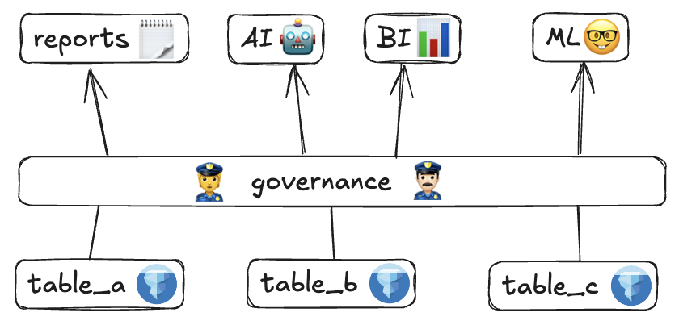
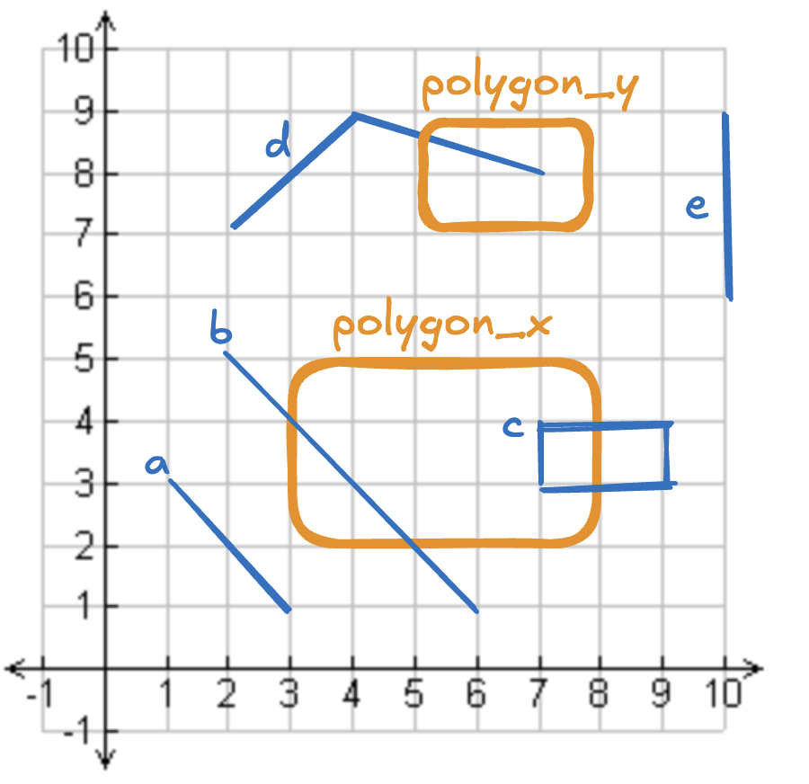

---
date:
  created: 2025-10-21
links:
  - SedonaDB: https://sedona.apache.org/sedonadb/
  - SpatialBench: https://sedona.apache.org/spatialbench/
authors:
  - matt_powers
title: "使用 Iceberg 在数据湖仓中管理空间表"
---

<!--
# Licensed to the Apache Software Foundation (ASF) under one
# or more contributor license agreements.  See the NOTICE file
# distributed with this work for additional information
# regarding copyright ownership.  The ASF licenses this file
# to you under the Apache License, Version 2.0 (the
# "License"); you may not use this file except in compliance
# with the License.  You may obtain a copy of the License at
#
#   http://www.apache.org/licenses/LICENSE-2.0
#
# Unless required by applicable law or agreed to in writing,
# software distributed under the License is distributed on an
# "AS IS" BASIS, WITHOUT WARRANTIES OR CONDITIONS OF ANY
# KIND, either express or implied.  See the License for the
# specific language governing permissions and limitations
# under the License.
-->

本文解释了湖仓架构(Lakehouse Architecture)对空间表的好处,以及湖仓与数据仓库、数据湖的不同之处。

<!-- more -->

湖仓(例如 Iceberg、Delta Lake、Hudi)为表格数据提供的许多好处同样适用于空间数据,例如:

* 可靠的事务
* 数据版本化
* 时间旅行(Time travel)
* Schema 约束
* 优化能力
* 等等

从 Iceberg v3 起,空间数据社区可以使用湖仓,因为它新增了几何/地理类型。

空间数据需要不同种类的元数据和优化,但并非总是需要完全不同的文件格式。Iceberg 现在可以存储几何与地理列所需的元数据。能够同时用 Iceberg 来管理表格和空间数据,是一件非常棒的事情。

本文还会解释为什么湖仓架构通常比仓库和数据湖更好。我们先从详细描述湖仓架构开始。

## 数据湖仓架构概述

湖仓将数据存储在像 Iceberg、Delta Lake 或 Hudi 这样的湖仓存储系统中。Iceberg v3 是目前最适合空间数据的选择,因为它原生支持几何和地理列。

湖仓中的表由像 Unity Catalog 或 Apache Polaris 这样的目录(catalog)进行治理。目录支持基于角色的访问控制(RBAC),以及多表事务等特性。

你可以在湖仓架构上对表进行查询,用于 BI、报表、数据科学、机器学习和其他复杂分析。

下图展示了湖仓架构:

{ align=center width="80%" }

湖仓架构具有以下几项优势:

* 数据以开放格式存储,因此任何引擎都可以查询,不存在厂商锁定。
* 湖仓支持数据仓库常见的所有特性,如可靠事务、DML 操作和基于角色的访问控制。
* 湖仓通常足以支撑像 BI 仪表盘这样的低延迟应用。
* 湖仓可与 BigQuery、Redshift 或 Esri 等专有工具互操作。
* 你可以将湖仓存储在基于云的存储系统中,而无需额外费用。
* 湖仓兼容任意引擎。你可以用一个引擎做摄取、另一个引擎做 ETL、再用第三个引擎做机器学习。这种架构鼓励为每项工作选择最合适的引擎。

让我们看看湖仓与数据湖有何不同。

## 湖仓中的空间表 vs. 数据湖

数据湖将数据存储在文件中,没有元数据层,因此无法保证事务的可靠性。

下面是空间数据湖的几个例子:

* 存储在 AWS S3 中的 GeoParquet 文件
* 存储在 Azure Blob 中的 GeoJSON 文件
* 存储在 GCP 中的、带 WKT 几何的 CSV 文件

由于数据湖不支持可靠事务,它们无法支持删除和合并这类开发者友好的功能,数据集变更时还会要求停机,也无法提供高级的性能特性。数据湖不支持删除向量(deletion vectors)或小文件合并等特性。

湖仓的元数据层使得便捷函数和更优性能成为可能。

湖仓的元数据层相对较小,因此湖仓和数据湖的存储成本大致相当。湖仓允许更好的性能,因此计算开销通常低于数据湖。

## 湖仓中的空间表 vs. 数据仓库

数据仓库是由专有引擎和文件格式驱动的分析系统。然而,由于市场压力,这个定义已经发生变化,一些数据仓库开始在专有文件格式之外支持湖仓存储系统。许多现代客户不希望被专有文件格式锁定。

数据仓库存在以下局限:

* 它们通常将存储与计算捆绑销售,因此你即便只想要更多存储,也必须额外付费购买更多计算。
* 它们以专有文件格式存储数据,与其他引擎不兼容。
* 当将数据存储在开放文件格式中时,查询可能更慢。
* 与其他用户共享计算时,当某个用户运行大查询会导致性能下降。

如今,数据仓库的严格定义正在变化,因为以前只支持专有文件格式的引擎现在也支持开放文件格式。你现在可以将数据仓库理解为:含有专有引擎或专有文件格式的系统。

许多现代企业偏好湖仓架构,因为它开放、能与任何构建了连接器的引擎兼容、厂商中立、成本低。

让我们看看如何创建一些 Iceberg 表。

## 用 Iceberg 创建表格表

下面演示如何创建一个 `customers` 表,包含 `id` 和 `first_name` 两列:

```sql
CREATE TABLE local.db.customers (id string, first_name string)
USING iceberg
TBLPROPERTIES('format-version'='3');
```

让我们向表中追加一些数据:

```python
df = sedona.createDataFrame(
    [
        ("a", "Bob"),
        ("b", "Mary"),
        ("c", "Sue"),
    ],
    ["id", "first_name"],
)

df.write.format("iceberg").mode("append").saveAsTable("local.db.customers")
```

让我们对表运行一次查询:

```
sedona.table("local.db.customers").show()

+---+----------+
| id|first_name|
+---+----------+
|  a|       Bob|
|  b|      Mary|
|  c|       Sue|
+---+----------+
```

创建表格数据的表很简单。现在,让我们看看如何在 Iceberg 中创建带空间数据的表。

## 用 Iceberg v3 创建空间表

下面创建一个 `customer_purchases` 表,带有一个 `purchase_location` 列。

下面是用 Iceberg 创建该空间表的方法:

```sql
CREATE TABLE local.db.customer_purchases (id string, price double, geometry geometry)
USING iceberg
TBLPROPERTIES('format-version'='3');
```

现在向表中追加一些带经纬度坐标的空间数据:

```python
coords = [
    (-88.110352, 24.006326),
    (-77.080078, 24.006326),
    (-77.080078, 31.503629),
    (-88.110352, 31.503629),
    (-88.110352, 24.006326),
]
df = sedona.createDataFrame(
    [
        ("a", 10.99, Polygon(coords)),
        ("b", 3.5, Point(1, 2)),
        ("c", 1.95, Point(3, 4)),
    ],
    ["id", "price", "geometry"],
)

df.write.format("iceberg").mode("append").saveAsTable("local.db.customer_purchases")
```

这张空间表既包含点也包含多边形。有些购买有精确位置,另一些则发生在某个区域内。

让我们看看如何把表格表与空间表进行连接。

## 连接 Iceberg 中的表格表与空间表

下面演示如何连接 `customers` 和 `customer_purchases` 表。

```
customers = sedona.table("local.db.customers")
purchases = sedona.table("local.db.customer_purchases")

joined = customers.join(purchases, "id")
joined.show()

+---+----------+-----+--------------------+
| id|first_name|price|            geometry|
+---+----------+-----+--------------------+
|  a|       Bob|10.99|POLYGON ((-88.110...|
|  b|      Mary|  3.5|         POINT (1 2)|
|  c|       Sue| 1.95|         POINT (3 4)|
+---+----------+-----+--------------------+
```

现在我们可以在同一张表中看到客户信息及其购买位置。

继续阅读,可以看到使用空间连接(基于两表的几何列的连接)的示例。

使用 Sedona 连接任意表都很容易,无论底层文件格式如何,因为 Sedona 内置了众多文件读取器(例如,你可以轻松连接一个存储为 Shapefile 的表和一个存储为 GeoParquet 文件的表)。但当 Iceberg 在同一个 catalog 中同时管理表格表和空间表时,会更加轻松。

## 在湖仓中优化空间表

本节展示查询如何能在 Iceberg 表上跑得更快。

下面查询存储为 GeoParquet 文件的 Overture Maps Foundation buildings 数据集。

```python
(
    sedona.table("open_data.overture_2025_03_19_1.buildings_building")
    .withColumn("geometry", ST_GeomFromWKB(col("geometry")))
    .select("id", "geometry", "num_floors", "roof_color")
    .createOrReplaceTempView("my_fun_view")
)
```

基于这个 GeoParquet 数据集,运行一个过滤查询,统计佛罗里达州 Gainesville 附近一个小区域内的建筑物数量。

```python
spot = "POLYGON((-82.258759 29.129371, -82.180481 29.136569, -82.202454 29.173747, -82.258759 29.129371))"
sql = f"""
select * from my_fun_view
where ST_Contains(ST_GeomFromWKT('{spot}'), geometry)
"""
sedona.sql(sql).count()
```

这个查询用时 45 秒。

让我们把这个数据集转换为 Iceberg:

```python
df = sedona.table("open_data.overture_2025_03_19_1.buildings_building")

sql = """
CREATE TABLE local.db.overture_2025_03_19_1_buildings_building (id string, geometry geometry, num_floors integer, roof_color string)
USING iceberg
TBLPROPERTIES('format-version'='3');
"""
sedona.sql(sql)

(
    df.select("id", "geometry", "num_floors", "roof_color")
    .write.format("iceberg")
    .mode("overwrite")
    .saveAsTable("local.db.overture_2025_03_19_1_buildings_building")
)
```

现在在 Iceberg 表上重新运行同一条查询:

```python
spot = "POLYGON((-82.258759 29.129371, -82.180481 29.136569, -82.202454 29.173747, -82.258759 29.129371))"
sql = f"""
select * from local.db.overture_2025_03_19_1_buildings_building
where ST_Contains(ST_GeomFromWKT('{spot}'), geometry)
"""
sedona.sql(sql).count()
```

这个查询在 4 秒内完成。

要让这个 Iceberg 查询跑得更快,我们还可以做更多优化,把空间上相近的数据放到相同的文件中。

## 更多 Iceberg 中的地理空间示例

本节用一个示意性的例子演示 Iceberg 中有助于管理空间数据的几个特性。首先创建两张表:一张存放图中蓝色的几何对象,另一张存放橙色的多边形:

{ align=center width="80%" }

先创建 Iceberg 表:

```sql
CREATE TABLE some_catalog.matt.icegeometries (id string, geometry geometry)
USING iceberg
TBLPROPERTIES('format-version'='3');
```

向表中追加对象 `a`、`b`、`c`、`d` 和 `e`:

```python
df = sedona.createDataFrame(
    [
        ("a", "LINESTRING(1.0 3.0,3.0 1.0)"),
        ("b", "LINESTRING(2.0 5.0,6.0 1.0)"),
        ("c", "POLYGON((7.0 4.0,9.0 4.0,9.0 3.0,7.0 3.0,7.0 4.0))"),
        ("d", "LINESTRING(2.0 7.0,4.0 9.0,7.0 8.0)"),
        ("e", "LINESTRING(10.0 9.0,10.0 6.0)"),
    ],
    ["id", "geometry"],
)
df = df.withColumn("geometry", ST_GeomFromText(col("geometry")))

df.write.format("iceberg").mode("append").saveAsTable("some_catalog.matt.icegeometries")
```

查看表中的内容:

```
sedona.sql("SELECT * FROM some_catalog.matt.icegeometries;").show(truncate=False)

+---+-----------------------------------+
|id |geometry                           |
+---+-----------------------------------+
|a  |LINESTRING (1 3, 3 1)              |
|b  |LINESTRING (2 5, 6 1)              |
|c  |POLYGON ((7 4, 9 4, 9 3, 7 3, 7 4))|
|d  |LINESTRING (2 7, 4 9, 7 8)         |
|e  |LINESTRING (10 9, 10 6)            |
+---+-----------------------------------+
```

Iceberg 让基于谓词删除表中行变得简单。

现在创建一张包含多边形的表。先创建 Iceberg 表:

```sql
CREATE TABLE some_catalog.matt.icepolygons (id string, geometry geometry)
USING iceberg
TBLPROPERTIES('format-version'='3');
```

追加对象 `polygon_x` 和 `polygon_y`:

```python
df = sedona.createDataFrame(
    [
        ("polygon_x", "POLYGON((3.0 5.0,8.0 5.0,8.0 2.0,3.0 2.0,3.0 5.0))"),
        ("polygon_y", "POLYGON((5.0 9.0,8.0 9.0,8.0 7.0,5.0 7.0,5.0 9.0))"),
    ],
    ["id", "geometry"],
)
df = df.withColumn("geometry", ST_GeomFromText(col("geometry")))

df.write.format("iceberg").mode("append").saveAsTable("some_catalog.matt.icepolygons")
```

下面演示如何删除所有与任意多边形相交的线串。

```python
sql = """
DELETE FROM some_catalog.matt.icegeometries
WHERE EXISTS (
    SELECT 1
    FROM some_catalog.matt.icepolygons
    WHERE ST_Intersects(icegeometries.geometry, icepolygons.geometry)
)
"""
sedona.sql(sql)
```

查看表,可以看到几何 `b`、`c` 和 `d` 已从表中删除。

```
sedona.sql("SELECT * FROM some_catalog.matt.icegeometries;").show(truncate=False)

+---+-----------------------+
|id |geometry               |
+---+-----------------------+
|a  |LINESTRING (1 3, 3 1)  |
|e  |LINESTRING (10 9, 10 6)|
+---+-----------------------+
```

Iceberg 也允许在表的不同版本之间进行时间旅行。下面查看 Iceberg 表目前所有的版本:

```
sql = "SELECT snapshot_id, committed_at, operation FROM some_catalog.matt.icegeometries.snapshots;"
sedona.sql(sql).show(truncate=False)

+-------------------+-----------------------+---------+
|snapshot_id        |committed_at           |operation|
+-------------------+-----------------------+---------+
|1643575804253593143|2025-10-10 19:35:19.539|append   |
|5206691623836785752|2025-10-10 19:35:41.214|overwrite|
+-------------------+-----------------------+---------+
```

让我们查看在删除操作执行之前的表内容:

```
sql = "SELECT * FROM some_catalog.matt.icegeometries FOR SYSTEM_VERSION AS OF 1643575804253593143;"
sedona.sql(sql).show(truncate=False)

+---+-----------------------------------+
|id |geometry                           |
+---+-----------------------------------+
|a  |LINESTRING (1 3, 3 1)              |
|b  |LINESTRING (2 5, 6 1)              |
|c  |POLYGON ((7 4, 9 4, 9 3, 7 3, 7 4))|
|d  |LINESTRING (2 7, 4 9, 7 8)         |
|e  |LINESTRING (10 9, 10 6)            |
+---+-----------------------------------+
```

每完成一次 Iceberg 事务,都会创建一个新的表版本。

**Iceberg 上的地理空间 upsert 操作**

Iceberg 还支持 upsert 操作,允许你在一次事务中对表进行更新或插入。upsert 在增量更新场景中尤其有用。

下面是 Iceberg 表当前的内容:

```
+---+-----------------------+
|id |geometry               |
+---+-----------------------+
|a  |LINESTRING (1 3, 3 1)  |
|e  |LINESTRING (10 9, 10 6)|
+---+-----------------------+
```

让我们用以下数据执行一次 upsert:

```
+---+---------------------+
|id |geometry             |
+---+---------------------+
|a  |LINESTRING (1 3, 3 1)| # duplicate
|e  |LINESTRING (5 9, 10 6)| # updated geometry
|z  |LINESTRING (6 7, 6 9)| # new data
+---+---------------------+
```

upsert 追加的预期行为是:

* 新数据应被追加
* 已存在的数据应被更新
* 重复的数据应被忽略

下面是执行此操作的代码:

```python
merge_sql = """
MERGE INTO some_catalog.matt.icegeometries target
USING source
ON target.id = source.id
WHEN MATCHED THEN
    UPDATE SET
        target.geometry = source.geometry
WHEN NOT MATCHED THEN
    INSERT (id, geometry) VALUES (source.id, source.geometry)
"""
sedona.sql(merge_sql)
```

操作完成后,表的内容如下:

```
+---+----------------------+
|id |geometry              |
+---+----------------------+
|a  |LINESTRING (1 3, 3 1) |
|e  |LINESTRING (5 9, 10 6)|
|z  |LINESTRING (6 7, 6 9) |
+---+----------------------+
```

MERGE 命令在地理空间表上还有许多其他实用场景。

**Iceberg 上的地理空间 schema 约束**

Iceberg 支持 schema 约束,禁止将 schema 不匹配的数据追加到表中。如果你尝试将一个 schema 不匹配的 DataFrame 追加到 Iceberg 表,它会报错。

让我们创建一个 schema 与已有 Iceberg 表不同的 DataFrame:

```python
df = sedona.createDataFrame(
    [
        ("x", 2, "LINESTRING(8.0 8.0,3.0 3.0)"),
        ("y", 3, "LINESTRING(5.0 5.0,1.0 1.0)"),
    ],
    ["id", "num", "geometry"],
)
df = df.withColumn("geometry", ST_GeomFromText(col("geometry")))
```

现在尝试将 DataFrame 追加到表中:

```python
df.write.format("iceberg").mode("append").saveAsTable("some_catalog.matt.icegeometries")
```

会得到如下错误:

```
AnalysisException: [INSERT_COLUMN_ARITY_MISMATCH.TOO_MANY_DATA_COLUMNS] Cannot write to `some_catalog`.`matt`.`icegeometries`, the reason is too many data columns:
Table columns: `id`, `geometry`.
Data columns: `id`, `num`, `geometry`.
```

追加操作被禁止,因为 DataFrame 的 schema 与 Iceberg 表的 schema 不同。

数据湖没有内建的 schema 约束,所以可能会在追加 schema 不匹配的数据后破坏表,或迫使开发者在读取表时使用特定语法。

schema 约束是保护数据表完整性的一个不错特性。

## Iceberg v3 中几何与地理列的规范

关于带几何和地理列的 Iceberg 规范更新,详见 [这个 pull request](https://github.com/apache/iceberg/pull/10981)。

Iceberg v3 规范中存储了以下关键信息:

* 每个几何/地理列的 CRS
* 每个几何/地理列的边界框(bbox)

引用[规范](https://iceberg.apache.org/spec/)中的描述:

> Geospatial features from OGC – Simple feature access. Edge-interpolation is always linear/planar. See Appendix G. Parameterized by CRS C. If not specified, C is OGC:CRS84.

附录 G:

> The Geometry and Geography class hierarchy and its Well-known text (WKT) and Well-known binary (WKB) serializations (ISO supporting XY, XYZ, XYM, XYZM) are defined by OpenGIS Implementation Specification for Geographic information – Simple feature access – Part 1: Common architecture, from OGC (Open Geospatial Consortium).
> Points are always defined by the coordinates X, Y, Z (optional), and M (optional), in this order. X is the longitude/easting, Y is the latitude/northing, and Z is usually the height, or elevation. M is a fourth optional dimension, for example a linear reference value (e.g., highway milepost value), a timestamp, or some other value as defined by the CRS.
> The version of the OGC standard first used here is 1.2.1, but future versions may also be used if the WKB representation remains wire-compatible.

## 结论

湖仓为数据社区提供了出色的特性,空间社区现在也可以在矢量数据集上享受这些好处。

你可以将几何和地理数据存储在 Iceberg 空间表中,从而把表格表和空间表放到同一个 catalog 内。以这种方式组织数据让你的空间数据更易被发现,也能提升查询性能。

空间数据社区仍然需要就将栅格数据(例如卫星影像)存入湖仓的最佳方式达成共识。请持续关注关于栅格数据的更多有趣讨论!
