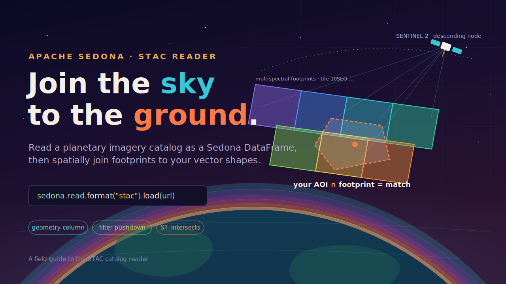
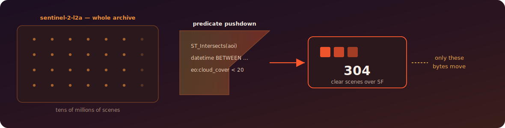
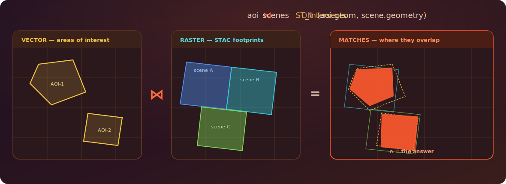
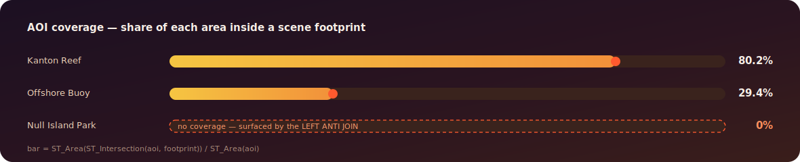

---
date:
  created: 2026-07-17
links:
  - STAC reader tutorial: https://sedona.apache.org/latest/tutorial/files/stac-sedona-spark/
  - STAC specification: https://stacspec.org/
  - earth-search (public Sentinel-2 STAC): https://earth-search.aws.element84.com/v1
authors:
  - jia
title: "Join the Sky to the Ground: Spatial Joins over STAC Catalogs"
---

# Join the Sky to the Ground: Spatial Joins over STAC Catalogs

You have the shapes. Somewhere in a petabyte of satellite imagery are exactly the scenes that cover them. The hard part was never the analysis — it was the plumbing in between.



<!-- more -->

Every few days, satellites re-photograph the entire planet. A [**STAC catalog**](https://stacspec.org/) (SpatioTemporal Asset Catalog) is how that firehose is published — Sentinel-2, Landsat, NAIP, Maxar, and Microsoft's Planetary Computer all speak it. Each *item* in a catalog describes one captured scene: its footprint geometry, its timestamp, its cloud cover, and links to the actual pixels.

SedonaSpark's STAC reader parses all of that into a Sedona DataFrame whose `geometry` column is a real Sedona geometry — which means the catalog drops straight into a spatial join with the vector shapes you already have. This post walks the whole path, from a live catalog read to the spatial join, with real output throughout.

## One line to a Sedona DataFrame

Point the `stac` format at any STAC endpoint — a public API, an `s3a://` object, or a local `collection.json`. Here we open Element 84's public `earth-search` catalog and pull the live Sentinel-2 archive:

```python
from sedona.spark import SedonaContext

sedona = SedonaContext.create(SedonaContext.builder().master("local[*]").getOrCreate())

base = "https://earth-search.aws.element84.com/v1"
scenes = sedona.read.format("stac").load(f"{base}/collections/sentinel-2-l2a")

scenes.printSchema()
```

The reader gives every STAC field a typed column. The important ones: `geometry` arrives as a native geometry, `datetime` as a timestamp, and the [EO extension](https://github.com/stac-extensions/eo)'s `eo:cloud_cover` is lifted to a top-level double.

```
 |-- id: string
 |-- bbox: array<double>
 |-- geometry: geometry          <- a real Sedona geometry
 |-- datetime: timestamp
 |-- eo:cloud_cover: double
 |-- eo:snow_cover: double
 |-- platform: string
 |-- constellation: string
 |-- collection: string
 |-- assets: map<string, struct<href, type, title, roles>>
```

A peek at the rows — a live descending pass captured the day this ran:

```python
scenes.selectExpr(
    "id",
    "datetime",
    "`eo:cloud_cover` AS cloud",
    "ST_GeometryType(geometry) AS shape",
).show(3, truncate=False)
```

```
+--------------------------+-------------------------+------+-----------+
|id                        |datetime                 |cloud |shape      |
+--------------------------+-------------------------+------+-----------+
|S2B_50LQK_20260717_0_L2A  |2026-07-17 02:31:27.091  |0.0   |ST_Polygon |
|S2B_50LPJ_20260717_0_L2A  |2026-07-17 02:31:39.810  |1.55  |ST_Polygon |
|S2B_50LQL_20260717_0_L2A  |2026-07-17 02:31:16.128  |6.95  |ST_Polygon |
+--------------------------+-------------------------+------+-----------+
```

Real footprints, real cloud cover, real timestamps — with nothing more than a format string.

## The API does the filtering

The Sentinel-2 archive is tens of millions of scenes. You never want all of them. When you filter on **space**, **time**, or **cloud cover**, Sedona pushes those predicates *down to the STAC API itself* — only the matching tiles ever cross the network. Apply the spatial predicate *on the read* (not buried in a join) and it becomes an API-side bounding query.



```python
sf = (
    "POLYGON((-122.52 37.70, -122.36 37.70, "
    "-122.36 37.83, -122.52 37.83, -122.52 37.70))"
)

sf_scenes = (
    sedona.read.format("stac")
    .load(f"{base}/collections/sentinel-2-l2a")
    # spatial + temporal + cloud predicates, all pushed to the STAC /search API
    .filter(f"ST_Intersects(ST_GeomFromText('{sf}'), geometry)")
    .filter("datetime BETWEEN '2026-05-01' AND '2026-06-30'")
    .filter("`eo:cloud_cover` < 20")
)

sf_scenes.selectExpr(
    "id", "date(datetime) AS day", "round(`eo:cloud_cover`, 1) AS cloud"
).orderBy("day").show(4)
```

Only tile `10SEG` — the one covering San Francisco — comes back, at sub-1% cloud:

```
+--------------------------+------------+------+
|id                        |day         |cloud |
+--------------------------+------------+------+
|S2C_10SEG_20260513_0_L2A  |2026-05-13  |0.9   |
|S2A_10SEG_20260515_0_L2A  |2026-05-15  |0.1   |
|S2B_10SEG_20260518_0_L2A  |2026-05-18  |0.7   |
+--------------------------+------------+------+
```

The archive's other tens of millions of scenes never touched the wire.

## Join footprints to your vectors

This is the payoff. Because `geometry` is a real geometry column, the catalog is just another spatial table — and it joins against your vector layer with the same `ST_Intersects` predicate you'd use anywhere else in Sedona. Your areas of interest on the left, the imagery footprints on the right, and the join is the overlap.



Let's make it concrete. The Apache Sedona source tree ships a tiny sample STAC collection under `spark/common/src/test/resources/datasource_stac/` — clone the repo and point at it, or swap in any `collection.json` of your own. We load those scene footprints, define three analyst-drawn AOIs as a vector layer, and ask: **which scenes cover each AOI, and how much of the AOI do they cover?**

```python
# 1 — the imagery layer (Sedona's sample STAC collection, from the source tree)
scenes = sedona.read.format("stac").load(
    "spark/common/src/test/resources/datasource_stac/collection.json"
)
scenes.createOrReplaceTempView("scenes")

# 2 — the vector layer: your areas of interest (load from GeoParquet /
#     Shapefile in production; inline WKT here so the example is self-contained)
aoi = sedona.sql("""
    SELECT aoi_name, ST_GeomFromText(wkt) AS geom FROM VALUES
      ('Kanton Reef',      'POLYGON((172.91 1.34, 172.95 1.34, 172.95 1.37, 172.91 1.37, 172.91 1.34))'),
      ('Offshore Buoy',    'POLYGON((172.93 1.35, 172.97 1.35, 172.97 1.39, 172.93 1.39, 172.93 1.35))'),
      ('Null Island Park', 'POLYGON((-0.01 -0.01, 0.01 -0.01, 0.01 0.01, -0.01 0.01, -0.01 -0.01))')
    AS t(aoi_name, wkt)
""")
aoi.createOrReplaceTempView("aoi")

# 3 — the spatial join + how much of each AOI is covered
sedona.sql("""
    SELECT DISTINCT a.aoi_name, s.id AS scene_id,
           ROUND(ST_Area(ST_Intersection(a.geom, s.geometry))
                 / ST_Area(a.geom) * 100, 1) AS aoi_covered_pct
    FROM   aoi a
    JOIN   scenes s ON ST_Intersects(a.geom, s.geometry)
    ORDER BY aoi_covered_pct DESC
""").show(truncate=False)
```

```
+--------------+---------------------+-----------------+
|aoi_name      |scene_id             |aoi_covered_pct  |
+--------------+---------------------+-----------------+
|Kanton Reef   |20201211_223832_CS2  |80.2             |
|Offshore Buoy |20201211_223832_CS2  |29.4             |
+--------------+---------------------+-----------------+
```

Kanton Reef is 80.2% inside the scene footprint; Offshore Buoy only 29.4%. Null Island didn't match at all — and that's the point of the inverse query. **Which AOIs have no coverage?** is a `LEFT ANTI JOIN` on the same predicate — perfect for *"where are the gaps, and where do we need to task a new capture?"*

```python
sedona.sql("""
    SELECT a.aoi_name
    FROM   aoi a
    LEFT ANTI JOIN scenes s ON ST_Intersects(a.geom, s.geometry)
""").show(truncate=False)
```

```
+------------------+
|aoi_name          |
+------------------+
|Null Island Park  |
+------------------+
```

The same three AOIs, read as a coverage report:



And it scales without changing shape. Swap the bundled path for the live `earth-search` endpoint, push a spatial + temporal filter, and the identical join runs over only the tiles that survive the pushdown. In one live run over San Francisco (May–June 2026), the AOI matched **5** scenes, **3** of them under 20% cloud, the clearest at **0.06%** — from the same join.

## Or skip the URLs entirely

For interactive work there's a Pythonic client that wraps the reader — open a catalog, search a collection with a bbox and a time range, get a Sedona DataFrame back. Same engine underneath, so the result drops into the exact same join:

```python
from sedona.spark.stac import Client

df = Client.open("https://planetarycomputer.microsoft.com/api/stac/v1").search(
    collection_id="aster-l1t",
    bbox=[-122.6, 37.6, -122.3, 37.9],
    datetime="2020",  # a whole year
    max_items=50,
)
df.show()  # -> a Sedona DataFrame, ready to join
```

The client also supports `with_bearer_token()` and `with_basic_auth()` for private catalogs.

## From match to pixels

Once the join hands you the matching items, the `assets` map holds the links to the actual imagery. From there:

- **Persist the catalog** — `save_to_geoparquet()` writes the filtered items to GeoParquet so you never re-hit the API.
- **Rank per AOI** — a window function over `eo:cloud_cover` and `datetime` picks the single best scene for each shape.
- **Go to raster** — feed `assets['visual'].href` into Sedona's raster functions and clip to the AOI for analysis-ready pixels.

The through-line is simple: the STAC reader makes a planetary imagery archive behave like a spatial table. And a spatial table is something Sedona already knows how to join, filter, and aggregate at scale. The sky becomes just another layer in your query.

*See the [STAC reader tutorial](https://sedona.apache.org/latest/tutorial/files/stac-sedona-spark/) for the full reader and Python client reference.*
