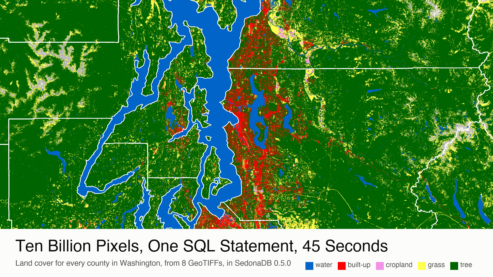
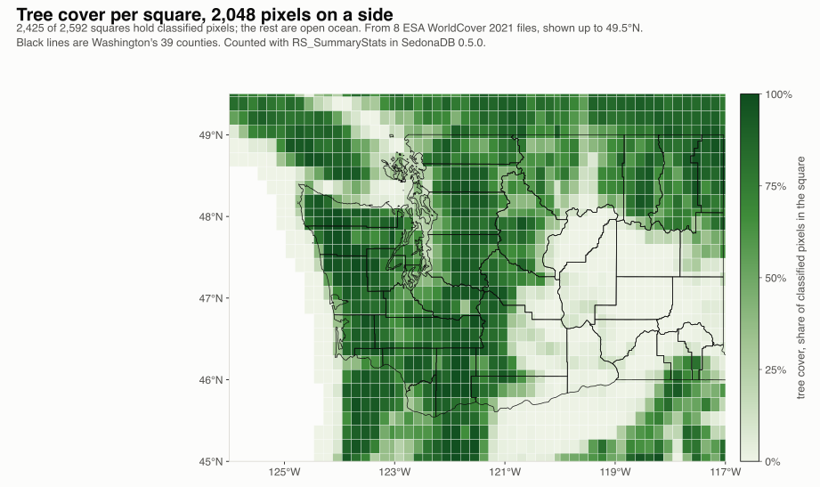
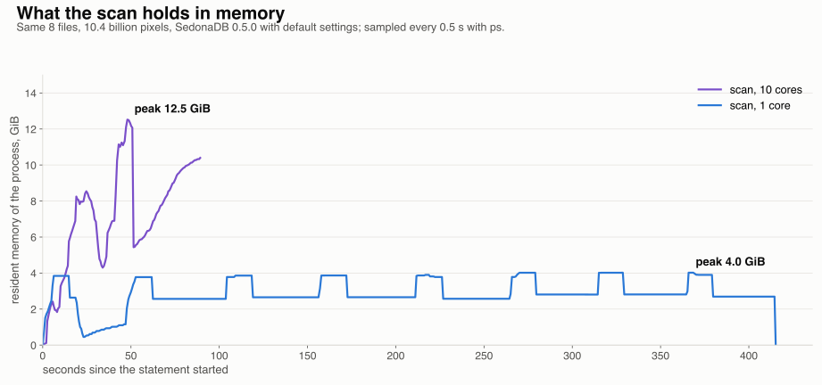

---
date:
  created: 2026-10-09
links:
  - RS_Tile in SedonaDB: https://sedona.apache.org/sedonadb/latest/reference/sql/rs_tile/
  - RS_ZonalStats in SedonaDB: https://sedona.apache.org/sedonadb/latest/reference/sql/rs_zonalstats/
  - ESA WorldCover: https://esa-worldcover.org/
authors:
  - jia
title: "Ten Billion Pixels, One SQL Statement, 45 Seconds"
slug: ten-billion-pixels-one-sql-statement
---

# Ten Billion Pixels, One SQL Statement, 45 Seconds

Where are the trees in Washington State? The answer is spread across 10.4 billion pixels, one byte each. ESA mapped the land cover of the whole planet in 2021, one pixel for every 10 meters of ground, and 8 files of that map cover Washington. SedonaDB 0.5.0 reads the 8 files as one table. One SQL statement joins that table to the 39 counties and returns the tree cover of every county in 45 seconds, on one machine.



<!-- more -->

## One file is a billion pixels

One WorldCover file covers 3 by 3 degrees: 36,000 by 36,000 pixels, 1.3 billion of them. Eight files cover Washington, plus parts of Oregon, Idaho and British Columbia. They are [public](https://registry.opendata.aws/esa-worldcover-vito/), 0.44 GiB to download for all 8, and 9.7 GiB of pixels once decompressed.

`RS_FromPath` opens a file and reads the header. No pixel is read until a function needs one.

```python
import sedona.db

sd = sedona.db.connect()
sd.sql("""
SELECT RS_Width(r) AS width, RS_Height(r) AS height, RS_BandPixelType(r, 1) AS pixel_type,
       RS_BandNoDataValue(r, 1) AS nodata, RS_SRID(r) AS srid
FROM (SELECT RS_FromPath('ESA_WorldCover_10m_2021_v200_N45W123_Map.tif') AS r)
""").show()
```

```
┌───────┬────────┬────────────────┬─────────┬──────┐
│ width ┆ height ┆   pixel_type   ┆  nodata ┆ srid │
╞═══════╪════════╪════════════════╪═════════╪══════╡
│ 36000 ┆  36000 ┆ UNSIGNED_8BITS ┆     0.0 ┆ 4326 │
└───────┴────────┴────────────────┴─────────┴──────┘
```

The pixel values are class codes: 10 is tree cover, 50 is built-up, 80 is permanent water, and 0 means no data.

## The raster becomes a table

A file with a billion pixels is one row. `RS_Tile` cuts it into pieces of 2,048 by 2,048 pixels and returns one list per file; `unnest` turns the list into rows. Eight files become 2,592 rows of 4 MiB each.

From there, every raster function in SedonaDB works per row. This statement counts, for every row, how many pixels are tree cover:

```sql
WITH files AS (SELECT RS_FromPath(path) AS r FROM (VALUES ('N45W123.tif'), ('N48W123.tif')) AS f(path)),
tiles AS (SELECT t['x'] AS x, t['y'] AS y, t['tile'] AS tile
          FROM (SELECT unnest(RS_Tile(r, 2048, 2048)) AS t FROM files))
SELECT x, y,
       RS_SummaryStats(tile, 'count', 1, false) AS pixels,
       RS_SummaryStats(tile, 'count', 1) AS classified,
       RS_SummaryStats(tile, 'count', 1, false) - RS_SummaryStats(RS_SetBandNoDataValue(tile, 1, 10), 'count', 1) AS tree
FROM tiles
```

The last line uses a small trick. `RS_SummaryStats` with `count` counts the pixels that are not nodata, and the `false` at the end counts every pixel. `RS_SetBandNoDataValue` changes which value counts as nodata, without touching a pixel. Set it to 10, count again, and the difference from the full count is the number of tree pixels.



Over all 8 files that is 2,592 rows and 10.4 billion pixels. The scan behind the map also counts built-up and water pixels per row, and it takes 87 seconds on ten cores.

## The county answer

Counties do not follow the cut lines, so the county numbers need two more functions. `RS_Intersects` joins each row to the counties it touches. `RS_ZonalStats` counts the pixels whose centers fall inside a county polygon. `SUM` adds the rows up. The whole thing is one statement:

??? example "Land cover per county, one statement"

    ```sql
    WITH files AS (SELECT RS_FromPath(path) AS r FROM (VALUES ('N45W126.tif'), ('N45W123.tif'), ...) AS f(path)),
    tiles AS (SELECT t['tile'] AS tile FROM (SELECT unnest(RS_Tile(r, 2048, 2048)) AS t FROM files)),
    pairs AS (
      SELECT c.name,
             RS_ZonalStats(t.tile, c.geom, 1, 'count', false, false) AS pixels,
             RS_ZonalStats(t.tile, c.geom, 1, 'count') AS classified,
             RS_ZonalStats(RS_SetBandNoDataValue(t.tile, 1, 10), c.geom, 1, 'count') AS not_tree,
             RS_ZonalStats(RS_SetBandNoDataValue(t.tile, 1, 50), c.geom, 1, 'count') AS not_built,
             RS_ZonalStats(RS_SetBandNoDataValue(t.tile, 1, 80), c.geom, 1, 'count') AS not_water
      FROM tiles t JOIN counties c ON RS_Intersects(t.tile, c.geom))
    SELECT name, SUM(classified) AS pixels,
           SUM(pixels - not_tree) / SUM(classified) AS tree,
           SUM(pixels - not_built) / SUM(classified) AS built,
           SUM(pixels - not_water) / SUM(classified) AS water
    FROM pairs GROUP BY name ORDER BY tree DESC
    ```

    `counties` is a view over the Census Bureau's county boundaries, read with `sd.read_pyogrio` and transformed to EPSG:4326 to match the rasters. In the first count, the last `false` keeps nodata pixels in the count; the `false` before it is `all_touched`, left at its default.

The join produces 1,263 pairs, with 3.0 billion pixels inside Washington's counties. The statement took 45 seconds on ten cores.

| County | Pixels | Tree cover | Built-up | Water |
|---|---:|---:|---:|---:|
| Grays Harbor | 85,641,759 | 91.6% | 0.5% | 1.3% |
| Clallam | 79,522,899 | 90.5% | 0.5% | 1.8% |
| Skamania | 73,075,423 | 90.3% | 0.1% | 1.6% |
| King | 97,560,956 | 79.3% | 7.4% | 3.2% |
| Whitman | 95,895,183 | 2.0% | 0.6% | 0.9% |
| Adams | 85,117,674 | 0.5% | 0.8% | 0.3% |

Statewide, 52.0% of the classified pixels are tree cover, 1.35% are built-up and 1.84% are water. King County, with Seattle, is the most built-up county at 7.4%, and San Juan County has the most water at 10.3%.

The counts match NumPy. For one of the rows over King County, `bincount` over the clipped pixels gives the same 1,288,514 pixels, 654,652 of them trees, 529,781 built-up and 43,094 water.

## Memory stays at one file



Memory follows one rule in the scan. The process holds one file's band and its rows, about 4 GiB, then moves to the next file. On one core, all 10.4 billion pixels went by in 414 seconds and resident memory peaked at 4.0 GiB. Ten cores work on several files at once: 87 seconds, 12.5 GiB.

One setting from 0.5.0 makes the rule work. Query engines size a batch of rows by row count, and a row that holds a raster can weigh a gigabyte. `sedona.raster.max_batch_bytes` sizes a batch of rasters by its pixel bytes, 256 MiB by default.

The eight file rows arrive as one batch. The budget splits it, so one band is loaded at a time. On one core, cutting the 8 files into rows peaks at 6.9 GiB with the default budget, and at 12.9 GiB with the budget set to 64 GiB, which turns the split off.

## The point

- A big raster is a table. `RS_Tile` makes the rows, and SQL does the rest.
- Count a class by making it nodata and counting the others.
- When you need every pixel, scan the rows. When you need boundaries, join the rows to polygons and let `SUM` add them up.

*Land cover from ESA WorldCover 2021 v200, CC BY 4.0; contains modified Copernicus Sentinel data (2021) processed by the ESA WorldCover consortium. County boundaries from the US Census Bureau, 2023 cartographic boundary files. Measurements on SedonaDB 0.5.0, one machine with 10 cores and 64 GiB.*
