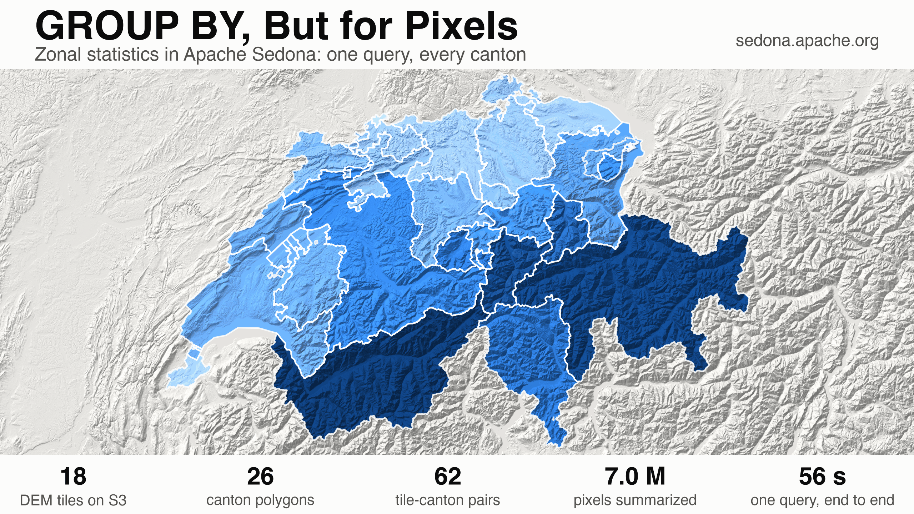
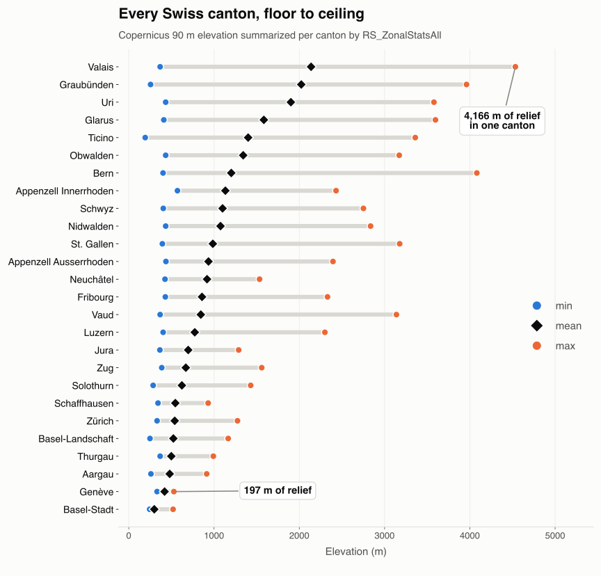
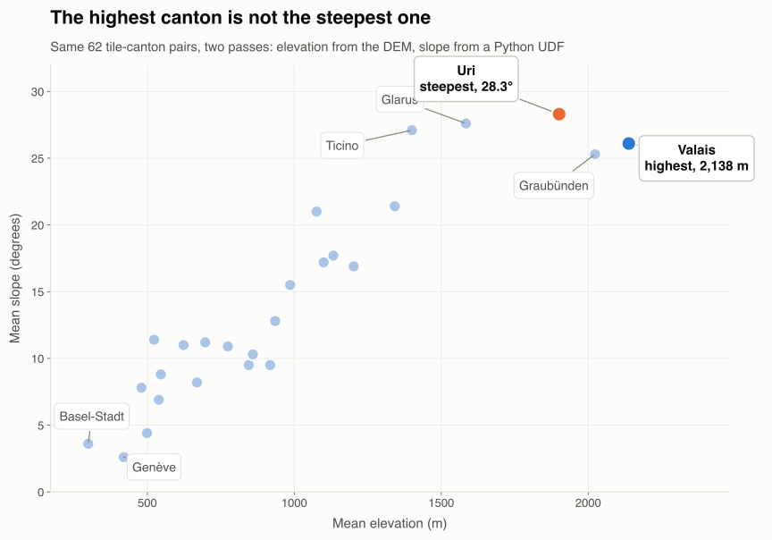

---
date:
  created: 2026-09-04
links:
  - RS_ZonalStatsAll reference: https://sedona.apache.org/latest/api/sql/Raster-Band-Accessors/RS_ZonalStatsAll/
  - Raster tutorial: https://sedona.apache.org/latest/tutorial/raster/
  - Copernicus DEM on AWS: https://registry.opendata.aws/copernicus-dem/
authors:
  - jia
title: "GROUP BY, But for Pixels"
---

# GROUP BY, But for Pixels

Almost every raster question ends at a polygon. Mean elevation per canton, forest cover per district, flood depth per parcel. The imagery arrives as a grid of numbers; the answer has to arrive as a table with one row per zone. Zonal statistics is the operation between the two, and in Sedona it is one function call inside an ordinary spatial join. Below: every Swiss canton, summarized from 7 million elevation pixels pulled straight off S3, in 56 seconds on a laptop.



<!-- more -->

## One call, nine numbers

`RS_ZonalStatsAll(raster, zone)` takes a raster column and a geometry and returns a struct: `count`, `sum`, `mean`, `median`, `mode`, `stddev`, `variance`, `min`, `max`. `RS_ZonalStats(raster, zone, 'mean')` returns a single statistic.

Two defaults shape the output. A pixel counts when its center falls inside the zone, which is the right rule for large zones and the wrong one for zones smaller than a few pixels; pass `allTouched = true` to include every pixel the geometry touches. NODATA pixels are excluded from the arithmetic, so a partly-masked zone reports a mean over the valid pixels. If the zone's CRS differs from the raster's, Sedona reprojects the zone first.

## Switzerland in one query

The elevation comes from the [Copernicus 90 m DEM](https://registry.opendata.aws/copernicus-dem/), an open bucket with one GeoTIFF per 1° tile. Eighteen of them cover Switzerland. The tiled `raster` reader from [our 2 GB wall post](https://sedona.apache.org/latest/blog/2026/07/10/open-huge-geotiffs-without-the-2-gb-wall/) reads them without a download step, and `retile = false` keeps each file as a single row:

```python
dem = (
    sedona.read.format("raster")
    .option("retile", "false")
    .load(
        "s3a://copernicus-dem-90m/"
        "Copernicus_DSM_COG_30_N4{5,6,7}_00_E0{05,06,07,08,09,10}_00_DEM/*_DEM.tif"
    )
)
dem.createOrReplaceTempView("dem")
```

Each row is 1200 × 1200 pixels of EPSG:4326 at 3 arc-seconds. The zones are the 26 Swiss cantons, read from the Overture divisions theme as ordinary GeoParquet.

??? example "Session setup and the canton pull"

    ```python
    from sedona.spark import SedonaContext

    config = (
        SedonaContext.builder()
        .master("local[4]")
        .config("spark.driver.memory", "10g")
        .config(
            "spark.jars.packages",
            "org.apache.sedona:sedona-spark-shaded-3.5_2.12:1.9.1,"
            "org.datasyslab:geotools-wrapper:1.9.1-33.5,"
            "org.apache.hadoop:hadoop-aws:3.3.4",
        )
        .config(
            "spark.hadoop.fs.s3a.aws.credentials.provider",
            "org.apache.hadoop.fs.s3a.AnonymousAWSCredentialsProvider",
        )
        .config(
            "spark.hadoop.fs.s3a.bucket.copernicus-dem-90m.endpoint.region", "eu-central-1"
        )
        .getOrCreate()
    )
    sedona = SedonaContext.create(config)

    cantons = (
        sedona.read.format("geoparquet")
        .load(
            "s3a://overturemaps-us-west-2/release/2026-08-19.0/"
            "theme=divisions/type=division_area/"
        )
        .where("bbox.xmin BETWEEN 5.5 AND 10.7 AND bbox.ymin BETWEEN 45.7 AND 47.9")
        .where("country = 'CH' AND subtype = 'region'")
        .selectExpr("names.primary AS name", "geometry")
    )
    cantons.createOrReplaceTempView("cantons")
    ```

Now the whole thing, as one statement:

```sql
WITH parts AS (
    SELECT c.name, RS_ZonalStatsAll(d.rast, c.geometry) AS s
    FROM dem d JOIN cantons c ON RS_Intersects(d.rast, c.geometry)
)
SELECT name,
       ROUND(SUM(s.sum) / SUM(s.count)) AS mean_m,
       ROUND(MIN(s.min)) AS min_m,
       ROUND(MAX(s.max)) AS max_m
FROM parts
WHERE s.count > 0
GROUP BY name
ORDER BY mean_m DESC
```

Twenty-six rows, 7,006,027 pixels summarized, 56 seconds from a cold session on four laptop cores. The top of the table is the Alps:

```
+----------------------------+---------+------+-----+------+
|name                        |px       |mean_m|min_m|max_m |
+----------------------------+---------+------+-----+------+
|Valais/Wallis               |876887.0 |2138.0|368.0|4534.0|
|Graubünden/Grischun/Grigioni|1202449.0|2023.0|256.0|3961.0|
|Uri                         |182555.0 |1901.0|433.0|3579.0|
|Glarus                      |116676.0 |1584.0|411.0|3597.0|
|Ticino                      |472768.0 |1400.0|193.0|3360.0|
|Obwalden                    |83282.0  |1342.0|433.0|3172.0|
|Bern/Berne                  |1008137.0|1202.0|402.0|4082.0|
|Appenzell Innerrhoden       |29553.0  |1133.0|571.0|2431.0|
+----------------------------+---------+------+-----+------+
```



Valais covers 4,166 m of vertical range. Genève covers 197 m. Both are one row of the same table.

## Why one canton becomes several rows

`RS_Intersects(d.rast, c.geometry)` is a raster-vector spatial join, and it pairs each tile with each zone that overlaps it. Twenty-six cantons and eighteen tiles produce **62 pairs**, because a canton that straddles a tile boundary is measured once per tile. Genève sits on the 6°E line, so it comes back twice:

```
+------+--------+--------+----------------------------------------------------------------------------------------------------------------------------------------------+
|name  |tile_lon|tile_lat|s                                                                                                                                             |
+------+--------+--------+----------------------------------------------------------------------------------------------------------------------------------------------+
|Genève|5.0     |47.0    |{2761.0, 1133564.8060302734, 410.5631314850678, 411.58612060546875, 345.5, 41.7174495306343, 1740.3455953410198, 332.0, 515.2003784179688}    |
|Genève|6.0     |47.0    |{44656.0, 1.8780723717163086E7, 420.56439710594384, 423.7024383544922, 368.0, 34.66281959027446, 1201.5110619479146, 346.5, 529.1962280273438}|
+------+--------+--------+----------------------------------------------------------------------------------------------------------------------------------------------+
```

That fan-out is the reason the pattern scales. Every pair is an independent unit of work: one tile, one polygon, no coordination with any other pair. On a laptop the 62 pairs fill four cores. Point the same query at a continent of tiles and a national parcel layer and the pair count grows into the millions, spread across whatever cluster you have, with the query text unchanged. The tiles themselves never pass through the driver.

## Which numbers survive the reassembly

The price of the fan-out is that the final `GROUP BY` has to put the pieces back together correctly, and not every statistic can be reassembled:

- **`count` and `sum` add.** Both hold across any number of pairs.
- **`min` and `max` combine** by taking the extreme of the extremes.
- **`mean` is a ratio**, so it is `SUM(s.sum) / SUM(s.count)`. Averaging the per-pair means weights a 2,761-pixel sliver the same as a 44,656-pixel remainder, and Genève's answer moves by 5 m.
- **`median`, `mode`, `stddev` and `variance` do not combine.** No arithmetic over per-tile medians produces the median of the union. Those statistics need the whole zone inside a single raster row: read with `retile = false` as above, or mosaic the tiles with `RS_Union_Aggr` before the zonal call.

One more trap produces a wrong number without any error. `RS_Intersects` compares the raster's footprint against the geometry, so a tile can qualify while holding no pixel *center* inside the zone. One of the 62 pairs is that case, and its struct comes back populated:

```
+----------------------------+---------------------------------------------+
|name                        |s                                            |
+----------------------------+---------------------------------------------+
|Graubünden/Grischun/Grigioni|{0.0, 0.0, 0.0, 0.0, 0.0, 0.0, 0.0, 0.0, 0.0}|
+----------------------------+---------------------------------------------+
```

Nine zeros, and one of them is a `min`. Fold that into `MIN(s.min)` and the deepest valley in Graubünden drops to sea level:

```
+----------------------------+---------+------------+
|name                        |naive_min|filtered_min|
+----------------------------+---------+------------+
|Graubünden/Grischun/Grigioni|0.0      |255.5       |
+----------------------------+---------+------------+
```

`WHERE s.count > 0` is the fix, and 255.5 m is the canton's true floor. Drop empty pairs before the aggregate in every zonal pipeline.

## The same 62 pairs, a different question

Zonal statistics summarize any raster column, including one computed on the way in. The DEM carries elevation; slope is a short pass of NumPy over the pixel grid, and [raster Python UDFs](https://sedona.apache.org/latest/blog/2026/08/14/seven-lines-of-numpy-121-million-pixels/) turn that pass into a raster column:

```python
@udf(returnType=RasterType())
def slope_deg(raster):
    z = raster.as_numpy_masked()[0].astype(np.float64)
    t = raster.affine_trans
    lat = t.ip_y + t.scale_y * raster.height / 2.0
    m_per_deg_x = 111320.0 * math.cos(math.radians(lat))
    dzdy, dzdx = np.gradient(z, abs(t.scale_y) * 111320.0, abs(t.scale_x) * m_per_deg_x)
    slope = np.degrees(np.arctan(np.hypot(dzdx, dzdy)))
    out = np.where(np.isnan(slope), -9999.0, slope).astype(np.float32)
    return raster.with_bands(out, nodata=-9999.0)
```

Wrap the DEM column in `slope_deg(...)`, run the identical join and aggregate, and the ranking changes. Uri averages 28.3° across its whole area and tops out at 72.5°, steeper than Valais at 26.1°, even though Valais sits 237 m higher on average. Height and steepness are different questions, answered by the same 62 pairs:



## What else fits this shape

Anything with a raster on one side and geometry on the other. Swap the DEM for [ESA WorldCover](https://registry.opendata.aws/esa-worldcover/) and a UDF that flags one class, and the `sum` of the flag over a zone is that zone's forest or built-up pixel count. Swap the cantons for a million parcels and the join is the same join. Use the [`geotiff.metadata` reader](https://sedona.apache.org/latest/blog/2026/08/07/index-a-million-rasters-without-reading-a-pixel/) to pick which tiles to open.

Resolution is a knob. The same query against the 30 m Copernicus product puts Valais's ceiling at 4,539 m instead of 4,534 m, for nine times the pixels. Both figures describe a surface model sampled on a grid, so they are terrain estimates. The query that produces them is character-for-character the same.

## The point

Rasters and polygons are two different data models, and the join between them is usually where a pipeline turns into an export step, a Python script, and a folder of intermediate files. `RS_ZonalStatsAll` collapses that into a function call in a join, on data you never downloaded. Get the aggregation right, drop the empty pairs, and one query answers the question for 26 zones or 26 million.

*Full parameter list in the [`RS_ZonalStatsAll` reference](https://sedona.apache.org/latest/api/sql/Raster-Band-Accessors/RS_ZonalStatsAll/); reading and writing patterns in the [raster tutorial](https://sedona.apache.org/latest/tutorial/raster/). Contains modified Copernicus DEM data (2026).*
