<!--
 Licensed to the Apache Software Foundation (ASF) under one
 or more contributor license agreements.  See the NOTICE file
 distributed with this work for additional information
 regarding copyright ownership.  The ASF licenses this file
 to you under the Apache License, Version 2.0 (the
 "License"); you may not use this file except in compliance
 with the License.  You may obtain a copy of the License at

   http://www.apache.org/licenses/LICENSE-2.0

 Unless required by applicable law or agreed to in writing,
 software distributed under the License is distributed on an
 "AS IS" BASIS, WITHOUT WARRANTIES OR CONDITIONS OF ANY
 KIND, either express or implied.  See the License for the
 specific language governing permissions and limitations
 under the License.
 -->

# 开发 Sedona

## Scala/Java 开发者

### IDE

推荐使用安装了 Scala 插件的 [Intellij IDEA](https://www.jetbrains.com/idea/)。请确认项目的 SDK 设置为 JDK 1.8。

### 导入项目

#### 选择 `Open`

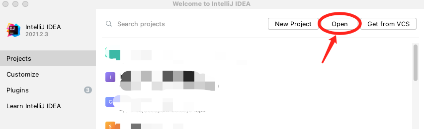

#### 进入 Sedona 根目录（不是子模块目录）并选择 `open`

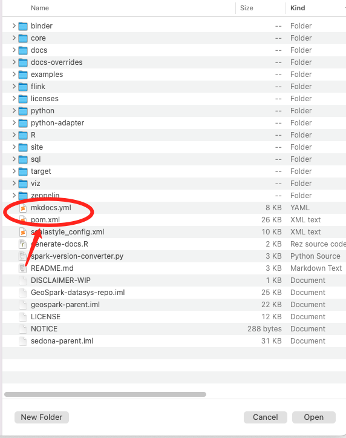

#### IDE 可能会显示错误

IDE 通常难以理解 Sedona 中较为复杂的项目结构。

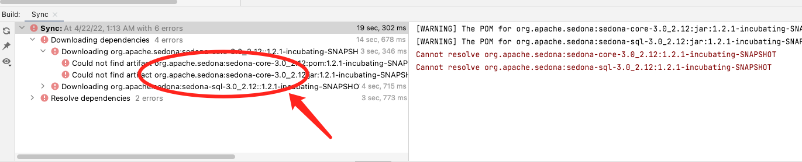

#### 通过修改 `pom.xml` 修复错误

需要在根目录的 `pom.xml` 中注释掉以下几行。==注意：请勿把这一改动提交到 Sedona。==

```xml
<!--    <parent>-->
<!--        <groupId>org.apache</groupId>-->
<!--        <artifactId>apache</artifactId>-->
<!--        <version>23</version>-->
<!--        <relativePath />-->
<!--    </parent>-->
```

#### 重新加载 `pom.xml`

确保重新加载 `pom.xml` 或重新加载整个 Maven 项目。IDE 会询问是否移除一些模块，请选择 `yes`。

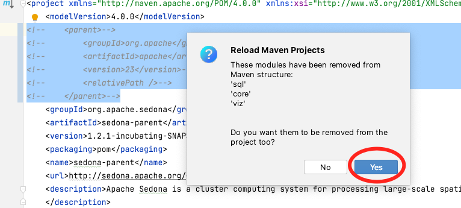

#### 最终的项目结构应该是这样：

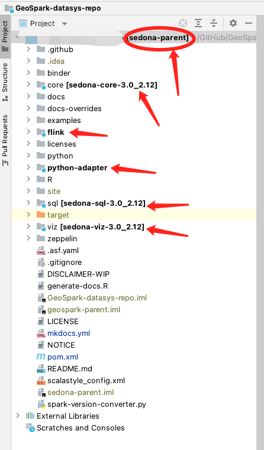

### 运行单元测试

#### 运行所有单元测试

在终端中进入 Sedona 根目录运行 `mvn clean install`。全部测试需要超过 15 分钟。如果只想构建 jar，运行 `mvn clean install -DskipTests`。

!!!Note
    `mvn clean install` 默认基于 Spark 3.3、Scala 2.12 编译 Sedona。如果 $SPARK_HOME 中是不同版本的 Spark，请通过 `-Dspark` 命令行参数指定。例如基于 Spark 3.4 与 Scala 2.12 编译：`mvn clean install -Dspark=3.4 -Dscala=2.12`。

更多细节请参阅 [编译 Sedona](../setup/compile.md)。

#### 运行单个单元测试

在 IDE 中右键点击某个测试用例即可运行。

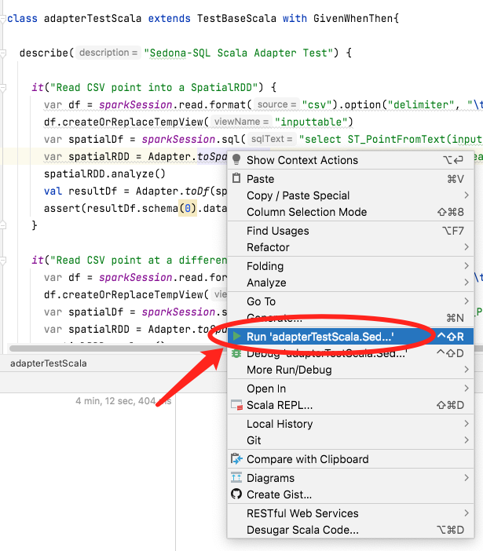

运行 Scala 编写的测试用例时，IDE 可能会提示 “Path does not exist”，如下：

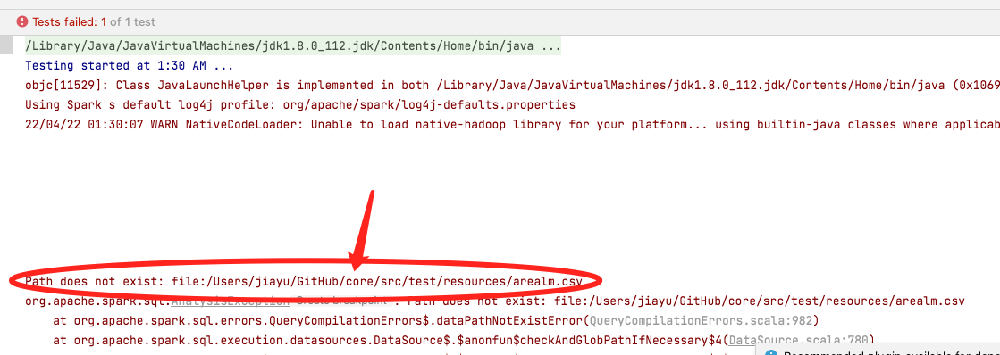

进入 `Edit Configuration`：

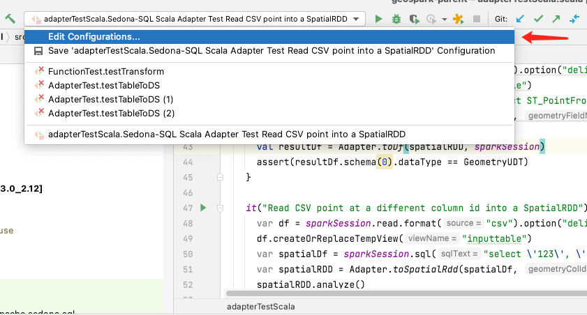

把 `Working Directory` 的值改为 `$MODULE_WORKING_DIR$`：

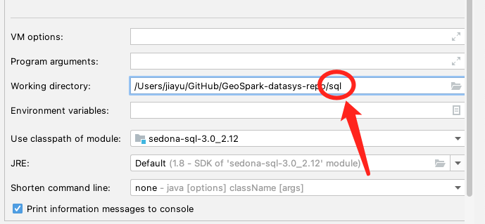

重新运行该测试用例。**不要**右键再次运行，请点击下图所示的按钮：

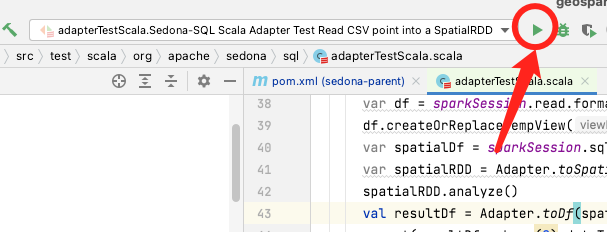

如果不想每次都修改 `Working Directory`，可以在 `Run/Debug Configurations` 窗口中修改 `Working Directory` 的默认值。点击 `Edit configuration templates...`，把 ScalaTest 的 `Working Directory` 设为 `$MODULE_WORKING_DIR$`。

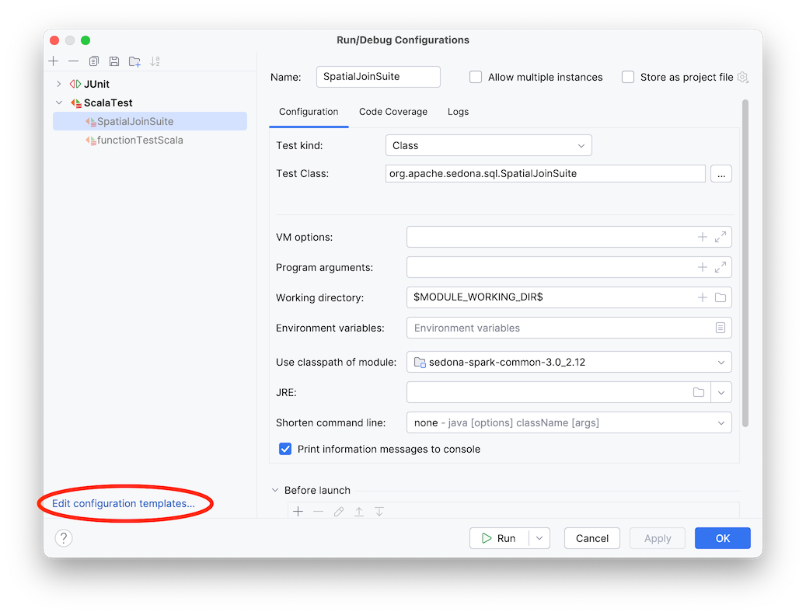
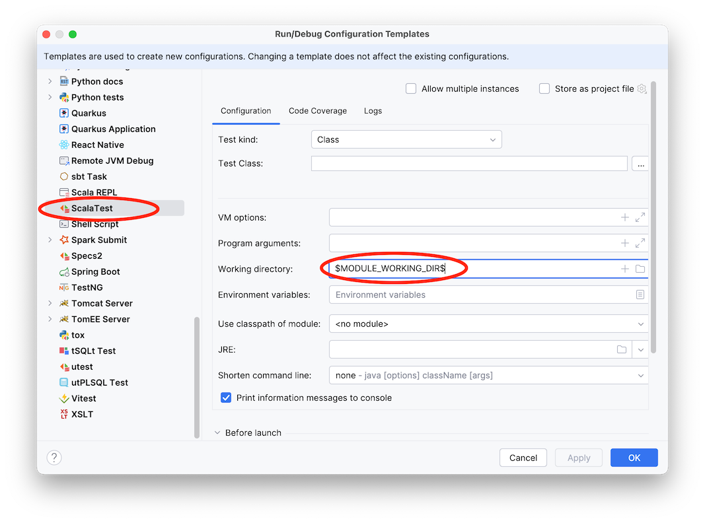

之后新建的 ScalaTest run configuration 都会自动使用正确的 `Working Directory`。

### 使用 Java 11 时的 IDE 配置

如果使用 Java 11，运行测试时可能遇到如下错误：

```
/path/to/sedona/common/src/main/java/org/apache/sedona/common/geometrySerde/UnsafeGeometryBuffer.java
package sun.misc does not exist
sun.misc.Unsafe
```

可在 IDE 设置中关闭 `Use '--release' option for cross-compilation` 来解决。

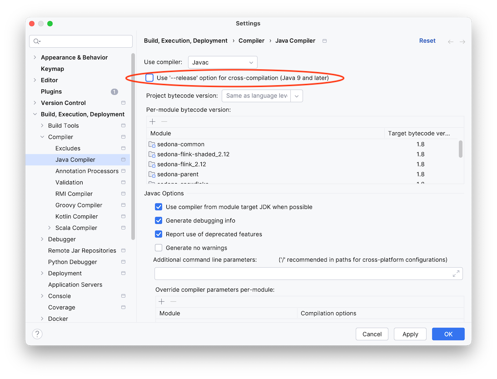

### 在不同 Spark/Scala 版本下运行测试

如需在不同 Spark/Scala 版本下测试改动，可在 Maven 面板中选择对应的 Spark 与 Scala profile。选择后请重新加载 sedona-parent 项目，参考下图。

!!!Note
    Profile 切换不会自动更新 IDE 中的模块名。如果模块名仍带有 `-3.3-2.12` 等后缀，不必感到困惑。

!!!Note
    并非所有 Spark 与 Scala 的组合都受支持，部分组合会编译失败。

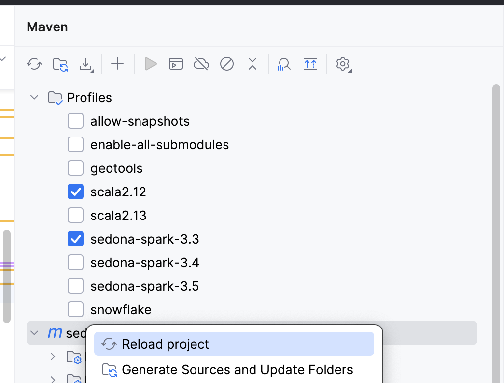

## Python 开发者

### IDE

推荐使用 [PyCharm](https://www.jetbrains.com/pycharm/)。

### 运行测试

#### 运行所有 Python 测试

按照 [此处](../setup/compile.md#run-python-test) 的步骤完成环境配置。

环境就绪后，在 python 目录下运行：

```bash
cd python
uv run pytest -v tests
```

#### 运行单个测试

如需运行某个特定的 Python 测试文件，传入 `.py` 路径即可。

例如运行 `python/tests/sql/test_function.py` 中的所有测试：

```bash
cd python
uv run pytest -v tests/sql/test_function.py
```

要运行某个文件中的特定测试，向 `pytest` 传入 `file_name::class_name::test_name`。

例如运行 `sql/test_predicate.py` 中关于 `ST_Contains` 的测试：

```bash
cd python
uv run pytest -v tests/sql/test_predicate.py::TestPredicate::test_st_contains
```

### 构建包

下面的命令会在 `dist` 目录中生成 sdist 与 whl 包：

```bash
cd python
uv build
```

## R 开发者

更多内容稍后补充。

### IDE

推荐使用 [RStudio](https://posit.co/products/open-source/rstudio/)。

### 导入项目
