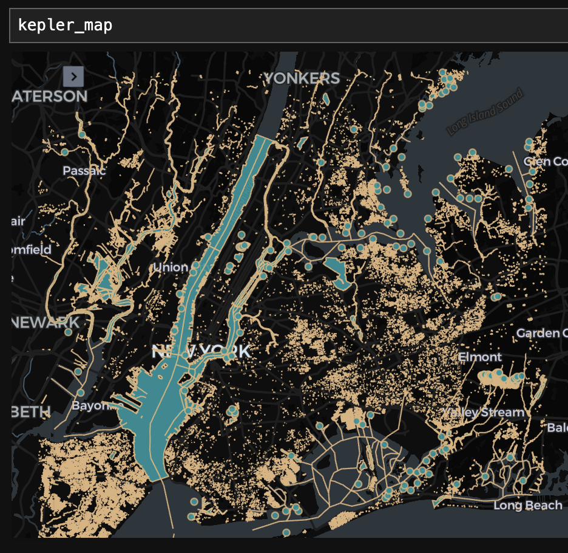

<!--
 Licensed to the Apache Software Foundation (ASF) under one
 or more contributor license agreements.  See the NOTICE file
 distributed with this work for additional information
 regarding copyright ownership.  The ASF licenses this file
 to you under the Apache License, Version 2.0 (the
 "License"); you may not use this file except in compliance
 with the License.  You may obtain a copy of the License at

   http://www.apache.org/licenses/LICENSE-2.0

 Unless required by applicable law or agreed to in writing,
 software distributed under the License is distributed on an
 "AS IS" BASIS, WITHOUT WARRANTIES OR CONDITIONS OF ANY
 KIND, either express or implied.  See the License for the
 specific language governing permissions and limitations
 under the License.
 -->

# SedonaSpark

SedonaSpark 在 Apache Spark 之上扩展了一套丰富、开箱即用的分布式空间数据集和函数，能够在多台机器之间高效地加载、处理和分析大规模空间数据。当数据集规模超过单机处理能力时，SedonaSpark 是一个非常合适的选择。

=== "SQL"

    ```sql
    SELECT superhero.name
    FROM city, superhero
    WHERE ST_Contains(city.geom, superhero.geom)
    AND city.name = 'Gotham'
    ```

=== "PySpark"

    ```python
    sedona.sql("""
        SELECT superhero.name
        FROM city, superhero
        WHERE ST_Contains(city.geom, superhero.geom)
        AND city.name = 'Gotham'
    """)
    ```

=== "Java"

    ```java
    Dataset<Row> result = spark.sql(
    "SELECT superhero.name " +
    "FROM city, superhero " +
    "WHERE ST_Contains(city.geom, superhero.geom) " +
    "AND city.name = 'Gotham'"
    );
    ```

=== "Scala"

    ```scala
    sedona.sql("""
        SELECT superhero.name
        FROM city, superhero
        WHERE ST_Contains(city.geom, superhero.geom)
        AND city.name = 'Gotham'
    """)
    ```

=== "R"

    ```r
    result <- sql("
    SELECT superhero.name
    FROM city, superhero
    WHERE ST_Contains(city.geom, superhero.geom)
    AND city.name = 'Gotham'
    ")
    ```

## 主要特性

* **极致性能**：SedonaSpark 在集群中的多个节点上并行执行计算，使大规模计算能够快速完成。
* 支持**多种文件格式**，包括 GeoJSON、Shapefile、GeoParquet、STAC、JDBC、OSM PBF、CSV 和 PostGIS。
* 提供多种**语言 API**，包括 SQL、Python、Java、Scala 和 R。
* **可扩展**：可根据数据规模水平扩展到数十、数百乃至数千个节点，使用 SedonaSpark 处理海量空间数据集。
* **可移植**：易于在自定义环境中运行，可在本地或云端（如 AWS EMR、Microsoft Fabric、Google DataProc）部署。
* **可扩展定制**：可以使用自定义逻辑对 SedonaSpark 进行扩展，以满足特定的地理空间数据分析需求。
* **开源**：Apache Sedona 是一个开源项目，遵循 Apache 软件基金会的相关准则进行管理。
* 提供更多扩展能力，例如 [最近邻搜索](https://sedona.apache.org/latest/api/sql/NearestNeighbourSearching/) 以及诸如 [DBSCAN](https://sedona.apache.org/latest/tutorial/sql/#cluster-with-dbscan) 等空间统计算法。

## 可移植性

SedonaSpark 易于在本地、Docker 中或主流云平台上运行。

SedonaSpark 设计为可在任何能运行 Spark 的环境中运行。许多云厂商都提供 Spark 运行时，Sedona 可以作为依赖库添加进去。

在本地运行 Sedona 也很方便，可以在将代码部署到生产数据集之前快速迭代。

## 使用 Spark 和 Sedona 处理矢量数据的示例

下面看一下如何使用 Spark 和 Sedona 在矢量数据集上完成一次完整的工作流程。

我们使用 Overture Maps Foundation 提供的基础水体数据，将纽约市地区的所有水体绘制到地图上。首先读取数据并创建视图：

```
base_water = sedona.table("open_data.overture_maps_foundation.base_water")
base_water.createOrReplaceTempView("base_water_view")
```

然后过滤出纽约市地区范围内的水体：

```python
spot = "POLYGON ((-74.174194 40.509623, -73.635864 40.509623, -73.635864 40.93634, -74.174194 40.93634, -74.174194 40.509623))"
query = f"""
select id, geometry from base_water_view
where ST_Contains(ST_GeomFromWKT('{spot}'), geometry)
"""
res = sedona.sql(query)
```

Sedona 与主流的可视化库无缝集成，可以轻松地从 Sedona DataFrame 创建地图。仅需两行代码即可生成一张地图：

```python
kepler_map = SedonaKepler.create_map()
SedonaKepler.add_df(kepler_map, df=res, name="Tri-state water")
```

地图效果非常出色！



通过这张地图，可以清晰地看到纽约市地区的所有河流、湖泊乃至游泳池。

## 有疑问？

欢迎在 GitHub Discussions 发起讨论，或者加入 Discord 社区向开发者提问。

我们期待与您协作！
