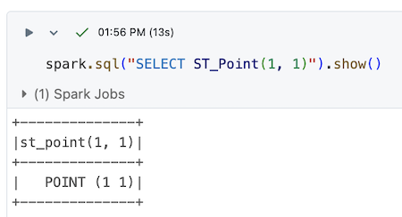

<!--
 Licensed to the Apache Software Foundation (ASF) under one
 or more contributor license agreements.  See the NOTICE file
 distributed with this work for additional information
 regarding copyright ownership.  The ASF licenses this file
 to you under the Apache License, Version 2.0 (the
 "License"); you may not use this file except in compliance
 with the License.  You may obtain a copy of the License at

   http://www.apache.org/licenses/LICENSE-2.0

 Unless required by applicable law or agreed to in writing,
 software distributed under the License is distributed on an
 "AS IS" BASIS, WITHOUT WARRANTIES OR CONDITIONS OF ANY
 KIND, either express or implied.  See the License for the
 specific language governing permissions and limitations
 under the License.
 -->

You can run Sedona in Databricks to leverage the functionality that Sedona provides.  Here’s an example of a Databricks notebook that’s running Sedona code:



Sedona isn’t available in all Databricks environments because of the platform's limitations. This post explains how and where you can run Sedona in Databricks.

## Databricks and Sedona version requirements

Databricks and Sedona depend on Spark, Scala, and other libraries.

For example, one Databricks Runtime 16.4 depends on Scala 2.12 and Spark 3.5.  Here are the version requirements for a few Databricks runtimes.


If you use a Databricks Runtime compiled with Spark 3.5 and Scala 2.12, then you should use a Sedona version compiled with Spark 3.5 and Scala 2.12.  You need to make sure the Scala versions are aligned, even if you’re using the Python or SQL APIs.

## Install the Sedona library in Databricks

Download the required Sedona packages by executing the following commands:

```sh
%sh
# Create JAR directory for Sedona
mkdir -p /Workspace/Shared/sedona/{{ sedona.current_version }}

# Download the dependencies from Maven into DBFS
curl -o /Workspace/Shared/sedona/{{ sedona.current_version }}/geotools-wrapper-{{ sedona.current_geotools }}.jar "https://repo1.maven.org/maven2/org/datasyslab/geotools-wrapper/{{ sedona.current_geotools }}/geotools-wrapper-{{ sedona.current_geotools }}.jar"

curl -o /Workspace/Shared/sedona/{{ sedona.current_version }}/sedona-spark-shaded-3.5_2.12-{{ sedona.current_version }}.jar "https://repo1.maven.org/maven2/org/apache/sedona/sedona-spark-shaded-3.5_2.12/{{ sedona.current_version }}/sedona-spark-shaded-3.5_2.12-{{ sedona.current_version }}.jar"
```

Here are the software versions used to compile `sedona-spark-shaded-3.5_2.12-{{ sedona.current_version }}.jar`:

* Spark 3.5
* Scala 2.12
* Sedona {{ sedona.current_version }}

Ensure that you use a Databricks Runtime with versions compatible with this jar.

You will be able to see these in your Databricks environment after downloading them:


Create an init script as follows:

```
%sh

# Create init script directory for Sedona
mkdir -p /Workspace/Shared/sedona/

# Create init script
cat > /Workspace/Shared/sedona/sedona-init.sh <<'EOF'
#!/bin/bash
#
# File: sedona-init.sh
#
# On cluster startup, this script will copy the Sedona jars to the cluster's default jar directory.

# Optional: Remove Databricks' bundled H3 JAR to avoid version conflicts with Sedona's H3 functions.
# Databricks bundles H3 v3.x which is incompatible with Sedona's H3 v4.x API.
# Uncomment the following line if you need to use Sedona's H3 functions (e.g., ST_H3CellIDs).
# rm -f /databricks/jars/*h3*.jar

cp /Workspace/Shared/sedona/{{ sedona.current_version }}/*.jar /databricks/jars

EOF
```

## Create a Databricks cluster

You need to create a Databricks cluster compatible with the Sedona JAR files.  If you use Sedona JAR files compiled with Scala 2.12, you must use a Databricks cluster that runs Scala 2.12.

Go to the compute tab and configure the cluster:


Set the proper cluster configurations:


Here’s a list of the cluster configurations that’s easy to copy and paste:

```
spark.sql.extensions org.apache.sedona.viz.sql.SedonaVizExtensions,org.apache.sedona.sql.SedonaSqlExtensions
spark.serializer org.apache.spark.serializer.KryoSerializer
spark.kryo.registrator org.apache.sedona.core.serde.SedonaKryoRegistrator
spark.sedona.enableParserExtension false
```

Specify the path to the init script:


If you are creating a Shared cluster, you won't be able to use init scripts and jars stored under Workspace. Please store them in volumes instead. The overall process should be the same.

Add the required dependencies in the Library tab:


Here’s the full list of libraries:

```
apache-sedona=={{ sedona.current_version }}
geopandas==1.0.1
keplergl==0.3.7
pydeck==0.9.1
```

Then click “Create compute” to start the cluster.

## Create a Databricks notebook

Create a Databricks notebook and connect it to the cluster.  Verify that you can run a Python computation with a Sedona function:


If you want to use Sedona Python functions such as [DataFrame APIs](../api/sql/DataFrameAPI.md) or [StructuredAdapter](../tutorial/sql.md#spatialrdd-to-dataframe-with-spatial-partitioning), you need to initialize Sedona as follows:

```python
from sedona.spark import *

sedona = SedonaContext.create(spark)
```

You can also use the SQL API as follows:


## Saving geometry in Databricks Delta Lake tables

Here’s how to create a Sedona DataFrame with a geometry column

```python
df = sedona.createDataFrame(
    [
        ("a", "POLYGON((1.0 1.0,1.0 3.0,2.0 3.0,2.0 1.0,1.0 1.0))"),
        ("b", "LINESTRING(4.0 1.0,4.0 2.0,6.0 4.0)"),
        ("c", "POINT(9.0 2.0)"),
    ],
    ["id", "geometry"],
)
df = df.withColumn("geometry", expr("ST_GeomFromWKT(geometry)"))
```

Write the Sedona DataFrame to a Delta Lake table:

```python
df.write.saveAsTable("your_org.default.geotable")
```

Here’s how to read the table: `sedona.table("your_org.default.geotable").display()`

This is what the results look like in Databricks:


## Known issues

To ensure stability, we recommend using a currently supported Long-Term Support (LTS) version, such as Databricks Runtime 16.4 LTS or 15.4 LTS.  Some Databricks Runtimes, such as 16.2 (non-LTS), are not compatible with Apache Sedona, as this particular runtime introduced a change in the json4s dependency.

### H3 function errors on Databricks

Databricks Runtime bundles an older version of the H3 library (v3.x) which is incompatible with Sedona's H3 functions (which require H3 v4.x). If you see errors like:

```
java.lang.NoSuchMethodError: com.uber.h3core.H3Core.polygonToCells(...)
```

when calling `ST_H3CellIDs`, `ST_H3CellDistance`, `ST_H3KRing`, `ST_H3ToGeom`, or other Sedona H3 functions, it means Databricks' bundled H3 library is taking precedence over Sedona's.

The init script provided above includes an optional fix: uncomment the line `rm -f /databricks/jars/*h3*.jar` to remove the Databricks-bundled H3 JAR before copying Sedona's JARs. This allows Sedona's H3 v4.x to be used instead.

!!!note
    Removing the Databricks-bundled H3 JAR will disable Databricks' built-in H3 SQL expressions (e.g., `h3_coverash3`, `h3_boundaryaswkt`). Sedona provides equivalent H3 functions that can be used as replacements.
