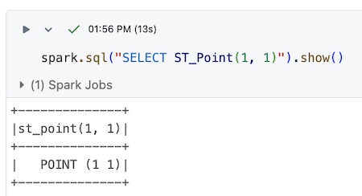
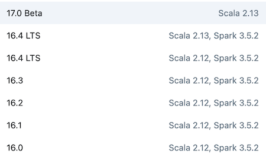
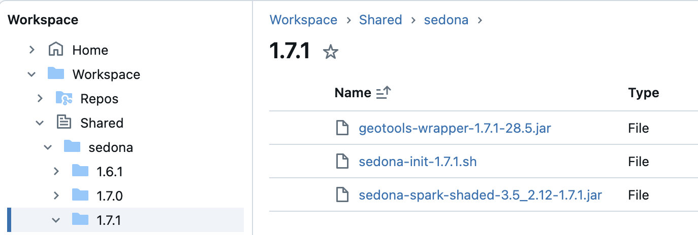
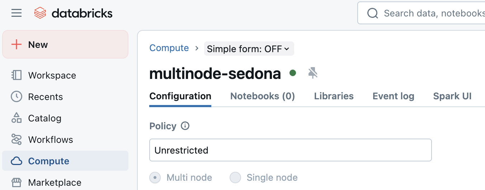
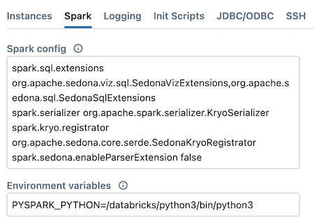
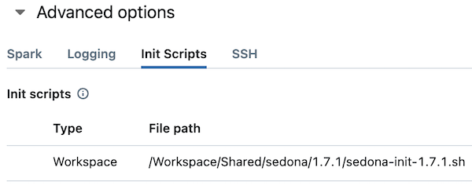
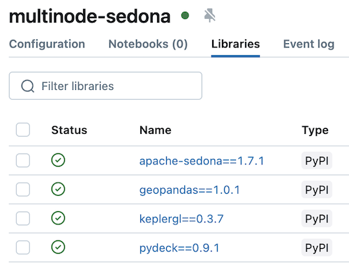
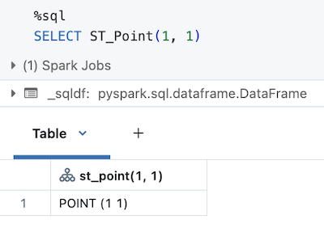
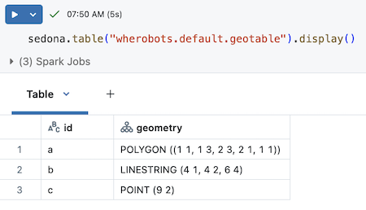

<!--
 Licensed to the Apache Software Foundation (ASF) under one
 or more contributor license agreements.  See the NOTICE file
 distributed with this work for additional information
 regarding copyright ownership.  The ASF licenses this file
 to you under the Apache License, Version 2.0 (the
 "License"); you may not use this file except in compliance
 with the License.  You may obtain a copy of the License at

   http://www.apache.org/licenses/LICENSE-2.0

 Unless required by applicable law or agreed to in writing,
 software distributed under the License is distributed on an
 "AS IS" BASIS, WITHOUT WARRANTIES OR CONDITIONS OF ANY
 KIND, either express or implied.  See the License for the
 specific language governing permissions and limitations
 under the License.
 -->

您可以在 Databricks 中运行 Sedona，以充分利用 Sedona 提供的功能。下面是一个运行 Sedona 代码的 Databricks notebook 示例：



由于平台限制，Sedona 并非在所有 Databricks 环境中都可用。本文将说明如何以及在哪些 Databricks 环境中运行 Sedona。

## Databricks 与 Sedona 的版本要求

Databricks 与 Sedona 都依赖 Spark、Scala 等多个库。

例如，某个 Databricks Runtime 16.4 依赖 Scala 2.12 与 Spark 3.5。下表给出几个 Databricks 运行时的版本要求：



如果使用基于 Spark 3.5 与 Scala 2.12 编译的 Databricks Runtime，那么也应使用基于 Spark 3.5 与 Scala 2.12 编译的 Sedona 版本。即使您只使用 Python 或 SQL API，Scala 版本也必须保持一致。

## 在 Databricks 中安装 Sedona 库

执行以下命令下载所需的 Sedona 包：

```sh
%sh
# 为 Sedona 创建 JAR 目录
mkdir -p /Workspace/Shared/sedona/{{ sedona.current_version }}

# 从 Maven 下载依赖到 DBFS
curl -o /Workspace/Shared/sedona/{{ sedona.current_version }}/geotools-wrapper-{{ sedona.current_geotools }}.jar "https://repo1.maven.org/maven2/org/datasyslab/geotools-wrapper/{{ sedona.current_geotools }}/geotools-wrapper-{{ sedona.current_geotools }}.jar"

curl -o /Workspace/Shared/sedona/{{ sedona.current_version }}/sedona-spark-shaded-3.5_2.12-{{ sedona.current_version }}.jar "https://repo1.maven.org/maven2/org/apache/sedona/sedona-spark-shaded-3.5_2.12/{{ sedona.current_version }}/sedona-spark-shaded-3.5_2.12-{{ sedona.current_version }}.jar"
```

`sedona-spark-shaded-3.5_2.12-{{ sedona.current_version }}.jar` 的编译环境如下：

* Spark 3.5
* Scala 2.12
* Sedona {{ sedona.current_version }}

请确保使用与该 jar 兼容的 Databricks Runtime。

下载完成后，您应在 Databricks 环境中看到这些文件：



按以下方式创建一个初始化脚本：

```
%sh

# 为 Sedona 创建初始化脚本目录
mkdir -p /Workspace/Shared/sedona/

# 创建初始化脚本
cat > /Workspace/Shared/sedona/sedona-init.sh <<'EOF'
#!/bin/bash
#
# File: sedona-init.sh
#
# 集群启动时，将 Sedona 的 jar 复制到集群默认的 jar 目录。

# 可选：移除 Databricks 自带的 H3 JAR，以避免与 Sedona 的 H3 函数发生版本冲突。
# Databricks 自带的是 H3 v3.x，与 Sedona 使用的 H3 v4.x API 不兼容。
# 如果您需要使用 Sedona 的 H3 函数（如 ST_H3CellIDs），请取消下一行的注释。
# rm -f /databricks/jars/*h3*.jar

cp /Workspace/Shared/sedona/{{ sedona.current_version }}/*.jar /databricks/jars

EOF
```

## 创建 Databricks 集群

需要创建与 Sedona JAR 文件兼容的 Databricks 集群。如果使用基于 Scala 2.12 编译的 Sedona JAR，集群也必须运行 Scala 2.12。

进入 compute 选项卡并配置集群：



设置正确的集群配置：



下面是方便复制粘贴的集群配置项列表：

```
spark.sql.extensions org.apache.sedona.viz.sql.SedonaVizExtensions,org.apache.sedona.sql.SedonaSqlExtensions
spark.serializer org.apache.spark.serializer.KryoSerializer
spark.kryo.registrator org.apache.sedona.core.serde.SedonaKryoRegistrator
spark.sedona.enableParserExtension false
```

指定初始化脚本的路径：



如果您创建的是 Shared 集群，则无法使用存放在 Workspace 中的 init 脚本与 jar，请改为存放到 volume 中。整体流程保持一致。

在 Library 选项卡中加入所需依赖：



完整库列表如下：

```
apache-sedona=={{ sedona.current_version }}
geopandas==1.0.1
keplergl==0.3.7
pydeck==0.9.1
```

然后点击 “Create compute” 启动集群。

## 创建 Databricks notebook

新建一个 Databricks notebook 并连接到刚才创建的集群。验证可以运行包含 Sedona 函数的 Python 计算：


如果您希望使用 Sedona 的 Python 函数，例如 [DataFrame API](../api/sql/DataFrameAPI.md) 或 [StructuredAdapter](../tutorial/sql.md#spatialrdd-to-dataframe-with-spatial-partitioning)，则需要按以下方式初始化 Sedona：

```python
from sedona.spark import *

sedona = SedonaContext.create(spark)
```

也可以使用 SQL API：



## 在 Databricks Delta Lake 表中保存几何对象

下面演示如何创建带几何列的 Sedona DataFrame：

```python
df = sedona.createDataFrame(
    [
        ("a", "POLYGON((1.0 1.0,1.0 3.0,2.0 3.0,2.0 1.0,1.0 1.0))"),
        ("b", "LINESTRING(4.0 1.0,4.0 2.0,6.0 4.0)"),
        ("c", "POINT(9.0 2.0)"),
    ],
    ["id", "geometry"],
)
df = df.withColumn("geometry", expr("ST_GeomFromWKT(geometry)"))
```

将 Sedona DataFrame 写入 Delta Lake 表：

```python
df.write.saveAsTable("your_org.default.geotable")
```

读取该表的方式：`sedona.table("your_org.default.geotable").display()`

在 Databricks 中的结果大致如下：



## 已知问题

为保证稳定性，建议使用当前在维护的长期支持（LTS）版本，例如 Databricks Runtime 16.4 LTS 或 15.4 LTS。部分 Databricks Runtime（如非 LTS 的 16.2）与 Apache Sedona 不兼容，原因是该运行时变更了 json4s 的依赖版本。

### Databricks 上的 H3 函数报错

Databricks Runtime 自带较旧的 H3 库（v3.x），与 Sedona 的 H3 函数（需要 H3 v4.x）不兼容。在调用 `ST_H3CellIDs`、`ST_H3CellDistance`、`ST_H3KRing`、`ST_H3ToGeom` 或其他 Sedona H3 函数时，如果出现类似报错：

```
java.lang.NoSuchMethodError: com.uber.h3core.H3Core.polygonToCells(...)
```

说明 Databricks 自带的 H3 库覆盖了 Sedona 携带的版本。

上文提供的初始化脚本中包含一个可选修复：取消 `rm -f /databricks/jars/*h3*.jar` 这一行的注释，先移除 Databricks 自带的 H3 JAR，再复制 Sedona 的 JAR。这样就可以使用 Sedona 的 H3 v4.x。

!!!note
    移除 Databricks 自带的 H3 JAR 会导致 Databricks 内置的 H3 SQL 表达式（如 `h3_coverash3`、`h3_boundaryaswkt`）失效。Sedona 提供了等价的 H3 函数可作为替代。
