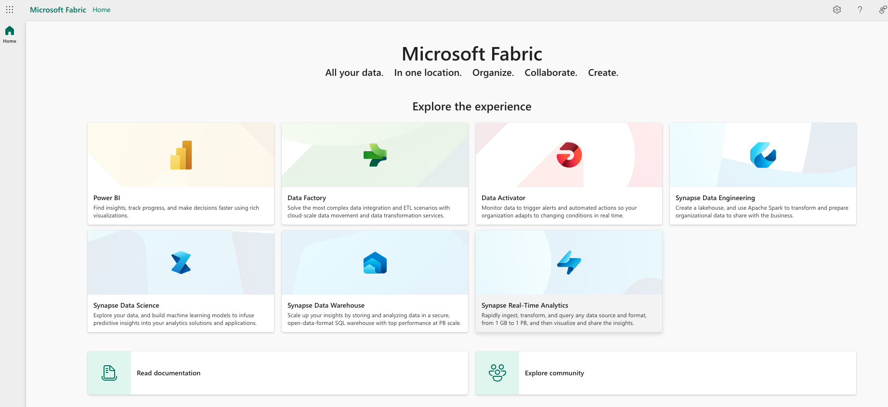
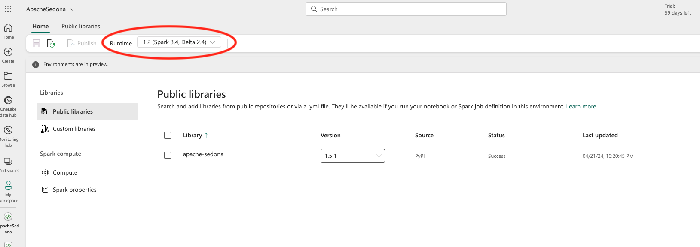
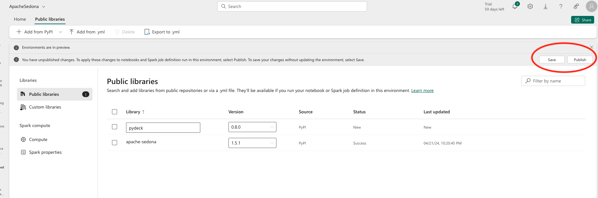
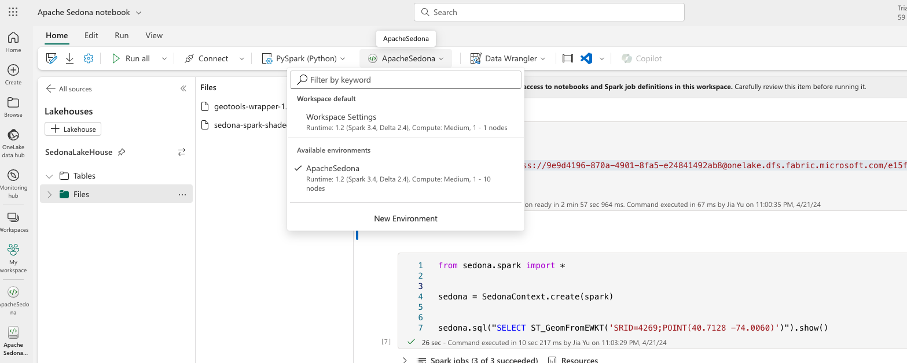
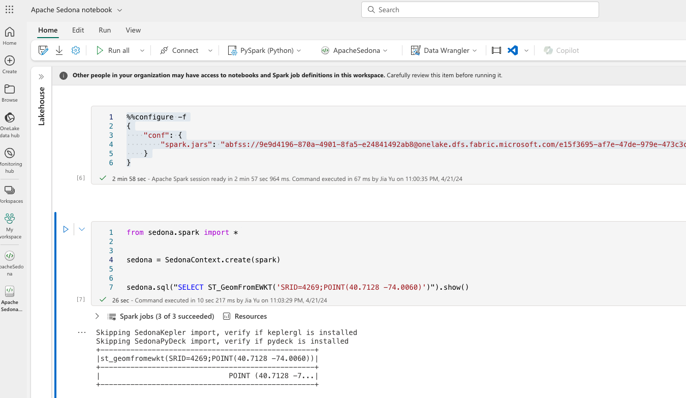
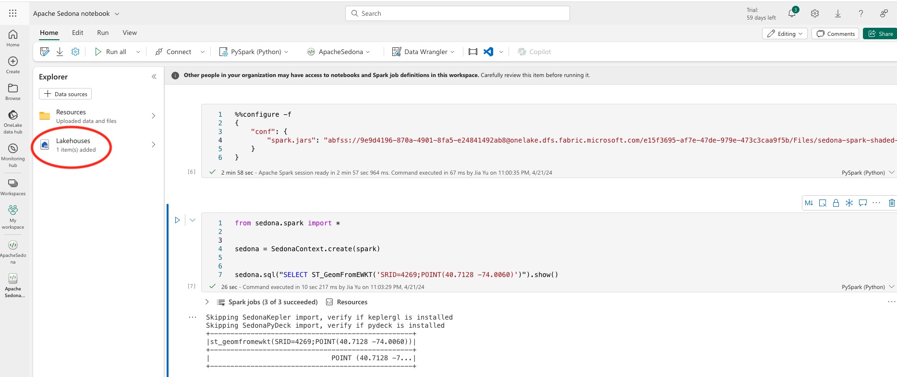
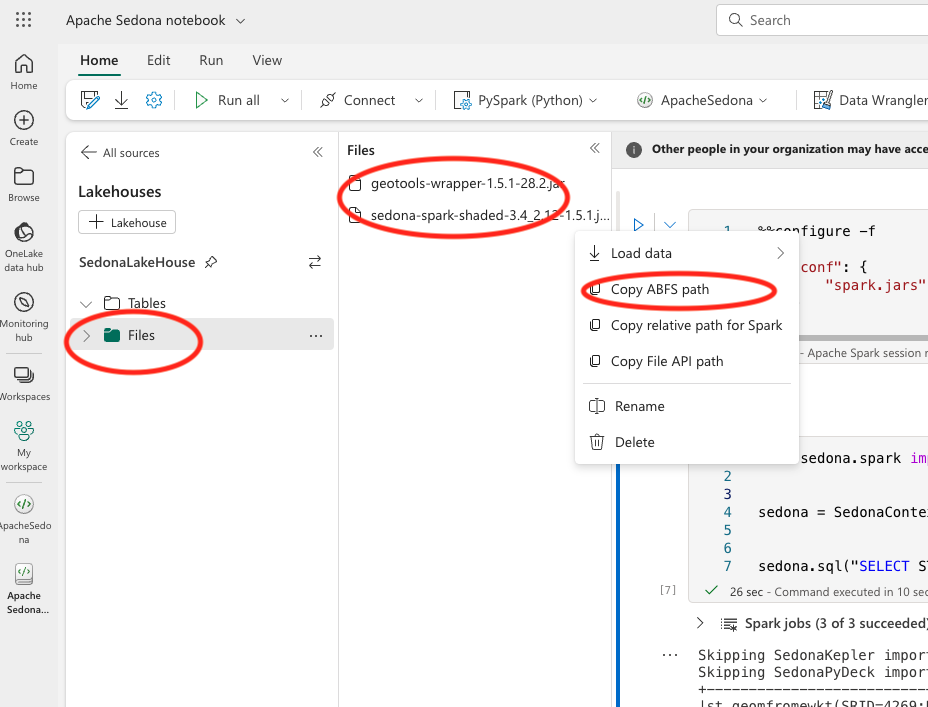

This tutorial will guide you through the process of installing Sedona on Microsoft Fabric Synapse Data Engineering's Spark environment.

## Step 1: Open Microsoft Fabric Synapse Data Engineering

Go to the [Microsoft Fabric portal](https://app.fabric.microsoft.com/) and choose the `Data Engineering` option.



## Step 2: Create a Microsoft Fabric Data Engineering environment

On the left side, click `My Workspace` and then click `+ New` to create a new `Environment`. Let's name it `ApacheSedona`.


## Step 3: Select the Apache Spark version

In the `Environment` page, click the `Home` tab and select the appropriate version of Apache Spark. You will need this version to install the correct version of Apache Sedona.



## Step 4: Install the Sedona Python package

In the `Environment` page, click the `Public libraries` tab and then type in `apache-sedona`. Please select the appropriate version of Apache Sedona. The source is `PyPI`.


## Step 5: Set Spark properties

In the `Environment` page, click the `Spark properties` tab, then create the following 3 properties:

- `spark.sql.extensions`: `org.apache.sedona.viz.sql.SedonaVizExtensions,org.apache.sedona.sql.SedonaSqlExtensions`
- `spark.serializer`: `org.apache.spark.serializer.KryoSerializer`
- `spark.kryo.registrator`: `org.apache.sedona.core.serde.SedonaKryoRegistrator`


## Step 6: Save and publish the environment

Click the `Save` button and then click the `Publish` button to save and publish the environment. This will create the environment with the Apache Sedona Python package installed. The publishing process will take about 10 minutes.



## Step 7: Find the download links of Sedona jars

1. Learn the Sedona jars you need from our [Sedona maven coordinate](maven-coordinates.md)
2. Find the `sedona-spark-shaded` jar from [Maven Central](https://search.maven.org/search?q=g:org.apache.sedona). Please pay attention to the Spark version and Scala version of the jars. If you select Spark 3.4 in the Fabric environment, you should download the Sedona jars with Spark 3.4 and Scala 2.12 and the jar name should be like `sedona-spark-shaded-3.4_2.12-1.5.1.jar`.
3. Find the `geotools-wrapper` jar from [Maven Central](https://search.maven.org/search?q=g:org.datasyslab). Please pay attention to the Sedona versions of the jar. If you select Sedona 1.5.1, you should download the `geotools-wrapper` jar with version 1.5.1 and the jar name should be like `geotools-wrapper-1.5.1-28.2.jar`.

The download links are like:

```
https://repo1.maven.org/maven2/org/apache/sedona/sedona-spark-shaded-3.4_2.12/1.5.1/sedona-spark-shaded-3.4_2.12-1.5.1.jar
https://repo1.maven.org/maven2/org/datasyslab/geotools-wrapper/1.5.1-28.2/geotools-wrapper-1.5.1-28.2.jar
```

## Step 8: Start the notebook with the Sedona environment and install the jars

In the notebook page, select the `ApacheSedona` environment you created before.



In the notebook, you can install the jars by running the following code. Please replace the `jars` with the download links of the 2 jars from the previous step.

```python
%%configure -f
{
    "jars": ["https://repo1.maven.org/maven2/org/datasyslab/geotools-wrapper/1.5.1-28.2/geotools-wrapper-1.5.1-28.2.jar", "https://repo1.maven.org/maven2/org/apache/sedona/sedona-spark-shaded-3.4_2.12/1.5.1/sedona-spark-shaded-3.4_2.12-1.5.1.jar"]
}
```

## Step 9: Verify the installation

You can verify the installation by running the following code in the notebook.

```python
from sedona.spark import *


sedona = SedonaContext.create(spark)


sedona.sql("SELECT ST_GeomFromEWKT('SRID=4269;POINT(40.7128 -74.0060)')").show()
```

If you see the output of the point, then the installation is successful.



## Optional: manually upload Sedona jars to the Fabric environment LakeHouse storage

If your cluster has no internet access or you want to skip the slow on-the-fly download, you can manually upload the Sedona jars to the Fabric environment LakeHouse storage.

In the notebook page, choose the `Explorer` and click the `LakeHouses` option. If you don't have a LakeHouse, you can create one. Then choose `Files` and upload the 2 jars you downloaded in the previous step.

After the upload, you should be able to see the 2 jars in the LakeHouse storage. Then please copy the `ABFS` paths of the 2 jars. In this example, the paths are

```angular2html
abfss://9e9d4196-870a-4901-8fa5-e24841492ab8@onelake.dfs.fabric.microsoft.com/e15f3695-af7e-47de-979e-473c3caa9f5b/Files/sedona-spark-shaded-3.4_2.12-1.5.1.jar

abfss://9e9d4196-870a-4901-8fa5-e24841492ab8@onelake.dfs.fabric.microsoft.com/e15f3695-af7e-47de-979e-473c3caa9f5b/Files/geotools-wrapper-1.5.1-28.2.jar
```





If you use this option, the config files in your notebook should be

```python
%%configure -f
{
    "conf": {
        "spark.jars": "abfss://XXX/Files/sedona-spark-shaded-3.4_2.12-1.5.1.jar,abfss://XXX/Files/geotools-wrapper-1.5.1-28.2.jar",
    }
}
```
