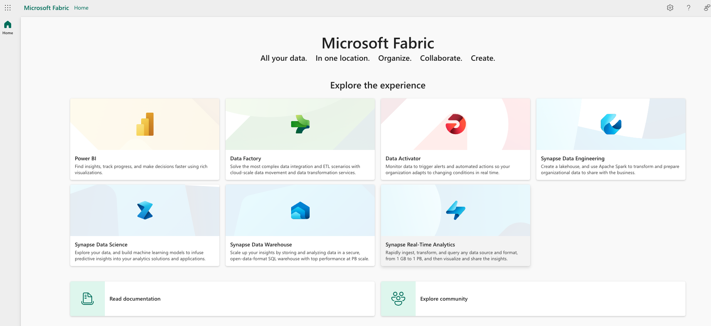
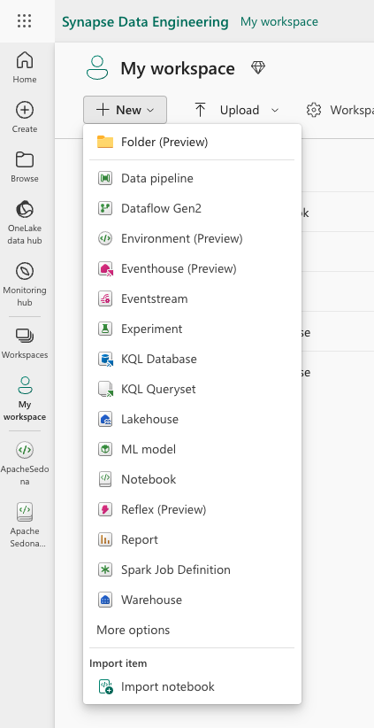
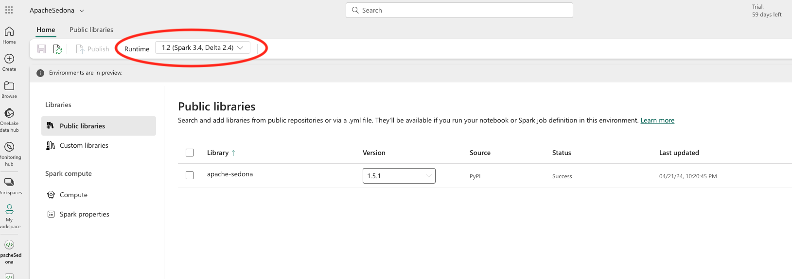
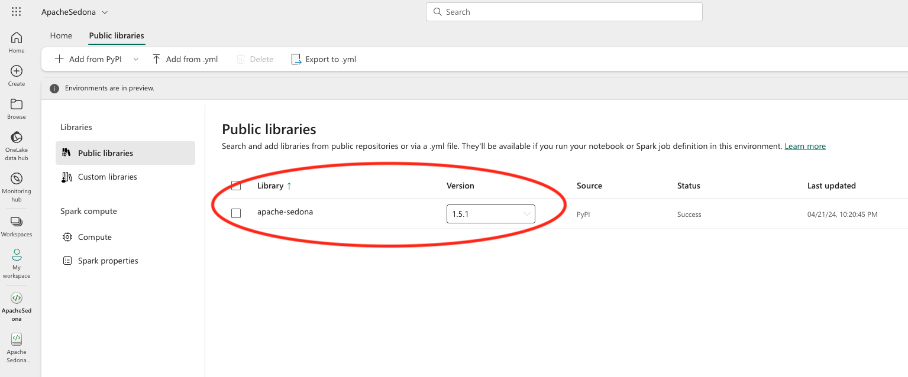
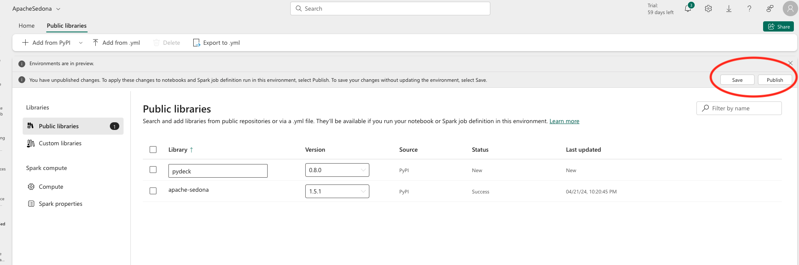
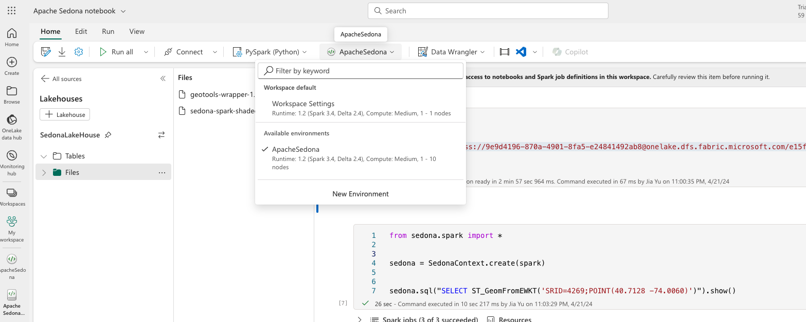
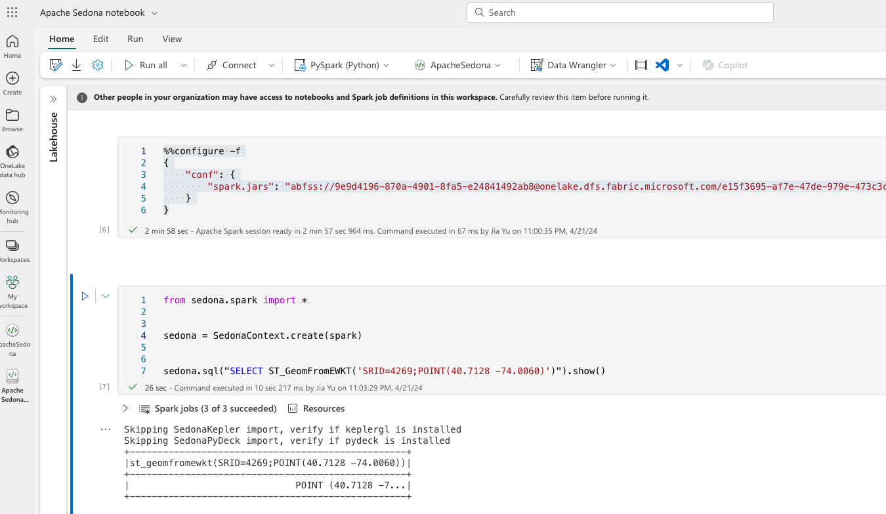
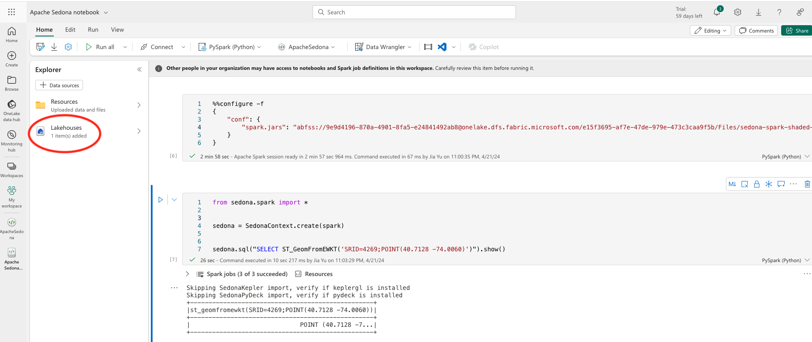
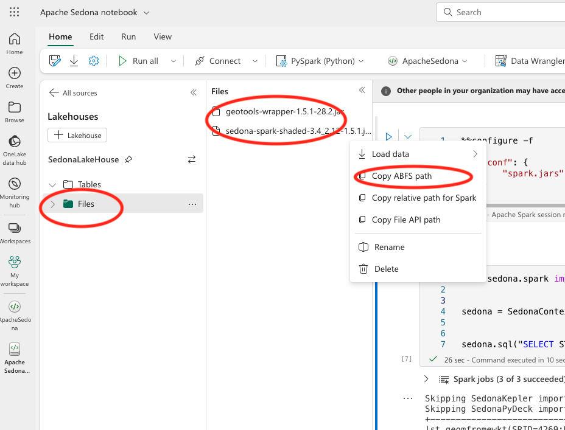

<!--
 Licensed to the Apache Software Foundation (ASF) under one
 or more contributor license agreements.  See the NOTICE file
 distributed with this work for additional information
 regarding copyright ownership.  The ASF licenses this file
 to you under the Apache License, Version 2.0 (the
 "License"); you may not use this file except in compliance
 with the License.  You may obtain a copy of the License at

   http://www.apache.org/licenses/LICENSE-2.0

 Unless required by applicable law or agreed to in writing,
 software distributed under the License is distributed on an
 "AS IS" BASIS, WITHOUT WARRANTIES OR CONDITIONS OF ANY
 KIND, either express or implied.  See the License for the
 specific language governing permissions and limitations
 under the License.
 -->

本教程将指引您在 Microsoft Fabric Synapse Data Engineering 的 Spark 环境中安装 Sedona。

## 步骤 1：打开 Microsoft Fabric Synapse Data Engineering

进入 [Microsoft Fabric 门户](https://app.fabric.microsoft.com/)，选择 `Data Engineering` 选项。



## 步骤 2：创建 Microsoft Fabric Data Engineering 环境

在左侧点击 `My Workspace`，再点击 `+ New` 新建一个 `Environment`，命名为 `ApacheSedona`。



## 步骤 3：选择 Apache Spark 版本

在 `Environment` 页面，点击 `Home` 选项卡并选择合适的 Apache Spark 版本。后续需要根据这个版本安装匹配的 Apache Sedona 版本。



## 步骤 4：安装 Sedona Python 包

在 `Environment` 页面，点击 `Public libraries` 选项卡，输入 `apache-sedona`，并选择合适的 Apache Sedona 版本，来源（source）选择 `PyPI`。



## 步骤 5：设置 Spark 配置项

在 `Environment` 页面，点击 `Spark properties` 选项卡，新建以下 3 个配置项：

- `spark.sql.extensions`：`org.apache.sedona.viz.sql.SedonaVizExtensions,org.apache.sedona.sql.SedonaSqlExtensions`
- `spark.serializer`：`org.apache.spark.serializer.KryoSerializer`
- `spark.kryo.registrator`：`org.apache.sedona.core.serde.SedonaKryoRegistrator`


## 步骤 6：保存并发布环境

依次点击 `Save` 与 `Publish` 按钮以保存并发布环境，环境随之创建并安装好 Apache Sedona Python 包。发布过程大约需要 10 分钟。



## 步骤 7：找到 Sedona jar 的下载链接

1. 阅读 [Sedona maven 坐标](maven-coordinates.md) 了解所需的 Sedona jar。
2. 在 [Maven Central](https://search.maven.org/search?q=g:org.apache.sedona) 查找 `sedona-spark-shaded` jar。请注意 jar 的 Spark 与 Scala 版本：如果 Fabric 环境选择了 Spark 3.4，则应下载与 Spark 3.4 + Scala 2.12 对应的 jar，文件名形如 `sedona-spark-shaded-3.4_2.12-1.5.1.jar`。
3. 在 [Maven Central](https://search.maven.org/search?q=g:org.datasyslab) 查找 `geotools-wrapper` jar。请注意 jar 与 Sedona 的版本对应关系：若使用 Sedona 1.5.1，则应下载 `geotools-wrapper` 1.5.1 版本，文件名形如 `geotools-wrapper-1.5.1-28.2.jar`。

下载链接示例：

```
https://repo1.maven.org/maven2/org/apache/sedona/sedona-spark-shaded-3.4_2.12/1.5.1/sedona-spark-shaded-3.4_2.12-1.5.1.jar
https://repo1.maven.org/maven2/org/datasyslab/geotools-wrapper/1.5.1-28.2/geotools-wrapper-1.5.1-28.2.jar
```

## 步骤 8：在带有 Sedona 环境的 notebook 中安装 jar

在 notebook 页面，选择此前创建的 `ApacheSedona` 环境。



可在 notebook 中运行以下代码安装 jar，请将 `jars` 替换为上一步的两个下载链接：

```text
%%configure -f
{
    "jars": ["https://repo1.maven.org/maven2/org/datasyslab/geotools-wrapper/1.5.1-28.2/geotools-wrapper-1.5.1-28.2.jar", "https://repo1.maven.org/maven2/org/apache/sedona/sedona-spark-shaded-3.4_2.12/1.5.1/sedona-spark-shaded-3.4_2.12-1.5.1.jar"]
}
```

## 步骤 9：验证安装

可在 notebook 中运行以下代码验证安装：

```python
from sedona.spark import *

sedona = SedonaContext.create(spark)


sedona.sql("SELECT ST_GeomFromEWKT('SRID=4269;POINT(40.7128 -74.0060)')").show()
```

如果看到点的输出，则说明安装成功。



## 可选：手动将 Sedona jar 上传到 Fabric 环境的 LakeHouse 存储

如果集群无法访问公网，或您希望避免缓慢的实时下载，可以手动将 Sedona jar 上传到 Fabric 环境的 LakeHouse 存储。

在 notebook 页面打开 `Explorer`，点击 `LakeHouses` 选项。如果还没有 LakeHouse，可先创建一个。然后选择 `Files`，将上一步下载的 2 个 jar 上传上去。

上传完成后，您应能在 LakeHouse 存储中看到这 2 个 jar。复制它们的 `ABFS` 路径。本例中路径为：

```angular2html
abfss://9e9d4196-870a-4901-8fa5-e24841492ab8@onelake.dfs.fabric.microsoft.com/e15f3695-af7e-47de-979e-473c3caa9f5b/Files/sedona-spark-shaded-3.4_2.12-1.5.1.jar

abfss://9e9d4196-870a-4901-8fa5-e24841492ab8@onelake.dfs.fabric.microsoft.com/e15f3695-af7e-47de-979e-473c3caa9f5b/Files/geotools-wrapper-1.5.1-28.2.jar
```





如使用此选项，notebook 中的配置代码应改为：

```text
%%configure -f
{
    "conf": {
        "spark.jars": "abfss://XXX/Files/sedona-spark-shaded-3.4_2.12-1.5.1.jar,abfss://XXX/Files/geotools-wrapper-1.5.1-28.2.jar",
    }
}
```
