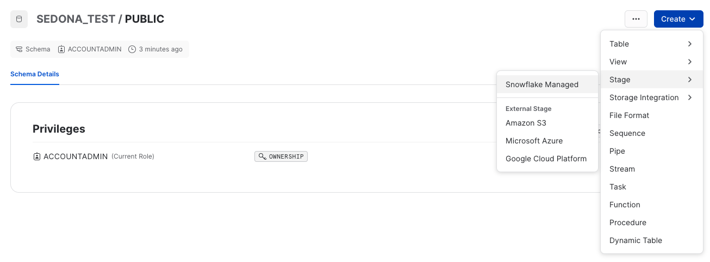
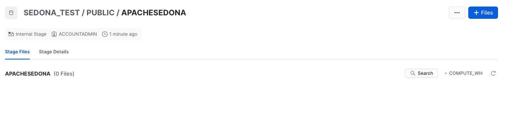
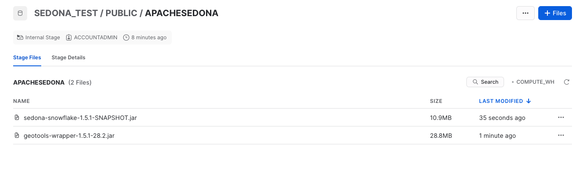
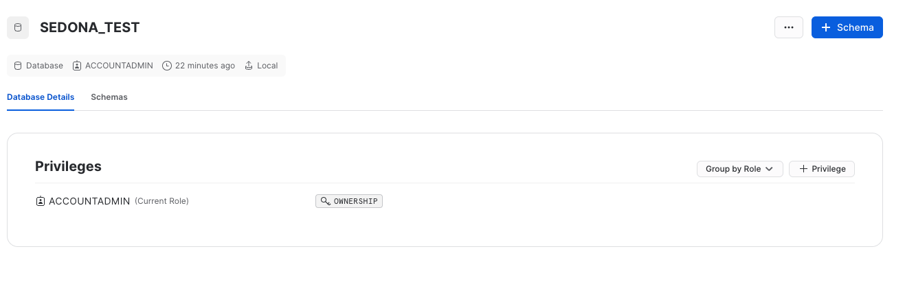
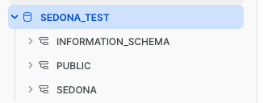
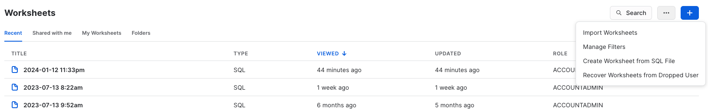
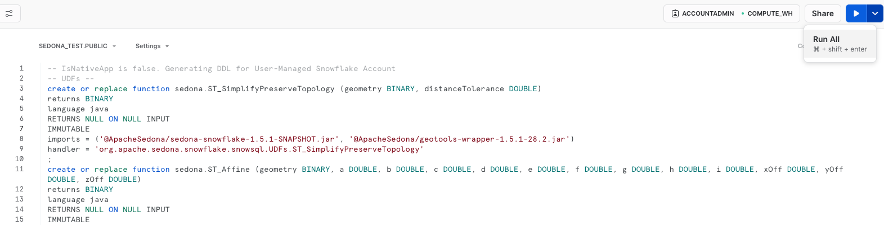
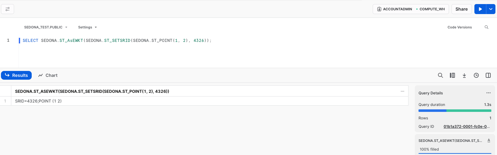

<!--
 Licensed to the Apache Software Foundation (ASF) under one
 or more contributor license agreements.  See the NOTICE file
 distributed with this work for additional information
 regarding copyright ownership.  The ASF licenses this file
 to you under the Apache License, Version 2.0 (the
 "License"); you may not use this file except in compliance
 with the License.  You may obtain a copy of the License at

   http://www.apache.org/licenses/LICENSE-2.0

 Unless required by applicable law or agreed to in writing,
 software distributed under the License is distributed on an
 "AS IS" BASIS, WITHOUT WARRANTIES OR CONDITIONS OF ANY
 KIND, either express or implied.  See the License for the
 specific language governing permissions and limitations
 under the License.
 -->

!!! note
    本教程介绍如何在 Snowflake 上手动安装 Sedona。如果您不希望手动安装，可以使用由 [Wherobots](https://wherobots.com/) 发布的免费 [SedonaSnow](https://app.snowflake.com/marketplace/listing/GZTYZF0RTY3/wherobots-sedonasnow) 原生应用。

## 前置条件

要在 Snowflake 上安装 Sedona，需要准备一个 Snowflake 账号，以及一位至少能访问一个 `DATABASE` 并能运行至少一个 `WAREHOUSE` 的 Snowflake 用户。然后按照以下步骤进行安装。

如何创建 DATABASE 可参阅 [Snowflake 官方文档](https://docs.snowflake.com/en/sql-reference/sql/create-database)。

本教程使用如下 SQL 语句创建数据库；当然您也可以使用任意其他数据库：

```sql
CREATE DATABASE SEDONA_TEST;
```

## 步骤 1：在数据库中创建 stage

stage 是 Snowflake 中映射到云存储位置（如 Amazon S3、Azure Blob Storage、Google Cloud Storage）的对象，可用于将数据加载到表中或从表中卸载数据。

这里我们在上一步创建的数据库的 `public` schema 下创建一个名为 `ApacheSedona` 的 stage，用于上传 Sedona 的 JAR 文件。我们选择 `Snowflake managed` 类型的 stage。



创建后，您应能在数据库中看到该 stage：



如何创建 stage 可参阅 [Snowflake 官方文档](https://docs.snowflake.com/en/sql-reference/sql/create-stage.html)。

## 步骤 2：将 Sedona 的 JAR 文件上传到 stage

需要下载以下 2 个 JAR 文件：

* sedona-snowflake-{{ sedona.current_version }}.jar：[Sedona 在 Maven Central 的仓库](https://central.sonatype.com/artifact/org.apache.sedona/sedona-snowflake/versions)
* geotools-wrapper-{{ sedona.current_geotools }}.jar：[GeoTools-wrapper 在 Maven Central 的仓库](https://central.sonatype.com/artifact/org.datasyslab/geotools-wrapper/versions)

然后将这 2 个 JAR 文件上传到上一步创建的 stage 中。

上传完成后，您应能在 stage 中看到这 2 个文件：



如何向 stage 上传文件可参阅 [Snowflake 官方文档](https://docs.snowflake.com/en/sql-reference/sql/put.html)。

## 步骤 3：在数据库中创建 schema

schema 是 Snowflake 中映射到数据库的对象，可按业务功能或其他类别将表组织在一起。

这里我们在上一步的数据库下创建一个名为 `SEDONA` 的 schema，用于承载 Sedona 的函数。



随后即可在数据库中找到该 schema：



如何创建 schema 可参阅 [Snowflake 官方文档](https://docs.snowflake.com/en/sql-reference/sql/create-schema.html)。

## 步骤 4：获取创建 Sedona 函数的 SQL 脚本

通过运行以下命令获取该 SQL 脚本：

```bash
java -jar sedona-snowflake-{{ sedona.current_version }}.jar --geotools-version {{ sedona.current_geotools }} > sedona-snowflake.sql
```

其中 sedona-snowflake-{{ sedona.current_version }}.jar 即步骤 2 中下载的 JAR 文件。

## 步骤 5：运行 SQL 脚本以创建 Sedona 的函数

我们在上一步的数据库下创建一个 worksheet，并运行该 SQL 脚本以创建 Sedona 的函数。

这里我们选择 `Create Worksheet from SQL File` 选项。



在 worksheet 中将数据库选择为 `SEDONA_TEST`，schema 选择为 `PUBLIC`。SQL 脚本应已加载到 worksheet 中。然后右键点击 worksheet 选择 `Run All`。Snowflake 大约会用 3 分钟时间创建 Sedona 的函数。



## 步骤 6：验证安装

打开新的 worksheet，将数据库选为 `SEDONA_TEST`，schema 任意。然后运行以下 SQL 语句：

```sql
SELECT SEDONA.ST_AsEWKT(SEDONA.ST_SETSRID(SEDONA.ST_POINT(1, 2), 4326));
```

应能看到如下结果：

```
SRID=4326;POINT (1 2)
```

worksheet 应类似下图：


