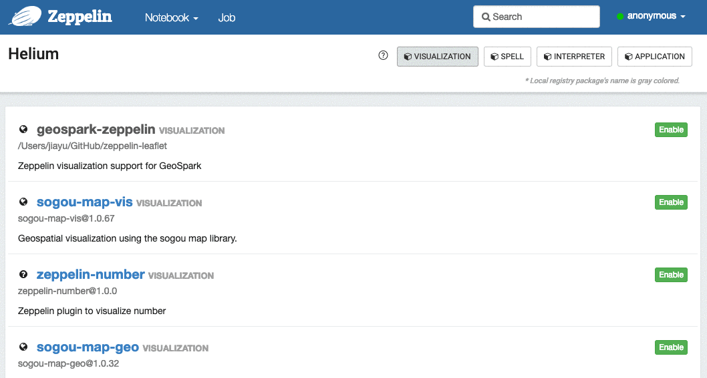
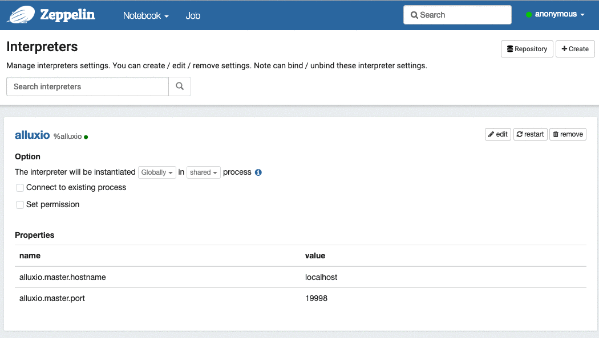

<!--
 Licensed to the Apache Software Foundation (ASF) under one
 or more contributor license agreements.  See the NOTICE file
 distributed with this work for additional information
 regarding copyright ownership.  The ASF licenses this file
 to you under the Apache License, Version 2.0 (the
 "License"); you may not use this file except in compliance
 with the License.  You may obtain a copy of the License at

   http://www.apache.org/licenses/LICENSE-2.0

 Unless required by applicable law or agreed to in writing,
 software distributed under the License is distributed on an
 "AS IS" BASIS, WITHOUT WARRANTIES OR CONDITIONS OF ANY
 KIND, either express or implied.  See the License for the
 specific language governing permissions and limitations
 under the License.
 -->

# 安装 Sedona-Zeppelin

!!!warning
	**已知问题**：由于 Leaflet JS 的限制，Sedona 在 Zeppelin 地图上只能将每个几何对象（点、线串和多边形）以点的形式绘制。如需可扩展且功能完整的可视化，请使用 SedonaViz 在 Zeppelin 地图上绘制散点图与热力图。

## 兼容性

Apache Spark 2.3+

Apache Zeppelin 0.8.1+

Sedona 1.0.0+：Sedona-core、Sedona-SQL、Sedona-Viz

## 安装

!!!note
	仅当您在 Zeppelin Helium 包列表中找不到 [Apache-sedona](https://www.npmjs.com/package/apache-sedona) 或 [GeoSpark Zeppelin](https://www.npmjs.com/package/geospark-zeppelin) 时，才需要执行步骤 1 和 2。

### 创建 Helium 文件夹（可选）

在 Zeppelin 根目录下创建一个名为 `helium` 的文件夹。

### 添加 Sedona-Zeppelin 描述（可选）

在该文件夹中创建一个名为 `sedona-zeppelin.json` 的文件，并写入以下内容。请注意修改 artifact 路径！

```
{
  "type": "VISUALIZATION",
  "name": "sedona-zeppelin",
  "description": "Zeppelin visualization support for Sedona",
  "artifact": "/Absolute/Path/sedona/zeppelin",
  "license": "BSD-2-Clause",
  "icon": "<i class='fa fa-globe'></i>"
}
```

### 启用 Sedona-Zeppelin

重启 Zeppelin，然后打开 Zeppelin Helium 界面并启用 Sedona-Zeppelin。



### 在 Zeppelin Spark 解释器中添加 Sedona 依赖



### 可视化 SedonaSQL 结果


### 展示 SedonaViz 结果


至此安装完成！请阅读 [Sedona-Zeppelin 教程](../tutorial/zeppelin.md) 查看完整的实操示例。
