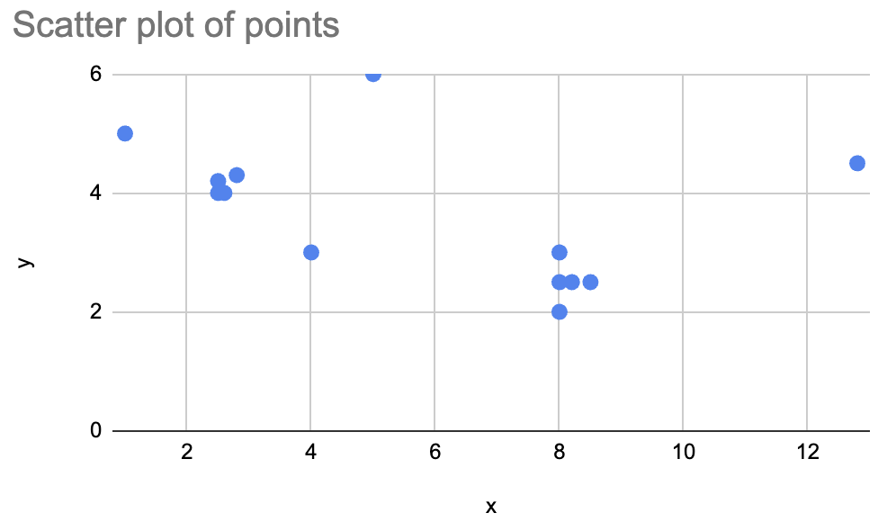
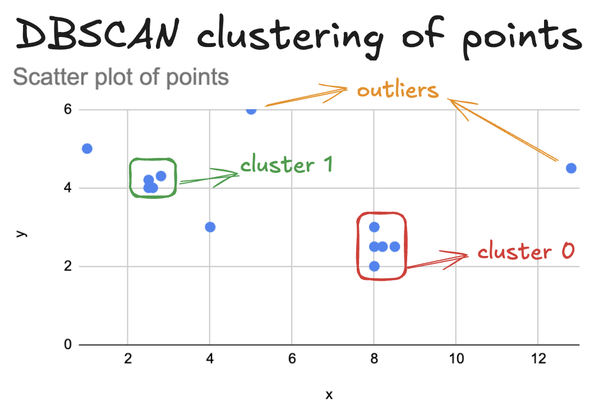

<!--
 Licensed to the Apache Software Foundation (ASF) under one
 or more contributor license agreements.  See the NOTICE file
 distributed with this work for additional information
 regarding copyright ownership.  The ASF licenses this file
 to you under the Apache License, Version 2.0 (the
 "License"); you may not use this file except in compliance
 with the License.  You may obtain a copy of the License at

   http://www.apache.org/licenses/LICENSE-2.0

 Unless required by applicable law or agreed to in writing,
 software distributed under the License is distributed on an
 "AS IS" BASIS, WITHOUT WARRANTIES OR CONDITIONS OF ANY
 KIND, either express or implied.  See the License for the
 specific language governing permissions and limitations
 under the License.
 -->

# Apache Sedona Clustering Algorithms

Clustering algorithms group similar data points into “clusters.”  Apache Sedona can run clustering algorithms on large geometric datasets.

Note that the term cluster is overloaded here:

* A computation cluster is a network of computers that work together to execute the algorithm
* A clustering algorithm divides data points into different “clusters”

This page uses “cluster” to refer to the output of a clustering algorithm.

## Clustering with DBSCAN

This page explains how to use Apache Sedona to perform density-based spatial clustering of applications with noise (“DBSCAN”).

This algorithm groups geometric objects in high-density areas as clusters and marks points in low-density areas as outliers.

Let’s look at a scatter plot of points to visualize a data set that can be clustered.



Here’s how the DBSCAN algorithm clusters the points:



* 5 points are in cluster 0
* 4 points are in cluster 1
* 4 points are outliers

Let’s create a Spark DataFrame with this data and then run the clustering with Sedona.  Here’s how to construct the DataFrame:

```python
df = (
    sedona.createDataFrame([
        (1, 8.0, 2.0),
        (2, 2.6, 4.0),
        (3, 2.5, 4.0),
        (4, 8.5, 2.5),
        (5, 2.8, 4.3),
        (6, 12.8, 4.5),
        (7, 2.5, 4.2),
        (8, 8.2, 2.5),
        (9, 8.0, 3.0),
        (10, 1.0, 5.0),
        (11, 8.0, 2.5),
        (12, 5.0, 6.0),
        (13, 4.0, 3.0),
    ], ["id", "x", "y"])
).withColumn("point", ST_Point(col("x"), col("y")))
```

Here are the contents of the DataFrame:

```
+---+----+---+----------------+
| id|   x|  y|           point|
+---+----+---+----------------+
|  1| 8.0|2.0|     POINT (8 2)|
|  2| 2.6|4.0|   POINT (2.6 4)|
|  3| 2.5|4.0|   POINT (2.5 4)|
|  4| 8.5|2.5| POINT (8.5 2.5)|
|  5| 2.8|4.3| POINT (2.8 4.3)|
|  6|12.8|4.5|POINT (12.8 4.5)|
|  7| 2.5|4.2| POINT (2.5 4.2)|
|  8| 8.2|2.5| POINT (8.2 2.5)|
|  9| 8.0|3.0|     POINT (8 3)|
| 10| 1.0|5.0|     POINT (1 5)|
| 11| 8.0|2.5|   POINT (8 2.5)|
| 12| 5.0|6.0|     POINT (5 6)|
| 13| 4.0|3.0|     POINT (4 3)|
+---+----+---+----------------+
```

Here’s how to run the DBSCAN algorithm:

```python
from sedona.stats.clustering.dbscan import dbscan

dbscan(df, 1.0, 3).orderBy("id").show()
```

Here are the results of the computation:

```
+---+----+---+----------------+------+-------+
| id|   x|  y|           point|isCore|cluster|
+---+----+---+----------------+------+-------+
|  1| 8.0|2.0|     POINT (8 2)|  true|      0|
|  2| 2.6|4.0|   POINT (2.6 4)|  true|      1|
|  3| 2.5|4.0|   POINT (2.5 4)|  true|      1|
|  4| 8.5|2.5| POINT (8.5 2.5)|  true|      0|
|  5| 2.8|4.3| POINT (2.8 4.3)|  true|      1|
|  6|12.8|4.5|POINT (12.8 4.5)| false|     -1|
|  7| 2.5|4.2| POINT (2.5 4.2)|  true|      1|
|  8| 8.2|2.5| POINT (8.2 2.5)|  true|      0|
|  9| 8.0|3.0|     POINT (8 3)|  true|      0|
| 10| 1.0|5.0|     POINT (1 5)| false|     -1|
| 11| 8.0|2.5|   POINT (8 2.5)|  true|      0|
| 12| 5.0|6.0|     POINT (5 6)| false|     -1|
| 13| 4.0|3.0|     POINT (4 3)| false|     -1|
+---+----+---+----------------+------+-------+
```

You can see the `cluster` column that indicates the grouping of the geometric object.

To run this operation, you must set the Spark checkpoint directory. The checkpoint directory is a temporary cache in durable storage where the query's intermediate results are written.

Here is how you can set the checkpoint directory:

```python
sedona.sparkContext.setCheckpointDir(myPath)
```

`myPath` needs to be accessible to all executors. A local path is a good option on a local machine. When available, the HDFS is likely the best choice. Some runtime environments may allow or require block storage paths (e.g., Amazon S3, Google Cloud Storage). Depending on your environment, some runtime environments may already set the Spark checkpoint directory, so this step may not be necessary.
