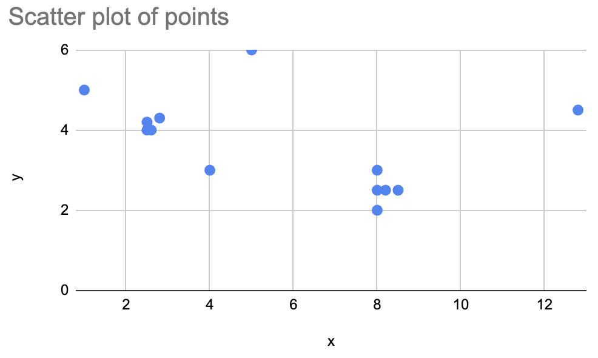
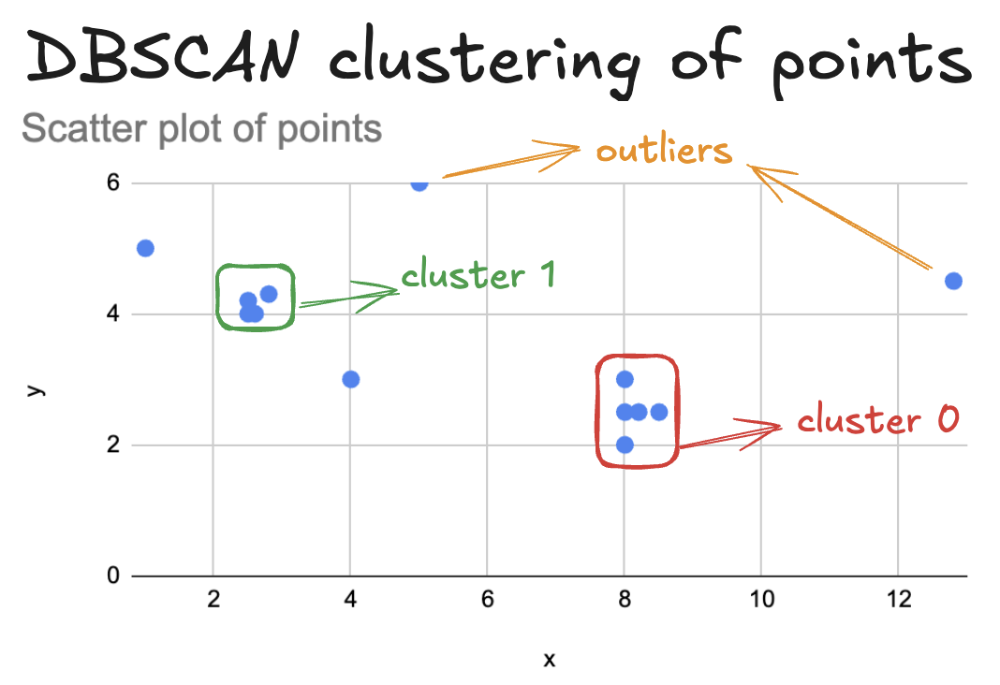

<!--
 Licensed to the Apache Software Foundation (ASF) under one
 or more contributor license agreements.  See the NOTICE file
 distributed with this work for additional information
 regarding copyright ownership.  The ASF licenses this file
 to you under the Apache License, Version 2.0 (the
 "License"); you may not use this file except in compliance
 with the License.  You may obtain a copy of the License at

   http://www.apache.org/licenses/LICENSE-2.0

 Unless required by applicable law or agreed to in writing,
 software distributed under the License is distributed on an
 "AS IS" BASIS, WITHOUT WARRANTIES OR CONDITIONS OF ANY
 KIND, either express or implied.  See the License for the
 specific language governing permissions and limitations
 under the License.
 -->

# 在 Apache Spark 上使用 Apache Sedona 进行聚类

聚类算法将相似的数据点划分到 “簇（cluster）” 中。Apache Sedona 可以在大规模几何数据集上运行聚类算法。

注意 “cluster” 一词在此处有两种含义：

* 计算集群（computation cluster）是一组协同执行算法的计算机网络
* 聚类算法把数据点划分到不同的 “簇（cluster）” 中

本页中的 “簇” 指聚类算法的输出结果。

## 在 Spark 上使用 DBSCAN 进行聚类

本页介绍如何使用 Apache Sedona 执行基于密度的带噪声空间聚类（DBSCAN，density-based spatial clustering of applications with noise）。

DBSCAN 将密度较高区域中的几何对象聚为簇，同时把密度较低区域中的点标记为噪声/离群点。

下面通过散点图来观察一份可被聚类的数据：



DBSCAN 的聚类结果如下：



* 簇 0 包含 5 个点
* 簇 1 包含 4 个点
* 4 个点为离群点

下面使用这份数据创建 Spark DataFrame，并使用 Sedona 运行聚类。构造 DataFrame 的代码如下：

```python
df = (
    sedona.createDataFrame(
        [
            (1, 8.0, 2.0),
            (2, 2.6, 4.0),
            (3, 2.5, 4.0),
            (4, 8.5, 2.5),
            (5, 2.8, 4.3),
            (6, 12.8, 4.5),
            (7, 2.5, 4.2),
            (8, 8.2, 2.5),
            (9, 8.0, 3.0),
            (10, 1.0, 5.0),
            (11, 8.0, 2.5),
            (12, 5.0, 6.0),
            (13, 4.0, 3.0),
        ],
        ["id", "x", "y"],
    )
).withColumn("point", ST_Point(col("x"), col("y")))
```

DataFrame 内容如下：

```
+---+----+---+----------------+
| id|   x|  y|           point|
+---+----+---+----------------+
|  1| 8.0|2.0|     POINT (8 2)|
|  2| 2.6|4.0|   POINT (2.6 4)|
|  3| 2.5|4.0|   POINT (2.5 4)|
|  4| 8.5|2.5| POINT (8.5 2.5)|
|  5| 2.8|4.3| POINT (2.8 4.3)|
|  6|12.8|4.5|POINT (12.8 4.5)|
|  7| 2.5|4.2| POINT (2.5 4.2)|
|  8| 8.2|2.5| POINT (8.2 2.5)|
|  9| 8.0|3.0|     POINT (8 3)|
| 10| 1.0|5.0|     POINT (1 5)|
| 11| 8.0|2.5|   POINT (8 2.5)|
| 12| 5.0|6.0|     POINT (5 6)|
| 13| 4.0|3.0|     POINT (4 3)|
+---+----+---+----------------+
```

运行 DBSCAN 算法的方法如下：

```python
from sedona.spark.stats import dbscan

dbscan(df, 1.0, 3).orderBy("id").show()
```

计算结果如下：

```
+---+----+---+----------------+------+-------+
| id|   x|  y|           point|isCore|cluster|
+---+----+---+----------------+------+-------+
|  1| 8.0|2.0|     POINT (8 2)|  true|      0|
|  2| 2.6|4.0|   POINT (2.6 4)|  true|      1|
|  3| 2.5|4.0|   POINT (2.5 4)|  true|      1|
|  4| 8.5|2.5| POINT (8.5 2.5)|  true|      0|
|  5| 2.8|4.3| POINT (2.8 4.3)|  true|      1|
|  6|12.8|4.5|POINT (12.8 4.5)| false|     -1|
|  7| 2.5|4.2| POINT (2.5 4.2)|  true|      1|
|  8| 8.2|2.5| POINT (8.2 2.5)|  true|      0|
|  9| 8.0|3.0|     POINT (8 3)|  true|      0|
| 10| 1.0|5.0|     POINT (1 5)| false|     -1|
| 11| 8.0|2.5|   POINT (8 2.5)|  true|      0|
| 12| 5.0|6.0|     POINT (5 6)| false|     -1|
| 13| 4.0|3.0|     POINT (4 3)| false|     -1|
+---+----+---+----------------+------+-------+
```

可以看到 `cluster` 列表示每个几何对象所属的簇。

要执行该操作，必须先设置 Spark 的检查点目录。检查点目录是查询中间结果写入的持久化临时缓存位置。

可按如下方式设置检查点目录：

```python
sedona.sparkContext.setCheckpointDir(myPath)
```

`myPath` 必须能被所有 executor 访问。本机运行时使用本地路径即可；如有 HDFS，通常是更好的选择。某些运行时环境可能允许或要求使用块存储路径（如 Amazon S3、Google Cloud Storage）。部分环境可能已经预先设置了 Spark 检查点目录，这一步即可省略。
