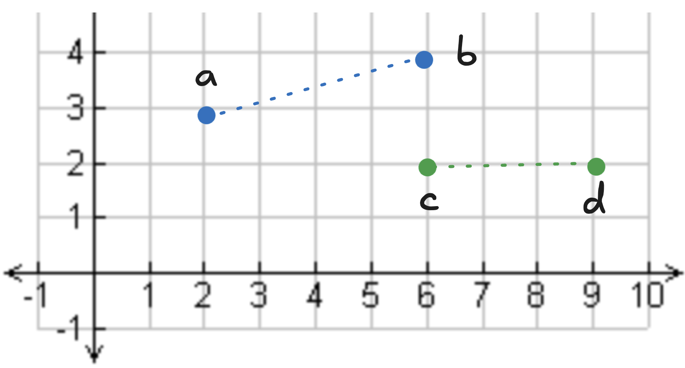
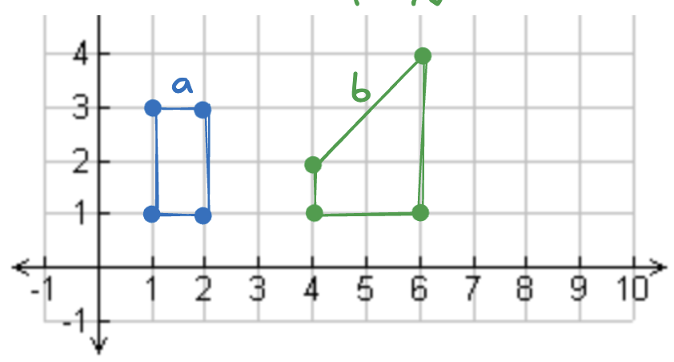
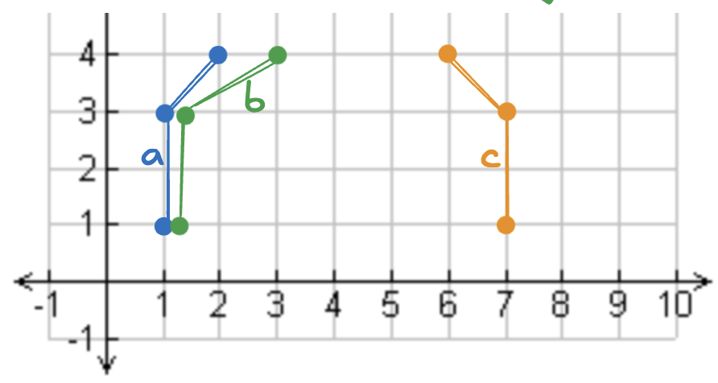
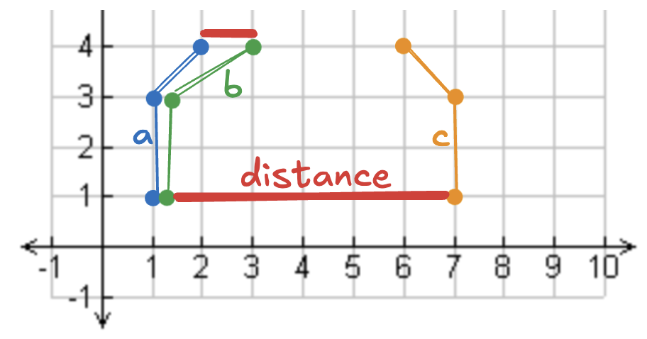
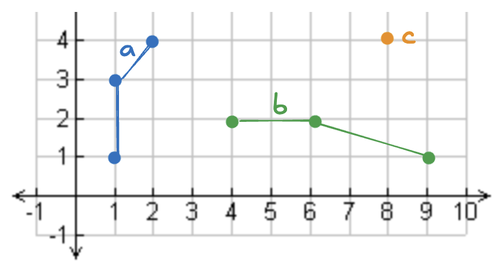

<!--
 Licensed to the Apache Software Foundation (ASF) under one
 or more contributor license agreements.  See the NOTICE file
 distributed with this work for additional information
 regarding copyright ownership.  The ASF licenses this file
 to you under the Apache License, Version 2.0 (the
 "License"); you may not use this file except in compliance
 with the License.  You may obtain a copy of the License at

   http://www.apache.org/licenses/LICENSE-2.0

 Unless required by applicable law or agreed to in writing,
 software distributed under the License is distributed on an
 "AS IS" BASIS, WITHOUT WARRANTIES OR CONDITIONS OF ANY
 KIND, either express or implied.  See the License for the
 specific language governing permissions and limitations
 under the License.
 -->

# 在 Apache Spark 上使用 Sedona 计算距离

本文介绍如何使用 Apache Sedona 与 Apache Spark 计算两个点或几何对象之间的距离。

您将了解如何在二维笛卡尔平面上计算距离，以及如何为地理空间数据计算考虑地球曲率的距离。

先看一个在二维笛卡尔平面上计算两点距离的示例。

## 使用 Spark 与 Sedona 计算两点之间的距离

假设您有 4 个点，希望分别计算 `point_a` 与 `point_b`、`point_c` 与 `point_d` 之间的距离。



先创建一个包含这些点的 DataFrame：

```python
df = sedona.createDataFrame(
    [
        (Point(2, 3), Point(6, 4)),
        (Point(6, 2), Point(9, 2)),
    ],
    ["start", "end"],
)
```

`start` 与 `end` 列均为 `geometry` 类型。

使用 `ST_Distance` 函数计算两点之间的距离：

```python
df.withColumn("distance", ST_Distance(col("start"), col("end"))).show()
```

结果如下：

```
+-----------+-----------+-----------------+
|      start|        end|         distance|
+-----------+-----------+-----------------+
|POINT (2 3)|POINT (6 4)|4.123105625617661|
|POINT (6 2)|POINT (9 2)|              3.0|
+-----------+-----------+-----------------+
```

借助 `ST_Distance`，在二维平面上计算两点之间的距离非常直观。

## 使用 Spark 与 Sedona 计算两个经纬度点之间的距离

下面创建两个经纬度点并计算它们之间的距离。先用经纬度构造 DataFrame：

```python
seattle = Point(-122.335167, 47.608013)
new_york = Point(-73.935242, 40.730610)
sydney = Point(151.2, -33.9)
df = sedona.createDataFrame(
    [
        (seattle, new_york),
        (seattle, sydney),
    ],
    ["place1", "place2"],
)
```

计算这些点之间的距离：

```python
df.withColumn(
    "st_distance_sphere", ST_DistanceSphere(col("place1"), col("place2"))
).show()
```

结果如下：

```
+--------------------+--------------------+--------------------+
|              place1|              place2|  st_distance_sphere|
+--------------------+--------------------+--------------------+
|POINT (-122.33516...|POINT (-73.935242...|  3870075.7867602874|
|POINT (-122.33516...| POINT (151.2 -33.9)|1.2473172370818963E7|
+--------------------+--------------------+--------------------+
```

我们使用 `ST_DistanceSphere` 计算距离，它会考虑地球的曲率，返回值的单位为米。

下面看如何使用椭球（spheroid）模型计算两点之间的距离。

## 使用 Spark 与 Sedona 在椭球模型上计算两点距离

复用前一节的 DataFrame，但改用椭球模型：

```python
res = df.withColumn(
    "st_distance_spheroid", ST_DistanceSpheroid(col("place1"), col("place2"))
)
res.select("place1_name", "place2_name", "st_distance_spheroid").show()
```

结果如下：

```
+-----------+-----------+--------------------+
|place1_name|place2_name|st_distance_spheroid|
+-----------+-----------+--------------------+
|    seattle|   new_york|  3880173.4858397646|
|    seattle|     sydney|1.2456531875384018E7|
+-----------+-----------+--------------------+
```

`ST_DistanceSpheroid` 返回两地之间的距离（单位：米）。在椭球模型下计算的结果与把地球建模为球时差别不大，但椭球的结果会略微更精确。

## 使用 Spark 与 Sedona 计算两个几何对象之间的距离

下面看看如何计算一条折线与一个多边形之间的距离。假设有以下对象：



两个多边形之间的距离定义为它们之间任意两点的最小欧氏距离。

计算距离：

```python
res = df.withColumn("distance", ST_Distance(col("geom1"), col("geom2")))
```

结果如下：

```
+---+---+--------+
|id1|id2|distance|
+---+---+--------+
|a  |b  |2.0     |
+---+---+--------+
```

可以从图中直观地看出两个多边形之间的最小距离。

## 三维最小笛卡尔距离

下面看如何在计算两点距离时把高度（elevation）也考虑进来。

我们将比较站在帝国大厦顶端的人与站在海平面的人之间的距离。

构造 DataFrame：

```python
empire_state_ground = Point(-73.9857, 40.7484, 0)
empire_state_top = Point(-73.9857, 40.7484, 380)
df = sedona.createDataFrame(
    [
        (empire_state_ground, empire_state_top),
    ],
    ["point_a", "point_b"],
)
```

分别计算 2D 与 3D 距离：

```python
res = df.withColumn("distance", ST_Distance(col("point_a"), col("point_b"))).withColumn(
    "3d_distance", ST_3DDistance(col("point_a"), col("point_b"))
)
```

结果如下：

```
+--------------------+--------------------+--------+-----------+
|             point_a|             point_b|distance|3d_distance|
+--------------------+--------------------+--------+-----------+
|POINT (-73.9857 4...|POINT (-73.9857 4...|     0.0|      380.0|
+--------------------+--------------------+--------+-----------+
```

`ST_Distance` 不考虑高度；`ST_3DDistance` 会把高度纳入计算。

## 使用 Spark 与 Sedona 计算 Frechet 距离

构造一个包含以下折线的 Sedona DataFrame：



```python
a = LineString([(1, 1), (1, 3), (2, 4)])
b = LineString([(1.1, 1), (1.1, 3), (3, 4)])
c = LineString([(7, 1), (7, 3), (6, 4)])
df = sedona.createDataFrame(
    [
        (a, "a", b, "b"),
        (a, "a", c, "c"),
    ],
    ["geometry1", "geometry1_id", "geometry2", "geometry2_id"],
)
```

计算 Frechet 距离：

```python
res = df.withColumn(
    "frechet_distance", ST_FrechetDistance(col("geometry1"), col("geometry2"))
)
```

查看结果：

```python
res.select("geometry1_id", "geometry2_id", "frechet_distance").show()
```

```
+------------+------------+----------------+
|geometry1_id|geometry2_id|frechet_distance|
+------------+------------+----------------+
|           a|           b|             1.0|
|           a|           c|             6.0|
+------------+------------+----------------+
```

下图直观展示了这些距离，便于理解算法：



## 使用 Spark 与 Sedona 计算几何对象之间的最大距离

假设有以下几何对象：



计算其中一些几何对象之间的最大距离：

```python
res = df.withColumn("max_distance", ST_MaxDistance(col("geom1"), col("geom2")))
```

查看结果：

```python
res.select("id1", "id2", "max_distance").show(truncate=False)
```

```
+---+---+-----------------+
|id1|id2|max_distance     |
+---+---+-----------------+
|a  |b  |8.246211251235321|
|a  |c  |7.615773105863909|
+---+---+-----------------+
```

由此可以方便地获得两个几何对象之间的最大距离。

## 结论

Sedona 支持多种类型的距离计算，包括基于不同地球模型的距离，以及考虑高度等更复杂的距离运算。

请根据您的分析需求选择最合适的距离函数。
