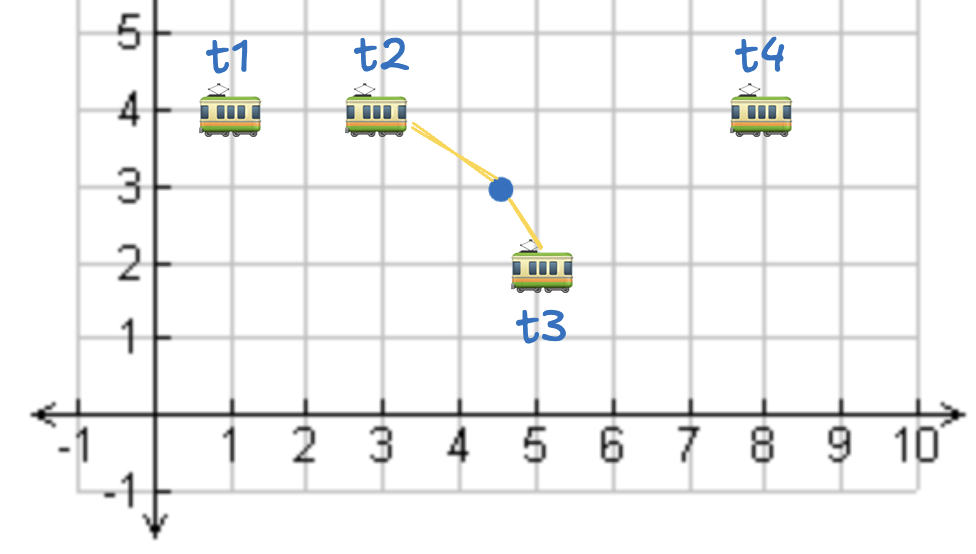

<!--
 Licensed to the Apache Software Foundation (ASF) under one
 or more contributor license agreements.  See the NOTICE file
 distributed with this work for additional information
 regarding copyright ownership.  The ASF licenses this file
 to you under the Apache License, Version 2.0 (the
 "License"); you may not use this file except in compliance
 with the License.  You may obtain a copy of the License at

   http://www.apache.org/licenses/LICENSE-2.0

 Unless required by applicable law or agreed to in writing,
 software distributed under the License is distributed on an
 "AS IS" BASIS, WITHOUT WARRANTIES OR CONDITIONS OF ANY
 KIND, either express or implied.  See the License for the
 specific language governing permissions and limitations
 under the License.
 -->

# Apache Sedona Spatial Joins with Spark

This post explains how to perform spatial joins with Apache Sedona. You will learn about the different types of spatial joins and how to run them efficiently.

This page provides basic examples that clearly illustrate the key conceptual points of spatial joins.  It also elaborates on spatial join concepts for real-world-sized datasets and highlights key performance enhancements.

## Spatial join within using Spark

Look at the following graph containing three points and two polygons.  `point_b` is within `polygon_y`, `point_c` is within `polygon_x`, and `point_a` isn’t within any polygon.


The `points` table contains points and the `polygons` table includes polygons.

Here’s how you can run the SQL for this query:

```sql
SELECT
    points.id as point_id,
    polygons.id as polygon_id
FROM points
JOIN polygons ON ST_Within(points.geometry, polygons.geometry);  
```

Here’s the result:

```
+--------+----------+
|point_id|polygon_id|
+--------+----------+
|       b|         y|
|       c|         x|
+--------+----------+
```

`point_a` is not in the resulting DataFrame because it’s not within any polygon.

It’s easier to see that the `polygon_id` is `NULL` for `point_a` with a `LEFT JOIN`:

```sql
SELECT
    points.id as point_id,
    polygons.id as polygon_id
FROM points
LEFT JOIN polygons ON ST_Within(points.geometry, polygons.geometry);  
```

Here’s the output:

```
+--------+----------+
|point_id|polygon_id|
+--------+----------+
|       a|      NULL|
|       b|         y|
|       c|         x|
+--------+----------+
```

The `polygon_id` is `NULL` for `point_a` because it is not within any polygon.

In production applications, you typically use `JOIN`. This post uses `LEFT JOIN` to illustrate the rows that do not match in the join.

This previous code snipped used the `ST_Within` predicate, which is closely related to the `ST_Contains` method.  They’re the same but the parameter order is swapped.  Here’s how you can get the same result with `ST_Contains`:

```sql
SELECT
    points.id as point_id,
    polygons.id as polygon_id
FROM points
LEFT JOIN polygons ON ST_Contains(polygons.geometry, points.geometry);  
```

Here’s the same result:

```
+--------+----------+
|point_id|polygon_id|
+--------+----------+
|       a|      NULL|
|       b|         y|
|       c|         x|
+--------+----------+
```

## Spatial join crosses with Spark

Look at the following graph containing one polygon and two lines.  `line_a` and `line_b` cross `polygon_x`.  `line_c` does not cross `polygon_x`.


Here’s the SQL query to run this spatial join:

```sql
SELECT
    lines.id as line_id,
    polygons.id as polygon_id
FROM lines
LEFT JOIN polygons ON ST_Crosses(lines.geometry, polygons.geometry);  
```

Here is the result:

```
+-------+----------+
|line_id|polygon_id|
+-------+----------+
|      a|         x|
|      b|         x|
|      c|      NULL|
+-------+----------+
```

A spatial join with `ST_Crosses` lets us identify the lines that cross the polygon.

## Spatial join with touches using Spark

Suppose you have a polygon and two lines.  `line_a` does not touch the polygon, and `line_b` does touch the polygon.  See the following diagram:


Let’s create `table_a` with the lines and `table_b` with the polygon and then join them.

Here is the content of the polygons table:

```
+---+-----------------------------------+
|id |geometry                           |
+---+-----------------------------------+
|x  |POLYGON ((6 2, 6 4, 8 4, 8 2, 6 2))|
+---+-----------------------------------+
```

Here is the content of the lines table:

```
+---+----------------------+
|id |geometry              |
+---+----------------------+
|a  |LINESTRING (2 4, 4 0) |
|b  |LINESTRING (6 0, 10 4)|
+---+----------------------+
```

Here’s a join that matches any touching values:

```python
sedona.sql("""
SELECT
    lines.id as line_id,
    polygons.id as polygon_id
FROM lines
LEFT JOIN polygons ON ST_Touches(lines.geometry, polygons.geometry);  
""").show()
```

Here’s the result of the join:

```
+-------+----------+
|line_id|polygon_id|
+-------+----------+
|      a|      NULL|
|      b|         x|
+-------+----------+
```

Now, let’s look at running a join to see if points are within a polygon.

## Spatial join overlaps with Spark

The following diagram shows two polygons and a few shapes.  `polygon_a` overlaps `polygon_x`.  Neither `line_b`, `line_c`, or `point_d` overlap with `polygon_y` or `polygon_x`.


Here is the SQL query to run this spatial join:

```sql
SELECT
    shapes.id as shape_id,
    polygons.id as polygon_id
FROM shapes
LEFT JOIN polygons ON ST_Overlaps(shapes.geometry, polygons.geometry);
```

Here is the result:

```
+--------+----------+
|shape_id|polygon_id|
+--------+----------+
|       a|         x|
|       b|      NULL|
|       c|      NULL|
|       d|      NULL|
+--------+----------+
```

## Spatial join K-nearest neighbors (KNN spatial join) with Spark

Suppose you have tables with addresses and coffee shop locations.  You’d like to find the two nearest coffee shops to each address.

Here are the `addresses` with `latitude` and `longitude` coordinates:

```
+---+---------+--------+
| id|longitude|latitude|
+---+---------+--------+
| a1|      2.0|     3.0|
| a2|      5.0|     5.0|
| a3|      7.0|     2.0|
+---+---------+--------+
```

Here are the `coffee_shops` with `latitude` and `longitude`:

```
+---+---------+--------+
| id|longitude|latitude|
+---+---------+--------+
| c1|      1.0|     4.0|
| c2|      3.0|     5.0|
| c3|      5.0|     1.0|
| c4|      8.0|     4.0|
+---+---------+--------+
```

Here’s how to compute the two nearest coffee shops to each address:

```sql
SELECT
    addresses.id AS address_id,
    coffee_shops.id AS coffee_shop_id
FROM addresses
JOIN coffee_shops
ON ST_KNN(addresses.geometry, coffee_shops.geometry, 2)
```

Here is the result:

```
+----------+--------------+
|address_id|coffee_shop_id|
+----------+--------------+
|        a1|            c1|
|        a1|            c2|
|        a2|            c2|
|        a2|            c4|
|        a3|            c3|
|        a3|            c4|
+----------+--------------+
```

Here’s a visualization of the results:


You can easily see the coffee shops that are closest to each address.

## Spatial distance join with Spark

Look at the following graph, which shows a point and different transit stations. Let’s perform a spatial join to find all the transit stations within 2.5 units of the point.



We can see that `t2` and `t3` are within 2.5 units from the point.

Here is the points table:

```
+---+-------------+
| id|     geometry|
+---+-------------+
| p1|POINT (4.5 3)|
+---+-------------+
```

And here is the transit table:

```
+---+-----------+
| id|   geometry|
+---+-----------+
| t1|POINT (1 4)|
| t2|POINT (3 4)|
| t3|POINT (5 2)|
| t4|POINT (8 4)|
+---+-----------+
```

Let’s perform a distance join to find all the transit stations that are within 2.5 units of the point:

```sql
SELECT
    points.id AS point_id,
    transit.id AS transit_id
FROM points
JOIN transit
ON ST_DWithin(points.geometry, transit.geometry, 2.5)
```

Here are the results:

```
+--------+----------+
|point_id|transit_id|
+--------+----------+
|      p1|        t2|
|      p1|        t3|
+--------+----------+
```

Sedona is an excellent tool for finding locations within a certain distance from a point.

Sedona uses the Euclidean distance between two objects so the distance unit has the same CRS of the original coordinates. To directly operate on WGS84 coordinates with meter distance, you should use `ST_DistanceSphere`, `ST_DistanceSpheroid`, or `ST_DWithnin(useSpheroid = true)`.

## Spatial range join with Spark

All joins triggered by `ST_Intersects`, `ST_Contains`, `ST_Within`, `ST_DWithin`, `ST_Touches`, and `ST_Crosses` are considered a range join.  This section illustrates another range join, but we've already covered several range joins on this page.

Suppose you have a table with cities and another table with restaurants.  You want to identify all the restaurants in a given city.  See the following diagram for some sample data.


Three restaurants are within the city boundary, and one is outside the city.

Here is the cities table:

```
+-----+--------------------+
|   id|            geometry|
+-----+--------------------+
|city1|POLYGON ((1 1, 1 ...|
+-----+--------------------+
```

And here is the `restaurants` table:

```
+---+-----------+
| id|   geometry|
+---+-----------+
| r1|POINT (2 2)|
| r2|POINT (3 3)|
| r3|POINT (4 4)|
| r4|POINT (6 6)|
+---+-----------+
```

Here’s how to execute the range join:

```
SELECT
    cities.id AS city_id,
    restaurants.id AS restaurant_id
FROM cities
JOIN restaurants
ON ST_Intersects(restaurants.geometry, cities.geometry)
```

Here are the results:

```
+-------+-------------+
|city_id|restaurant_id|
+-------+-------------+
|  city1|           r1|
|  city1|           r2|
|  city1|           r3|
+-------+-------------+
```

Range joins are helpful in many practical applications.

## Spatial join optimizations for Sedona and Apache Spark

You can optimize spatial joins by using better file formats, indexing your data, or optimizing your queries.

For example, suppose you’re performing a spatial join with two wide tables stored in GeoJSON files and don’t need all the output columns.  GeoJSON files are row-oriented and don’t support column pruning.  You can switch the data from GeoJSON to a column-oriented file format like GeoParquet to take advantage of column pruning, a vital performance enhancement.

See this section on [additional query enhancements here](https://sedona.apache.org/latest/api/sql/Optimizer/) to learn more.

## Spatial broadcast joins

Sedona can run on a single node or many nodes in a cluster.  

As you can imagine, joining two datasets can be slower when your data is on different machines in a cluster.  That requires data shuffling, which can be slow.

If one of the tables is small, you can broadcast it, which copies it to all the machines in the cluster.  Broadcasting can make the join much faster.

You should generally only broadcast DataFrames that are relatively small, see [here for more information](https://sedona.apache.org/latest/api/sql/Optimizer/?h=broadcast#broadcast-index-join).  

Sedona will automatically broadcast tables smaller than the threshold; [see here for more details](https://sedona.apache.org/latest/api/sql/Optimizer/#automatic-broadcast-index-join).

## Conclusion

Apache Sedona supports a variety of spatial joins.

Spatial joins are one of the strengths of the Sedona engine.  Other engines can struggle with memory issues for spatial joins.  Sedona is capable of performing spatial joins on massive datasets.
