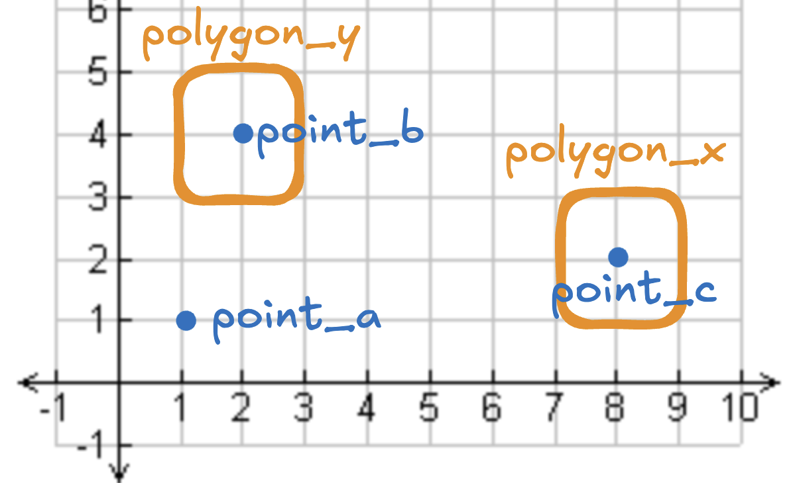
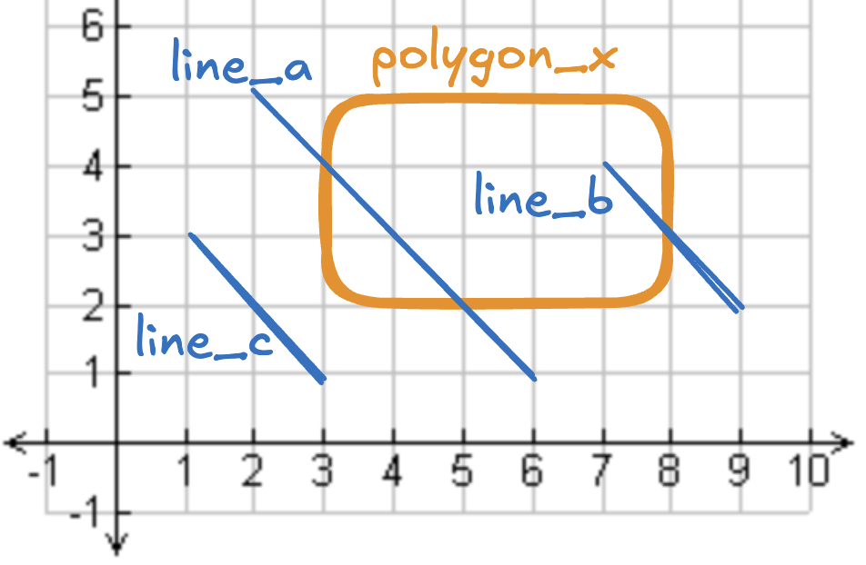
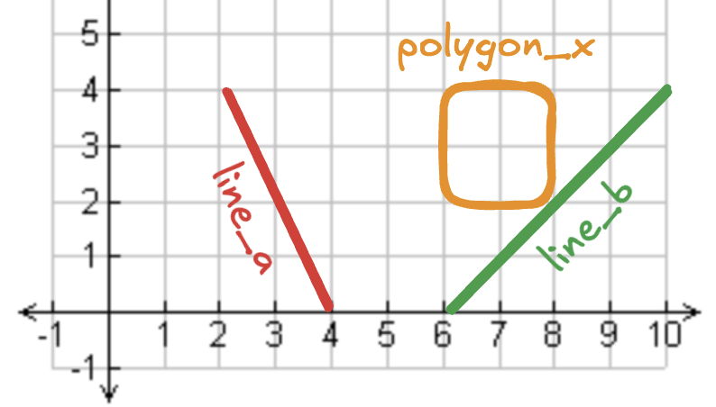
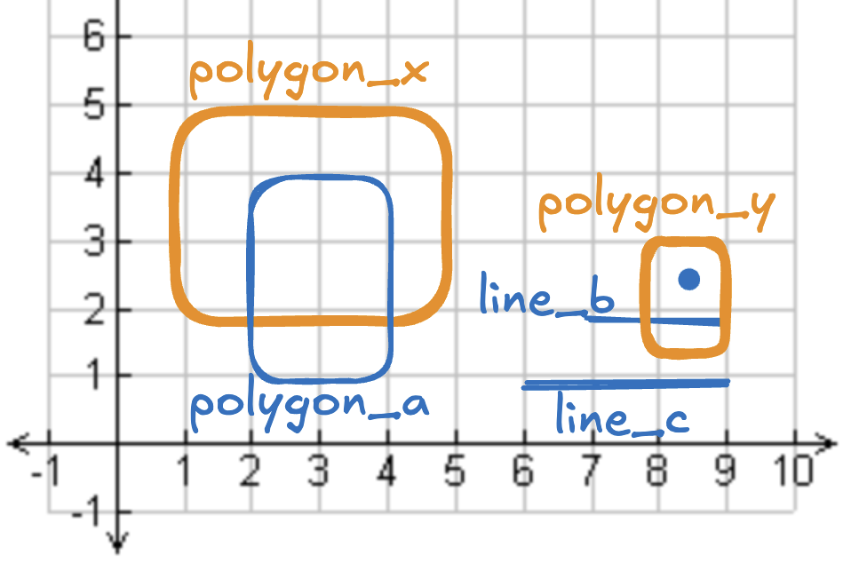
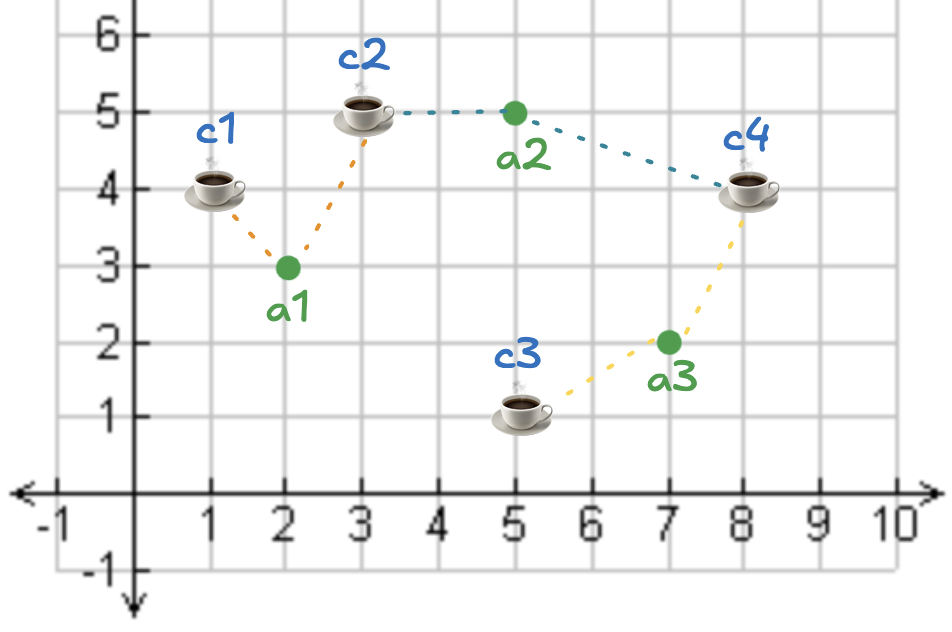
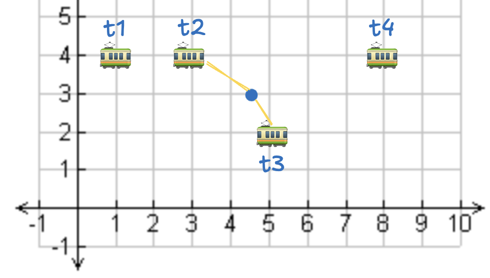
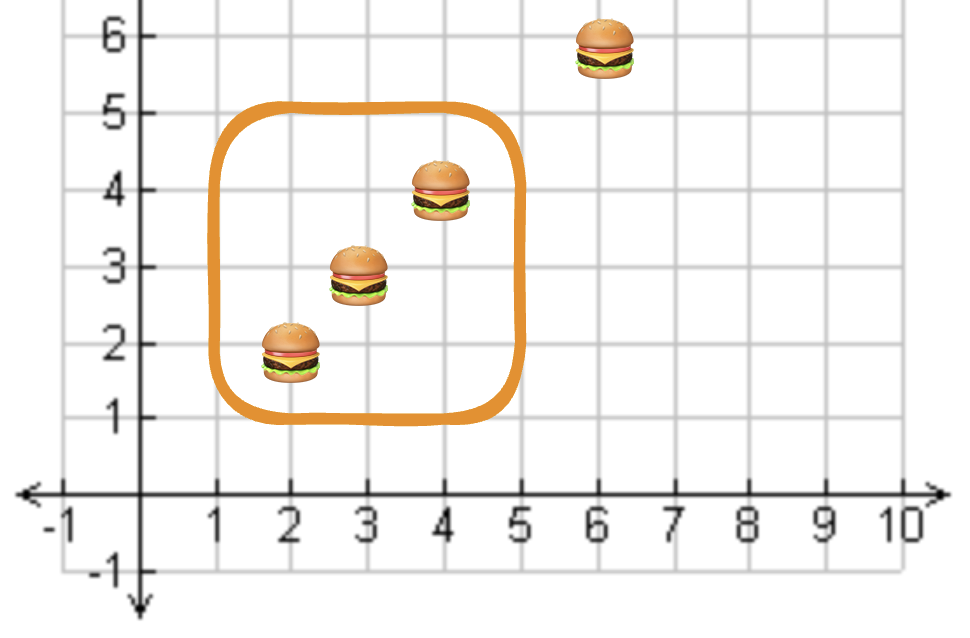

<!--
 Licensed to the Apache Software Foundation (ASF) under one
 or more contributor license agreements.  See the NOTICE file
 distributed with this work for additional information
 regarding copyright ownership.  The ASF licenses this file
 to you under the Apache License, Version 2.0 (the
 "License"); you may not use this file except in compliance
 with the License.  You may obtain a copy of the License at

   http://www.apache.org/licenses/LICENSE-2.0

 Unless required by applicable law or agreed to in writing,
 software distributed under the License is distributed on an
 "AS IS" BASIS, WITHOUT WARRANTIES OR CONDITIONS OF ANY
 KIND, either express or implied.  See the License for the
 specific language governing permissions and limitations
 under the License.
 -->

# 在 Spark 上使用 Apache Sedona 进行空间连接

本文介绍如何使用 Apache Sedona 进行空间连接（spatial join）。您将了解到不同类型的空间连接以及如何高效执行它们。

页面中的示例较为基础，便于直观地说明空间连接的核心概念。文末还会针对真实业务规模的数据集，进一步阐述空间连接概念并强调若干关键的性能改进。

## 使用 Spark 进行 within 空间连接

下图包含 3 个点和 2 个多边形：`point_b` 位于 `polygon_y` 内部，`point_c` 位于 `polygon_x` 内部，`point_a` 不在任何多边形中。



`points` 表存放点，`polygons` 表存放多边形。

执行该查询的 SQL 如下：

```sql
SELECT
    points.id as point_id,
    polygons.id as polygon_id
FROM points
JOIN polygons ON ST_Within(points.geometry, polygons.geometry);
```

结果如下：

```
+--------+----------+
|point_id|polygon_id|
+--------+----------+
|       b|         y|
|       c|         x|
+--------+----------+
```

`point_a` 不在结果 DataFrame 中，因为它不在任何多边形内部。

如果使用 `LEFT JOIN`，可以更直观地看到 `point_a` 的 `polygon_id` 为 `NULL`：

```sql
SELECT
    points.id as point_id,
    polygons.id as polygon_id
FROM points
LEFT JOIN polygons ON ST_Within(points.geometry, polygons.geometry);
```

输出：

```
+--------+----------+
|point_id|polygon_id|
+--------+----------+
|       a|      NULL|
|       b|         y|
|       c|         x|
+--------+----------+
```

`point_a` 的 `polygon_id` 为 `NULL`，因为它不在任何多边形内。

在生产应用中通常使用 `JOIN`。本文使用 `LEFT JOIN` 仅是为了展示哪些行没有匹配到。

上面的代码使用了 `ST_Within` 谓词，它与 `ST_Contains` 含义相同，只是参数顺序相反。下面是用 `ST_Contains` 写的等价查询：

```sql
SELECT
    points.id as point_id,
    polygons.id as polygon_id
FROM points
LEFT JOIN polygons ON ST_Contains(polygons.geometry, points.geometry);
```

结果完全相同：

```
+--------+----------+
|point_id|polygon_id|
+--------+----------+
|       a|      NULL|
|       b|         y|
|       c|         x|
+--------+----------+
```

## 使用 Spark 进行 crosses 空间连接

下图包含 1 个多边形和 2 条折线：`line_a` 与 `line_b` 都穿过 `polygon_x`，`line_c` 没有穿过 `polygon_x`。



执行该空间连接的 SQL：

```sql
SELECT
    lines.id as line_id,
    polygons.id as polygon_id
FROM lines
LEFT JOIN polygons ON ST_Crosses(lines.geometry, polygons.geometry);
```

结果：

```
+-------+----------+
|line_id|polygon_id|
+-------+----------+
|      a|         x|
|      b|         x|
|      c|      NULL|
+-------+----------+
```

借助 `ST_Crosses` 的空间连接，可以筛选出与多边形相交的折线。

## 使用 Spark 进行 touches 空间连接

假设有 1 个多边形和 2 条折线：`line_a` 不接触多边形，`line_b` 接触多边形。如下图所示：



我们用折线创建 `table_a`，用多边形创建 `table_b`，然后做连接。

多边形表内容如下：

```
+---+-----------------------------------+
|id |geometry                           |
+---+-----------------------------------+
|x  |POLYGON ((6 2, 6 4, 8 4, 8 2, 6 2))|
+---+-----------------------------------+
```

折线表内容如下：

```
+---+----------------------+
|id |geometry              |
+---+----------------------+
|a  |LINESTRING (2 4, 4 0) |
|b  |LINESTRING (6 0, 10 4)|
+---+----------------------+
```

匹配相互接触的连接：

```python
sedona.sql("""
SELECT
    lines.id as line_id,
    polygons.id as polygon_id
FROM lines
LEFT JOIN polygons ON ST_Touches(lines.geometry, polygons.geometry);
""").show()
```

连接结果：

```
+-------+----------+
|line_id|polygon_id|
+-------+----------+
|      a|      NULL|
|      b|         x|
+-------+----------+
```

接下来看看如何用空间连接判断点是否在多边形内。

## 使用 Spark 进行 overlaps 空间连接

下图展示了 2 个多边形与若干图形：`polygon_a` 与 `polygon_x` 重叠；`line_b`、`line_c` 与 `point_d` 都不与 `polygon_y` 或 `polygon_x` 重叠。



执行该空间连接的 SQL：

```sql
SELECT
    shapes.id as shape_id,
    polygons.id as polygon_id
FROM shapes
LEFT JOIN polygons ON ST_Overlaps(shapes.geometry, polygons.geometry);
```

结果：

```
+--------+----------+
|shape_id|polygon_id|
+--------+----------+
|       a|         x|
|       b|      NULL|
|       c|      NULL|
|       d|      NULL|
+--------+----------+
```

## 使用 Spark 进行 K 近邻空间连接（KNN spatial join）

假设有一张地址表与一张咖啡店表，希望为每个地址找到最近的两家咖啡店。

`addresses` 表包含 `latitude` 与 `longitude`：

```
+---+---------+--------+
| id|longitude|latitude|
+---+---------+--------+
| a1|      2.0|     3.0|
| a2|      5.0|     5.0|
| a3|      7.0|     2.0|
+---+---------+--------+
```

`coffee_shops` 表同样包含 `latitude` 与 `longitude`：

```
+---+---------+--------+
| id|longitude|latitude|
+---+---------+--------+
| c1|      1.0|     4.0|
| c2|      3.0|     5.0|
| c3|      5.0|     1.0|
| c4|      8.0|     4.0|
+---+---------+--------+
```

为每个地址计算最近的两家咖啡店：

```sql
SELECT
    addresses.id AS address_id,
    coffee_shops.id AS coffee_shop_id
FROM addresses
JOIN coffee_shops
ON ST_KNN(addresses.geometry, coffee_shops.geometry, 2)
```

结果：

```
+----------+--------------+
|address_id|coffee_shop_id|
+----------+--------------+
|        a1|            c1|
|        a1|            c2|
|        a2|            c2|
|        a2|            c4|
|        a3|            c3|
|        a3|            c4|
+----------+--------------+
```

可视化结果如下：



可以一目了然地看出每个地址附近的两家咖啡店。

## 使用 Spark 进行空间距离连接

下图展示了 1 个点与若干公交站点。我们要找出与该点距离不超过 2.5 单位的所有公交站点。



可以看出 `t2` 与 `t3` 在 2.5 单位范围内。

points 表如下：

```
+---+-------------+
| id|     geometry|
+---+-------------+
| p1|POINT (4.5 3)|
+---+-------------+
```

transit 表如下：

```
+---+-----------+
| id|   geometry|
+---+-----------+
| t1|POINT (1 4)|
| t2|POINT (3 4)|
| t3|POINT (5 2)|
| t4|POINT (8 4)|
+---+-----------+
```

执行距离连接，找出与该点距离 ≤ 2.5 的公交站点：

```sql
SELECT
    points.id AS point_id,
    transit.id AS transit_id
FROM points
JOIN transit
ON ST_DWithin(points.geometry, transit.geometry, 2.5)
```

结果：

```
+--------+----------+
|point_id|transit_id|
+--------+----------+
|      p1|        t2|
|      p1|        t3|
+--------+----------+
```

Sedona 非常适合查找距离某点一定范围内的位置。

Sedona 使用的是欧氏距离，因此距离单位与原始坐标的 CRS 相同。如果要在 WGS84 坐标上以米为单位运算，请使用 `ST_DistanceSphere`、`ST_DistanceSpheroid` 或 `ST_DWithin(useSpheroid = true)`。

## 使用 Spark 进行空间范围连接

由 `ST_Intersects`、`ST_Contains`、`ST_Within`、`ST_DWithin`、`ST_Touches`、`ST_Crosses` 触发的连接都属于范围连接（range join）。本节再展示一个范围连接示例，其实前面已经介绍过多个范围连接。

假设有一张城市表与一张餐厅表，希望找出某城市内的所有餐厅。示例数据如下图：



3 家餐厅位于城市边界内，1 家餐厅在城市外。

cities 表：

```
+-----+--------------------+
|   id|            geometry|
+-----+--------------------+
|city1|POLYGON ((1 1, 1 ...|
+-----+--------------------+
```

`restaurants` 表：

```
+---+-----------+
| id|   geometry|
+---+-----------+
| r1|POINT (2 2)|
| r2|POINT (3 3)|
| r3|POINT (4 4)|
| r4|POINT (6 6)|
+---+-----------+
```

执行范围连接：

```
SELECT
    cities.id AS city_id,
    restaurants.id AS restaurant_id
FROM cities
JOIN restaurants
ON ST_Intersects(restaurants.geometry, cities.geometry)
```

结果：

```
+-------+-------------+
|city_id|restaurant_id|
+-------+-------------+
|  city1|           r1|
|  city1|           r2|
|  city1|           r3|
+-------+-------------+
```

范围连接在很多实际场景中都非常有用。

## Sedona 与 Apache Spark 上的空间连接优化

可以通过更优的文件格式、索引、查询写法等方式优化空间连接。

例如，假设您正在对存储为 GeoJSON 的两张宽表执行空间连接，且不需要全部输出列。GeoJSON 是行式存储，不支持列裁剪。把数据从 GeoJSON 切换到 GeoParquet 等列式格式即可享受列裁剪带来的关键性能收益。

更多查询优化方法请参阅 [此处](https://sedona.apache.org/latest/api/sql/Optimizer/)。

## 空间广播连接

Sedona 既能在单机运行，也能在多节点集群上运行。

可以想象，当数据分布在集群的不同机器上时，连接两个数据集会更慢——因为需要 shuffle，开销不小。

如果其中一张表很小，可以将其广播到集群中的所有机器，从而大幅提升连接速度。

通常只有相对较小的 DataFrame 才适合广播，详见 [此处说明](https://sedona.apache.org/latest/api/sql/Optimizer/?h=broadcast#broadcast-index-join)。

Sedona 会自动广播大小低于阈值的表，[详细信息见此](https://sedona.apache.org/latest/api/sql/Optimizer/#automatic-broadcast-index-join)。

## 结论

Apache Sedona 支持多种类型的空间连接。

空间连接是 Sedona 引擎的强项之一。其他引擎在执行空间连接时常常受到内存问题的困扰，而 Sedona 能够在海量数据集上完成空间连接。
