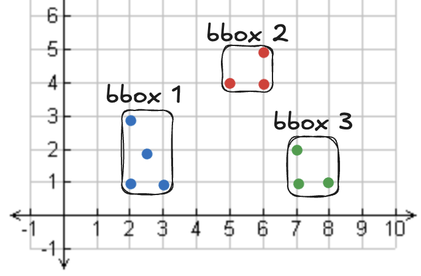
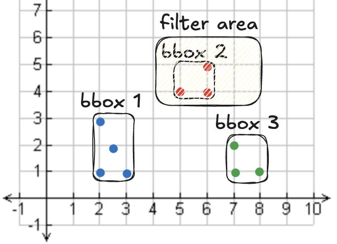

<!--
 Licensed to the Apache Software Foundation (ASF) under one
 or more contributor license agreements.  See the NOTICE file
 distributed with this work for additional information
 regarding copyright ownership.  The ASF licenses this file
 to you under the Apache License, Version 2.0 (the
 "License"); you may not use this file except in compliance
 with the License.  You may obtain a copy of the License at

   http://www.apache.org/licenses/LICENSE-2.0

 Unless required by applicable law or agreed to in writing,
 software distributed under the License is distributed on an
 "AS IS" BASIS, WITHOUT WARRANTIES OR CONDITIONS OF ANY
 KIND, either express or implied.  See the License for the
 specific language governing permissions and limitations
 under the License.
 -->

# Apache Sedona GeoParquet with Spark

This page explains how to build spatial data lakes with Apache Sedona and GeoParquet.

GeoParquet offers many advantages for spatial data sets:

* Built-in support for geometry columns
* GeoParquet's columnar nature allows for column pruning, which speeds up queries that use only a subset of columns.
* Embedded statistics enable readers to skip reading entire chunks of a file in some queries.
* Storing bounding-box metadata (“bbox”) for each row group allows for row-group filtering.
* Columnar file formats are easy to compress.
* You don’t need to infer or manually specify the schema as you would have to with GeoJSON or CSV because GeoParquet includes it in the footer.

Let's see how to write a Sedona DataFrame to GeoParquet files.

## Write Sedona DataFrame to GeoParquet with Spark

Start by creating a Sedona DataFrame:

```python
df = sedona.createDataFrame(
    [
        ("a", "LINESTRING(2.0 5.0,6.0 1.0)"),
        ("b", "LINESTRING(7.0 4.0,9.0 2.0)"),
        ("c", "LINESTRING(1.0 3.0,3.0 1.0)"),
    ],
    ["id", "geometry"],
)
df = df.withColumn("geometry", ST_GeomFromText(col("geometry")))
```

Now write the DataFrame to GeoParquet files:

```python
df.write.format("geoparquet").mode("overwrite").save("/tmp/somewhere")
```

Here are the files created in storage:

```
somewhere/
  _SUCCESS
  part-00000-1c13be9e-6d4c-401e-89d8-739000ad3aba-c000.snappy.parquet
  part-00003-1c13be9e-6d4c-401e-89d8-739000ad3aba-c000.snappy.parquet
  part-00007-1c13be9e-6d4c-401e-89d8-739000ad3aba-c000.snappy.parquet
  part-00011-1c13be9e-6d4c-401e-89d8-739000ad3aba-c000.snappy.parquet
```

Sedona writes many Parquet files in parallel because that's much faster than writing a single file.

## Read GeoParquet files into Sedona DataFrame with Spark

Let's read the GeoParquet files into a Sedona DataFrame:

```python
df = sedona.read.format("geoparquet").load("/tmp/somewhere")
df.show(truncate=False)
```

Here are the results:

```
+---+---------------------+
|id |geometry             |
+---+---------------------+
|a  |LINESTRING (2 5, 6 1)|
|b  |LINESTRING (7 4, 9 2)|
|c  |LINESTRING (1 3, 3 1)|
+---+---------------------+
```

Here's how Sedona executes this query under the hood:

1. It fetches the schema from the footer of a GeoParquet file, so no schema inference is needed.
2. It collects the bbox metadata for each file and sees if any data can be skipped.
3. It runs the query, skipping any columns that are not required.

Sedona queries on GeoParquet files can often be executed faster and more reliably than other file formats, like CSV.  CSV files don't store the schema in the file footer, don't support column pruning, and don't have row-group metadata for data skipping.

## Inspect GeoParquet metadata

Since v`1.5.1`, Sedona provides a Spark SQL data source `"geoparquet.metadata"` for inspecting GeoParquet metadata. The resulting dataframe contains
the "geo" metadata for each input file.

=== "Scala"

  ```scala
  val df = sedona.read.format("geoparquet.metadata").load(geoparquetdatalocation1)
  df.printSchema()
  ```

=== "Java"

  ```java
  Dataset<Row> df = sedona.read.format("geoparquet.metadata").load(geoparquetdatalocation1)
  df.printSchema()
  ```

=== "Python"

  ```python
  df = sedona.read.format("geoparquet.metadata").load(geoparquetdatalocation1)
  df.printSchema()
  ```

The output will be as follows:

```
root
 |-- path: string (nullable = true)
 |-- version: string (nullable = true)
 |-- primary_column: string (nullable = true)
 |-- columns: map (nullable = true)
 |    |-- key: string
 |    |-- value: struct (valueContainsNull = true)
 |    |    |-- encoding: string (nullable = true)
 |    |    |-- geometry_types: array (nullable = true)
 |    |    |    |-- element: string (containsNull = true)
 |    |    |-- bbox: array (nullable = true)
 |    |    |    |-- element: double (containsNull = true)
 |    |    |-- crs: string (nullable = true)
```

The GeoParquet footer stores the following data for each column:

* geometry_type: type of geometric object like point or polygon
* bbox: bounding box of objects in file
* crs: Coordinate Reference System
* covering: a struct column of xmin, ymin, xmax, ymax that provides the row group statistics for GeoParquet 1.1 files

The rest of the Parquet metadata is stored in the Parquet footer, right where it is stored for other Parquet files too.

If the input Parquet file does not have GeoParquet metadata, the values of `version`, `primary_column` and `columns` fields of the resulting dataframe will be `null`.

`geoparquet.metadata` only supports reading GeoParquet specific metadata. Users can use [G-Research/spark-extension](https://github.com/G-Research/spark-extension/blob/13109b8e43dfba9272c85896ba5e30cfe280426f/PARQUET.md) to read comprehensive metadata of generic Parquet files.

Let’s check out the content of the metadata and the schema:

```
df.show(truncate=False)

+-----------------------------+-------------------------------------------------------------------+
|path                         |columns                                                            |
+-----------------------------+-------------------------------------------------------------------+
|file:/part-00003-1c13.parquet|{geometry -> {WKB, [LineString], [2.0, 1.0, 6.0, 5.0], null, NULL}}|
|file:/part-00007-1c13.parquet|{geometry -> {WKB, [LineString], [7.0, 2.0, 9.0, 4.0], null, NULL}}|
|file:/part-00011-1c13.parquet|{geometry -> {WKB, [LineString], [1.0, 1.0, 3.0, 3.0], null, NULL}}|
|file:/part-00000-1c13.parquet|{geometry -> {WKB, [], [0.0, 0.0, 0.0, 0.0], null, NULL}}          |
+-----------------------------+-------------------------------------------------------------------+
```

The `columns` column contains bounding box information on each file in the GeoParquet data lake.  These bbox values are useful for skipping files or row-groups.  More will come on bbox metadata in the following section.

## Write GeoParquet with CRS Metadata

Since v`1.5.1`, Sedona supports writing GeoParquet files with custom GeoParquet spec version and crs.
The default GeoParquet spec version is `1.0.0` and the default crs is `null`. You can specify the GeoParquet spec version and crs as follows:

```scala
val projjson = "{...}" // PROJJSON string for all geometry columns
df.write.format("geoparquet")
    .option("geoparquet.version", "1.0.0")
    .option("geoparquet.crs", projjson)
    .save(geoparquetoutputlocation + "/GeoParquet_File_Name.parquet")
```

If you have multiple geometry columns written to the GeoParquet file, you can specify the CRS for each column.
For example, `g0` and `g1` are two geometry columns in the DataFrame `df`, and you want to specify the CRS for each column as follows:

```scala
val projjson_g0 = "{...}" // PROJJSON string for g0
val projjson_g1 = "{...}" // PROJJSON string for g1
df.write.format("geoparquet")
    .option("geoparquet.version", "1.0.0")
    .option("geoparquet.crs.g0", projjson_g0)
    .option("geoparquet.crs.g1", projjson_g1)
    .save(geoparquetoutputlocation + "/GeoParquet_File_Name.parquet")
```

The value of `geoparquet.crs` and `geoparquet.crs.<column_name>` can be one of the following:

* `"null"`: Explicitly setting `crs` field to `null`. This is the default behavior.
* `""` (empty string): Omit the `crs` field. This implies that the CRS is [OGC:CRS84](https://www.opengis.net/def/crs/OGC/1.3/CRS84) for CRS-aware implementations.
* `"{...}"` (PROJJSON string): The `crs` field will be set as the PROJJSON object representing the Coordinate Reference System (CRS) of the geometry. You can find the PROJJSON string of a specific CRS from here: https://epsg.io/ (click the JSON option at the bottom of the page). You can also customize your PROJJSON string as needed.

Please note that Sedona currently cannot set/get a projjson string to/from a CRS. Its geoparquet reader will ignore the projjson metadata and you will have to set your CRS via [`ST_SetSRID`](../../api/sql/Function.md#st_setsrid) after reading the file.
Its geoparquet writer will not leverage the SRID field of a geometry so you will have to always set the `geoparquet.crs` option manually when writing the file, if you want to write a meaningful CRS field.

Due to the same reason, Sedona geoparquet reader and writer do NOT check the axis order (lon/lat or lat/lon) and assume they are handled by the users themselves when writing / reading the files. You can always use [`ST_FlipCoordinates`](../../api/sql/Function.md#st_flipcoordinates) to swap the axis order of your geometries.

## Save GeoParquet with Covering Metadata

Since `v1.6.1`, Sedona supports writing the [`covering` field](https://github.com/opengeospatial/geoparquet/blob/v1.1.0/format-specs/geoparquet.md#covering) to geometry column metadata. The `covering` field specifies a bounding box column to help accelerate spatial data retrieval. The bounding box column should be a top-level struct column containing `xmin`, `ymin`, `xmax`, `ymax` columns. If the DataFrame you are writing contains such columns, you can specify `.option("geoparquet.covering.<geometryColumnName>", "<coveringColumnName>")` option to write `covering` metadata to GeoParquet files:

```scala
df.write.format("geoparquet")
    .option("geoparquet.covering.geometry", "bbox")
    .save("/path/to/saved_geoparquet.parquet")
```

If the DataFrame has only one geometry column, you can simply specify the `geoparquet.covering` option and omit the geometry column name:

```scala
df.write.format("geoparquet")
    .option("geoparquet.covering", "bbox")
    .save("/path/to/saved_geoparquet.parquet")
```

If the DataFrame does not have a covering column, you can construct one using Sedona's SQL functions:

```scala
val df_bbox = df.withColumn("bbox", expr("struct(ST_XMin(geometry) AS xmin, ST_YMin(geometry) AS ymin, ST_XMax(geometry) AS xmax, ST_YMax(geometry) AS ymax)"))
df_bbox.write.format("geoparquet").option("geoparquet.covering.geometry", "bbox").save("/path/to/saved_geoparquet.parquet")
```

## Sort then Save GeoParquet

To maximize the performance of Sedona GeoParquet filter pushdown, we suggest that you sort the data by their geohash values (see [ST_GeoHash](../../api/sql/Function.md#st_geohash)) and then save as a GeoParquet file. An example is as follows:

```
SELECT col1, col2, geom, ST_GeoHash(geom, 5) as geohash
FROM spatialDf
ORDER BY geohash
```

Let's look closer at how Sedona uses the GeoParquet bbox metadata to optimize queries.

## Spatial Partitioning for GeoParquet

When building a GeoParquet data lake, spatial partitioning can dramatically improve query performance by co-locating spatially nearby records into the same partitions. This makes GeoParquet bbox-based file skipping much more effective because each file's bounding box covers a compact spatial region instead of spanning the entire dataset.

Sedona provides a one-step API — `StructuredAdapter.repartitionBySpatialKey` — that handles spatial partitioning directly on DataFrames. Under the hood it converts to a SpatialRDD, applies a partitioning scheme such as KDB-Tree, and converts back to a DataFrame — all in a single call.

=== "Python"

    ```python
    from sedona.core.enums import GridType
    from sedona.spark.adapters.structured_adapter import StructuredAdapter

    df = sedona.read.format("geoparquet").load("/path/to/input")

    # Repartition with explicit geometry column and partition count
    partitioned_df = StructuredAdapter.repartitionBySpatialKey(
        df, GridType.KDBTREE, "geometry", 16
    )

    # Or auto-detect geometry column
    partitioned_df = StructuredAdapter.repartitionBySpatialKey(df, GridType.KDBTREE)

    partitioned_df.write.format("geoparquet").save("/path/to/output")
    ```

=== "Scala"

    ```scala
    import org.apache.sedona.core.enums.GridType
    import org.apache.spark.sql.sedona_sql.adapters.StructuredAdapter

    val df = sedona.read.format("geoparquet").load("/path/to/input")

    // Repartition with explicit geometry column and partition count
    val partitionedDf = StructuredAdapter.repartitionBySpatialKey(df, "geometry", GridType.KDBTREE, 16)

    // Or auto-detect geometry column
    val partitionedDf = StructuredAdapter.repartitionBySpatialKey(df, GridType.KDBTREE)

    partitionedDf.write.format("geoparquet").save("/path/to/output")
    ```

=== "Java"

    ```java
    import org.apache.sedona.core.enums.GridType;
    import org.apache.spark.sql.sedona_sql.adapters.StructuredAdapter;

    Dataset<Row> df = sedona.read().format("geoparquet").load("/path/to/input");

    // Repartition with explicit geometry column and partition count
    Dataset<Row> partitionedDf = StructuredAdapter.repartitionBySpatialKey(df, "geometry", GridType.KDBTREE, 16);

    // Or auto-detect geometry column
    Dataset<Row> partitionedDf = StructuredAdapter.repartitionBySpatialKey(df, GridType.KDBTREE);

    partitionedDf.write().format("geoparquet").save("/path/to/output");
    ```

This approach is more effective than sorting by GeoHash because it uses a KDB-Tree to create balanced spatial partitions that respect the actual data distribution. Each output file will cover a compact spatial region, maximizing the effectiveness of GeoParquet's bbox-based file skipping.

## How Sedona uses GeoParquet bounding box (bbox) metadata with Spark

The bounding box metadata specifies the area covered by geometric shapes in a given file.  Suppose you query points in a region not covered by the bounding box for a given file.  The engine can skip that entire file when executing the query because it’s known that it does not cover any relevant data.

Skipping entire files of data can massively improve performance.  The more data that’s skipped, the faster the query will run.

Let’s look at an example of a dataset with points and three bounding boxes.



Now, let’s apply a spatial filter to read points within a particular area:



Here is the query:

```python
my_shape = "POLYGON((4.0 3.5, 4.0 6.0, 8.0 6.0, 8.0 4.5, 4.0 3.5))"

res = sedona.sql(f"""
select *
from points
where st_intersects(geometry, ST_GeomFromWKT('{my_shape}'))
""")
res.show(truncate=False)
```

Here are the results:

```
+---+-----------+
|id |geometry   |
+---+-----------+
|e  |POINT (5 4)|
|f  |POINT (6 4)|
|g  |POINT (6 5)|
+---+-----------+
```

We don’t need the data in bounding boxes 1 or 3 to run this query.  We just need points in bounding box 2.  File skipping lets us read one file instead of three for this query.  Here are the bounding boxes for the files in the GeoParquet data lake:

```
+--------------------------------------------------------------+
|columns                                                       |
+--------------------------------------------------------------+
|{geometry -> {WKB, [Point], [2.0, 1.0, 3.0, 3.0], null, NULL}}|
|{geometry -> {WKB, [Point], [7.0, 1.0, 8.0, 2.0], null, NULL}}|
|{geometry -> {WKB, [Point], [5.0, 4.0, 6.0, 5.0], null, NULL}}|
+--------------------------------------------------------------+
```

Skipping entire files can result in massive performance gains.

## Advantages of GeoParquet files

As previously mentioned, GeoParquet files have many advantages over row-oriented files like CSV or GeoJSON:

* Column pruning
* Row group filtering
* Schema in the footer
* Good compressibility because of the columnar data layout

These are huge advantages but don’t offer the complete feature set that spatial data practitioners need.

## Limitations of GeoParquet files

Parquet data lakes and GeoParquet data lakes face many of the same limitations as other data lakes:

* They don’t support reliable transactions
* Some Data Manipulation Language (“DML”) operations (e.g., update, delete) are not supported
* No concurrency protection
* Poor performance compared to databases for certain operations

To overcome these limitations, the data community has migrated to open table formats like Iceberg, Delta Lake, and Hudi.

Iceberg recently rolled out support for geometry and geography columns.  This allows data practitioners to get the best features of open table formats and the benefits of Parquet files, where the data is stored.  Iceberg overcomes the limitations of GeoParquet data lakes and allows for reliable transactions and easy access to common operations like updates and deletes.

## Conclusion

GeoParquet is a significant innovation for the spatial data community.  It provides geo engineers with embedded schemas, performance optimizations, and native support for geometry columns.

Spatial data engineers can also migrate to Iceberg now that it supports all these positive features of GeoParquet, and even more.  Iceberg provides many useful open table features and is almost always a better option than vanilla GeoParquet (except for single file datasets that will never change or for compatibility with other engines).

Switching from legacy file formats like Shapefile, GeoPackage, CSV, GeoJSON to high-performance file formats like GeoParquet/Iceberg should immediately speed up your computational workflows.
