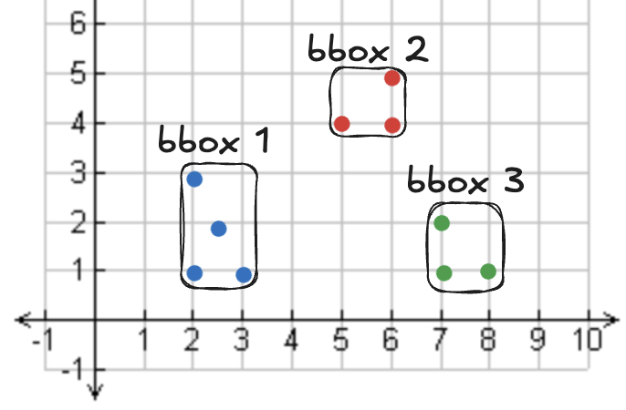
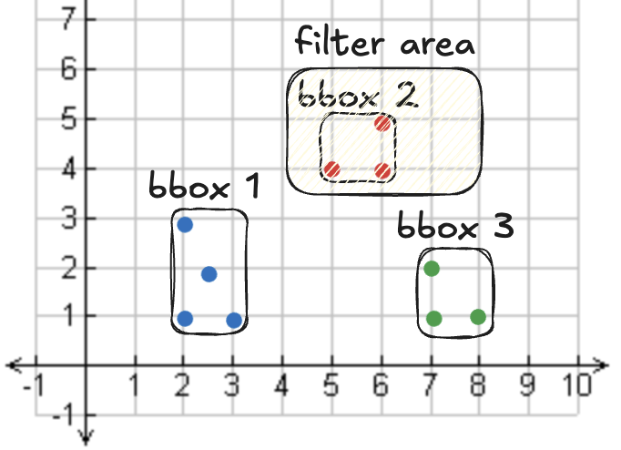

<!--
 Licensed to the Apache Software Foundation (ASF) under one
 or more contributor license agreements.  See the NOTICE file
 distributed with this work for additional information
 regarding copyright ownership.  The ASF licenses this file
 to you under the Apache License, Version 2.0 (the
 "License"); you may not use this file except in compliance
 with the License.  You may obtain a copy of the License at

   http://www.apache.org/licenses/LICENSE-2.0

 Unless required by applicable law or agreed to in writing,
 software distributed under the License is distributed on an
 "AS IS" BASIS, WITHOUT WARRANTIES OR CONDITIONS OF ANY
 KIND, either express or implied.  See the License for the
 specific language governing permissions and limitations
 under the License.
 -->

# 在 Spark 上使用 Apache Sedona 处理 GeoParquet

本页介绍如何使用 Apache Sedona 与 GeoParquet 构建空间数据湖。

GeoParquet 在空间数据集场景下具有诸多优势：

* 内置对几何列的支持
* GeoParquet 是列式存储，支持列裁剪，仅使用部分列的查询会更快
* 内嵌统计信息让某些查询能够直接跳过整块文件内容
* 为每个 row group 存储边界框（“bbox”）元数据，可进行 row-group 级过滤
* 列式格式利于压缩
* 与 GeoJSON 或 CSV 不同，GeoParquet 在文件尾部携带 schema，无需推断或手动指定

下面看如何把 Sedona DataFrame 写成 GeoParquet 文件。

## 使用 Spark 把 Sedona DataFrame 写为 GeoParquet

先创建一个 Sedona DataFrame：

```python
df = sedona.createDataFrame(
    [
        ("a", "LINESTRING(2.0 5.0,6.0 1.0)"),
        ("b", "LINESTRING(7.0 4.0,9.0 2.0)"),
        ("c", "LINESTRING(1.0 3.0,3.0 1.0)"),
    ],
    ["id", "geometry"],
)
df = df.withColumn("geometry", ST_GeomFromText(col("geometry")))
```

将 DataFrame 写成 GeoParquet 文件：

```python
df.write.format("geoparquet").mode("overwrite").save("/tmp/somewhere")
```

写出的文件如下：

```
somewhere/
  _SUCCESS
  part-00000-1c13be9e-6d4c-401e-89d8-739000ad3aba-c000.snappy.parquet
  part-00003-1c13be9e-6d4c-401e-89d8-739000ad3aba-c000.snappy.parquet
  part-00007-1c13be9e-6d4c-401e-89d8-739000ad3aba-c000.snappy.parquet
  part-00011-1c13be9e-6d4c-401e-89d8-739000ad3aba-c000.snappy.parquet
```

Sedona 会并行写出多个 Parquet 文件，比写单一文件快得多。

## 使用 Spark 将 GeoParquet 读入 Sedona DataFrame

将 GeoParquet 文件读入 Sedona DataFrame：

```python
df = sedona.read.format("geoparquet").load("/tmp/somewhere")
df.show(truncate=False)
```

结果如下：

```
+---+---------------------+
|id |geometry             |
+---+---------------------+
|a  |LINESTRING (2 5, 6 1)|
|b  |LINESTRING (7 4, 9 2)|
|c  |LINESTRING (1 3, 3 1)|
+---+---------------------+
```

Sedona 在底层执行该查询的过程大致如下：

1. 从 GeoParquet 文件尾部读取 schema，因此无需 schema 推断。
2. 收集每个文件的 bbox 元数据，判断哪些数据可以被跳过。
3. 执行查询时跳过未使用的列。

得益于此，Sedona 在 GeoParquet 上的查询通常比在 CSV 等格式上更快、更稳定。CSV 既不在文件尾部存 schema，也不支持列裁剪，更没有用于数据跳过的 row-group 元数据。

## 检查 GeoParquet 元数据

自 v`1.5.1` 起，Sedona 提供了一个 Spark SQL 数据源 `"geoparquet.metadata"`，可用于检查 GeoParquet 元数据。返回的 DataFrame 中包含每个输入文件的 “geo” 元数据。

=== "Scala"

  ```scala
  val df = sedona.read.format("geoparquet.metadata").load(geoparquetdatalocation1)
  df.printSchema()
  ```

=== "Java"

  ```java
  Dataset<Row> df = sedona.read.format("geoparquet.metadata").load(geoparquetdatalocation1)
  df.printSchema()
  ```

=== "Python"

  ```python
  df = sedona.read.format("geoparquet.metadata").load(geoparquetdatalocation1)
  df.printSchema()
  ```

输出如下：

```
root
 |-- path: string (nullable = true)
 |-- version: string (nullable = true)
 |-- primary_column: string (nullable = true)
 |-- columns: map (nullable = true)
 |    |-- key: string
 |    |-- value: struct (valueContainsNull = true)
 |    |    |-- encoding: string (nullable = true)
 |    |    |-- geometry_types: array (nullable = true)
 |    |    |    |-- element: string (containsNull = true)
 |    |    |-- bbox: array (nullable = true)
 |    |    |    |-- element: double (containsNull = true)
 |    |    |-- crs: string (nullable = true)
```

GeoParquet 文件尾部为每一列存储以下数据：

* geometry_type：几何对象的类型，如点、多边形等
* bbox：文件中对象的边界框
* crs：坐标参考系
* covering：包含 xmin、ymin、xmax、ymax 的结构体列，用于 GeoParquet 1.1 文件的 row group 统计信息

其他 Parquet 元数据存储在 Parquet 文件尾部，与普通 Parquet 文件保持一致。

如果输入的 Parquet 文件没有 GeoParquet 元数据，返回 DataFrame 中的 `version`、`primary_column` 与 `columns` 字段会为 `null`。

`geoparquet.metadata` 仅支持读取 GeoParquet 特有的元数据。如果需要读取通用 Parquet 文件的全部元数据，可以使用 [G-Research/spark-extension](https://github.com/G-Research/spark-extension/blob/13109b8e43dfba9272c85896ba5e30cfe280426f/PARQUET.md)。

我们来查看一下元数据的内容与 schema：

```
df.show(truncate=False)

+-----------------------------+-------------------------------------------------------------------+
|path                         |columns                                                            |
+-----------------------------+-------------------------------------------------------------------+
|file:/part-00003-1c13.parquet|{geometry -> {WKB, [LineString], [2.0, 1.0, 6.0, 5.0], null, NULL}}|
|file:/part-00007-1c13.parquet|{geometry -> {WKB, [LineString], [7.0, 2.0, 9.0, 4.0], null, NULL}}|
|file:/part-00011-1c13.parquet|{geometry -> {WKB, [LineString], [1.0, 1.0, 3.0, 3.0], null, NULL}}|
|file:/part-00000-1c13.parquet|{geometry -> {WKB, [], [0.0, 0.0, 0.0, 0.0], null, NULL}}          |
+-----------------------------+-------------------------------------------------------------------+
```

`columns` 列保存了 GeoParquet 数据湖中各文件的边界框信息，可用于跳过整个文件或 row group。下文还会进一步介绍如何利用 bbox 元数据。

## 写出带 CRS 元数据的 GeoParquet

自 v`1.5.1` 起，Sedona 支持以自定义的 GeoParquet 规范版本与 CRS 写出 GeoParquet 文件。默认的 GeoParquet 规范版本为 `1.1.0`（自 `v1.9.0` 起），默认 CRS 为 `null`。可按以下方式指定：

```scala
val projjson = "{...}" // 所有几何列共享的 PROJJSON 字符串
df.write.format("geoparquet")
    .option("geoparquet.version", "1.0.0")
    .option("geoparquet.crs", projjson)
    .save(geoparquetoutputlocation + "/GeoParquet_File_Name.parquet")
```

如果 GeoParquet 文件中存在多个几何列，可以为每个列分别指定 CRS。例如 `df` 中有两列几何列 `g0` 与 `g1`，希望分别指定它们的 CRS：

```scala
val projjson_g0 = "{...}" // g0 的 PROJJSON 字符串
val projjson_g1 = "{...}" // g1 的 PROJJSON 字符串
df.write.format("geoparquet")
    .option("geoparquet.version", "1.0.0")
    .option("geoparquet.crs.g0", projjson_g0)
    .option("geoparquet.crs.g1", projjson_g1)
    .save(geoparquetoutputlocation + "/GeoParquet_File_Name.parquet")
```

`geoparquet.crs` 与 `geoparquet.crs.<column_name>` 可取以下值：

* `"null"`：显式将 `crs` 字段置为 `null`，这是几何 SRID 为 0 时的默认行为。
* `""`（空字符串）：省略 `crs` 字段。对于支持 CRS 的实现而言，意味着使用 [OGC:CRS84](https://www.opengis.net/def/crs/OGC/1.3/CRS84)。
* `"{...}"`（PROJJSON 字符串）：`crs` 字段会被设为表示该几何坐标参考系的 PROJJSON 对象。可在 https://epsg.io/ （页面底部点击 JSON 选项）查找特定 CRS 的 PROJJSON，也可以根据需要自定义 PROJJSON。

### 通过 SRID 自动推断 CRS

未显式提供 `geoparquet.crs` 选项时，Sedona 会根据几何列的 SRID 自动推导出 CRS PROJJSON。例如，如果某列所有几何对象的 SRID 都是 32632（通过 [`ST_SetSRID`](../../api/sql/Spatial-Reference-System/ST_SetSRID.md) 设置），写入器会自动在 GeoParquet 元数据中生成 EPSG:32632 对应的 PROJJSON。当 SRID 为 4326 时，由于这就是 GeoParquet 的默认 CRS（OGC:CRS84），`crs` 字段会被省略。

* 若 SRID 为 0（未显式设置 SRID 的几何对象的默认值），`crs` 字段会被设为 `null`。
* 若同一列中的几何对象 SRID 不一致，`crs` 字段默认置为 `null`。
* 若显式提供了 `geoparquet.crs` 或 `geoparquet.crs.<column_name>` 选项，则始终优先于 SRID 推导出的 CRS。

Sedona 的 GeoParquet 读写器**不会**校验坐标轴顺序（lon/lat 还是 lat/lon），假定使用者在读写时自行处理。可以使用 [`ST_FlipCoordinates`](../../api/sql/Geometry-Editors/ST_FlipCoordinates.md) 来交换几何对象的坐标轴顺序。

## 写出带 covering 元数据的 GeoParquet

自 `v1.6.1` 起，Sedona 支持向几何列元数据写入 [`covering` 字段](https://github.com/opengeospatial/geoparquet/blob/v1.1.0/format-specs/geoparquet.md#covering)。该字段指定一列边界框列以加速空间数据检索。该边界框列必须是顶层结构体列，包含 `xmin`、`ymin`、`xmax`、`ymax` 四个子列。如果待写入的 DataFrame 已经包含这样的列，可通过 `.option("geoparquet.covering.<geometryColumnName>", "<coveringColumnName>")` 选项把 `covering` 元数据写入 GeoParquet：

```scala
df.write.format("geoparquet")
    .option("geoparquet.covering.geometry", "bbox")
    .save("/path/to/saved_geoparquet.parquet")
```

如果 DataFrame 仅有一列几何列，可以省略列名直接使用 `geoparquet.covering`：

```scala
df.write.format("geoparquet")
    .option("geoparquet.covering", "bbox")
    .save("/path/to/saved_geoparquet.parquet")
```

如果未设置 `geoparquet.covering` 选项，Sedona 在写出 GeoParquet `1.1.0` 时会自动为您填充 covering 元数据。

对每个几何列，Sedona 会使用 `<geometryColumnName>_bbox` 作为 covering 列：

* 如果 `<geometryColumnName>_bbox` 已存在且是合法的 covering 结构体（`xmin`、`ymin`、`xmax`、`ymax`），Sedona 会复用它。
* 如果 `<geometryColumnName>_bbox` 不存在，Sedona 会在写出时自动生成。

显式的 `geoparquet.covering` 或 `geoparquet.covering.<geometryColumnName>` 选项始终优先于上述默认行为。

可以通过 `geoparquet.covering.mode` 控制该默认行为：

* `auto`（默认）：在写 GeoParquet `1.1.0` 时启用 covering 元数据/列的自动生成。
* `legacy`：禁用自动 covering 生成。

```scala
df.write.format("geoparquet")
  .option("geoparquet.covering.mode", "legacy")
  .save("/path/to/saved_geoparquet.parquet")
```

如果 DataFrame 中没有 covering 列，可以使用 Sedona 的 SQL 函数构造一个：

```scala
val df_bbox = df.withColumn("bbox", expr("struct(ST_XMin(geometry) AS xmin, ST_YMin(geometry) AS ymin, ST_XMax(geometry) AS xmax, ST_YMax(geometry) AS ymax)"))
df_bbox.write.format("geoparquet").option("geoparquet.covering.geometry", "bbox").save("/path/to/saved_geoparquet.parquet")
```

## 排序后再写出 GeoParquet

为了最大程度地发挥 Sedona GeoParquet filter pushdown 的性能，建议先按几何对象的 geohash 值（参见 [ST_GeoHash](../../api/sql/Geometry-Output/ST_GeoHash.md)）排序，再写出 GeoParquet。示例如下：

```
SELECT col1, col2, geom, ST_GeoHash(geom, 5) as geohash
FROM spatialDf
ORDER BY geohash
```

接下来更深入地看看 Sedona 是如何利用 GeoParquet 的 bbox 元数据来优化查询的。

## Sedona 如何在 Spark 上利用 GeoParquet 边界框（bbox）元数据

bbox 元数据描述了某个文件中所包含几何对象覆盖的范围。如果查询的区域不与某个文件的边界框相交，引擎在执行查询时即可整体跳过该文件——因为它不可能包含相关数据。

跳过整个文件可以极大提升性能，跳过的数据越多，查询就越快。

下面来看一个由若干点和三个边界框组成的数据集示例：



应用一个空间过滤器，只读取某个区域内的点：



查询代码：

```python
my_shape = "POLYGON((4.0 3.5, 4.0 6.0, 8.0 6.0, 8.0 4.5, 4.0 3.5))"

res = sedona.sql(f"""
select *
from points
where st_intersects(geometry, ST_GeomFromWKT('{my_shape}'))
""")
res.show(truncate=False)
```

结果如下：

```
+---+-----------+
|id |geometry   |
+---+-----------+
|e  |POINT (5 4)|
|f  |POINT (6 4)|
|g  |POINT (6 5)|
+---+-----------+
```

执行该查询其实并不需要边界框 1 或 3 中的数据，只需要边界框 2 中的点。文件跳过让我们对这个查询只需读取一个文件而非三个。该数据湖中各文件的 bbox 如下：

```
+--------------------------------------------------------------+
|columns                                                       |
+--------------------------------------------------------------+
|{geometry -> {WKB, [Point], [2.0, 1.0, 3.0, 3.0], null, NULL}}|
|{geometry -> {WKB, [Point], [7.0, 1.0, 8.0, 2.0], null, NULL}}|
|{geometry -> {WKB, [Point], [5.0, 4.0, 6.0, 5.0], null, NULL}}|
+--------------------------------------------------------------+
```

跳过整个文件能带来显著的性能收益。

## GeoParquet 的优势

如前所述，GeoParquet 相比 CSV、GeoJSON 等行式格式有诸多优势：

* 列裁剪
* row-group 过滤
* schema 写在文件尾部
* 列式数据布局，压缩效果良好

但这些优势仍不足以满足空间数据从业者所需的全部能力。

## GeoParquet 的局限

Parquet 与 GeoParquet 数据湖与其他数据湖一样，存在以下局限：

* 不支持可靠事务
* 不支持部分数据操作语言（DML），如 update、delete
* 没有并发保护
* 与数据库相比，某些操作性能较差

为了克服这些局限，数据社区已逐步迁移到 Iceberg、Delta Lake、Hudi 等开放式表格式。

Iceberg 最近开始支持 geometry 与 geography 列，让数据从业者既能享受开放式表格式的特性，又能复用底层的 Parquet 文件。Iceberg 解决了 GeoParquet 数据湖的局限，支持可靠事务以及 update、delete 等常见操作。

## 结论

GeoParquet 是空间数据社区的一项重要进展。它为地理工程师提供了内嵌 schema、性能优化与对几何列的原生支持。

由于 Iceberg 现已具备 GeoParquet 的全部优秀特性甚至更多，空间数据工程师也可以平滑迁移到 Iceberg。Iceberg 提供了大量实用的开放式表格式特性，几乎在所有场景下都优于纯 GeoParquet（例外情况：永不变更的单文件数据集，或与其他引擎的兼容性需求）。

将工作流从 Shapefile、GeoPackage、CSV、GeoJSON 等传统格式迁移到 GeoParquet/Iceberg 等高性能格式，能立刻提升计算效率。
