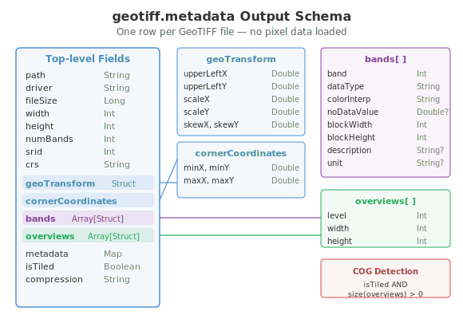
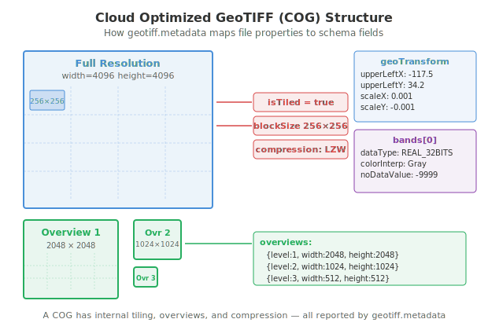

<!--
 Licensed to the Apache Software Foundation (ASF) under one
 or more contributor license agreements.  See the NOTICE file
 distributed with this work for additional information
 regarding copyright ownership.  The ASF licenses this file
 to you under the Apache License, Version 2.0 (the
 "License"); you may not use this file except in compliance
 with the License.  You may obtain a copy of the License at

   http://www.apache.org/licenses/LICENSE-2.0

 Unless required by applicable law or agreed to in writing,
 software distributed under the License is distributed on an
 "AS IS" BASIS, WITHOUT WARRANTIES OR CONDITIONS OF ANY
 KIND, either express or implied.  See the License for the
 specific language governing permissions and limitations
 under the License.
 -->

# GeoTiffMetadata - GeoTIFF 文件元数据

`GeoTiffMetadata` 是 Spark 数据源，用于读取 GeoTIFF 文件的元数据，而不解码像素数据，行为类似于 [gdalinfo](https://gdal.org/en/stable/programs/gdalinfo.html)。它会为每个文件返回一行，包含尺寸、坐标系、波段信息、瓦片化、概览（overview）以及压缩等元数据。

适用场景：

* 对大批量栅格文件进行编目与盘点
* 通过检查瓦片化与概览状态识别 Cloud Optimized GeoTIFF（COG）
* 在加载完整栅格数据前先检查文件属性
* 基于栅格文件集合构建空间索引



## 检测 COG

Cloud Optimized GeoTIFF（COG）是带有内部瓦片与概览结构、面向云端访问优化过的 GeoTIFF 文件。`geotiff.metadata` 数据源会直接报告这些属性：



```python
df = sedona.read.format("geotiff.metadata").load("/path/to/rasters/")
cogs = df.filter("isTiled AND size(overviews) > 0")
cogs.select("path", "compression", "overviews").show(truncate=False)
```

## 读取 GeoTIFF 元数据

=== "Scala"

    ```scala
    val df = sedona.read.format("geotiff.metadata").load("/path/to/rasters/")
    df.show()
    ```

=== "Java"

    ```java
    Dataset<Row> df = sedona.read().format("geotiff.metadata").load("/path/to/rasters/");
    df.show();
    ```

=== "Python"

    ```python
    df = sedona.read.format("geotiff.metadata").load("/path/to/rasters/")
    df.show()
    ```

也支持 glob 通配符：

```python
df = sedona.read.format("geotiff.metadata").load("/path/to/rasters/*.tif")
```

或加载单个文件：

```python
df = sedona.read.format("geotiff.metadata").load("/path/to/image.tiff")
```

## 输出 schema

每行代表一个 GeoTIFF 文件，包含以下列：

| 列 | 类型 | 说明 |
|--------|------|-------------|
| `path` | String | 文件路径 |
| `driver` | String | 格式驱动（`"GTiff"`） |
| `fileSize` | Long | 文件大小（字节） |
| `width` | Int | 图像宽度（像素） |
| `height` | Int | 图像高度（像素） |
| `numBands` | Int | 波段数 |
| `srid` | Int | EPSG 编号（未知时为 0） |
| `crs` | String | 以 WKT 表示的坐标参考系 |
| `geoTransform` | Struct | 仿射变换参数 |
| `cornerCoordinates` | Struct | 边界框 |
| `bands` | Array[Struct] | 每个波段的元数据 |
| `overviews` | Array[Struct] | 概览（金字塔）层级 |
| `metadata` | Map[String, String] | 文件级 TIFF 元数据标签 |
| `isTiled` | Boolean | 是否使用了内部瓦片化 |
| `compression` | String | 压缩类型（如 `"LZW"`、`"Deflate"`） |

### geoTransform 结构体

| 字段 | 类型 | 说明 |
|-------|------|-------------|
| `upperLeftX` | Double | 世界坐标系下的原点 X |
| `upperLeftY` | Double | 世界坐标系下的原点 Y |
| `scaleX` | Double | X 方向的像素大小 |
| `scaleY` | Double | Y 方向的像素大小 |
| `skewX` | Double | X 方向的旋转/剪切 |
| `skewY` | Double | Y 方向的旋转/剪切 |

### cornerCoordinates 结构体

| 字段 | 类型 | 说明 |
|-------|------|-------------|
| `minX` | Double | X 最小值（西） |
| `minY` | Double | Y 最小值（南） |
| `maxX` | Double | X 最大值（东） |
| `maxY` | Double | Y 最大值（北） |

### bands 数组元素

| 字段 | 类型 | 说明 |
|-------|------|-------------|
| `band` | Int | 波段编号（从 1 开始） |
| `dataType` | String | 数据类型（如 `"REAL_32BITS"`） |
| `colorInterpretation` | String | 颜色解释（如 `"Gray"`、`"Red"`） |
| `noDataValue` | Double | NoData 值（未设置时为 null） |
| `blockWidth` | Int | 内部 tile/block 宽度 |
| `blockHeight` | Int | 内部 tile/block 高度 |
| `description` | String | 波段描述 |
| `unit` | String | 单位（如 `"meters"`） |

### overviews 数组元素

| 字段 | 类型 | 说明 |
|-------|------|-------------|
| `level` | Int | 概览层级（1, 2, 3, ...） |
| `width` | Int | 概览宽度（像素） |
| `height` | Int | 概览高度（像素） |

## 示例

### 查看波段信息

```python
df = sedona.read.format("geotiff.metadata").load("/path/to/image.tif")
df.selectExpr("path", "explode(bands) as band").selectExpr(
    "path",
    "band.band",
    "band.dataType",
    "band.noDataValue",
    "band.blockWidth",
    "band.blockHeight",
).show()
```

### 按空间范围过滤

```python
df = sedona.read.format("geotiff.metadata").load("/path/to/rasters/")
df.filter("cornerCoordinates.minX > -120 AND cornerCoordinates.maxX < -100").select(
    "path", "width", "height", "srid"
).show()
```

### 获取概览详情

```python
df = sedona.read.format("geotiff.metadata").load("/path/to/image.tif")
df.selectExpr("path", "explode(overviews) as ovr").selectExpr(
    "path", "ovr.level", "ovr.width", "ovr.height"
).show()
```

### 仅选取需要的列

```python
df = (
    sedona.read.format("geotiff.metadata")
    .load("/path/to/rasters/")
    .select("path", "width", "height", "numBands")
)
df.show()
```
