<!--
 Licensed to the Apache Software Foundation (ASF) under one
 or more contributor license agreements.  See the NOTICE file
 distributed with this work for additional information
 regarding copyright ownership.  The ASF licenses this file
 to you under the Apache License, Version 2.0 (the
 "License"); you may not use this file except in compliance
 with the License.  You may obtain a copy of the License at

   http://www.apache.org/licenses/LICENSE-2.0

 Unless required by applicable law or agreed to in writing,
 software distributed under the License is distributed on an
 "AS IS" BASIS, WITHOUT WARRANTIES OR CONDITIONS OF ANY
 KIND, either express or implied.  See the License for the
 specific language governing permissions and limitations
 under the License.
 -->

Sedona SQL 在矢量之外也原生支持栅格数据。本教程使用同一份数据集，把它从加载、检视、可视化、处理、再次可视化到落盘走完一遍完整的流水线，让你能直接看到每一步产出的结果。其他格式、所有算子的速查、以及 Python 端的额外用法，放在文末的参考章节。

!!!note
    Sedona 中所有栅格函数均使用从 1 开始的索引，唯一例外是 [map algebra](../api/sql/Raster-map-algebra.md)，它使用从 0 开始的索引。

!!!note
    Sedona 假定地理坐标按经度/纬度顺序排列。若数据是 lat/lon 顺序，请使用 `ST_FlipCoordinates` 交换 X 与 Y。

Scala、Java、Python、R 等所有 Sedona 语言绑定都已支持栅格能力。本教程以 Python 为主语言进行示例，关键步骤会附上多语言切换标签。

## 配置依赖

=== "Scala/Java"

	1. 阅读 [Sedona Maven Central 坐标](../setup/maven-coordinates.md)，并在 build.sbt 或 pom.xml 中添加 Sedona 依赖。
	2. 添加 [Apache Spark core](https://mvnrepository.com/artifact/org.apache.spark/spark-core) 与 [Apache SparkSQL](https://mvnrepository.com/artifact/org.apache.spark/spark-sql) 依赖。
	3. 参考 [SQL 示例项目](demo.md)。

=== "Python"

	1. 阅读 [快速开始](../setup/install-python.md) 安装 Sedona Python。
	2. 本教程结构参考 [Sedona SQL Jupyter Notebook 示例](jupyter-notebook.md)。
	3. 教程主线使用 NumPy 和 rasterio 合成输入场景：`pip install numpy rasterio`。如果直接读取已有的 GeoTIFF，则无需安装 rasterio。

## 创建 SedonaContext

若你已经有 SparkSession（例如来自 Wherobots、AWS EMR 或 Databricks），可直接跳过此步并把它传入 `SedonaContext.create`。否则：

=== "Scala"

	```scala
	import org.apache.sedona.spark.SedonaContext

	val config = SedonaContext.builder()
	  .master("local[*]") // 在集群上运行时请删除此行
	  .appName("rasterTutorial")
	  .getOrCreate()
	val sedona = SedonaContext.create(config)
	```

=== "Java"

	```java
	import org.apache.sedona.spark.SedonaContext;

	SparkSession config = SedonaContext.builder()
	  .master("local[*]") // 在集群上运行时请删除此行
	  .appName("rasterTutorial")
	  .getOrCreate();
	SparkSession sedona = SedonaContext.create(config);
	```

=== "Python"

	```python
	from sedona.spark import SedonaContext

	config = (
	    SedonaContext.builder()
	    .config(
	        "spark.jars.packages",
	        "org.apache.sedona:sedona-spark-shaded-3.3_2.12:{{ sedona.current_version }},"
	        "org.datasyslab:geotools-wrapper:{{ sedona.current_geotools }}",
	    )
	    .getOrCreate()
	)
	sedona = SedonaContext.create(config)
	```
	请将 `sedona-spark-shaded-3.3` 中的 `3.3` 替换为对应的 Spark 主.次版本号，例如 `sedona-spark-shaded-3.4_2.12`。

你也可以通过给 `spark-submit` 或 `spark-shell` 传入 `--conf spark.sql.extensions=org.apache.sedona.sql.SedonaSqlExtensions` 来注册 Sedona。

## 端到端教程

本教程贯穿一份 2 波段 GeoTIFF —— 一小块 AOI 上的红光与近红外反射率影像 —— 让它走完一条典型的栅格处理流水线。场景影像在 Python 中合成，因此整个示例可重复运行，仓库无需新增任何二进制数据。对真实的 Sentinel-2 切片，下面同样的 SQL 不用改一行就能跑，仅输入路径需要换一下。

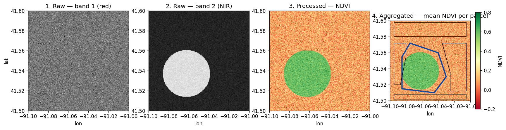

??? example "真实栅格长什么样"

    上面这套代码可处理任何符合 GeoTIFF 规范的数据。下面两个示例来自 Sedona 自带的测试资源：

    | 3 波段彩色栅格 | 单波段栅格 |
    | :--- | :--- |
    | 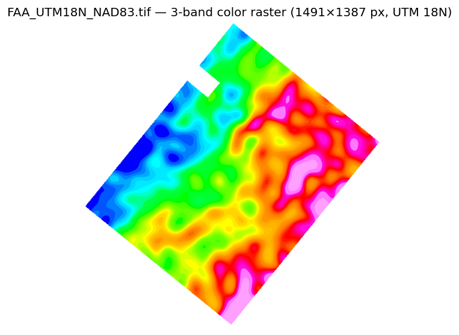 | 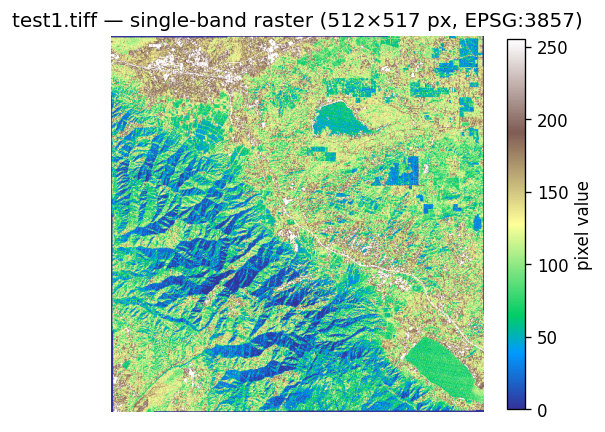 |

    它们的 `RS_NumBands(rast)` 分别返回 `3` 和 `1`。`RS_Band(rast, ARRAY(1,2,3))`、`RS_MapAlgebra` 等波段级函数在两类栅格上用法一致。

### 1. 准备输入场景

合成一份 256 × 256 的栅格，其中包含一块圆形植被田。真实工作流跳过这一步，直接让 Sedona 读取磁盘或对象存储上已有的 GeoTIFF。

```python
import os
import numpy as np
import rasterio
from rasterio.transform import from_bounds

WORK = "/tmp/sedona-raster-tutorial"
os.makedirs(WORK, exist_ok=True)

AOI = (-91.10, 41.50, -91.00, 41.60)  # xmin, ymin, xmax, ymax，EPSG:4326
W = H = 256
transform = from_bounds(*AOI, W, H)
rng = np.random.default_rng(42)

ys, xs = np.mgrid[0:H, 0:W]
field = ((xs - 96) ** 2 + (ys - 160) ** 2) < 60**2  # 圆形植被田

red = (1500 + 200 * rng.standard_normal((H, W))).clip(0, 10000).astype("uint16")
nir = (1800 + 200 * rng.standard_normal((H, W))).clip(0, 10000)
nir = np.where(field, nir + 4000, nir).astype("uint16")

with rasterio.open(
    f"{WORK}/scene.tif",
    "w",
    driver="GTiff",
    tiled=True,
    blockxsize=256,
    blockysize=256,
    height=H,
    width=W,
    count=2,
    dtype="uint16",
    crs="EPSG:4326",
    transform=transform,
) as dst:
    dst.write(red, 1)
    dst.set_band_description(1, "red")
    dst.write(nir, 2)
    dst.set_band_description(2, "nir")
```

### 2. 使用 `raster` 数据源加载

`raster` 数据源可以加载 GeoTIFF 并自动将文件切成多个 tile。每一个 tile 在结果 DataFrame 中对应一行，`Raster` 类型保存于其中的一列。

=== "Scala"

	```scala
	// 把路径替换为 scene.tif 的实际位置，例如对象存储 URL。
	val rasterDf = sedona.read.format("raster").load("/tmp/sedona-raster-tutorial/scene.tif")
	rasterDf.createOrReplaceTempView("rasterDf")
	rasterDf.show()
	```

=== "Java"

	```java
	// 把路径替换为 scene.tif 的实际位置，例如对象存储 URL。
	Dataset<Row> rasterDf = sedona.read().format("raster").load("/tmp/sedona-raster-tutorial/scene.tif");
	rasterDf.createOrReplaceTempView("rasterDf");
	rasterDf.show();
	```

=== "Python"

	```python
	rasterDf = sedona.read.format("raster").load(f"{WORK}/scene.tif")
	rasterDf.createOrReplaceTempView("rasterDf")
	rasterDf.show()
	```

```
+--------------------+---+---+----------+
|                rast|  x|  y|      name|
+--------------------+---+---+----------+
|GridCoverage2D["g...|  0|  0| scene.tif|
+--------------------+---+---+----------+
```

各列含义：

- `rast` —— 栅格数据，Sedona 内置 `Raster` 类型。
- `x`、`y` —— 当前 tile 在源文件内的 0 基索引（仅在启用 retile 时出现）。
- `name` —— 源文件名。

256 × 256 的场景在这里恰好放在一个 tile 中，所以 DataFrame 只有一行。一份几 GB 的 GeoTIFF 则会产生很多行 —— 下游同一份 SQL 在两种情况下都能工作。

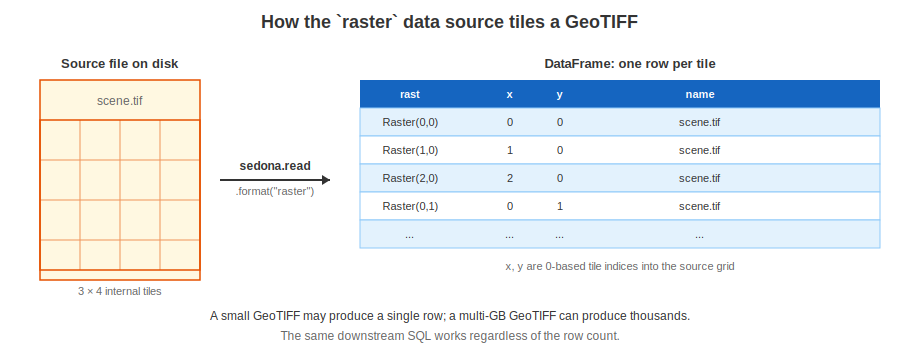

更多内容见下文的 [加载选项](#loading-options)：包括 tile 大小覆盖、目录递归读取、以及 NetCDF / Arc Grid 等非 GeoTIFF 格式。

### 3. 检视元数据

在做任何处理之前，先确认像素维度、地理参考与坐标系：

```python
sedona.sql("""
    SELECT RS_Width(rast)       AS width,
           RS_Height(rast)      AS height,
           RS_NumBands(rast)    AS bands,
           RS_SRID(rast)        AS srid,
           RS_GeoReference(rast) AS world_file
    FROM rasterDf
""").show(truncate=False)
```

```
+-----+------+-----+----+----------------------------------------------------------+
|width|height|bands|srid|world_file                                                 |
+-----+------+-----+----+----------------------------------------------------------+
|256  |256   |2    |4326|0.000391\n0.000000\n0.000000\n-0.000391\n-91.099805\n41.599805|
+-----+------+-----+----+----------------------------------------------------------+
```

[`RS_MetaData`](../api/sql/Raster-Operators/RS_MetaData.md) 把同样的信息以单个数组返回：`[upperLeftX, upperLeftY, width, height, scaleX, scaleY, skewX, skewY, srid, numBands]`。

地理参考字段共同定义了从像素空间到世界坐标的仿射变换：

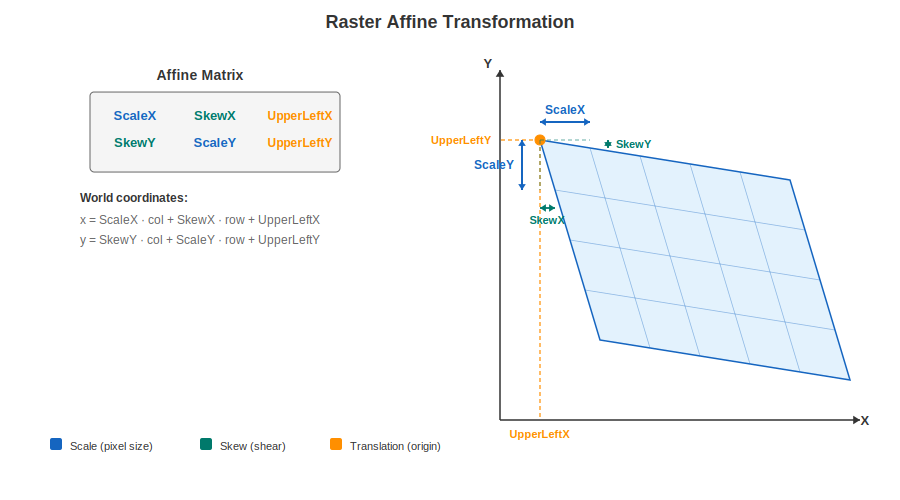

每个访问器的详细说明见 [栅格元数据参考](#raster-metadata-reference)；运行时的像素—世界坐标互转使用 [`RS_PixelAsPoint`](../api/sql/Pixel-Functions/RS_PixelAsPoint.md) 与 [`RS_WorldToRasterCoord`](../api/sql/Raster-Accessors/RS_WorldToRasterCoord.md)。

### 4. 可视化原始栅格

先把两个波段渲染出来，看看处理前的输入是什么样子。`SedonaUtils.display_image` 在 Jupyter notebook 中会自动检测栅格列并就地渲染：

```python
from sedona.spark import SedonaUtils

SedonaUtils.display_image(
    sedona.sql("SELECT RS_Band(rast, ARRAY(1)) AS rast FROM rasterDf")
)
SedonaUtils.display_image(
    sedona.sql("SELECT RS_Band(rast, ARRAY(2)) AS rast FROM rasterDf")
)
```

波段 1 是红光通道 —— 大体是没什么特征的裸地。波段 2 (NIR) 在植被田上明显变亮：

| 波段 1（红光） | 波段 2 (NIR) |
| :--- | :--- |
| 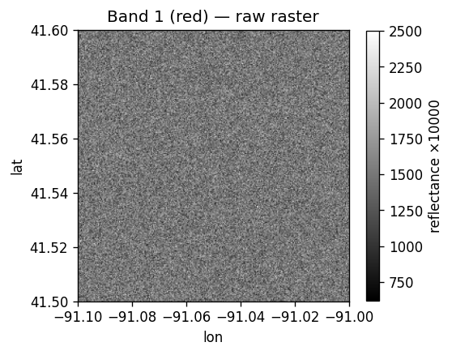 | 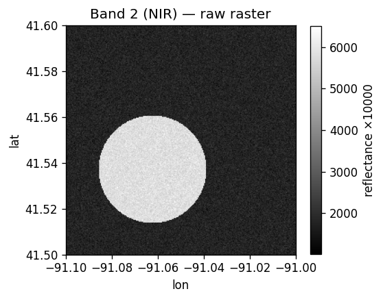 |

如果不在 notebook 环境，使用 [`RS_AsImage(rast, width)`](../api/sql/Raster-Output/RS_AsImage.md) 得到 HTML `` 标签，或者用 [`RS_AsBase64`](../api/sql/Raster-Output/RS_AsBase64.md) 得到任意图像查看器都能解码的 Base64 字符串。

### 5. 处理 —— 用 map algebra 计算 NDVI

归一化植被指数（NDVI）可以把活体植被从其他地物中分离出来：

```
NDVI = (NIR − Red) / (NIR + Red)
```

[`RS_MapAlgebra`](../api/sql/Raster-map-algebra.md) 在一个或多个波段上按像素运行一段脚本。输出类型 `'D'`（double）保留 NDVI 的负值范围：

```python
ndviDf = sedona.sql("""
    SELECT RS_MapAlgebra(
               rast, 'D',
               'out[0] = (rast[1] - rast[0]) / (rast[1] + rast[0] + 1e-6);'
           ) AS rast
    FROM rasterDf
""")
ndviDf.createOrReplaceTempView("ndviDf")
```

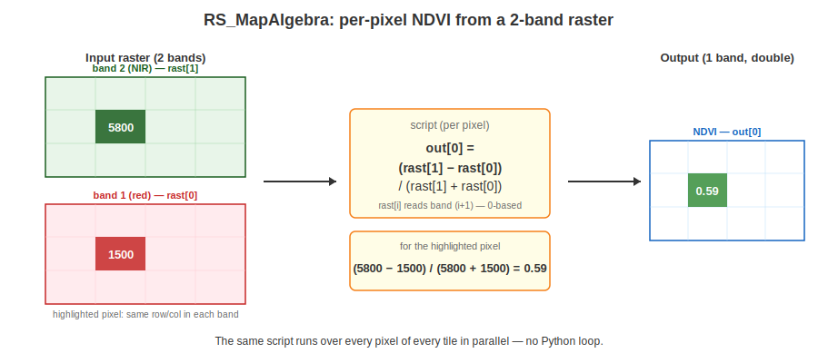

Map algebra 是最通用的处理原语 —— 裁剪、遮罩、阈值过滤、不同波段或不同栅格之间的算术运算，都可以用同样的 `RS_MapAlgebra(rast, pixelType, script)`（或双栅格版本）写出来。脚本语法见 [Map algebra](../api/sql/Raster-map-algebra.md)；其他备选算子（`RS_Clip`、`RS_Resample`、`RS_SetValues`）见下文的 [栅格处理参考](#raster-processing-reference)。

### 6. 可视化处理结果

NDVI 栅格让植被田一目了然：NDVI 高的像素显示为绿色，其余为淡红色。

```python
SedonaUtils.display_image(ndviDf)
```

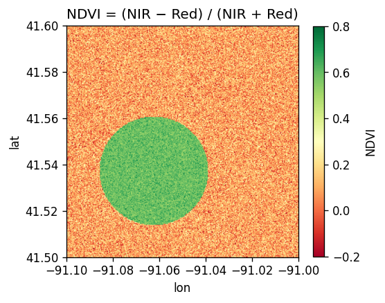

### 7. 使用分区统计聚合到矢量区域

逐像素的 NDVI 很少是最终的可交付成果。真正想回答的问题往往是「哪一块*区域*变绿了？」—— 哪个农业地块、哪个普查区、哪个流域。[`RS_ZonalStats(raster, zone, statType)`](../api/sql/Raster-Band-Accessors/RS_ZonalStats.md) 就是栅格 → 矢量聚合的规范函数：落在区域多边形内的每个像素都会贡献到该统计值上。

真实的地块边界往往是不规则的 —— 形状各异的田地、地块之间留出的道路与地役权间隙、不属于任何区域的留白。下面在 AOI 上手绘 5 个地块：

```python
from pyspark.sql import Row

parcels = sedona.createDataFrame(
    [
        Row(
            parcel_id="Orchard",
            wkt="POLYGON((-91.085 41.515, -91.045 41.510, -91.030 41.530, "
            "-91.040 41.560, -91.075 41.572, -91.085 41.555, -91.085 41.515))",
        ),
        Row(
            parcel_id="EastFarm",
            wkt="POLYGON((-91.025 41.512, -91.005 41.512, -91.005 41.572, "
            "-91.035 41.572, -91.025 41.535, -91.025 41.512))",
        ),
        Row(
            parcel_id="WestFarm",
            wkt="POLYGON((-91.095 41.520, -91.087 41.520, -91.080 41.555, "
            "-91.080 41.572, -91.095 41.572, -91.095 41.520))",
        ),
        Row(
            parcel_id="NorthBlock",
            wkt="POLYGON((-91.095 41.580, -91.005 41.580, -91.005 41.598, "
            "-91.095 41.598, -91.095 41.580))",
        ),
        Row(
            parcel_id="SouthStrip",
            wkt="POLYGON((-91.095 41.502, -91.005 41.502, -91.005 41.508, "
            "-91.095 41.508, -91.095 41.502))",
        ),
    ]
).selectExpr("parcel_id", "ST_GeomFromText(wkt) AS geom")

parcels.createOrReplaceTempView("parcels")

ranked = sedona.sql("""
    SELECT p.parcel_id,
           ROUND(RS_ZonalStats(n.rast, p.geom, 'mean'), 4) AS mean_ndvi
    FROM parcels p, ndviDf n
    ORDER BY mean_ndvi DESC
""")
ranked.show()
```

```
+----------+---------+
| parcel_id|mean_ndvi|
+----------+---------+
|   Orchard|   0.4213|
|  WestFarm|   0.1182|
|NorthBlock|   0.0925|
|  EastFarm|   0.0907|
|SouthStrip|   0.0905|
+----------+---------+
```

不规则形状的 **Orchard** 地块明显胜出 —— 它正好覆盖了植被田。落在地块缝隙里的像素（道路、未登记土地）不属于任何区域，对所有统计值都没有影响。

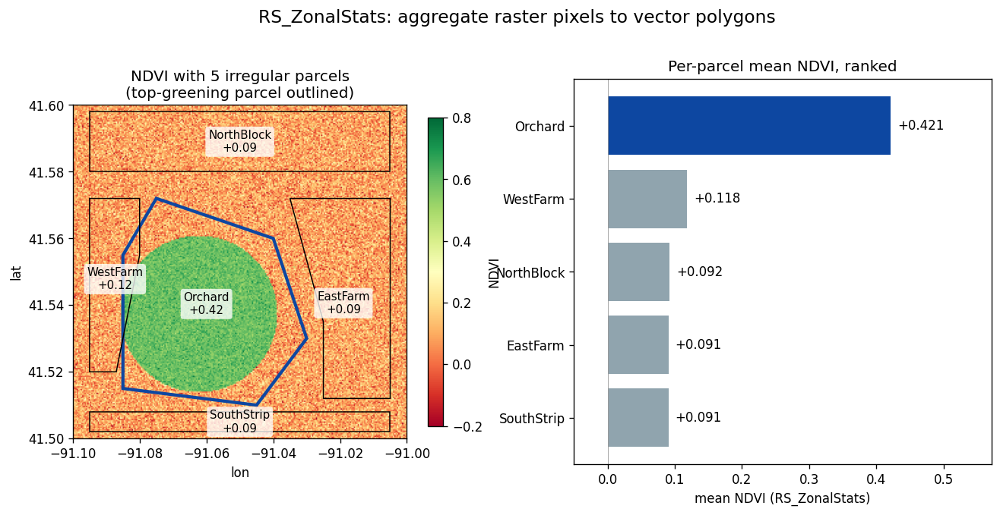

!!!note
    当输入栅格被分成多个 tile 时，`parcels × ndviDf` 的笛卡尔连接会产生每个 `(parcel, tile)` 一行的结果。要在 tile 之间正确聚合，应该按 tile 先算 `sum` 与 `count`，再 `GROUP BY parcel_id` 用 `SUM(sum) / SUM(count)` 汇总。思路相同，只是多加一层聚合。[`RS_ZonalStatsAll`](../api/sql/Raster-Band-Accessors/RS_ZonalStatsAll.md) 可以在一次调用里返回所有常用统计量。

### 8. 写回磁盘

写出栅格分两步：先用 `RS_AsXXX` 把 `Raster` 列转成二进制，再把这个二进制 DataFrame 交给 Sedona 的 `raster` writer。

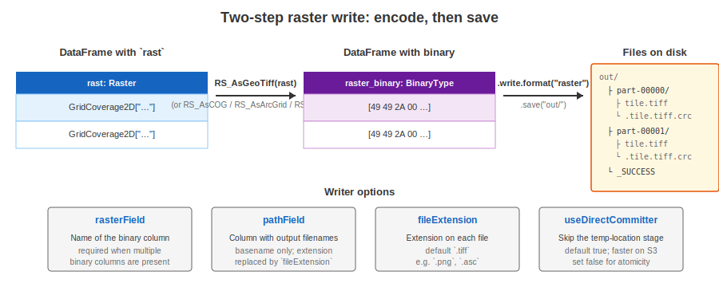

=== "Scala"

	```scala
	import org.apache.spark.sql.functions.expr

	ndviDf.withColumn("raster_binary", expr("RS_AsGeoTiff(rast)"))
	  .write.format("raster").mode("overwrite").save("/tmp/sedona-raster-tutorial/ndvi_out")
	```

=== "Python"

	```python
	from pyspark.sql.functions import expr

	(
	    ndviDf.withColumn("raster_binary", expr("RS_AsGeoTiff(rast)"))
	    .write.format("raster")
	    .mode("overwrite")
	    .save(f"{WORK}/ndvi_out")
	)
	```

输出目录中，每一行对应一个 part 子目录中的一个文件，再加上 Spark 的 `_SUCCESS` 标记。读回方式：

```python
roundtrip = sedona.read.format("raster").load(f"{WORK}/ndvi_out/*/*.tiff")
roundtrip.selectExpr("RS_Width(rast) AS w", "RS_Height(rast) AS h").show()
```

完整的 writer 选项（`rasterField`、`pathField`、`fileExtension`、`useDirectCommitter`）与可选的二进制格式（`RS_AsGeoTiff`、`RS_AsCOG`、`RS_AsArcGrid`、`RS_AsPNG`）见下文 [写出栅格参考](#writing-rasters-reference)。

---

下面是参考材料：其他加载方式、按用途分组的所有栅格算子、以及在 Python 端处理已收集 `SedonaRaster` 对象的用法。



## 加载选项 {#loading-options}



### Tile 大小覆盖

`raster` 数据源默认使用 GeoTIFF 自身的内部 tile 方案。推荐使用 [Cloud Optimized GeoTIFF](https://www.cogeo.org/)（COG）作为源格式，因为它本身就把像素按方形 tile 组织。要显式覆盖 tile 设置：

| 选项 | 默认值 | 说明 |
| :--- | :--- | :--- |
| `retile` | `true` | 是否进行 tile 切分。设为 `false` 时每个文件作为单行加载。 |
| `tileWidth` | 源文件内部的 tile 宽度 | 覆盖每个 tile 的宽度（像素）。 |
| `tileHeight` | 若已设置 `tileWidth`，则同其 | 覆盖每个 tile 的高度（像素）。 |
| `padWithNoData` | `false` | 当右侧/底部边缘的 tile 小于指定尺寸时，是否用 NODATA 值填充。 |

=== "Python"
	```python
	rasterDf = (
	    sedona.read.format("raster")
	    .option("tileWidth", "256")
	    .option("tileHeight", "256")
	    .load("/some/path/*.tif")
	)
	```

!!!note
    若文件内部布局不适合 tile 切分，数据源会报错。可通过 `option("retile", "false")` 禁用，或显式指定 tile 尺寸；更彻底的做法是用 `gdal_translate` 把文件重写为 COG。

### 按目录与 glob 加载

`raster` 数据源支持 Spark 通用的文件源选项：

=== "Python"
	```python
	rasterDf = (
	    sedona.read.format("raster")
	    .option("recursiveFileLookup", "true")
	    .option("pathGlobFilter", "*.tif*")
	    .load("/path/to/raster_folder")
	)
	```

!!!tip
    如果加载路径以 `/` 结尾，会自动开启递归扫描 —— 相当于设置了 `recursiveFileLookup=true`。

### 非 GeoTIFF 格式（NetCDF、Arc Grid）

对 GeoTIFF 以外的格式，使用 Spark 的 `binaryFile` 数据源加上 Sedona 的栅格构造器。

=== "Python"
	```python
	rawDf = sedona.read.format("binaryFile").load("/path/to/file.asc")
	rawDf.createOrReplaceTempView("rawdf")
	```

然后把 `content` 列提升为 `Raster`：

| 构造器 | 源格式 |
| :--- | :--- |
| [`RS_FromGeoTiff(content)`](../api/sql/Raster-Constructors/RS_FromGeoTiff.md) | GeoTIFF（也可通过上述 `raster` 数据源直接读） |
| [`RS_FromArcInfoAsciiGrid(content)`](../api/sql/Raster-Constructors/RS_FromArcInfoAsciiGrid.md) | Arc Info ASCII Grid |
| [`RS_FromNetCDF(...)`](../api/sql/Raster-Constructors/RS_FromNetCDF.md) | NetCDF |

```sql
SELECT RS_FromArcInfoAsciiGrid(content) AS rast,
       modificationTime, length, path
FROM rawdf
```



## 栅格元数据参考 {#raster-metadata-reference}



| 函数 | 返回内容 |
| :--- | :--- |
| [`RS_MetaData(rast)`](../api/sql/Raster-Operators/RS_MetaData.md) | 上述所有字段，以单个数组返回 |
| [`RS_Width(rast)`](../api/sql/Raster-Accessors/RS_Width.md)、[`RS_Height(rast)`](../api/sql/Raster-Accessors/RS_Height.md) | 像素维度 |
| [`RS_NumBands(rast)`](../api/sql/Raster-Operators/RS_NumBands.md) | 波段数 |
| [`RS_SRID(rast)`](../api/sql/Raster-Operators/RS_SRID.md) | 坐标参考系（EPSG 代码） |
| [`RS_GeoReference(rast, format)`](../api/sql/Raster-Accessors/RS_GeoReference.md) | world file（GDAL 或 ESRI 风格） |
| [`RS_UpperLeftX(rast)`](../api/sql/Raster-Accessors/RS_UpperLeftX.md)、`RS_UpperLeftY` | 左上角世界坐标 |
| [`RS_ScaleX(rast)`](../api/sql/Raster-Accessors/RS_ScaleX.md)、`RS_ScaleY` | 每像素对应的世界坐标尺寸 |



## 栅格处理参考 {#raster-processing-reference}



教程主线使用 `RS_MapAlgebra` 计算 NDVI。完整的算子集合：

### 坐标转换

- [`RS_PixelAsPoint(rast, col, row)`](../api/sql/Pixel-Functions/RS_PixelAsPoint.md) —— 像素 → 世界坐标。
- [`RS_WorldToRasterCoord(rast, x, y)`](../api/sql/Raster-Accessors/RS_WorldToRasterCoord.md) —— 世界坐标 → 像素（只取单轴时用 `RS_WorldToRasterCoordX` / `Y`）。


### 像素操作

- [`RS_Values(rast, points)`](../api/sql/Raster-Operators/RS_Values.md) —— 在一组点几何处采样像素值。
- [`RS_SetValues(rast, band, x, y, width, height, values)`](../api/sql/Raster-Operators/RS_SetValues.md) —— 覆写一个矩形像素块。

### 波段操作

- [`RS_Band(rast, bands)`](../api/sql/Raster-Band-Accessors/RS_Band.md) —— 选取部分波段构造新栅格。
- [`RS_AddBand(target, source, srcBand, dstBand)`](../api/sql/Raster-Operators/RS_AddBand.md) —— 在两个栅格之间复制波段。

### 重采样与裁剪

- [`RS_Resample(rast, scaleX, scaleY, gridX, gridY, useScale, method)`](../api/sql/Raster-Operators/RS_Resample.md) —— 改变像元尺寸或将栅格对齐到目标网格，支持最近邻、双线性、双立方插值。
- [`RS_Clip(rast, band, geom)`](../api/sql/Raster-Operators/RS_Clip.md) —— 按多边形裁剪。
- [`RS_ReprojectMatch`](../api/sql/Raster-Operators/RS_ReprojectMatch.md) —— 将一个栅格重采样到另一个栅格的网格与坐标系上：

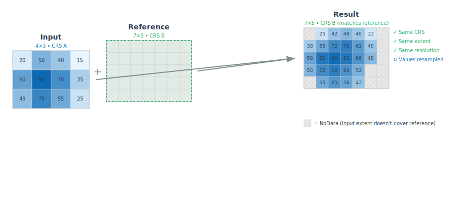

### Map algebra

[`RS_MapAlgebra`](../api/sql/Raster-map-algebra.md) 有两种形式：

- **单栅格** —— `RS_MapAlgebra(rast, pixelType, script)`。对单个栅格的多个波段按像素运行脚本。教程主线即使用此形式。
- **双栅格** —— `RS_MapAlgebra(rast0, rast1, pixelType, script, noDataValue)`。对两个栅格按像素运行脚本，常用于差分栅格与变化检测。

```sql
-- 双栅格：用一个 NDVI 减去另一个
SELECT RS_MapAlgebra(a.rast, b.rast, 'D',
                     'out[0] = rast0[0] - rast1[0];', -9999.0) AS delta
FROM ndvi_after a JOIN ndvi_before b ON a.x = b.x AND a.y = b.y
```

## 栅格与矢量互通

### 几何栅格化

[`RS_AsRaster`](../api/sql/Raster-Operators/RS_AsRaster.md) 将矢量几何渲染到栅格网格上：

```sql
SELECT RS_AsRaster(
    ST_GeomFromWKT('POLYGON((150 150, 220 260, 190 300, 300 220, 150 150))'),
    RS_MakeEmptyRaster(1, 'b', 4, 6, 1, -1, 1),
    'b', 230
)
```


### 空间过滤与连接

栅格谓词既可用于 `WHERE` 子句，也可作为连接条件：

```sql
-- 范围查询：保留与 AOI 相交的 tile
SELECT rast FROM rasterDf
WHERE RS_Intersects(rast, ST_GeomFromWKT('POLYGON((0 0, 0 10, 10 10, 10 0, 0 0))'))

-- 空间连接：把每个 tile 与覆盖到它的矢量要素配对
SELECT r.rast, g.geom
FROM rasterDf r JOIN geomDf g ON RS_Intersects(r.rast, g.geom)
```

[`RS_Intersects`](../api/sql/Raster-Predicates/RS_Intersects.md) 与其他 [栅格谓词](../api/sql/Raster-Functions.md#raster-predicates) 都基于栅格的空间外包做判断。

### 分区统计

教程主线使用 [`RS_ZonalStats(raster, zone, statType)`](../api/sql/Raster-Band-Accessors/RS_ZonalStats.md) 配合 `'mean'`。同一函数还支持 `'sum'`、`'count'`、`'min'`、`'max'`、`'stddev'`。如需一次拿到所有标准统计量，使用 [`RS_ZonalStatsAll`](../api/sql/Raster-Band-Accessors/RS_ZonalStatsAll.md)，它对每个区域返回一个 struct，包含全部统计字段。

## 可视化参考

除教程主线使用的 `SedonaUtils.display_image` 与 `RS_AsImage` 之外：

- [`RS_AsBase64(rast)`](../api/sql/Raster-Output/RS_AsBase64.md) —— 编码为 Base64 字符串，便于嵌入或使用 [在线解码器](https://base64-viewer.onrender.com/) 查看。
- [`RS_AsMatrix(rast)`](../api/sql/Raster-Output/RS_AsMatrix.md) —— 把底层像素网格渲染成文本矩阵（适合小尺寸栅格或调试场景）。

完整列表见 [栅格输出函数](../api/sql/Raster-Functions.md#raster-output)。



## 写出栅格参考 {#writing-rasters-reference}



教程使用的两步写出流程支持以下四种输出格式：

| 函数 | 格式 | 适用场景 |
| :--- | :--- | :--- |
| [`RS_AsGeoTiff`](../api/sql/Raster-Output/RS_AsGeoTiff.md) | GeoTIFF | 通用格式，可选压缩 |
| [`RS_AsCOG`](../api/sql/Raster-Output/RS_AsCOG.md) | Cloud Optimized GeoTIFF | 对象存储 + 高效 range read |
| [`RS_AsArcGrid`](../api/sql/Raster-Output/RS_AsArcGrid.md) | Arc Info ASCII Grid | 单波段、文本格式 |
| [`RS_AsPNG`](../api/sql/Raster-Output/RS_AsPNG.md) | PNG | 仅用于显示，像素类型必须为无符号整数 |

`raster` writer 支持以下选项：

| 选项 | 默认值 | 说明 |
| :--- | :--- | :--- |
| `rasterField` | schema 中最后一个 `binary` 列 | 要写出的二进制列名。当 DataFrame 中存在多个二进制列时建议显式设置。 |
| `fileExtension` | `.tiff` | 输出文件扩展名（例如 `.png`、`.asc`）。 |
| `pathField` | 无 | 提供输出文件名的列。仅使用文件 basename，已有扩展名会被 `fileExtension` 替换。未设置时每个文件以随机 UUID 命名。 |
| `useDirectCommitter` | `true` | 直接写入目标位置。设为 `false` 时先写到临时位置，速度较慢，尤其在 S3 等对象存储上。 |

设置所有选项的完整示例：

=== "Scala"
	```scala
	import org.apache.spark.sql.functions.expr

	rasterDf.withColumn("raster_binary", expr("RS_AsGeoTiff(rast)"))
	  .write.format("raster")
	  .option("rasterField", "raster_binary")
	  .option("pathField", "name")
	  .option("fileExtension", ".tiff")
	  .mode("overwrite")
	  .save("my_raster_file")
	```

=== "Python"
	```python
	from pyspark.sql.functions import expr

	(
	    rasterDf.withColumn("raster_binary", expr("RS_AsGeoTiff(rast)"))
	    .write.format("raster")
	    .option("rasterField", "raster_binary")
	    .option("pathField", "name")
	    .option("fileExtension", ".tiff")
	    .mode("overwrite")
	    .save("my_raster_file")
	)
	```

输出目录结构：

```
my_raster_file
├── part-00000-…-c000
│   ├── test1.tiff
│   └── .test1.tiff.crc
├── part-00001-…-c000
│   ├── test2.tiff
│   └── .test2.tiff.crc
└── _SUCCESS
```

使用同一 `raster` 数据源读回：

```python
rasterDf = sedona.read.format("raster").load("my_raster_file/*/*.tiff")
```

## 在 Python 中处理栅格 DataFrame

自 `v1.6.0` 起，可以把含栅格列的 DataFrame 拉到 Python driver 端本地处理。被收集回的栅格元素表现为 `SedonaRaster` 对象。

!!!tip
    在 Jupyter 中若只是想快速可视化栅格，优先使用 `SedonaUtils.display_image(df)`，无需 collect。

```python
df_raster = (
    sedona.read.format("raster").option("retile", "false").load("/path/to/raster.tif")
)
rows = df_raster.collect()
raster = rows[0].rast
raster  # <sedona.raster.sedona_raster.InDbSedonaRaster at 0x…>
```

`SedonaRaster` 通过 Python 属性暴露元数据：

```python
raster.width
raster.height
raster.affine_trans
raster.crs_wkt
```

像素数据以 NumPy 数组形式提供（CHW 排列）：

```python
raster.as_numpy()  # ndarray
raster.as_numpy_masked()  # ndarray，NODATA 被掩码为 NaN
```

需要与 `rasterio`（>= 1.2.10）互操作时：

```python
ds = raster.as_rasterio()  # rasterio.DatasetReader
band1 = ds.read(1)
```

## 在栅格上编写 Python UDF

UDF 可接收 `SedonaRaster` 输入并返回任意 Spark 数据类型。下面的 UDF 计算栅格均值：

```python
from pyspark.sql.types import DoubleType


def mean_udf(raster):
    return float(raster.as_numpy().mean())


sedona.udf.register("mean_udf", mean_udf, DoubleType())
df_raster.withColumn("mean", expr("mean_udf(rast)")).show()
```

```
+--------------------+------------------+
|                rast|              mean|
+--------------------+------------------+
|GridCoverage2D["g...|1542.8092886117788|
+--------------------+------------------+
```

让 UDF 直接返回栅格目前还不支持 —— Sedona 暂未实现 Python 栅格对象的序列化。变通方案是返回波段数据数组，再用 [`RS_MakeRaster`](../api/sql/Raster-Constructors/RS_MakeRaster.md) 重建栅格：

```python
from pyspark.sql.types import ArrayType, DoubleType
import numpy as np


def mask_udf(raster):
    band1 = raster.as_numpy()[0, :, :]
    mask = (band1 < 1400).astype(np.float64)
    return mask.flatten().tolist()


sedona.udf.register("mask_udf", mask_udf, ArrayType(DoubleType()))
(
    df_raster.withColumn("mask", expr("mask_udf(rast)"))
    .withColumn("mask_rast", expr("RS_MakeRaster(rast, 'I', mask)"))
    .show()
)
```

## 性能优化

处理大体量栅格时，可参考 [将栅格几何以 Parquet 形式存储](storing-blobs-in-parquet.md) 的分区与持久化建议。
