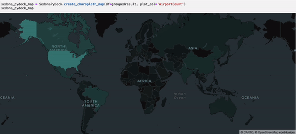
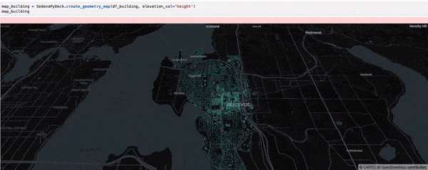
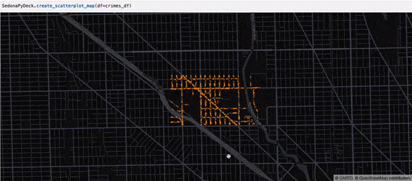
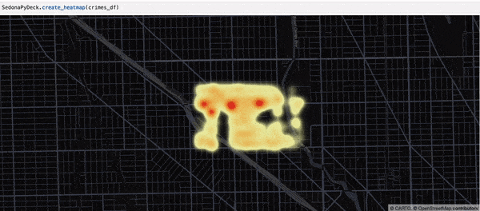
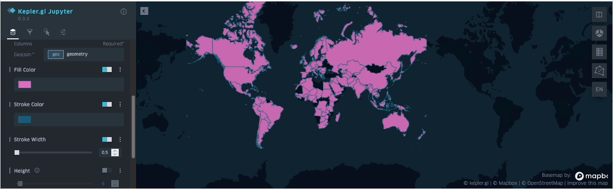

<!--
 Licensed to the Apache Software Foundation (ASF) under one
 or more contributor license agreements.  See the NOTICE file
 distributed with this work for additional information
 regarding copyright ownership.  The ASF licenses this file
 to you under the Apache License, Version 2.0 (the
 "License"); you may not use this file except in compliance
 with the License.  You may obtain a copy of the License at

   http://www.apache.org/licenses/LICENSE-2.0

 Unless required by applicable law or agreed to in writing,
 software distributed under the License is distributed on an
 "AS IS" BASIS, WITHOUT WARRANTIES OR CONDITIONS OF ANY
 KIND, either express or implied.  See the License for the
 specific language governing permissions and limitations
 under the License.
 -->

本页介绍如何使用 SedonaSQL 管理空间数据。

!!!note
    Sedona 假定地理坐标按 lon/lat 顺序排列。如果您的数据是 lat/lon 顺序，请使用 `ST_FlipCoordinates` 交换 X 与 Y。

SedonaSQL 支持 SQL/MM Part3 空间 SQL 标准，提供四类 SQL 算子，所有算子都可以直接通过以下方式调用：

=== "Scala"

	```scala
	var myDataFrame = sedona.sql("YOUR_SQL")
	myDataFrame.createOrReplaceTempView("spatialDf")
	```

=== "Java"

	```java
	Dataset<Row> myDataFrame = sedona.sql("YOUR_SQL")
	myDataFrame.createOrReplaceTempView("spatialDf")
	```

=== "Python"

	```python
	myDataFrame = sedona.sql("YOUR_SQL")
	myDataFrame.createOrReplaceTempView("spatialDf")
	```

SedonaSQL 详细 API 说明请参阅 [SedonaSQL API](../api/sql/Overview.md)。示例 county 数据（即 `county_small.tsv`）可在 [Sedona GitHub 仓库](https://github.com/apache/sedona/tree/master/spark/common/src/test/resources) 找到。

## 配置依赖

=== "Scala/Java"

	1. 阅读 [Sedona Maven Central 坐标](../setup/maven-coordinates.md) 并在 build.sbt 或 pom.xml 中添加 Sedona 依赖。
	2. 在 build.sbt 或 pom.xml 中添加 [Apache Spark core](https://mvnrepository.com/artifact/org.apache.spark/spark-core_2.11) 与 [Apache SparkSQL](https://mvnrepository.com/artifact/org.apache.spark/spark-sql) 依赖。
	3. 参考 [SQL 示例项目](demo.md)。

=== "Python"

	1. 请阅读 [快速开始](../setup/install-python.md) 安装 Sedona Python。
	2. 本教程基于 [Sedona SQL Jupyter Notebook 示例](jupyter-notebook.md)。

## 创建 Sedona 配置

在程序起始处使用以下代码创建 Sedona 配置。如果您已经有了由 AWS EMR / Databricks / Microsoft Fabric 创建的 SparkSession（通常名为 `spark`），请==跳过此步骤==。

可以在 builder 中追加额外的 Spark 运行时配置，例如 `SedonaContext.builder().config("spark.sql.autoBroadcastJoinThreshold", "10485760")`。

=== "Scala"

	```scala
	import org.apache.sedona.spark.SedonaContext

	val config = SedonaContext.builder()
	.master("local[*]") // 集群模式下请删除此行
	.appName("readTestScala") // 改成合适的名字
	.getOrCreate()
	```
	如果同时使用 SedonaViz 与 SedonaSQL，请在 `SedonaContext.builder()` 之后追加以下行启用 Sedona Kryo 序列化器：
	```scala
	.config("spark.kryo.registrator", classOf[SedonaVizKryoRegistrator].getName) // org.apache.sedona.viz.core.Serde.SedonaVizKryoRegistrator
	```

=== "Java"

	```java
	import org.apache.sedona.spark.SedonaContext;

	SparkSession config = SedonaContext.builder()
	.master("local[*]") // 集群模式下请删除此行
	.appName("readTestJava") // 改成合适的名字
	.getOrCreate()
	```
	如果同时使用 SedonaViz 与 SedonaSQL，请在 `SedonaContext.builder()` 之后追加以下行启用 Sedona Kryo 序列化器：
	```java
	.config("spark.kryo.registrator", SedonaVizKryoRegistrator.class.getName()) // org.apache.sedona.viz.core.Serde.SedonaVizKryoRegistrator
	```

=== "Python"

	```python
	from sedona.spark import *

	config = SedonaContext.builder() .\
	    config('spark.jars.packages',
	           'org.apache.sedona:sedona-spark-shaded-3.3_2.12:{{ sedona.current_version }},'
	           'org.datasyslab:geotools-wrapper:{{ sedona.current_geotools }}'). \
	    getOrCreate()
	```
    如使用其他 Spark 版本，请将 sedona-spark-shaded 包名中的 `3.3` 替换为对应的 Spark major.minor 版本，例如 `sedona-spark-shaded-3.4_2.12:{{ sedona.current_version }}`。

## 初始化 SedonaContext

在创建 Sedona 配置之后加上以下代码。如果您已经有了由 AWS EMR / Databricks / Microsoft Fabric 创建的 SparkSession（通常名为 `spark`），请改为调用 `sedona = SedonaContext.create(spark)`。

=== "Scala"

	```scala
	import org.apache.sedona.spark.SedonaContext

	val sedona = SedonaContext.create(config)
	```

=== "Java"

	```java
	import org.apache.sedona.spark.SedonaContext;

	SparkSession sedona = SedonaContext.create(config)
	```

=== "Python"

	```python
	from sedona.spark import *

	sedona = SedonaContext.create(config)
	```

也可以通过在 `spark-submit` 或 `spark-shell` 中传入 `--conf spark.sql.extensions=org.apache.sedona.sql.SedonaSqlExtensions` 完成注册。

## 从文本文件加载数据

假设有一个 WKT 文件 `usa-county.tsv`，路径为 `/Download/usa-county.tsv`，内容如下：

```
POLYGON (..., ...)	Cuming County
POLYGON (..., ...)	Wahkiakum County
POLYGON (..., ...)	De Baca County
POLYGON (..., ...)	Lancaster County
```

文件中可能还有许多其他列。

### 加载原始 DataFrame

使用以下代码加载数据并创建原始 DataFrame：

=== "Scala"
	```scala
	var rawDf = sedona.read.format("csv").option("delimiter", "\t").option("header", "false").load("/Download/usa-county.tsv")
	rawDf.createOrReplaceTempView("rawdf")
	rawDf.show()
	```

=== "Java"
	```java
	Dataset<Row> rawDf = sedona.read.format("csv").option("delimiter", "\t").option("header", "false").load("/Download/usa-county.tsv")
	rawDf.createOrReplaceTempView("rawdf")
	rawDf.show()
	```

=== "Python"
	```python
	rawDf = sedona.read.format("csv").option("delimiter", "\t").option("header", "false").load("/Download/usa-county.tsv")
	rawDf.createOrReplaceTempView("rawdf")
	rawDf.show()
	```

输出大致如下：

```
|                 _c0|_c1|_c2|     _c3|  _c4|        _c5|                 _c6|_c7|_c8|  _c9|_c10| _c11|_c12|_c13|      _c14|    _c15|       _c16|        _c17|
+--------------------+---+---+--------+-----+-----------+--------------------+---+---+-----+----+-----+----+----+----------+--------+-----------+------------+
|POLYGON ((-97.019...| 31|039|00835841|31039|     Cuming|       Cuming County| 06| H1|G4020|null| null|null|   A|1477895811|10447360|+41.9158651|-096.7885168|
|POLYGON ((-123.43...| 53|069|01513275|53069|  Wahkiakum|    Wahkiakum County| 06| H1|G4020|null| null|null|   A| 682138871|61658258|+46.2946377|-123.4244583|
|POLYGON ((-104.56...| 35|011|00933054|35011|    De Baca|      De Baca County| 06| H1|G4020|null| null|null|   A|6015539696|29159492|+34.3592729|-104.3686961|
|POLYGON ((-96.910...| 31|109|00835876|31109|  Lancaster|    Lancaster County| 06| H1|G4020| 339|30700|null|   A|2169240202|22877180|+40.7835474|-096.6886584|
```

### 创建 Geometry 类型列

SedonaSQL 中所有几何运算都作用在 Geometry 类型对象上。因此在执行任何查询之前，需要在 DataFrame 上构造一列 Geometry 类型列。

```sql
SELECT ST_GeomFromWKT(_c0) AS countyshape, _c1, _c2
```

可以选取更多属性来组成这个 `spatialdDf`。输出大致如下：

```
|                 countyshape|_c1|_c2|     _c3|  _c4|        _c5|                 _c6|_c7|_c8|  _c9|_c10| _c11|_c12|_c13|      _c14|    _c15|       _c16|        _c17|
+--------------------+---+---+--------+-----+-----------+--------------------+---+---+-----+----+-----+----+----+----------+--------+-----------+------------+
|POLYGON ((-97.019...| 31|039|00835841|31039|     Cuming|       Cuming County| 06| H1|G4020|null| null|null|   A|1477895811|10447360|+41.9158651|-096.7885168|
|POLYGON ((-123.43...| 53|069|01513275|53069|  Wahkiakum|    Wahkiakum County| 06| H1|G4020|null| null|null|   A| 682138871|61658258|+46.2946377|-123.4244583|
|POLYGON ((-104.56...| 35|011|00933054|35011|    De Baca|      De Baca County| 06| H1|G4020|null| null|null|   A|6015539696|29159492|+34.3592729|-104.3686961|
|POLYGON ((-96.910...| 31|109|00835876|31109|  Lancaster|    Lancaster County| 06| H1|G4020| 339|30700|null|   A|2169240202|22877180|+40.7835474|-096.6886584|
```

虽然外观与输入一致，但 `countyshape` 列的类型已经变为 ==Geometry==。

可以通过打印 schema 进行验证：

```scala
spatialDf.printSchema()
```

输出如下：

```
root
 |-- countyshape: geometry (nullable = false)
 |-- _c1: string (nullable = true)
 |-- _c2: string (nullable = true)
 |-- _c3: string (nullable = true)
 |-- _c4: string (nullable = true)
 |-- _c5: string (nullable = true)
 |-- _c6: string (nullable = true)
 |-- _c7: string (nullable = true)
```

!!!note
	SedonaSQL 提供了大量构造 Geometry 列的函数，详见 [SedonaSQL 构造器 API](../api/sql/Geometry-Functions.md)。

## 加载 GeoJSON 数据

自 `v1.6.1` 起，Sedona 支持通过 `geojson` 数据源读取 GeoJSON 文件。它专门用于处理几何对象采用 [GeoJSON 格式](https://datatracker.ietf.org/doc/html/rfc7946) 的 JSON 文件。

读取多行 GeoJSON 文件请将 `multiLine` 选项设为 `True`。

=== "Python"

    ```python
    df = (
        sedona.read.format("geojson")
        .option("multiLine", "true")
        .load("PATH/TO/MYFILE.json")
        .selectExpr("explode(features) as features")  # 展开 envelope
        .select("features.*")  # 解包 features 结构体
        .withColumn("prop0", f.expr("properties['prop0']"))
        .drop("properties")
        .drop("type")
    )

    df.show()
    df.printSchema()
    ```

=== "Scala"

    ```scala
    val df = sedona.read.format("geojson").option("multiLine", "true").load("PATH/TO/MYFILE.json")
    val parsedDf = df.selectExpr("explode(features) as features").select("features.*")
            .withColumn("prop0", expr("properties['prop0']")).drop("properties").drop("type")

    parsedDf.show()
    parsedDf.printSchema()
    ```

=== "Java"

    ```java
    Dataset<Row> df = sedona.read.format("geojson").option("multiLine", "true").load("PATH/TO/MYFILE.json")
     .selectExpr("explode(features) as features") // 展开 envelope，每行一个 feature
     .select("features.*") // 解包 features 结构体
     .withColumn("prop0", expr("properties['prop0']")).drop("properties").drop("type")

    df.show();
    df.printSchema();
    ```

加载 GeoJSON 文件的更多信息请参阅 [此页](files/geojson-sedona-spark.md)。

## 加载 Shapefile

自 v`1.7.0` 起，Sedona 支持把 Shapefile 加载为 DataFrame。

=== "Scala/Java"

    ```scala
    val df = sedona.read.format("shapefile").load("/path/to/shapefile")
    ```

=== "Java"

    ```java
    Dataset<Row> df = sedona.read().format("shapefile").load("/path/to/shapefile")
    ```

=== "Python"

    ```python
    df = sedona.read.format("shapefile").load("/path/to/shapefile")
    ```

输入路径既可以是包含一个或多个 Shapefile 的目录，也可以是 `.shp` 文件本身。

加载 Shapefile 的更多信息请参阅 [此页](files/shapefiles-sedona-spark.md)。

## 加载 GeoParquet

自 v`1.3.0` 起，Sedona 原生支持加载 GeoParquet 文件。Sedona 会通过 GeoParquet 文件中的 “geo” 元数据推断几何字段。

=== "Scala/Java"

	```scala
	val df = sedona.read.format("geoparquet").load(geoparquetdatalocation1)
	df.printSchema()
	```

=== "Java"

	```java
	Dataset<Row> df = sedona.read.format("geoparquet").load(geoparquetdatalocation1)
	df.printSchema()
	```

=== "Python"

	```python
	df = sedona.read.format("geoparquet").load(geoparquetdatalocation1)
	df.printSchema()
	```

输出如下：

```
root
 |-- pop_est: long (nullable = true)
 |-- continent: string (nullable = true)
 |-- name: string (nullable = true)
 |-- iso_a3: string (nullable = true)
 |-- gdp_md_est: double (nullable = true)
 |-- geometry: geometry (nullable = true)
```

Sedona 支持 GeoParquet 文件的空间谓词下推，详见 [SedonaSQL 查询优化器](../api/sql/Optimizer.md) 文档。

GeoParquet 文件读取器也可用于读取 Apache Sedona 1.3.1-incubating 及更早版本写出的旧版 Parquet 文件，详见 [读取旧版 Parquet 文件](../api/sql/Reading-legacy-parquet.md)。

加载 GeoParquet 的更多信息请参阅 [此页](files/geoparquet-sedona-spark.md)。

## 从 STAC catalog 加载数据

Sedona 的 STAC 数据源允许从 SpatioTemporal Asset Catalog（STAC）API 读取数据，支持读取 STAC items 与 collections。

可以从 S3 上的 collection 文件加载 STAC collection：

```python
df = sedona.read.format("stac").load(
    "s3a://example.com/stac_bucket/stac_collection.json"
)
```

也可以从 HTTP/HTTPS 端点加载：

```python
df = sedona.read.format("stac").load(
    "https://earth-search.aws.element84.com/v1/collections/sentinel-2-pre-c1-l2a"
)
```

STAC 数据源支持空间和时间过滤的下推，可以将这些过滤直接下推到底层数据源以减少需要读取的数据量。

加载 STAC 数据的更多信息请参阅 [此页](files/stac-sedona-spark.md)。

## 从 JDBC 数据源加载数据

可以使用 Spark SQL JDBC 数据源的 'query' 选项把几何列转换成 Sedona 能识别的格式。该方式适用于大多数支持空间的 JDBC 数据源。Postgis 由于使用 EWKB 作为其传输格式，无需添加查询进行类型转换。

=== "Scala"

	```scala
	// 适用于任意 JDBC 数据源（包括 Postgis）
	val df = sedona.read.format("jdbc")
		// 其他选项
		.option("query", "SELECT id, ST_AsBinary(geom) as geom FROM my_table")
		.load()
		.withColumn("geom", expr("ST_GeomFromWKB(geom)"))

	// Postgis 上的简化写法
	val df = sedona.read.format("jdbc")
		// 其他选项
		.option("dbtable", "my_table")
		.load()
		.withColumn("geom", expr("ST_GeomFromWKB(geom)"))
	```

=== "Java"

	```java
	// 适用于任意 JDBC 数据源（包括 Postgis）
	Dataset<Row> df = sedona.read().format("jdbc")
		// 其他选项
		.option("query", "SELECT id, ST_AsBinary(geom) as geom FROM my_table")
		.load()
		.withColumn("geom", expr("ST_GeomFromWKB(geom)"))

	// Postgis 上的简化写法
	Dataset<Row> df = sedona.read().format("jdbc")
		// 其他选项
		.option("dbtable", "my_table")
		.load()
		.withColumn("geom", expr("ST_GeomFromWKB(geom)"))
	```

=== "Python"

	```python
	# 适用于任意 JDBC 数据源（包括 Postgis）
	df = (sedona.read.format("jdbc")
		# 其他选项
		.option("query", "SELECT id, ST_AsBinary(geom) as geom FROM my_table")
		.load()
		.withColumn("geom", f.expr("ST_GeomFromWKB(geom)")))

	# Postgis 上的简化写法
	df = (sedona.read.format("jdbc")
		# 其他选项
		.option("dbtable", "my_table")
		.load()
		.withColumn("geom", f.expr("ST_GeomFromWKB(geom)")))
	```

## 加载 GeoPackage

自 v1.7.0 起，Sedona 支持把 GeoPackage 文件加载为 DataFrame。

=== "Scala/Java"

	```scala
	val df = sedona.read.format("geopackage").option("tableName", "tab").load("/path/to/geopackage")
	```

=== "Java"

	```java
	Dataset<Row> df = sedona.read().format("geopackage").option("tableName", "tab").load("/path/to/geopackage")
	```

=== "Python"

	```python
	df = sedona.read.format("geopackage").option("tableName", "tab").load("/path/to/geopackage")
	```

加载 GeoPackage 的更多信息请参阅 [此页](files/geopackage-sedona-spark.md)。

## 加载 OSM PBF

自 v1.7.1 起，Sedona 支持把 OSM PBF 文件加载为 DataFrame。

=== "Scala/Java"

	```scala
	val df = sedona.read.format("osmpbf").load("/path/to/osmpbf")
	```

=== "Java"

	```java
	Dataset<Row> df = sedona.read().format("osmpbf").load("/path/to/osmpbf")
	```

=== "Python"

	```python
	df = sedona.read.format("osmpbf").load("/path/to/osmpbf")
	```

OSM PBF 文件可以包含 nodes、ways 与 relations。Sedona 目前支持 Nodes、DenseNodes、Ways 与 Relations。加载后的 DataFrame schema 如下：

```
root
 |-- id: long (nullable = true)
 |-- kind: string (nullable = true)
 |-- location: struct (nullable = true)
 |    |-- longitude: double (nullable = true)
 |    |-- latitude: double (nullable = true)
 |-- tags: map (nullable = true)
 |    |-- key: string
 |    |-- value: string (valueContainsNull = true)
 |-- refs: array (nullable = true)
 |    |-- element: long (containsNull = true)
 |-- ref_roles: array (nullable = true)
 |    |-- element: string (containsNull = true)
 |-- ref_types: array (nullable = true)
 |    |-- element: string (containsNull = true)
```

各字段含义：

- `id`：对象的唯一标识。
- `kind`：对象类型，可能为 `node`、`way` 或 `relation`。
- `location`：对象的位置，包含 `longitude` 与 `latitude`。
- `tags`：键值对的 map，表示对象的 tags。
- `refs`：对象引用的数组。
- `ref_roles`：引用对应的角色数组。
- `ref_types`：引用对应的类型数组。

nodes 的 DataFrame 大致如下：

```
+---------+----+--------------------+--------------------+----+---------+---------+
|       id|kind|            location|                tags|refs|ref_roles|ref_types|
+---------+----+--------------------+--------------------+----+---------+---------+
|248675410|node|{21.0884952545166...|{tactile_paving -...|NULL|     NULL|     NULL|
|260821820|node|{21.0191555023193...|{created_by -> JOSM}|NULL|     NULL|     NULL|
|349189665|node|{22.1437530517578...|{source -> http:/...|NULL|     NULL|     NULL|
|353366899|node|{22.9787712097167...|{source -> http:/...|NULL|     NULL|     NULL|
|359460224|node|{22.4816703796386...|{source -> http:/...|NULL|     NULL|     NULL|
+---------+----+--------------------+--------------------+----+---------+---------+
only showing top 5 rows
```

ways 的大致样子：

```
+-------+----+--------+--------------------+--------------------+---------+---------+
|     id|kind|location|                tags|                refs|ref_roles|ref_types|
+-------+----+--------+--------------------+--------------------+---------+---------+
|4307329| way|    NULL|{junction -> roun...|[2448759046, 7093...|     NULL|     NULL|
|4307330| way|    NULL|{surface -> aspha...|[26063923, 260639...|     NULL|     NULL|
|4308966| way|    NULL|{sidewalk -> sepa...|[3387797238, 9252...|     NULL|     NULL|
|4308968| way|    NULL|{surface -> pavin...|[26083890, 744724...|     NULL|     NULL|
|4308969| way|    NULL|{cycleway:both ->...|[9526831176, 1218...|     NULL|     NULL|
+-------+----+--------+--------------------+--------------------+---------+---------+
```

relations 的大致样子：

```
+-----+--------+--------+--------------------+--------------------+--------------------+--------------------+
|   id|    kind|location|                tags|                refs|           ref_roles|           ref_types|
+-----+--------+--------+--------------------+--------------------+--------------------+--------------------+
|28124|relation|    NULL|{official_name ->...|[26382394, 26259985]|      [inner, outer]|          [WAY, WAY]|
|28488|relation|    NULL|  {type -> junction}|[26409253, 303249...|[roundabout, roun...|[WAY, WAY, WAY, WAY]|
|32939|relation|    NULL|{ref -> E 67, rou...|[140673970, 14067...|        [, , , , , ]|[WAY, WAY, RELATI...|
|34387|relation|    NULL|{note -> rząd III...|[209161000, 52154...|[main_stream, mai...|[WAY, WAY, WAY, W...|
|34392|relation|    NULL|{distance -> 1047...|[150033976, 25076...|[main_stream, mai...|[WAY, WAY, WAY, W...|
+-----+--------+--------+--------------------+--------------------+--------------------+--------------------+
```

## 转换坐标参考系

Sedona 不会自动管理一列 Geometry 中所有几何对象的坐标单位（基于度还是基于米）。SedonaSQL 中所有相关距离的单位与 Geometry 列中几何对象的单位保持一致。

自 `v1.5.0` 起，该函数默认使用 lon/lat 顺序（之前为 lat/lon 顺序）。可以使用 ==ST_FlipCoordinates== 交换 X 与 Y。

更多细节请参阅 Sedona API 参考中的 `ST_Transform` 章节。

转换前述 Geometry 列的坐标参考系：

```sql
SELECT ST_Transform(countyshape, "epsg:4326", "epsg:3857") AS newcountyshape, _c1, _c2, _c3, _c4, _c5, _c6, _c7
FROM spatialdf
```

`ST_Transform` 第一个 EPSG 代码 EPSG:4326 是源 CRS——也就是最常见的基于度的 CRS（WGS84）。

第二个 EPSG 代码 EPSG:3857 是目标 CRS——最常见的基于米的 CRS。

`ST_Transform` 会把这些几何对象的 CRS 从 EPSG:4326 转换到 EPSG:3857。详细 CRS 信息可在 [EPSG.io](https://epsg.io/) 找到。

多边形坐标已发生变化。输出大致如下：

```
+--------------------+---+---+--------+-----+-----------+--------------------+---+
|      newcountyshape|_c1|_c2|     _c3|  _c4|        _c5|                 _c6|_c7|
+--------------------+---+---+--------+-----+-----------+--------------------+---+
|POLYGON ((-108001...| 31|039|00835841|31039|     Cuming|       Cuming County| 06|
|POLYGON ((-137408...| 53|069|01513275|53069|  Wahkiakum|    Wahkiakum County| 06|
|POLYGON ((-116403...| 35|011|00933054|35011|    De Baca|      De Baca County| 06|
|POLYGON ((-107880...| 31|109|00835876|31109|  Lancaster|    Lancaster County| 06|

```

## 使用 DBSCAN 进行聚类

Sedona 提供 [DBSCAN](https://en.wikipedia.org/wiki/Dbscan) 算法的实现，用于对空间数据进行聚类。

该算法以 Scala 与 Python 函数的形式提供，作用在空间 DataFrame 上。返回的 DataFrame 中会增加两列：所属簇的唯一标识，以及一个表示该记录是否为核心点的布尔列。

第一个参数是 DataFrame，后两个是 DBSCAN 的 epsilon 与 min_points 参数。

=== "Scala"

	```scala
	import org.apache.sedona.stats.clustering.DBSCAN.dbscan

	dbscan(df, 0.1, 5).show()
	```

=== "Java"

	```java
	import org.apache.sedona.stats.clustering.DBSCAN;

	DBSCAN.dbscan(df, 0.1, 5).show();
	```

=== "Python"

	```python
	from sedona.spark.stats import dbscan

	dbscan(df, 0.1, 5).show()
	```

输出大致如下：

```
+----------------+---+------+-------+
|        geometry| id|isCore|cluster|
+----------------+---+------+-------+
|   POINT (2.5 4)|  3| false|      1|
|     POINT (3 4)|  2| false|      1|
|     POINT (3 5)|  5| false|      1|
|     POINT (1 3)|  9|  true|      0|
| POINT (2.5 4.5)|  7|  true|      1|
|     POINT (1 2)|  1|  true|      0|
| POINT (1.5 2.5)|  4|  true|      0|
| POINT (1.2 2.5)|  8|  true|      0|
|   POINT (1 2.5)| 11|  true|      0|
|     POINT (1 5)| 10| false|     -1|
|     POINT (5 6)| 12| false|     -1|
|POINT (12.8 4.5)|  6| false|     -1|
|     POINT (4 3)| 13| false|     -1|
+----------------+---+------+-------+
```

DBSCAN 算法的更多内容请参阅 [此页](concepts/clustering-algorithms.md)。

## 计算 Local Outlier Factor（LOF）

Sedona 提供 [Local Outlier Factor](https://en.wikipedia.org/wiki/Local_outlier_factor) 算法的实现，用于识别空间数据中的异常点。

该算法以 Scala 与 Python 函数的形式提供，作用在空间 DataFrame 上。返回的 DataFrame 中会增加一列保存 local outlier factor。

第一个参数是 DataFrame，第二个参数是计算评分时考虑的最近邻数量。

=== "Scala"

	```scala
	import org.apache.sedona.stats.outlierDetection.LocalOutlierFactor.localOutlierFactor

    localOutlierFactor(df, 20).show()
	```

=== "Java"

	```java
	import org.apache.sedona.stats.outlierDetection.LocalOutlierFactor;

	LocalOutlierFactor.localOutlierFactor(df, 20).show();
	```

=== "Python"

	```python
	from sedona.spark.stats import local_outlier_factor

	local_outlier_factor(df, 20).show()
	```

输出大致如下：

```
+--------------------+------------------+
|            geometry|               lof|
+--------------------+------------------+
|POINT (-2.0231305...| 0.952098153363662|
|POINT (-2.0346944...|0.9975325496668104|
|POINT (-2.2040074...|1.0825843906411081|
|POINT (1.61573501...|1.7367129352162634|
|POINT (-2.1176324...|1.5714144683150393|
|POINT (-2.2349759...|0.9167275845938276|
|POINT (1.65470192...| 1.046231536764447|
|POINT (0.62624112...|1.1988700676990034|
|POINT (2.01746261...|1.1060219481067417|
|POINT (-2.0483857...|1.0775553430145446|
|POINT (2.43969463...|1.1129132178576646|
|POINT (-2.2425480...| 1.104108012697006|
|POINT (-2.7859235...|  2.86371824574529|
|POINT (-1.9738858...|1.0398822680356794|
|POINT (2.00153403...| 0.927409656346015|
|POINT (2.06422812...|0.9222203762264445|
|POINT (-1.7533819...|1.0273650471626696|
|POINT (-2.2030766...| 0.964744555830738|
|POINT (-1.8509857...|1.0375927869698574|
|POINT (2.10849080...|1.0753419197322656|
+--------------------+------------------+
```

## 执行 Getis-Ord Gi(*) 热点分析

Sedona 提供 [Gi 与 Gi*](https://en.wikipedia.org/wiki/Getis%E2%80%93Ord_statistics) 算法的实现，用于识别空间数据中的局部热点。

该算法以 Scala 与 Python 函数的形式提供，作用在空间 DataFrame 上。返回的 DataFrame 中会增加 G 统计量、E[G]、V[G]、Z 分数与 p 值等列。

使用 Gi 时，先为每条记录生成邻居列表，再调用 g_local 函数。
=== "Scala"

	```scala
	import org.apache.sedona.stats.Weighting.addBinaryDistanceBandColumn
	import org.apache.sedona.stats.hotspotDetection.GetisOrd.gLocal

	val distanceRadius = 1.0
	val weightedDf = addBinaryDistanceBandColumn(df, distanceRadius)
    gLocal(weightedDf, "val").show()
	```

=== "Java"

	```java
	import org.apache.sedona.stats.Weighting;
	import org.apache.sedona.stats.hotspotDetection.GetisOrd;
	import org.apache.spark.sql.DataFrame;

	double distanceRadius = 1.0;
	DataFrame weightedDf = Weighting.addBinaryDistanceBandColumn(df, distanceRadius);
	GetisOrd.gLocal(weightedDf, "val").show();
	```

=== "Python"

	```python
	from sedona.spark.stats import add_binary_distance_band_column
	from sedona.spark.stats import g_local

	distance_radius = 1.0
	weighted_df = addBinaryDistanceBandColumn(df, distance_radius)
    g_local(weightedDf, "val").show()
	```

输出大致如下：

<pre>
<code>
+-----------+---+--------------------+-------------------+-------------------+--------------------+--------------------+--------------------+
|   geometry|val|             weights|                  G|                 EG|                  VG|                   Z|                   P|
+-----------+---+--------------------+-------------------+-------------------+--------------------+--------------------+--------------------+
|POINT (2 2)|0.9|[&#123;&#123;POINT (2 3), 1...| 0.4488188976377953|0.45454545454545453| 0.00356321373799772|-0.09593402008347063|  0.4617864875295957|
|POINT (2 3)|1.2|[&#123;&#123;POINT (2 2), 0...|0.35433070866141736|0.36363636363636365|0.003325666155464539|-0.16136436037034918|  0.4359032175415549|
|POINT (3 3)|1.2|[&#123;&#123;POINT (2 3), 1...|0.28346456692913385| 0.2727272727272727|0.002850570990398176| 0.20110780337013057| 0.42030714022155924|
|POINT (3 2)|1.2|[&#123;&#123;POINT (2 2), 0...| 0.4488188976377953|0.45454545454545453| 0.00356321373799772|-0.09593402008347063|  0.4617864875295957|
|POINT (3 1)|1.2|[&#123;&#123;POINT (3 2), 3...| 0.3622047244094489| 0.2727272727272727|0.002850570990398176|  1.6758983614177538| 0.04687905137429871|
|POINT (2 1)|2.2|[&#123;&#123;POINT (2 2), 0...| 0.4330708661417323|0.36363636363636365|0.003325666155464539|  1.2040263812249166| 0.11428969105925013|
|POINT (1 1)|1.2|[&#123;&#123;POINT (2 1), 5...| 0.2834645669291339| 0.2727272727272727|0.002850570990398176|  0.2011078033701316|  0.4203071402215588|
|POINT (1 2)|0.2|[&#123;&#123;POINT (2 2), 0...|0.35433070866141736|0.45454545454545453| 0.00356321373799772|   -1.67884535146075|0.046591093685710794|
|POINT (1 3)|1.2|[&#123;&#123;POINT (2 3), 1...| 0.2047244094488189| 0.2727272727272727|0.002850570990398176| -1.2736827546774914| 0.10138793530151635|
|POINT (0 2)|1.0|[&#123;&#123;POINT (1 2), 7...|0.09448818897637795|0.18181818181818182|0.002137928242798632| -1.8887168824332323|0.029464887612748458|
|POINT (4 2)|1.2|[&#123;&#123;POINT (3 2), 3...| 0.1889763779527559|0.18181818181818182|0.002137928242798632| 0.15481285921583854| 0.43848442662481324|
+-----------+---+--------------------+-------------------+-------------------+--------------------+--------------------+--------------------+
</code>
</pre>

## 执行空间查询

构造完 Geometry 类型列后，即可执行各类空间查询。

### 范围查询

使用 ==ST_Contains==、==ST_Intersects==、==ST_Within== 在单列上执行范围查询。

下例查找位于给定多边形内的所有 county：

```sql
SELECT *
FROM spatialdf
WHERE ST_Contains (ST_PolygonFromEnvelope(1.0,100.0,1000.0,1100.0), newcountyshape)
```

!!!note
	了解如何创建 Geometry 类型的查询窗口请参阅 [SedonaSQL 构造器 API](../api/sql/Geometry-Functions.md)。

### KNN 查询

使用 ==ST_Distance== 计算距离并排序。

下面的代码返回距离给定多边形最近的 5 个对象：

```sql
SELECT countyname, ST_Distance(ST_PolygonFromEnvelope(1.0,100.0,1000.0,1100.0), newcountyshape) AS distance
FROM spatialdf
ORDER BY distance DESC
LIMIT 5
```

### 连接查询

连接查询的细节请参阅 [Join query](../api/sql/Optimizer.md)。

### KNN 连接查询

KNN 连接查询的细节请参阅 [KNN join query](../api/sql/NearestNeighbourSearching.md)。

### 其他查询

还有许多函数可以与上述查询组合使用，详见 [SedonaSQL 函数](../api/sql/Overview.md) 与 [SedonaSQL 聚合函数](../api/sql/Geometry-Functions.md#aggregate-functions)。

## 可视化查询结果

Sedona 提供 `SedonaPyDeck` 与 `SedonaKepler` 两种封装，都提供了在 Jupyter 环境中基于 SedonaDataFrame 创建交互式地图可视化的 API。

!!!Note
	`SedonaPyDeck` 与 `SedonaKepler` 默认要求几何对象按 lon-lat 顺序排列。如果您的 DataFrame 是 lat-lon 顺序，请使用 [ST_FlipCoordinates](../api/sql/Geometry-Editors/ST_FlipCoordinates.md)。

!!!Note
	`SedonaPyDeck` 与 `SedonaKepler` 设计上仅处理只含 1 个几何列的 SedonaDataFrame，传入包含多个几何列的 DataFrame 会出错。

### SedonaPyDeck

可在 Jupyter Lab/Notebook 中通过 SedonaPyDeck 可视化空间查询结果。

SedonaPyDeck 基于 [pydeck](https://deckgl.readthedocs.io)（构建于 [deck.gl](https://deck.gl/) 之上）提供创建交互式地图的 API。

!!!Note
	使用 SedonaPyDeck 需要安装 sedona 的 `pydeck-map` 附加项：
	```
	pip install apache-sedona[pydeck-map]
	```

下面的教程展示了 SedonaPyDeck 可创建的多种地图，所用数据集均为公开数据。

每个 SedonaPyDeck API 都通过可选参数提供定制能力，所有可用参数详见 [SedonaPyDeck API 文档](../api/sql/Visualization-SedonaPyDeck.md)。

#### 使用 SedonaPyDeck 创建 Choropleth 地图

SedonaPyDeck 的 `create_choropleth_map` API 可基于包含多边形与观测值的 SedonaDataFrame 创建 choropleth 地图：

示例：

```python
SedonaPyDeck.create_choropleth_map(df=groupedresult, plot_col="AirportCount")
```

!!!Note
	`plot_col` 是必填参数，用于告诉 SedonaPyDeck 渲染 choropleth 时使用哪一列。



所用数据集见 [此处](https://github.com/apache/sedona/tree/b66e768155866a38ba2e3404f1151cac14fad5ea/docs/usecases/data/ne_50m_airports)，对应示例 notebook 见 [此处](https://github.com/apache/sedona/blob/master/docs/usecases/legacy/ApacheSedonaSQL_SpatialJoin_AirportsPerCountry.ipynb)。

#### 使用 SedonaPyDeck 创建 Geometry 地图

SedonaPyDeck 的 `create_geometry_map` API 可可视化任意类型几何对象的 SedonaDataFrame：

示例：

```python
SedonaPyDeck.create_geometry_map(df_building, elevation_col="height")
```



!!!Tip
	`elevation_col` 是可选参数，用于渲染 3D 地图。请把对应几何对象 “高度” 信息所在的列名传入此参数。

#### 使用 SedonaPyDeck 创建 Scatterplot 地图

SedonaPyDeck 的 `create_scatterplot_map` API 可基于包含点的 SedonaDataFrame 创建散点地图：

示例：

```python
SedonaPyDeck.create_scatterplot_map(df=crimes_df)
```



所用的是 Chicago crimes 数据集，见 [此处](https://github.com/apache/sedona/blob/sedona-1.5.0/spark/common/src/test/resources/Chicago_Crimes.csv)。

#### 使用 SedonaPyDeck 创建热力图

SedonaPyDeck 的 `create_heatmap` API 可基于包含点的 SedonaDataFrame 创建热力图：

示例：

```python
SedonaPyDeck.create_heatmap(df=crimes_df)
```



所用同样是 Chicago crimes 数据集，见 [此处](https://github.com/apache/sedona/blob/sedona-1.5.0/spark/common/src/test/resources/Chicago_Crimes.csv)。

### SedonaKepler

可在 Jupyter Lab/Notebook 中通过 SedonaKepler 可视化空间查询结果。

SedonaKepler 提供基于 [KeplerGl](https://kepler.gl/) 的交互式、可定制地图可视化 API。

!!!Note
	使用 SedonaKepler 需要安装 sedona 的 `kepler-map` 附加项：
	```
	pip install apache-sedona[kepler-map]
	```

下面演示如何使用 SedonaKepler 立即可视化地理空间数据。

示例（取自 binder 提供的示例 notebook）：

```python
SedonaKepler.create_map(df=groupedresult, name="AirportCount")
```



所用数据集见 [此处](https://github.com/apache/sedona/tree/b66e768155866a38ba2e3404f1151cac14fad5ea/docs/usecases/data/ne_50m_airports)，示例 notebook 见 [此处](https://github.com/apache/sedona/blob/master/docs/usecases/legacy/ApacheSedonaSQL_SpatialJoin_AirportsPerCountry.ipynb)。

SedonaKepler 提供的所有 API 详见 [SedonaKepler API 文档](../api/sql/Visualization-SedonaKepler.md)。

## 创建用户自定义函数（UDF）

用户自定义函数（UDF）是用户编写的函数，可以对单行数据执行操作。为了覆盖几乎所有的使用场景，下面给出 4 种不同形式的 UDF 示例，演示如何在 UDF 中使用几何对象。Sedona 的序列化器会把 SQL 几何类型反序列化为 [JTS Geometry](https://locationtech.github.io/jts/javadoc-1.18.0/org/locationtech/jts/geom/Geometry.html)（Scala/Java）或 [Shapely Geometry](https://shapely.readthedocs.io/en/stable/geometry.html)（Python），可以充分利用这两个生态实现自定义逻辑。

### Geometry 转 primitive

下例 UDF 接收 Geometry 类型输入，返回基本类型输出：

=== "Scala"

	```scala
	import org.locationtech.jts.geom.Geometry
	import org.apache.spark.sql.types._

	def lengthPoly(geom: Geometry): Double = {
        geom.getLength
	}

	sedona.udf.register("udf_lengthPoly", lengthPoly _)

	df.selectExpr("udf_lengthPoly(geom)").show()
	```

=== "Java"

	```java
	import org.apache.spark.sql.api.java.UDF1;
	import org.apache.spark.sql.types.DataTypes;

	// 使用 lambda 注册 UDF
	sparkSession.udf().register(
			"udf_lengthPoly",
			(UDF1<Geometry, Double>) Geometry::getLength,
			DataTypes.DoubleType);

	df.selectExpr("udf_lengthPoly(geom)").show()
	```

=== "Python"

	```python
	from sedona.spark.sql.types import GeometryType
	from pyspark.sql.types import DoubleType

	def lengthPoly(geom: GeometryType()):
		return geom.length

	sedona.udf.register("udf_lengthPoly", lengthPoly, DoubleType())

	df.selectExpr("udf_lengthPoly(geom)").show()
	```

输出：

```
+--------------------+
|udf_lengthPoly(geom)|
+--------------------+
|   3.414213562373095|
+--------------------+
```

### Geometry 转 Geometry

下例 UDF 接收 Geometry 类型输入，返回 Geometry 类型输出：

=== "Scala"

	```scala
	import org.locationtech.jts.geom.Geometry
	import org.apache.spark.sql.types._

	def bufferFixed(geom: Geometry): Geometry = {
        geom.buffer(5.5)
	}

	sedona.udf.register("udf_bufferFixed", bufferFixed _)

	df.selectExpr("udf_bufferFixed(geom)").show()
	```

=== "Java"

	```java
	import org.apache.spark.sql.api.java.UDF1;
	import org.apache.spark.sql.types.DataTypes;

	// 使用 lambda 注册 UDF
	sparkSession.udf().register(
			"udf_bufferFixed",
			(UDF1<Geometry, Geometry>) geom ->
                geom.buffer(5.5),
			new GeometryUDT());

	df.selectExpr("udf_bufferFixed(geom)").show()
	```

=== "Python"

	```python
	from sedona.spark import GeometryType
	from pyspark.sql.types import DoubleType

	def bufferFixed(geom: GeometryType()):
    	return geom.buffer(5.5)

	sedona.udf.register("udf_bufferFixed", bufferFixed, GeometryType())

	df.selectExpr("udf_bufferFixed(geom)").show()
	```

输出：

```
+--------------------------------------------------+
|                             udf_bufferFixed(geom)|
+--------------------------------------------------+
|POLYGON ((1 -4.5, -0.0729967710887076 -4.394319...|
+--------------------------------------------------+
```

### Geometry + primitive 转 Geometry

下例 UDF 接收 Geometry 与基本类型两个输入，返回 Geometry 输出：

=== "Scala"

	```scala
	import org.locationtech.jts.geom.Geometry
	import org.apache.spark.sql.types._

	def bufferIt(geom: Geometry, distance: Double): Geometry = {
        geom.buffer(distance)
	}

	sedona.udf.register("udf_buffer", bufferIt _)

	df.selectExpr("udf_buffer(geom, distance)").show()
	```

=== "Java"

	```java
	import org.apache.spark.sql.api.java.UDF2;
	import org.apache.spark.sql.types.DataTypes;

	// 使用 lambda 注册 UDF
	sparkSession.udf().register(
			"udf_buffer",
			(UDF2<Geometry, Double, Geometry>) Geometry::buffer,
			new GeometryUDT());

	df.selectExpr("udf_buffer(geom, distance)").show()
	```

=== "Python"

	```python
	from sedona.spark import GeometryType
	from pyspark.sql.types import DoubleType

	def bufferIt(geom: GeometryType(), distance: DoubleType()):
    	return geom.buffer(distance)

	sedona.udf.register("udf_buffer", bufferIt, GeometryType())

	df.selectExpr("udf_buffer(geom, distance)").show()
	```

输出：

```
+--------------------------------------------------+
|                        udf_buffer(geom, distance)|
+--------------------------------------------------+
|POLYGON ((1 -9, -0.9509032201612866 -8.80785280...|
+--------------------------------------------------+
```

### Geometry + primitive 转 Geometry + primitive

下例 UDF 接收 Geometry 与基本类型两个输入，同时返回 Geometry 与基本类型两个输出：

=== "Scala"

	```scala
	import org.locationtech.jts.geom.Geometry
	import org.apache.spark.sql.types._
	import org.apache.spark.sql.api.java.UDF2

	val schemaUDF = StructType(Array(
		StructField("buffed", GeometryUDT),
		StructField("length", DoubleType)
	))

	val udf_bufferLength = udf(
		new UDF2[Geometry, Double, (Geometry, Double)] {
			def call(geom: Geometry, distance: Double): (Geometry, Double) = {
				val buffed = geom.buffer(distance)
				val length = geom.getLength
				(buffed, length)
			}
		}, schemaUDF)

	sedona.udf.register("udf_bufferLength", udf_bufferLength)

	data.withColumn("bufferLength", expr("udf_bufferLengths(geom, distance)"))
        .select("geom", "distance", "bufferLength.*")
		.show()
	```

=== "Java"

	```java
	import org.apache.spark.sql.api.java.UDF2;
	import org.apache.spark.sql.types.DataTypes;
	import org.apache.spark.sql.types.StructType;
	import scala.Tuple2;

	StructType schemaUDF = new StructType()
                .add("buffedGeom", new GeometryUDT())
                .add("length", DataTypes.DoubleType);

	// 使用 lambda 注册 UDF
	sparkSession.udf().register("udf_bufferLength",
                (UDF2<Geometry, Double, Tuple2<Geometry, Double>>) (geom, distance) -> {
                    Geometry buffed = geom.buffer(distance);
                    Double length = buffed.getLength();
                    return new Tuple2<>(buffed, length);
                },
                schemaUDF);

	df.withColumn("bufferLength", functions.expr("udf_bufferLength(geom, distance)"))
                .select("geom", "distance", "bufferLength.*")
				.show();
	```

=== "Python"

	```python
	from sedona.spark import GeometryType
	from pyspark.sql.types import *

	schemaUDF = StructType([
        StructField("buffed", GeometryType()),
        StructField("length", DoubleType())
    ])

	def bufferAndLength(geom: GeometryType(), distance: DoubleType()):
		buffed = geom.buffer(distance)
		length = buffed.length
		return [buffed, length]

	sedona.udf.register("udf_bufferLength", bufferAndLength, schemaUDF)

	df.withColumn("bufferLength", expr("udf_bufferLength(geom, buffer)")) \
				.select("geom", "buffer", "bufferLength.*") \
				.show()
	```

输出：

```
+------------------------------+--------+--------------------------------------------------+-----------------+
|                          geom|distance|                                        buffedGeom|           length|
+------------------------------+--------+--------------------------------------------------+-----------------+
|POLYGON ((1 1, 1 2, 2 1, 1 1))|    10.0|POLYGON ((1 -9, -0.9509032201612866 -8.80785280...|66.14518337329191|
+------------------------------+--------+--------------------------------------------------+-----------------+
```

## 空间向量化 UDF（仅 Python）

默认情况下，您在 Python 中创建的 UDF 不是向量化的，会逐行调用，速度较慢。可以使用 `vectorized` UDF，通过 Apache Arrow 以批模式执行，从而加速。

要创建向量化 UDF，请使用 `sedona_vectorized_udf` 装饰器。当前仅支持标量 UDF，向量化 UDF 通常比普通 UDF 快得多，可能达到 2 倍。

!!!note
	当输入类型为几何对象时，请在使用 GEO_SERIES 向量化 UDF 时显式包含 BaseGeometry 类型（例如 shapely 的 Point 或 GeoPandas 的 GeoSeries），Sedona 会借此推断类型并判断数据是否需要转换。

装饰器签名如下：

```python
def sedona_vectorized_udf(
    udf_type: SedonaUDFType = SedonaUDFType.SHAPELY_SCALAR, return_type: DataType
): ...
```

其中 `udf_type` 是 UDF 函数的类型，目前支持：

- SHAPELY_SCALAR
- GEO_SERIES

主要差异在于函数所接收的输入数据形式不同。下面通过两个示例对几何对象执行 buffer 操作来说明。

### Shapely 标量 UDF

```python
import shapely.geometry.base as b
from sedona.spark import sedona_vectorized_udf


@sedona_vectorized_udf(return_type=GeometryType())
def vectorized_buffer(geom: b.BaseGeometry) -> b.BaseGeometry:
    return geom.buffer(0.1)
```

### GeoSeries UDF

```python
import geopandas as gpd
from sedona.spark import sedona_vectorized_udf, SedonaUDFType
from sedona.spark import GeometryType


@sedona_vectorized_udf(udf_type=SedonaUDFType.GEO_SERIES, return_type=GeometryType())
def vectorized_geo_series_buffer(series: gpd.GeoSeries) -> gpd.GeoSeries:
    buffered = series.buffer(0.1)

    return buffered
```

调用 UDF 的方式如下：

```python
# Shapely 标量 UDF
df.withColumn("buffered", vectorized_buffer(df.geom)).show()

# GeoSeries UDF
df.withColumn("buffered", vectorized_geo_series_buffer(df.geom)).show()
```

## 保存到永久存储

要把空间 DataFrame 保存到 Hive 表、HDFS 等永久存储，最简单的做法是把 Geometry 列里的每个几何对象转换回普通字符串，再把得到的 DataFrame 保存到任意位置。

把 DataFrame 中的 Geometry 列还原为 WKT 字符串列：

```sql
SELECT ST_AsText(countyshape)
FROM polygondf
```

## 保存为 GeoJSON

自 `v1.6.1` 起，Sedona 中的 GeoJSON 数据源可把空间 DataFrame 保存为单行 JSON 文件，几何对象按 GeoJSON 格式写出：

```sparksql
df.write.format("geojson").save("YOUR/PATH.json")
```

写出 GeoJSON 的更多信息请参阅 [此页](files/geojson-sedona-spark.md)。

## 保存为 GeoParquet

自 v`1.3.0` 起，Sedona 原生支持写出 GeoParquet 文件：

```scala
df.write.format("geoparquet").save(geoparquetoutputlocation + "/GeoParquet_File_Name.parquet")
```

写出 GeoParquet 的更多信息请参阅 [此页](files/geoparquet-sedona-spark.md)。

## 保存到 Postgis

遗憾的是，Spark SQL JDBC 数据源的 'createTableColumnTypes' 选项不支持在 PostGIS 中创建几何类型，仅识别 Spark 内置类型。这意味着您需要在 Spark 之外单独管理 PostGIS 的 schema。一种做法是先在 PostGIS 中创建好包含几何列的表，再用 Spark 写入数据；也可以先用 Spark 写入数据，然后再手动把列类型改为 geometry。

PostGIS 使用 EWKB 序列化几何对象。如果您在 Sedona 中把几何对象转换为 EWKB 格式，PostGIS 端就无需再做额外转换。

```
my_postgis_db# create table my_table (id int8, geom geometry);

df.withColumn("geom", expr("ST_AsEWKB(geom)")
	.write.format("jdbc")
	.option("truncate","true") // 不让 Spark 重建表
	// 其他选项
	.save()

// 如果写入前没有创建表，可以在写入后修改列类型
my_postgis_db# alter table my_table alter column geom type geometry;

```

## 在 DataFrame 与 SpatialRDD 之间互转

### DataFrame 转 SpatialRDD

使用 SedonaSQL 的 DataFrame-RDD Adapter 将 DataFrame 转换为 SpatialRDD：

=== "Scala"

	```scala
	var spatialRDD = StructuredAdapter.toSpatialRdd(spatialDf, "usacounty")
	```

=== "Java"

	```java
	SpatialRDD spatialRDD = StructuredAdapter.toSpatialRdd(spatialDf, "usacounty")
	```

=== "Python"

	```python
	from sedona.spark import StructuredAdapter

	spatialRDD = StructuredAdapter.toSpatialRdd(spatialDf, "usacounty")
	```

`"usacounty"` 是几何列的列名，可选参数。如果不提供，将使用第一个几何列。

### SpatialRDD 转 DataFrame

使用 SedonaSQL 的 DataFrame-RDD Adapter 将 SpatialRDD 转换为 DataFrame。详见 [Adapter Scaladoc](../api/javadoc/sql/org/apache/sedona/sql/utils/index.html)。

=== "Scala"

	```scala
	var spatialDf = StructuredAdapter.toDf(spatialRDD, sedona)
	```

=== "Java"

	```java
	Dataset<Row> spatialDf = StructuredAdapter.toDf(spatialRDD, sedona)
	```

=== "Python"

	```python
	from sedona.spark import StructuredAdapter

	spatialDf = StructuredAdapter.toDf(spatialRDD, sedona)
	```

### 保留空间分区的 SpatialRDD 转 DataFrame

`StructuredAdapter.toDf()` 默认不保留空间分区，因为对于大多数空间数据保留空间分区会引入重复要素。这些重复是为了在执行空间连接时保证正确性而有意引入的；但当使用 Sedona 准备数据用于分发时，通常不希望出现这些重复。

可以使用 `StructuredAdapter` 与 `spatialRDD.spatialPartitioningWithoutDuplicates` 函数得到不含重复的、按空间分区的 Sedona DataFrame。这在生成均衡的 GeoParquet 文件时特别有用，可以在文件内保留空间邻近性，从而最大化 GeoParquet 的过滤下推性能。

=== "Scala"

	```scala
	spatialRDD.spatialPartitioningWithoutDuplicates(GridType.KDBTREE)
	// 期望分区数为 10（实际数量可能略有不同）
	// spatialRDD.spatialPartitioningWithoutDuplicates(GridType.KDBTREE, 10)
	var spatialDf = StructuredAdapter.toSpatialPartitionedDf(spatialRDD, sedona)
	```

=== "Java"

	```java
	spatialRDD.spatialPartitioningWithoutDuplicates(GridType.KDBTREE)
	// 期望分区数为 10（实际数量可能略有不同）
	// spatialRDD.spatialPartitioningWithoutDuplicates(GridType.KDBTREE, 10)
	Dataset<Row> spatialDf = StructuredAdapter.toSpatialPartitionedDf(spatialRDD, sedona)
	```

=== "Python"

	```python
	from sedona.spark import StructuredAdapter

	spatialRDD.spatialPartitioningWithoutDuplicates(GridType.KDBTREE)
	# 期望分区数为 10（实际数量可能略有不同）
	# spatialRDD.spatialPartitioningWithoutDuplicates(GridType.KDBTREE, 10)
	spatialDf = StructuredAdapter.toSpatialPartitionedDf(spatialRDD, sedona)
	```

### SpatialPairRDD 转 DataFrame

PairRDD 是空间连接查询或距离连接查询的结果。SedonaSQL 的 DataFrame-RDD Adapter 可以把它转换为 DataFrame，但需要提供左、右 RDD 的 schema。

=== "Scala"

	```scala
	var joinResultDf = StructuredAdapter.toDf(joinResultPairRDD, leftDf.schema, rightDf.schema, sedona)
	```

=== "Java"

	```java
	Dataset joinResultDf = StructuredAdapter.toDf(joinResultPairRDD, leftDf.schema, rightDf.schema, sedona);
	```
=== "Python"

	```python
	from sedona.spark import StructuredAdapter

	joinResultDf = StructuredAdapter.pairRddToDf(result_pair_rdd, leftDf.schema, rightDf.schema, spark)
	```
