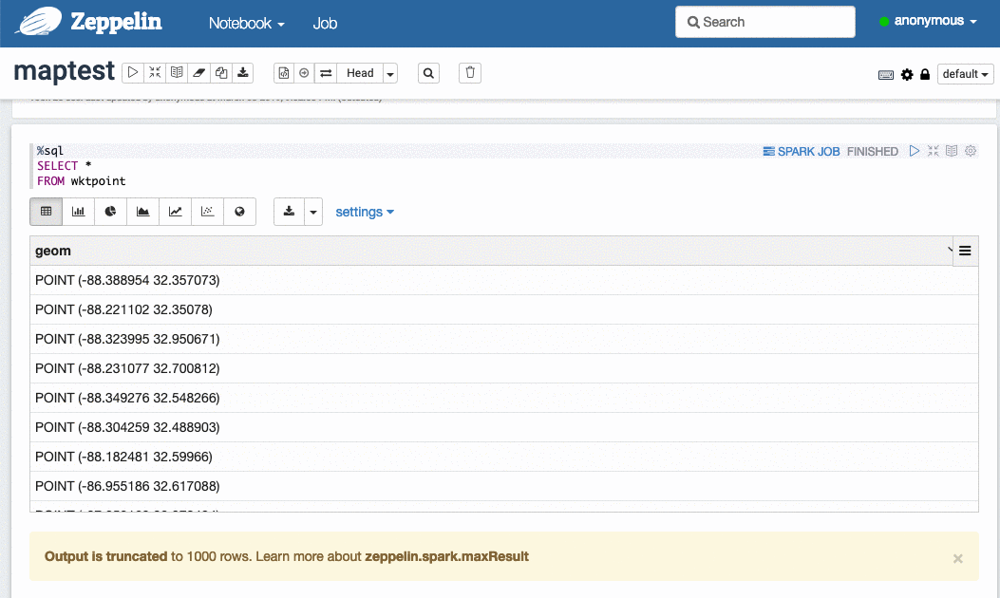
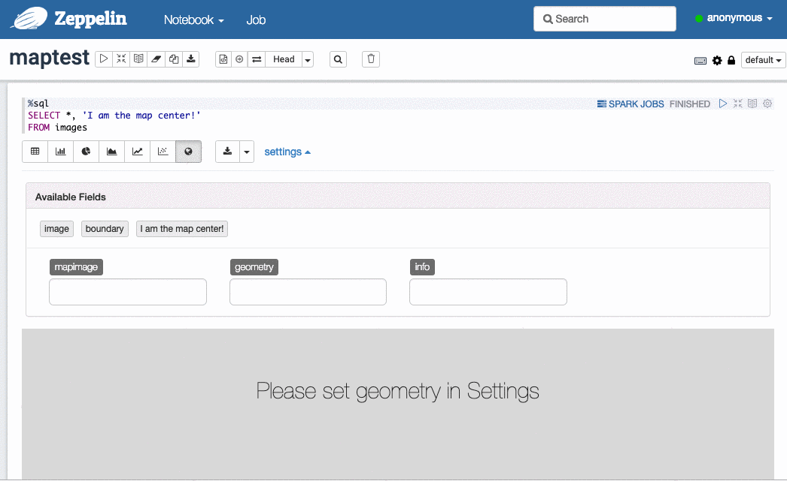

<!--
 Licensed to the Apache Software Foundation (ASF) under one
 or more contributor license agreements.  See the NOTICE file
 distributed with this work for additional information
 regarding copyright ownership.  The ASF licenses this file
 to you under the Apache License, Version 2.0 (the
 "License"); you may not use this file except in compliance
 with the License.  You may obtain a copy of the License at

   http://www.apache.org/licenses/LICENSE-2.0

 Unless required by applicable law or agreed to in writing,
 software distributed under the License is distributed on an
 "AS IS" BASIS, WITHOUT WARRANTIES OR CONDITIONS OF ANY
 KIND, either express or implied.  See the License for the
 specific language governing permissions and limitations
 under the License.
 -->

Sedona 提供了一个为 [Apache Zeppelin](https://zeppelin.apache.org/) 量身定制的 Helium 可视化插件，最终弥合了 Sedona 与 Zeppelin 之间的鸿沟。安装方法请参阅 [安装 Sedona-Zeppelin](../setup/zeppelin.md)。

Sedona-Zeppelin 提供了两种在 Zeppelin 中可视化空间数据的方式。第一种方式使用 Zeppelin 在地图上绘制所有空间对象；第二种方式利用 SedonaViz 生成地图图像并叠加到地图上。

## 小规模数据：不使用 SedonaViz

!!! danger
	Zeppelin 只是一个前端可视化框架，本方式不具备扩展性，对于大规模地理空间数据会失败。请向下阅读 SedonaViz 方案。

可以使用 Apache Zeppelin 绘制少量空间对象，例如 1000 个点。假设您已经有一个空间 DataFrame，需要在 Zeppelin 的 Spark notebook 中通过 Scala paragraph 将几何列转换为 WKT 字符串列：

```scala
spark.sql(
  """
    |CREATE OR REPLACE TEMP VIEW wktpoint AS
    |SELECT ST_AsText(shape) as geom
    |FROM pointtable
  """.stripMargin)
```

然后再创建一个 SQL paragraph 拉取数据：

```sql
%sql
SELECT *
FROM wktpoint
```

选择要可视化的几何列：



## 大规模数据：使用 SedonaViz

SedonaViz 是一个分布式可视化系统，能够大规模地可视化空间数据。请阅读 [如何使用 SedonaViz](viz.md)。

可以借助 Sedona-Zeppelin 让 Zeppelin 把 SedonaViz 的图像叠加到地图上，从而轻松可视化 10 亿乃至更多的空间对象（取决于集群规模）。

首先，在 Zeppelin Spark notebook 的 Scala paragraph 中对 SedonaViz DataFrame 中的图像进行编码：

```
spark.sql(
  """
    |CREATE OR REPLACE TEMP VIEW images AS
    |SELECT ST_EncodeImage(image) AS image, (SELECT ST_AsText(bound) FROM boundtable) AS boundary
    |FROM images
  """.stripMargin)
```

然后创建 SQL paragraph 拉取数据：

```sql
%sql
SELECT *, 'I am the map center!'
FROM images
```

选择图像与对应的地理边界：



## Zeppelin Spark notebook 演示

我们提供了一个完整的 Zeppelin Spark notebook，演示了所有功能。请下载 [Sedona-Zeppelin notebook 模板](../image/geospark-zeppelin-demo.json) 与 [测试数据 - arealm.csv](../image/arealm.csv)。

需要在 Zeppelin 中导入该 notebook JSON 文件，并修改 notebook 中的输入数据路径。
